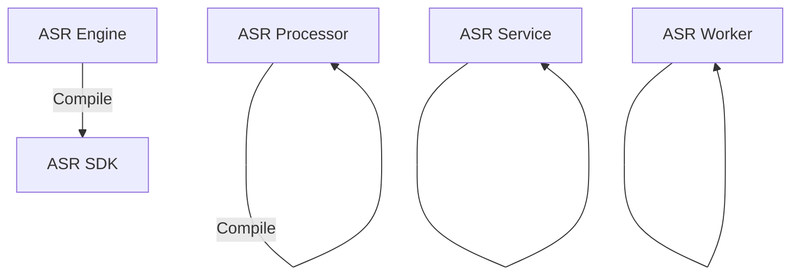
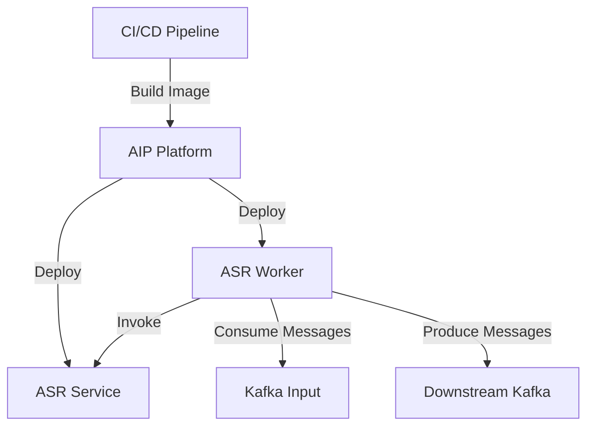

# ASR &VAD 交接资源汇总

本文档包括自动语音识别（ASR）和语音活动检测（VAD）引擎，包括协议、代码仓库、设计文档、使用说明以及在 AIP 平台上的部署注意事项。

日期: 2025 年 2 月 27 日

## 协议

- **ASR 引擎协议**：[查看文档](https://docs.google.com/document/d/1H9Kzqj6XRERqnYhngj8t8LKLPFGYpfeaDfYi9BrONR0/edit?tab=t.0)
- **VAD 引擎协议**：[查看文档](https://docs.google.com/document/d/1D5h7e142dWNtSSzTqImjYdfM1pBINEYrtNJvc7oVwq8/edit?tab=t.0)

## 代码仓库

### 1. ASR 引擎
ASR 引擎根据硬件和流式需求支持多种实现。

- **GPU-Attention 版本**：已停止维护。如有新需求，建议迁移到 CPU-WFST/GPU-WFST 版本。
- **GPU-WFST 版本**：[仓库地址](https://git.garena.com/shopee/AudioAI-Dev/asr/-/tree/hammer_dev)
- **CPU-WFST 版本**：[仓库地址](https://git.garena.com/shopee/AudioAI-Dev/asr/-/tree/masimeng-dev)
- **流式 ASR 版本**：[仓库地址](https://git.garena.com/shopee/AudioAI-Dev/asr/-/tree/kai/streaming)

### 2. VAD 引擎
VAD 引擎包括非流式和流式实现。

- **非流式 VAD**：已停止维护。如有新需求，建议迁移到流式 VAD，可选择能量 VAD 或模型 VAD。
- **流式 VAD**：[仓库地址](https://git.garena.com/shopee/AudioAI-Dev/engine/stream-vad-engine/-/tree/hammer_dev)

### 3. AIP 平台组件
AIP 平台通过多个组件集成 ASR 功能：

- **ASR 处理器**：[仓库地址](https://git.garena.com/shopee/MLP/aip/inference/audio/asr-processor)
- **ASR 服务**：[仓库地址](https://git.garena.com/shopee/MLP/aip/inference/audio/asr-service)
- **ASR 工作节点**：[仓库地址](https://git.garena.com/shopee/MLP/aip/inference/audio/asr-worker)
- **ASR SDK**：[仓库地址](https://git.garena.com/shopee/MLP/aip/inference/audio/asr-sdk)

## 设计文档

- **ASR 引擎技术设计**：[查看文档](https://docs.google.com/document/d/1X8-hJ2PSRzqLkshm8mNm70Eer-67jk16kfGeb3zwKqI/edit?tab=t.0#heading=h.yc77gngzh4gr)
- **流式 VAD 引擎技术设计**：[查看文档](https://confluence.shopee.io/display/Audio/Streaming+VAD)

## 使用说明

### VAD 引擎使用注意事项

#### 环境依赖
- **Libtorch 版本**：1.11.0
- **CMakeLists.txt 配置**：将默认的 `rapidjson/include` 路径替换为本地下载的版本。
  1. 编译第三方依赖库：[脚本](https://git.garena.com/shopee/AudioAI-Dev/engine/stream-vad-engine/-/blob/hammer_dev/thirdparty/make.sh)
  2. 编译 VAD 库：[脚本](https://git.garena.com/shopee/AudioAI-Dev/engine/stream-vad-engine/-/blob/hammer_dev/make.sh)

#### 配置
配置 VAD 引擎以使用能量检测或模型检测：

```plaintext
SCORE_TYPE=1  # 能量 VAD
SCORE_TYPE=0  # 模型 VAD
```

### ASR 引擎使用注意事项

#### 环境依赖
- **Libtorch 版本**：1.11.0
- **CMakeLists.txt 配置**：将默认的 `rapidjson/include` 路径替换为本地下载的版本。
  1. 编译第三方依赖库：[脚本](https://git.garena.com/shopee/AudioAI-Dev/asr/-/blob/master/thirdparty/make.sh)
  2. 编译 ASR 库：[脚本](https://git.garena.com/shopee/AudioAI-Dev/asr/-/blob/master/make.sh)

#### 配置
配置 ASR 引擎以使用 WFST 或 Attention 解码：

```plaintext
MODEL_TYPE=CTC
MODEL_NAME=asr
DECODER_TYPE=attention  # 使用 Attention 解码
DECODER_TYPE=CTC_WFST  # 使用 WFST 解码
MAX_THREAD_NUM=20
USE_FP16=true
```

### AIP 部署注意事项

#### 处理流程
1. ASR 引擎被编译为 `asr-sdk`。
2. 核心业务逻辑（如多线程下载、批处理拼接）封装在 `asr-processor` 中。
3. `asr-service` 调用 `asr-processor` 提供 ASR 服务。
4. `asr-worker` 消费 Kafka 数据，调用 `asr-service`，并将结果发送到下游 Kafka 主题。

#### 部署步骤
1. **构建镜像**：
   - 使用 GitLab 定义的 CI/CD 流程：[`.gitlab-ci.yml`](https://git.garena.com/shopee/MLP/aip/inference/audio/asr-service/-/blob/master/.gitlab-ci.yml)
2. **部署**：
   - 在 AIP 平台上更新镜像。

#### 流程图：AIP 部署流程
AIP 部署流程的流程图：

1. 编译库资源



2. 部署流程




## 业务使用场景

1. **旧版 ASR 引擎（Attention 解码）- GPU 推理**：
   - 用于 `video-qc` 和 `video-search`。

2. **CPU 推理**：
   - 当前大部分业务使用 CPU 推理。

3. **GPU 推理**：
   - 由于 AIP 平台迁移，统计数据有限。初步确认仅 `credit` 业务使用（待确认）。

## 其他FAQ

1. 模型测事宜待算法补充
