## Kimi 对O1复现的思考


````mermaid 
graph TD;
  %% 第一部分：Long CoT 及其作用
  A[Long CoT and o1] -->|Long CoT 允许错误、反思、重试| B[o1的成功依赖于 Long CoT];
  A -->|强调 Long CoT 的重要性| B;

  %% 第二部分：Long CoT vs. 成本 & 速度
  C[Long CoT and Cost/Speed vs. Performance] -->|Long Context 受 Prefill 和 Mooncake 影响| D[成本 & 速度可控];
  C -->|Long CoT 初期被忽视| E[因高成本 & 低速];
  C -->|性能更重要| F[Long CoT 仍被优先考虑];

  %% 第三部分：测试时搜索 & AlphaGo
  G[Test-Time Search and AlphaGo] -->|Noam Brown 强调测试时搜索| H[类似 AlphaGo];
  G -->|不建议直接引入 MCTS| I[强调搜索能力];

  %% 第四部分：结构 vs. 自由思考
  J[Structure vs. Free Thinking] -->|反对 MCTS 和 Agentic Workflows| K[认为其限制模型能力];
  J -->|建议训练模型自由思考| L[Agentic Workflows 仅有短期价值];

  %% 第五部分：强化学习 & 精确奖励
  M[RL with Exact Rewards] -->|建议使用精确奖励| N[避免 Reward Models 限制];
  M -->|专注于标准答案问题| O[数学 & 代码];
  M -->|RL 性能完全依赖奖励| P;

  %% 第六部分：上下文强化学习 & 自我批评
  Q[In Context RL with Self-Critique] -->|o1 使用自我批评| R[预测下一个令牌 = RL 探索];
  Q -->|模型通过反思学习| S[轨迹包括行动和奖励];

  %% 第七部分：Long CoT 作为上下文 RL
  T[Long CoT as In-Context RL] -->|Long CoT 输出可视为 In-Context RL| U[但优化困难];
  T -->|策略的自我反思影响价值评估| V;

  %% 第八部分：o1 和人生的类比
  W[Life and o1] -->|o1 = 有限的连续轨迹| X[充满探索和错误];
  W -->|最终结果取决于目标| Y;

  %% 第九部分：REINFORCE 训练 Long CoT
  Z[REINFORCE for Long CoT Training] -->|使用 REINFORCE 变体| AA[梯度增加正确答案 & 减少错误答案];
  Z -->|结合 KL 散度 & 奖励规范化| AB[稳定训练];

  %% 第十部分：模型改进与令牌计数
  AC[Model Improvement and Token Count] -->|性能提升导致令牌计数增加| AD[RL 训练过程中自然出现];

  %% 第十一部分：AGI 和 ASI
  AE[AGI and ASI] -->|AGI 迫近| AF[重新思考 ASI];
  AE -->|RL 已超越人类性能| AG[未来是更复杂场景中的复制];
```

````


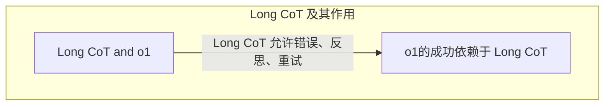

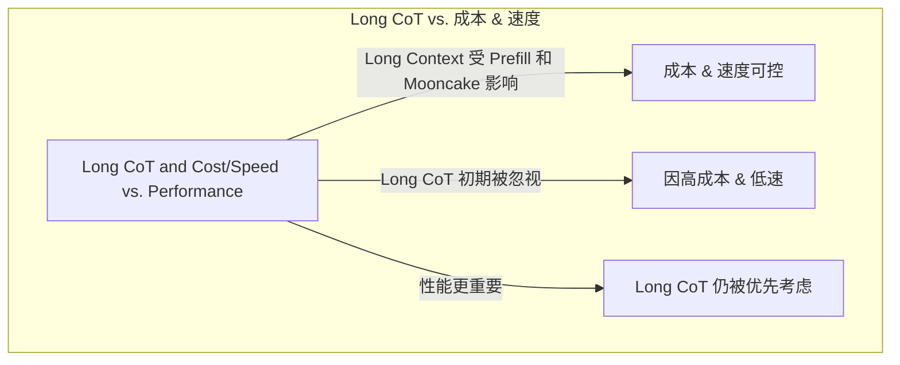

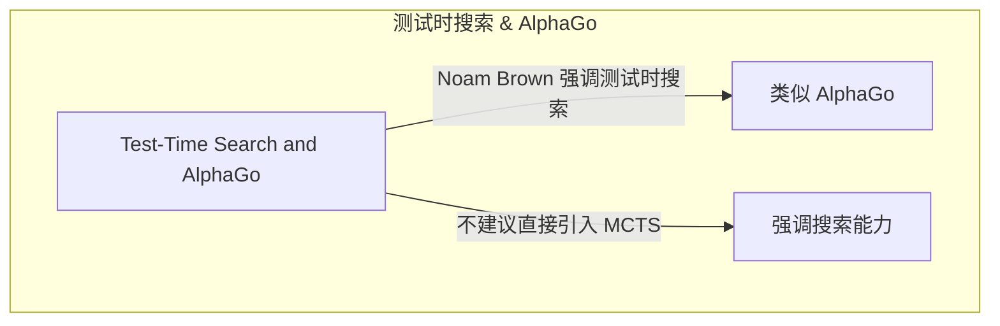


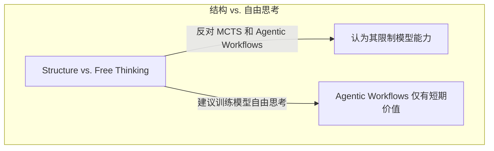

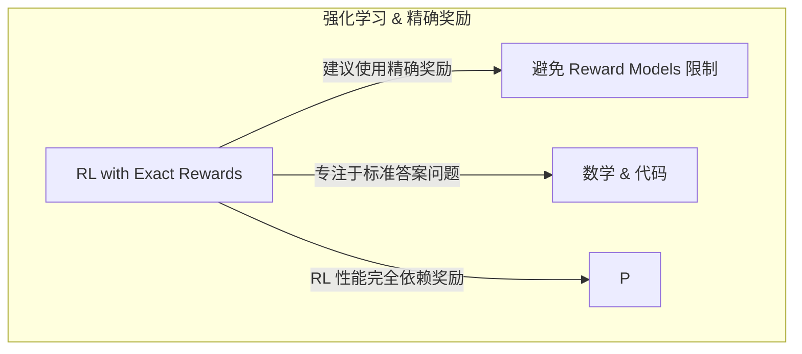

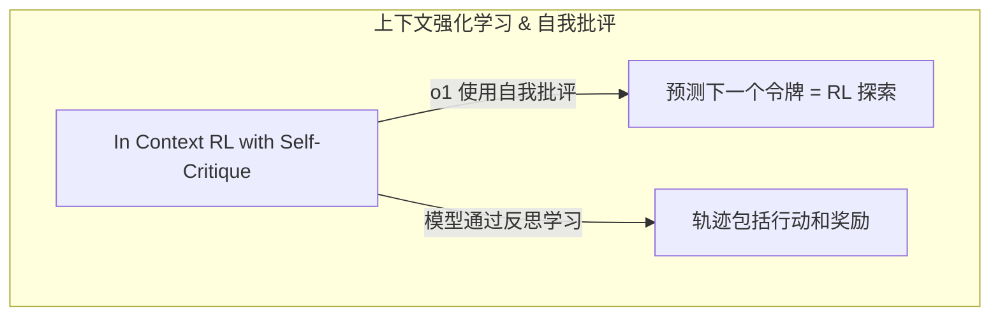

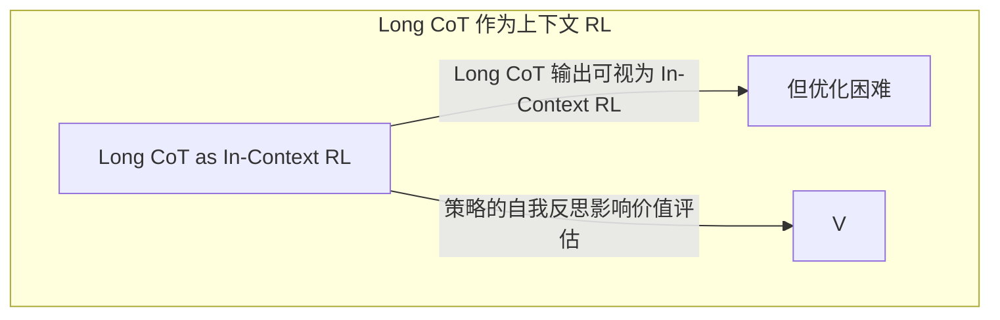


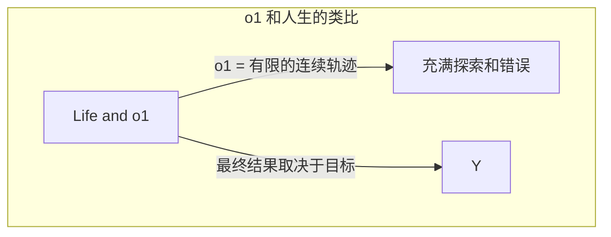


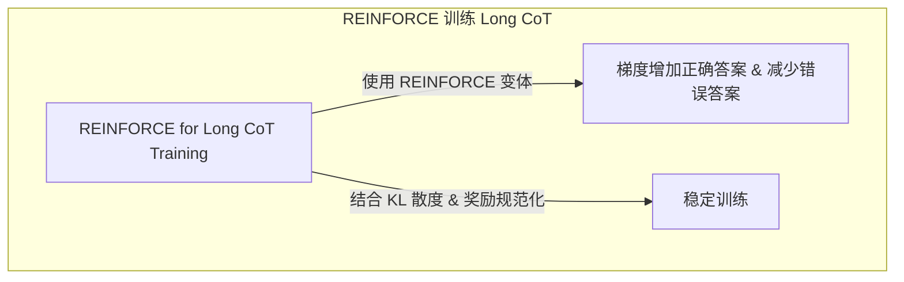

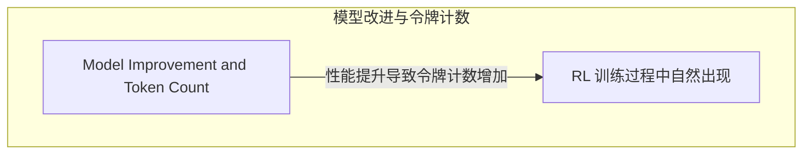

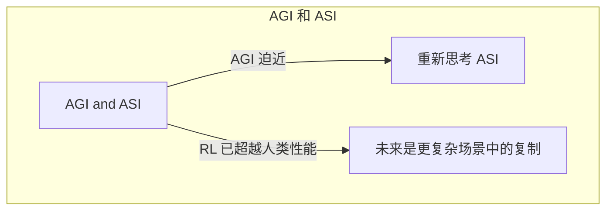