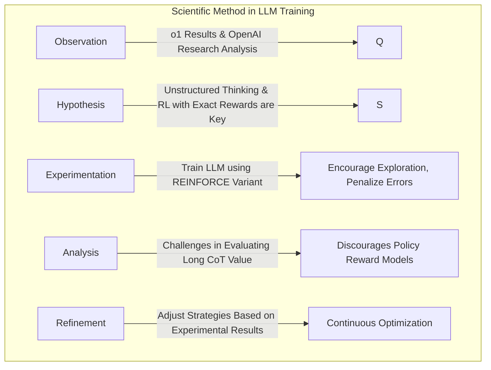
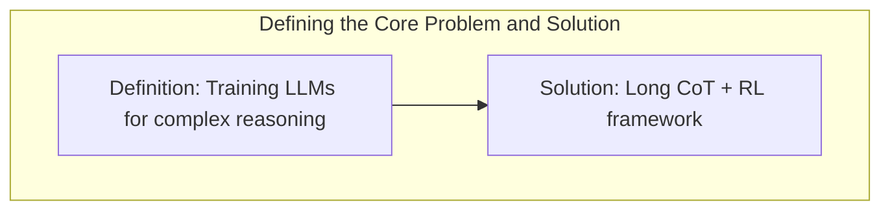
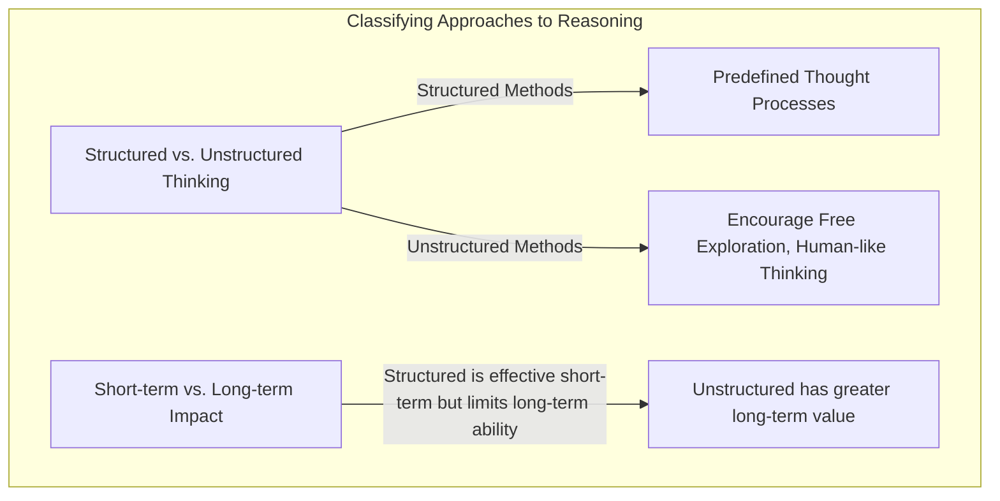
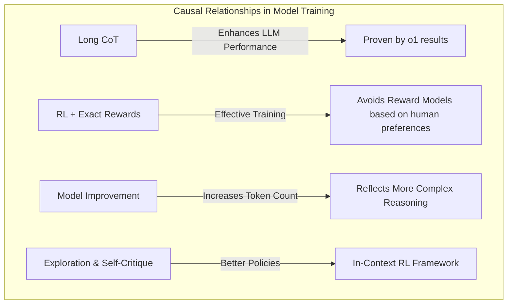
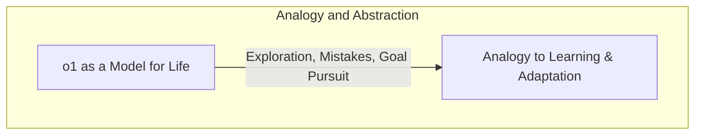
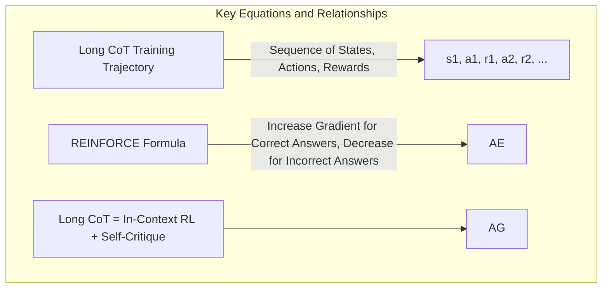
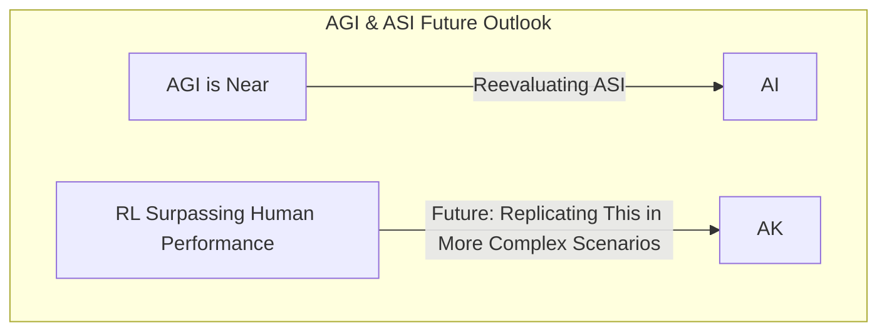

## Kimi 对O1复现的思考(2)

```mermaid
graph TD;
  subgraph "Scientific Method in LLM Training"
      P[Observation] -->|o1 Results & OpenAI Research Analysis| Q;
      R[Hypothesis] -->|Unstructured Thinking & RL with Exact Rewards are Key| S;
      T[Experimentation] -->|Train LLM using REINFORCE Variant| U[Encourage Exploration, Penalize Errors];
      V[Analysis] -->|Challenges in Evaluating Long CoT Value| W[Discourages Policy Reward Models];
      X[Refinement] -->|Adjust Strategies Based on Experimental Results| Y[Continuous Optimization];
    end
```

```mermaid
graph TD;
  subgraph "Defining the Core Problem and Solution"
    A[Definition: Training LLMs for complex reasoning] --> B[Solution: Long CoT + RL framework];
  end
```

```mermaid
graph TD;
  subgraph "Classifying Approaches to Reasoning"
    C[Structured vs. Unstructured Thinking] -->|Structured Methods | D[Predefined Thought Processes];
    C -->|Unstructured Methods| E[Encourage Free Exploration, Human-like Thinking];
    F[Short-term vs. Long-term Impact] -->|Structured is effective short-term but limits long-term ability| G[Unstructured has greater long-term value];
  end
```

```mermaid
graph TD;
  subgraph "Causal Relationships in Model Training"
    H[Long CoT] -->|Enhances LLM Performance| I[Proven by o1 results];
    J[RL + Exact Rewards] -->|Effective Training| K[Avoids Reward Models based on human preferences];
    L[Model Improvement] -->|Increases Token Count| M[Reflects More Complex Reasoning];
    N[Exploration & Self-Critique] -->|Better Policies| O[In-Context RL Framework];
  end
```

```mermaid
graph TD;
  subgraph "Analogy and Abstraction"
    Z[o1 as a Model for Life] -->|Exploration, Mistakes, Goal Pursuit| AA[Analogy to Learning & Adaptation];
  end
```

```mermaid
graph TD;
  subgraph "Key Equations and Relationships"
    AB[Long CoT Training Trajectory] -->|Sequence of States, Actions, Rewards| AC[s1, a1, r1, a2, r2, ...];
    AD[REINFORCE Formula] -->|Increase Gradient for Correct Answers, Decrease for Incorrect Answers| AE;
    AF[Long CoT = In-Context RL + Self-Critique] --> AG;
  end
```

```mermaid
graph TD;
   subgraph "AGI & ASI Future Outlook"
    AH[AGI is Near] -->|Reevaluating ASI| AI;
    AJ[RL Surpassing Human Performance] -->|Future: Replicating This in More Complex Scenarios| AK;
  end
```