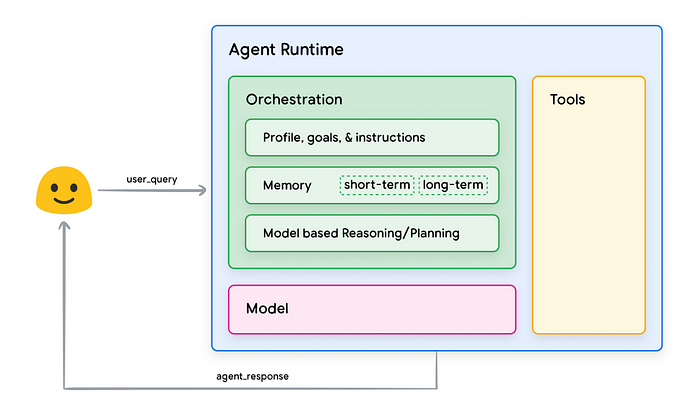

# Agent from Google

> Source: https://medium.com/@penkow/summary-of-googles-ai-white-paper-agents-d5670ae495c9

Google 将生成式 AI Agent 定义为一个应用程序，它通过观察周围世界并使用可用的工具来实现其目标。

- Agent 是自治的（autonomous），只要提供了合适的目标，它们就能独立行动，无需人类干预；
- 即使是模糊的人类指令，Agent 也可以推理出它接下来应该做什么，并采取行动，最终实现其目标；

Agent 的核心组成部分

- 模型（The model）：作为中央决策者的语言模型，可以是单个或多个大小不等的模型；
- 工具（The tools）：让 Agent 能与外部世界交互的桥梁，包括 Extensions、Functions 和 Data Stores；
  - Extensions
    - 

  - Functions
    - 

  - Data Stores
    - 

- 编排层（The orchestration layer）：管理 Agent 如何接收信息、进行内部推理并使用推理结果来决定下一步行动；

Agent vs Model 的主要区别

- 知识获取：Agent 可以通过工具获取外部信息，而模型仅限于训练数据；
- 推理能力：Agent 支持多轮推理和会话历史管理；
- 工具使用：Agent 原生支持工具集成；
- 系统架构：Agent 有内置的认知架构，而模型需要通过提示来引导推理；

代理使用认知架构来实现其最终目标，方法是迭代处理信息、做出明智的决策以及根据先前输出优化下一步行动。 代理认知架构的核心是编排层，负责维护内存、状态、推理和规划。它使用快速发展的提示工程领域和相关框架来指导推理和规划，使代理能够更有效地与其环境交互并完成任务。

认知架构工作方式

就像厨师在繁忙的厨房工作一样，Agent 会：
- 收集信息（如顾客订单和库存）
- 进行内部推理
- 采取行动（如烹饪）
- 根据反馈进行调整

Google 的白皮书中使用 ReAct、Chain-of-Thought 等框架来指导推理和规划

* **ReAct**：一种提示工程框架，它为语言模型提供了一种思维过程策略，无论是否有上下文示例，都可以对用户查询进行推理并采取行动。
* **思维链 (CoT)**：一种提示工程框架，它通过中间步骤实现推理能力。
* **思维树 (ToT)**：一种非常适合探索或战略前瞻任务的提示工程框架。

工具能力包括

- Extensions：连接 API 和 Agent 的标准化方式，Anthropic 在这里用了 MPC 协议；
- Functions：在客户端执行的功能；
- Data Stores：让 Agent 访问结构化或非结构化数据；

这种架构让 Agent 能够结合语言模型的能力与外部工具的实用性，从而完成更复杂的任务。

在去年九月 Google 发布过一篇 Agents 技术白皮书：“工具的使用是人类区别于动物的标志 —— 也是 Agent 区别于大模型的标志”。

### 进一步简化Agent 过程

- **代理 = 模型 + 工具 + 编排层**：代理由模型、工具和编排层三个基本组件构成。
- **工具 = 扩展 + 函数 + 数据存储**：工具是代理与外部世界互动的桥梁，主要包括扩展、函数和数据存储三种类型。
- **编排层 = 循环过程（信息获取 + 推理 + 行动）**：编排层管理代理如何获取信息、进行推理以及根据推理结果采取行动，该过程会一直循环直到代理达到目标或停止点。
- **推理技术 = ReAct,  思维链 (CoT), 思维树 (ToT) 等** ：代理可以使用多种推理技术来选择针对用户请求的最佳行动，例如 ReAct、思维链、思维树等。
- **目标学习 = 上下文学习 + 基于检索的上下文学习 + 基于微调的学习**：目标学习可以帮助模型在生成输出时选择正确的工具，主要包括上下文学习、基于检索的上下文学习和基于微调的学习三种方法。

这些模块相互关联，共同构成了代理的完整体系。代理通过模型进行推理和决策，利用工具与外部世界互动，并通过编排层管理整个行动流程。目标学习则可以帮助代理更好地理解和使用工具，从而提高其完成任务的能力。