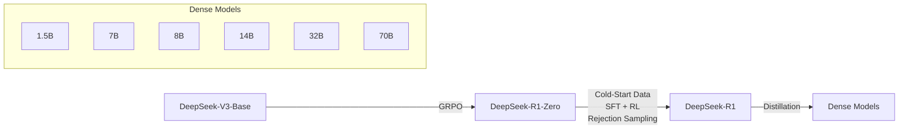
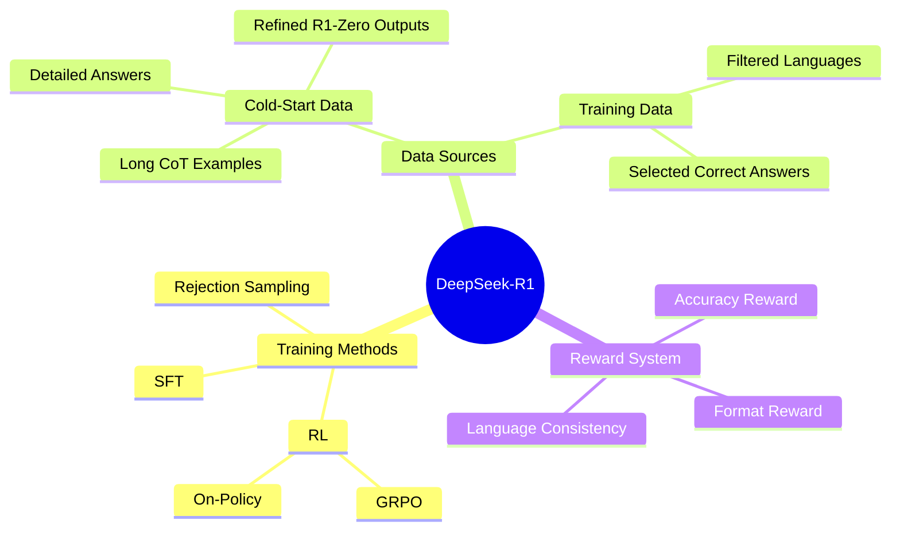
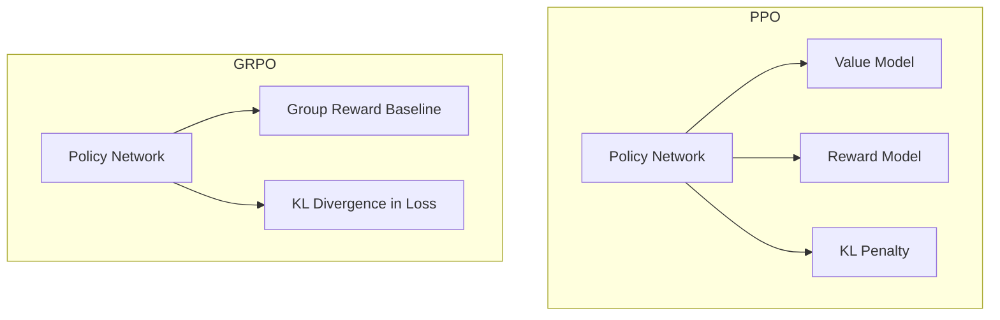
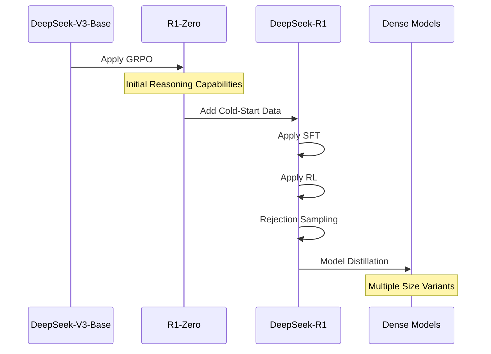

# DeepSeek-R1: Reinforcement Learning for Reasoning

**DeepSeek-R1 involved a complex multi-stage approach**, and the use of GRPO, and a refinement of training data, to improve reasoning capabilities and address initial limitations. Furthermore, it illustrates how **different RL approaches** like PPO and GRPO differ in their use of value models and how their reward functions are designed.

## Visualization

### Model Evolution Flow

### Training Components

### GRPO vs PPO Comparison

### Training Process Sequence

**Model Development and Training**

- **DeepSeek-V3-Base + GRPO = DeepSeek-R1-Zero**: This equation illustrates that the DeepSeek-R1-Zero model is a result of applying the Group Relative Policy Optimization (GRPO) algorithm to the DeepSeek-V3-Base model. This foundational step is **crucial for understanding the origin of the model's initial capabilities**.
- **DeepSeek-R1-Zero (with issues) + Cold-Start Data + SFT + RL + Rejection Sampling = DeepSeek-R1**: This complex equation shows the evolution from DeepSeek-R1-Zero to DeepSeek-R1. It details that **DeepSeek-R1 incorporates several stages** including: addressing the issues of DeepSeek-R1-Zero, adding Supervised Fine-Tuning (SFT) with Cold-Start Data, further refinement through Reinforcement Learning (RL), and data cleaning using rejection sampling.
- **DeepSeek-R1**  **-> Distillation -> Dense Models**: This expression indicates that the DeepSeek-R1 model serves as a basis for the creation of smaller, distilled models. These dense models (1.5B, 7B, 8B, 14B, 32B, 70B) are based on the architectures of Qwen and Llama.

**Reinforcement Learning (RL) and its Components**

- **Reward = Accuracy Reward + Format Reward (for DeepSeek-R1-Zero)**: This equation clarifies that the total reward for DeepSeek-R1-Zero is composed of two parts: one for accuracy and one for correct formatting.
- **Reward = Accuracy Reward + Language Consistency Reward (for DeepSeek-R1)**: This shows that the reward system for DeepSeek-R1 was modified to include a reward for language consistency, aligning with human preferences, in addition to accuracy.
- **On Policy RL vs. Off Policy RL**: This is not an equation but rather a comparison. On-policy methods like PPO use the model’s own data for training, while off-policy methods use existing datasets.
- **PPO (On Policy) = Value Model + Reward Model + KL Penalty**: This illustrates that PPO relies on a separate value model, which can be computationally expensive, and has a KL penalty that complicates calculations.
- **GRPO (On Policy)  = Average Group Reward as Baseline + KL Divergence in Loss**: This equation represents the GRPO algorithm. GRPO uses average reward within a group to avoid the need for a separate value model. It adds KL divergence to the loss, rather than as a penalty term in the reward.

**Data and Reasoning**

- **Cold-Start Data = Long CoT examples + Detailed Answers + Refined DeepSeek-R1-Zero Outputs**: This shows that cold-start data is generated through a combination of different data collection methods, combining curated CoT data with detailed answers, and outputs from the DeepSeek-R1-Zero model that were refined via manual annotation.
- **Reasoning = Chain-of-Thought (CoT)**: This equation shows that **reasoning is achieved through the Chain-of-Thought method**, where a model generates intermediate thoughts before arriving at an answer. This helps improve the transparency and reliability of the model's thinking process.
- **Rejection Sampling = Filter (Mixed Languages + Long Paragraphs + Code Blocks) + Select (Correct Answers)**: This formula demonstrates that Rejection Sampling is a process of filtering out undesirable data and selecting only correct answers.

**Key Performance Metrics**

- **AIME Score = Pass@1**: This indicates that the AIME score, specifically the "pass@1" score, is a metric used to evaluate the performance of the model on the AIME benchmark.

## DeepSeek-R1 and its training process

The development of DeepSeek-R1 is a process that highlights the interplay between different models, training techniques, and scientific inquiry. The initial model, DeepSeek-R1-Zero, was a pure RL experiment demonstrating emergent reasoning abilities. By addressing the identified limitations of DeepSeek-R1-Zero through the introduction of cold-start data, supervised fine-tuning, and an improved reward system, DeepSeek-R1 achieved enhanced performance in reasoning tasks. The use of GRPO as the RL algorithm allowed for more efficient training by eliminating the need for a separate value model and by aligning reward computation with the model's purpose.

**1. Definition & Classification:**

- Models:

   We start by classifying the models involved. There are foundational models and derived models.

  - Foundational:
    - **DeepSeek-V3-Base** is the initial model, serving as the base for DeepSeek-R1-Zero.
    - **Qwen** and **Llama** are pre-existing models that are used for distilling the dense models from DeepSeek-R1.
  - Derived:
    - **DeepSeek-R1-Zero** is the first derived model, trained solely via reinforcement learning (RL).
    - **DeepSeek-R1** is the improved model that utilizes multi-stage training and cold-start data in addition to RL.
    - **Dense Models (1.5B, 7B, 8B, 14B, 32B, 70B)** are distilled from DeepSeek-R1 for varied use cases.

- Training Methods:

   We can classify training methods into distinct approaches.

  - **Reinforcement Learning (RL)**: A core method for training both DeepSeek-R1-Zero and DeepSeek-R1, focusing on self-evolution of reasoning.
  - **Supervised Fine-Tuning (SFT)**: A process where a model learns from labeled data, used in DeepSeek-R1 before RL, and *not* used in DeepSeek-R1-Zero.
  - **Cold-Start Data:** A small, high-quality dataset used to "kickstart" the training of DeepSeek-R1 and address issues with DeepSeek-R1-Zero.
  - **Group Relative Policy Optimization (GRPO)**: A specific RL algorithm used for both DeepSeek-R1-Zero and DeepSeek-R1.

- Evaluation Metrics: Metrics used to measure model performance.

  - **Accuracy**: A reward used to measure the correctness of answers.
  - **Language Consistency**: A reward used to measure the alignment of language in the generated text with a target language.
  - **AIME score (pass@1)**: A metric for evaluating the model on a specific benchmark.

**2. Comparison:**

- DeepSeek-R1-Zero vs. DeepSeek-R1:
  - **Training**: DeepSeek-R1-Zero is trained purely via RL, while DeepSeek-R1 uses SFT with cold-start data, followed by RL.
  - **Reasoning:** Both exhibit reasoning abilities, but DeepSeek-R1 is designed to be more user-friendly.
  - **Issues:** DeepSeek-R1-Zero had poor readability and mixed languages, which DeepSeek-R1 addresses.
- On-Policy vs. Off-Policy RL:
  - **On-Policy:** Models like PPO use their own generated data for training, while GRPO uses a different technique to avoid using a value function.
  - **Off-Policy:** Methods that use existing, labeled data, which may lead to mismatches between data and the model.
- PPO vs. GRPO:
  - **PPO**: Requires a separate value model, which increases computational burden.
  - **GRPO**: Avoids a separate value model, using average reward within a group as a baseline, making it computationally more efficient.

**3. Cause and Effect:**

- **RL (GRPO) on DeepSeek-V3-Base**  -> **DeepSeek-R1-Zero**: The application of GRPO to the base model results in DeepSeek-R1-Zero, a model with strong reasoning abilities.
- **Issues in DeepSeek-R1-Zero** -> **Introduction of Cold-Start Data**: The readability and language mixing issues of DeepSeek-R1-Zero led to the incorporation of cold-start data in DeepSeek-R1.
- **Cold-Start Data + SFT + RL + Rejection Sampling** -> **Improved Reasoning in DeepSeek-R1**: By adding cold start data to the training process and including supervised fine-tuning (SFT), the performance of DeepSeek-R1 is improved.
- **Rejection Sampling** -> **Cleaner Data and Better Model**: Filtering out undesirable data leads to higher quality training data and a more reliable model output.
- **Accuracy Reward & Format Reward** -> **Basic Reasoning in DeepSeek-R1-Zero**: These initial reward systems guide the model toward accurate and formatted outputs, which help the model with basic reasoning.
- **Language Consistency Reward** -> **User-Friendly Output in DeepSeek-R1**: This reward ensures outputs are more readable and understandable, aligning the model with human preferences.
- **GRPO** -> **Efficient Training**: By avoiding a separate value model, GRPO is more computationally efficient than PPO.

**4. Scientific Method:**

- **Observation:** Researchers observed the reasoning abilities of models developed by reinforcement learning, along with their limitations.
- **Hypothesis:** They hypothesized that a model trained purely through RL (DeepSeek-R1-Zero) could develop reasoning abilities without supervision, but that its performance and usability could be improved.
- **Experimentation:** This included training DeepSeek-R1-Zero with RL, and then experimenting with DeepSeek-R1 which added cold-start data, supervised fine-tuning, language consistency rewards, and rejection sampling.
- **Analysis**: They evaluated the models using specific metrics such as the AIME test, accuracy, and language consistency rewards.
- **Refinement:** Based on the results, the process of developing DeepSeek-R1 incorporated new data, training methods, and reward systems to improve performance. The distilled models based on Qwen and Llama are also a product of this analysis and refinement.

## glossary

- Models:
  - **DeepSeek-R1-Zero**: The initial model trained via reinforcement learning (RL) without supervised fine-tuning (SFT), exhibiting strong reasoning abilities.
  - **DeepSeek-R1**: An enhanced model that incorporates multi-stage training and cold-start data prior to RL to improve reasoning performance and address limitations of DeepSeek-R1-Zero.
  - **DeepSeek-V3-Base**: The base model used for training DeepSeek-R1-Zero.
  - **Qwen and Llama**: Base models used to distill dense models from DeepSeek-R1.
  - **Dense Models**: Six models (1.5B, 7B, 8B, 14B, 32B, 70B) distilled from DeepSeek-R1, based on Qwen and Llama.
- Training Processes & Techniques:
  - **Reinforcement Learning (RL)**: A core method for training both DeepSeek-R1-Zero and DeepSeek-R1, enabling the models to develop reasoning abilities.
  - **Supervised Fine-Tuning (SFT)**: A training step that DeepSeek-R1 uses before RL, unlike DeepSeek-R1-Zero.
  - **Group Relative Policy Optimization (GRPO)**: The RL framework used for training, which avoids the need for an additional value model by using average reward within a group as a baseline.
  - **Cold-Start Data**: A small amount of high-quality data (long Chain-of-Thought examples) used to fine-tune the model before RL, intended to improve reasoning and convergence.
  - **Chain-of-Thought (CoT)**: A reasoning approach where the model generates a series of intermediate thoughts before arriving at a final answer.
  - **Rejection Sampling**: A method used to improve data quality by filtering out undesirable outputs such as mixed languages and long paragraphs.
- Evaluation Metrics & Concepts:
  - **Accuracy Reward**: A type of reward used during training, it evaluates whether an answer is correct.
  - **Format Reward**: A reward model that encourages the model to place its thinking process between "<思考>" and "</思考>" tags.
  - **Language Consistency Reward**: A reward based on the proportion of target language words within the CoT, enhancing readability.
  - **AIME**: A benchmark used to evaluate the model's performance, with a specific reference to the "pass@1" score.
- RL Concepts:
  - **On Policy**: A type of RL where training is based on the model's own generated data, using a "critic" to provide feedback.
  - **Off Policy**: A type of RL that analyzes existing labeled data, but it can have mismatch problems between training samples and the model.
  - **Proximal Policy Optimization (PPO)**: An on-policy RL algorithm that DeepSeek-R1 does not use; it requires a value model and can be computationally burdensome.
  - **Value Model**: An additional model used in PPO, which approximates value function, but is avoided by GRPO.
- Other Key Concepts:
  - **Reasoning**: The ability of the model to solve problems and make inferences.
  - **Supervision Data**: Labeled data used to train a model, which DeepSeek-R1-Zero aims to avoid, instead focusing on self-evolution.
  - **Reward Model**: A system that provides a signal to determine the direction of RL optimization.
  - **KL Divergence**: A method used by GRPO that measures the difference between two probability distributions.
  - **Actor**: In RL context, this refers to the model or agent that learns to take actions.
  - **Critic**: In RL context, this refers to a component that assesses the actions of the Actor.
  - **Baseline**: GRPO uses the average reward as the baseline to measure relative performance.

## Reference

* [DeepSeek_R1][https://github.com/deepseek-ai/DeepSeek-R1/blob/main/DeepSeek_R1.pdf]

