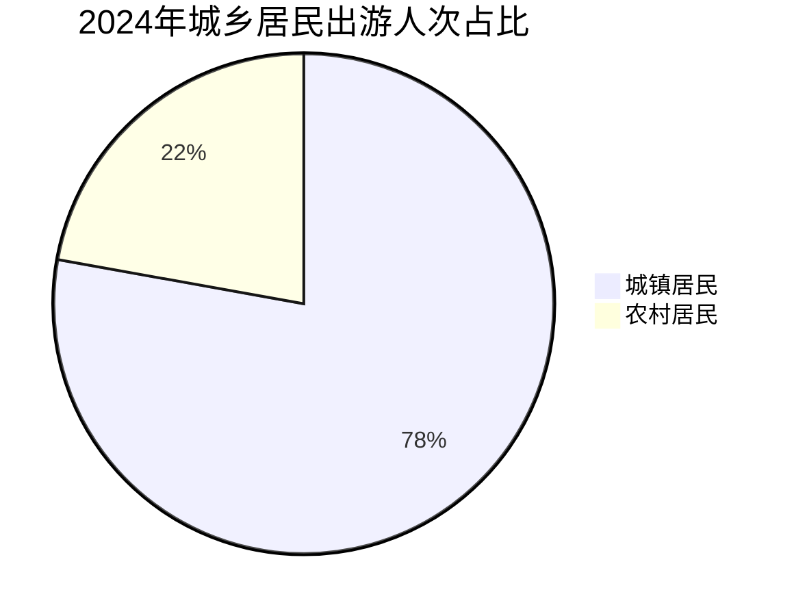
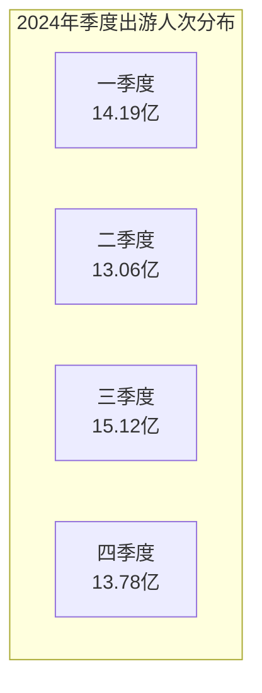
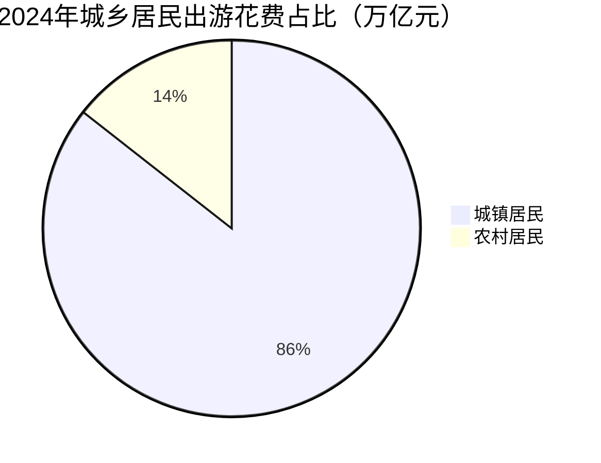

根据国内旅游抽样调查统计结果，2024年，国内出游人次56.15亿，比上年同期增加7.24亿，同比增长14.8%。其中，城镇居民国内出游人次43.70亿，同比增长16.3%；农村居民国内出游人次12.45亿，同比增长9.9%。分季度看，一季度国内出游人次14.19亿，同比增长16.7%；二季度国内出游人次13.06亿，同比增长11.8%；三季度国内出游人次15.12亿，同比增长17.2%；四季度国内出游人次13.78亿，同比增长13.2%。
　　2024年，国内游客出游总花费5.75万亿元，比上年增加0.84万亿元，同比增长17.1%。其中，城镇居民出游花费4.93万亿元，同比增长18.0%；农村居民出游花费0.83万亿元，同比增长12.2%。

## Visualization

### 2024年城乡居民出游人次占比

### 2024年各季度出游人次

### 2024年城乡居民出游花费占比

1. [source][https://zwgk.mct.gov.cn/zfxxgkml/tjxx/202501/t20250121_958012.html]