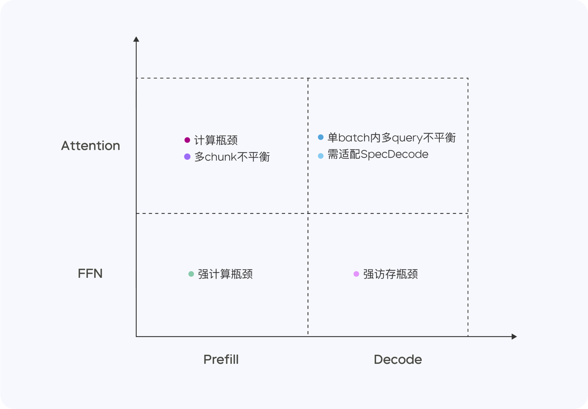

## 豆包模型Doubao-1.5-pro

>  https://team.doubao.com/zh/special/doubao_1_5_pro

模型使用 MoE 架构，并通过训练-推理一体化设计，探索模型性能和推理性能之间的极致平衡。Doubao-1.5-pro 仅用较小激活参数，即可超过一流超大稠密预训练模型的性能，并在多个评测基准上取得优异成绩。

## 高性能推理系统

Doubao-1.5-pro 是一个高度稀疏的 MoE 模型，在 Prefill/Decode 与 Attention/FFN 构成的四个计算象限中，表现出显著不同的计算与访存特征。针对四个不同象限，我们采用异构硬件结合不同的低精度优化策略，在确保低延迟的同时大幅提升吞吐量，在降低总成本的同时兼顾 TTFT 和 TPOT 的最优化目标。

Prefill 阶段，通信和访存瓶颈不明显，但容易达到计算瓶颈。考虑到 LLM 单向注意力的特点，我们在多种计算访存比高的设备上做 Chunk-PP Prefill Serving，使线上系统 Tensor Core 的利用率接近 60%。

**Prefill Attention:** 使用 MMA/WGMMA 等指令扩展开源的 FlashAttention 8-bit 实现，结合 Per N tokens Per Sequence 的量化策略，确保该阶段可以在不同架构的 GPU 上无损运行。同时，通过建模不同长度分片的 Attention 耗时，并结合动态跨 Query Batching 的策略，实现 Chunk-PP Serving 时的卡间均衡，有效消除负载不均衡引起的空跑；

**Prefill FFN:** 采用 W4A8 量化，有效降低了稀疏 MoE 专家的访存开销，并通过跨 Query Batching 的策略，给到FFN阶段更多输入，使 MFU 提升至 0.8.

Decode 阶段，计算瓶颈不明显，但对通信和访存能力要求比较高。我们采用计算访存比较低的设备 Serving 来换取更高的 ROI，同时，采用极低成本的 Sampling 采样以及 Speculative Decoding 策略，降低 TPOT 指标。

**Decode Attention：** 采用 TP 方式部署，并通过启发式搜索以及激进的长句拆分策略，优化单 batch 内不同 Query KV 长度差异大的常见场景；精度上，依然采用 Per N tokens Per Sequence 量化方式；此外，还优化了随机采样过程中的 Attention 计算，保证 KV Cache 只被访问一次。

**Decode FFN：** 保持 W4A8 量化，采用 EP 方式部署。

整体来看，在 PD 分离的 Serving 系统上，我们实现了以下优化：

针对 Tensor 传输进行定制化的 RPC Backend，并通过零拷贝、多流并行等手段优化了 TCP/RDMA 网络上的 Tensor 传输效率，进而提升 PD 分离下的 KV Cache 传输效率。

支持 Prefill 跟 Decode 集群的灵活配比和动态扩缩，对每种角色独立做 HPA 弹性扩容，保障 Prefill 和 Decode 都无冗余算力，两边算力配比贴合线上实际流量模式。

在框架上将 GPU 计算和 CPU 前后处理异步化，使得 GPU 推理第 N 步时 CPU 提前发射第 N+1 步 Kernel，保持 GPU 始终被打满，整个框架处理动作对 GPU 推理零开销。

此外，凭借自研服务器集群方案，灵活支持低成本芯片，硬件成本比行业方案大幅度降低。我们还通过定制化网卡和自主研发的网络协议，显著优化了小包通信的效率。在算子层面，我们实现了计算与通信的高效重叠（Overlap），从而保证了多机分布式推理的稳定性和高效性。