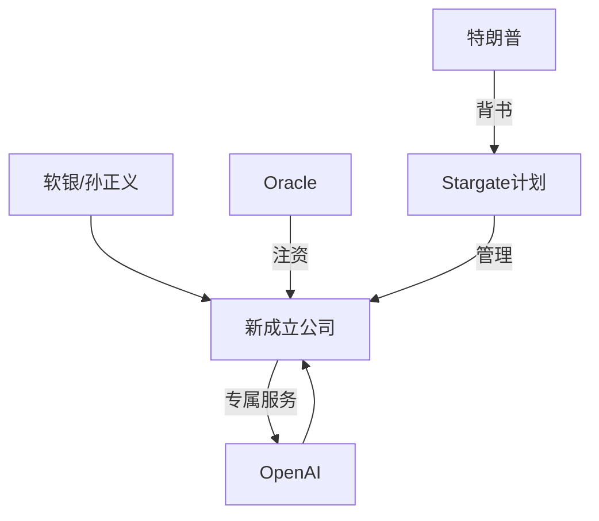
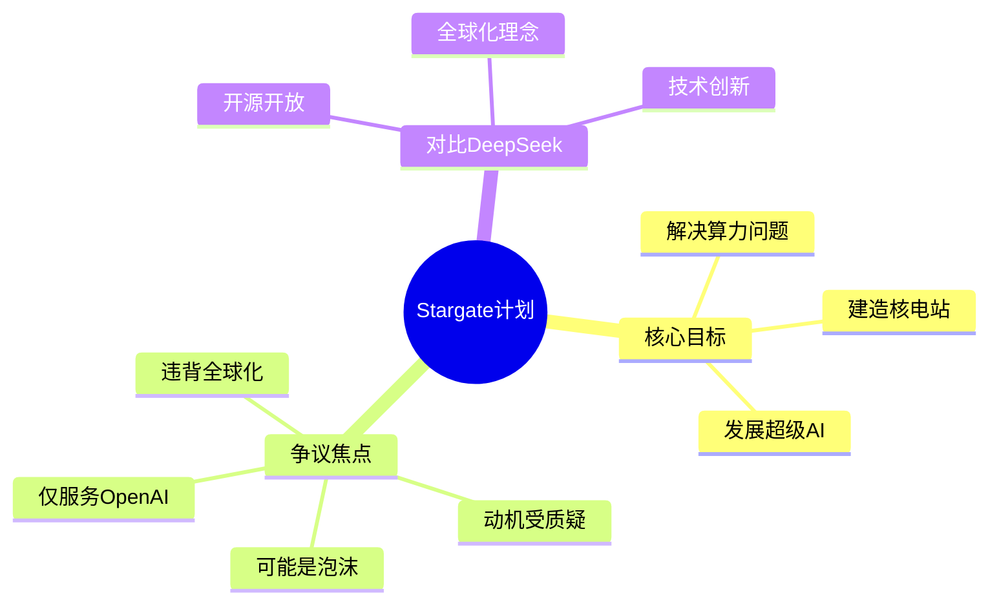

# Stargate

**Stargate 计划的背景**

*   Stargate 计划是在美国出现的，旨在人工智能领域与中国竞争。
*   该计划的提出与一份年度报告有关，该报告指出美国应该以当年"曼哈顿计划"的精神来发展人工智能，以在人工智能领域击败中国。
*   Stargate 计划被认为是对中国在人工智能领域快速发展的一种回应。

**Stargate 计划的参与者**
*   该计划是由 **OpenAI 和软银的孙正义** 两家公司合资成立新公司。
*   **Oracle 和其他公司** 也将为该计划注资。
*   **特朗普** 愿意为该计划背书。

**Stargate 计划的目标和运作模式**
*   **新成立的公司只为 OpenAI 服务**，这意味着其他人工智能公司，如 Anthropic、微软和谷歌等，无法从该计划中获益。
*   该计划旨在解决 OpenAI 的 **算力问题**，并进一步解决算力背后的 **能源问题**。
*   Stargate 计划的预算中包括 **建造五个核电站**，专门为新的算力中心供电。
*   该计划的目标似乎不仅仅是达到通用人工智能（AGI），而是 **超人工智能（ASI）**。
*   Stargate 计划被认为是 **美国国家战略** 的一部分，但理论上讲并不完全是。
*   该计划被一些人视为是 "**发币**" 行为，目的是为了通过资金流动来获利，而不是真正为了"让美国再次伟大"。

**Stargate 计划的争议点**
*   **只为 OpenAI 服务** 的模式引发争议，被认为不利于其他 AI 公司的创新。
*   有人认为该计划可能只是一个 "**泡泡**"，目的是让参与者从中获利，而非真正推动技术进步。
*   **其背后目的和动机** 受到质疑，尤其是其与特朗普政府的关联。
*   有人认为，**该计划与"曼哈顿计划"最大的区别在于，罗斯福没有自己"发币"**。
*   **该计划可能不符合全球化的理念**，因为只有少数公司能从中获益。

**Stargate 计划与 DeepSeek 的对比**
*   与 Stargate 计划不同，DeepSeek **致力于开源和开放研究**，赋能所有人。
*  **DeepSeek 的模式更符合全球化的理念**，让更多人受益，并推动整个人工智能领域的进步。
*   DeepSeek 在技术方面取得了突破，通过 **创新性的组合现有技术**，达到了低成本高产出的效果。

**总结**

Stargate 计划是一个由 OpenAI 主导，软银等公司参与，旨在解决 OpenAI 算力问题的美国 AI 项目。该计划的特点是只为 OpenAI 服务，且预算包括建造核电站。这一计划的背后动机和模式受到争议，被认为可能更多是为了商业利益，而不是真正推动 AI 技术的进步。与此形成对比的是，DeepSeek 更注重开源和开放研究，致力于让更多人受益。

## Visualization

### Stargate 计划参与者与结构

### Stargate 计划目标与争议
