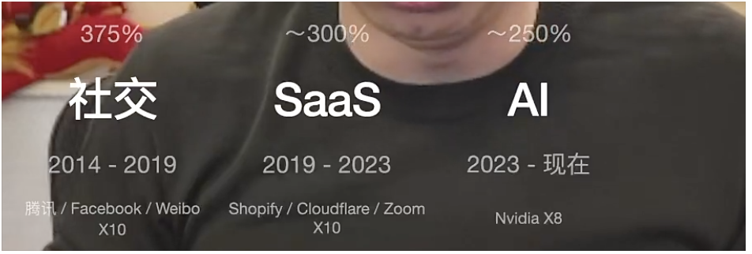
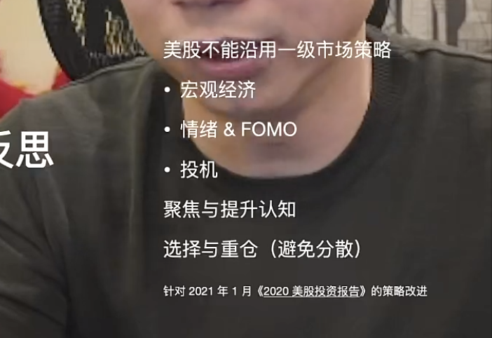
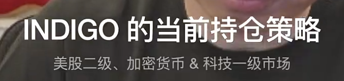
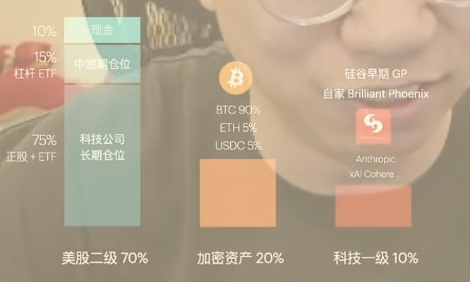
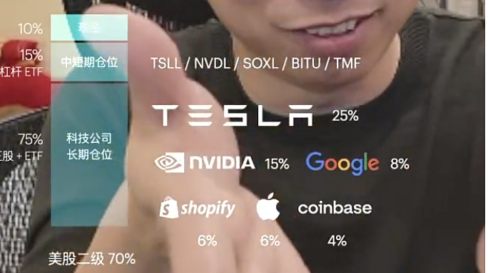
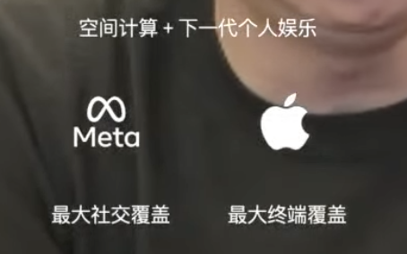
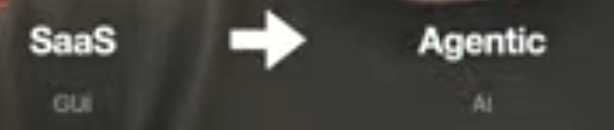
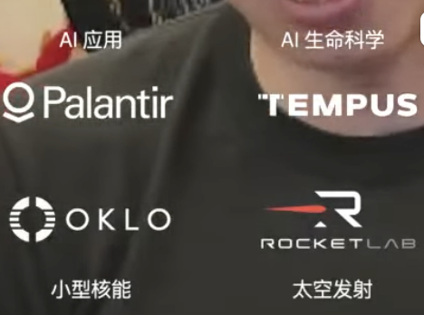
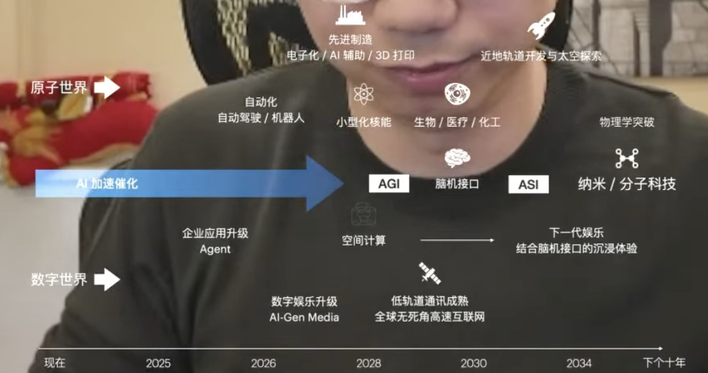

# FAQ 问题

1. 过去10年的互联网投资
   1. 回报是是375%还是1+275% 
   2. 北美出售股票需要考虑税率
   3. timeframe：5-10年

2. 反思

   

   * 投资是具身智能：认知、体验、情绪、合一的智能
     * 这个观点不太同意
   * 股市是情绪波动
   * <信号和噪音>
   * Deepseek事件，市场在找机会回调

	3. 当前持仓策略
    	1. NVIDIA 是 AI 时代前十年是个最好的标的
    	2. 
    	3. 
    	4. 
	4. 未来的思考
    	1. 空间计算+ 下一代个人娱乐
        	1. 
    	2. 大的空间进化
        	1. 

​			c. 方向

* 

5. 下一个十年
   1. 

