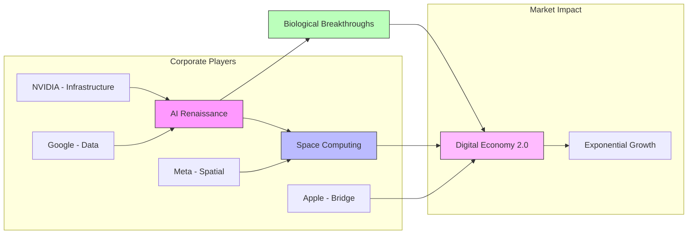
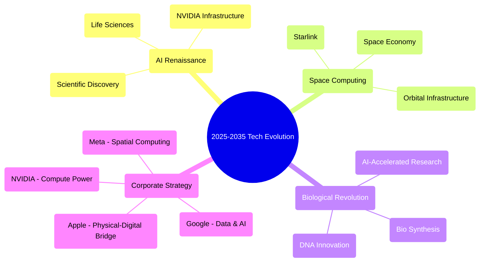

# The Next Decade of Tech: A Symphony of AI, Space, and Biological Revolution

## Technology Convergence Flow

## Key Storylines:

1. The AI Renaissance (2025-2035)

   * Like the transition from horse-drawn carriages to automobiles, AI is poised to fundamentally transform how we interact with technology

   * NVIDIA emerges as the "picks and shovels" supplier of the AI gold rush

   * The real breakthrough isn't in chatbots, but in AI's ability to accelerate scientific discovery - particularly in life sciences

2. The Space Computing Revolution

   * Picture the internet evolving from earthbound cables to a celestial web

   * SpaceX's Starlink represents just the first wave of space-based computing infrastructure

   * By 2029, we may see the emergence of a true "space economy"

3. The Biological Breakthrough

   * AI is set to compress century-long research cycles into mere years

   * The chemical industry's transformation into a biological synthesis industry

   * The convergence of AI and biology could mark the most significant scientific advancement since the discovery of DNA

4. The Corporate Chess Game

   * Tech giants are positioning themselves like players on a grand chessboard:

     * Google: Leveraging its vast data empire for AI dominance

     * Apple: Building the bridge between digital and physical reality

     * Meta: Betting big on spatial computing
     * NVIDIA: Providing the computational backbone for it all

5. Investment Implications

   * The market appears to be in the early stages of an exponential growth curve

   * 2020-2025 marks a crucial transition period

   * The winners will likely be companies that can successfully bridge the digital and physical worlds

### Tech Evolution Mindmap

