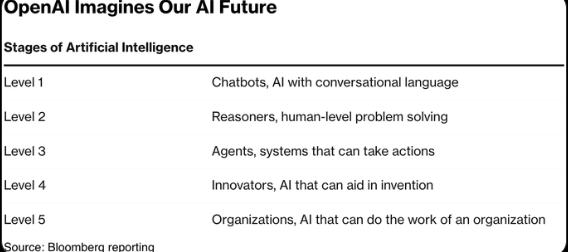
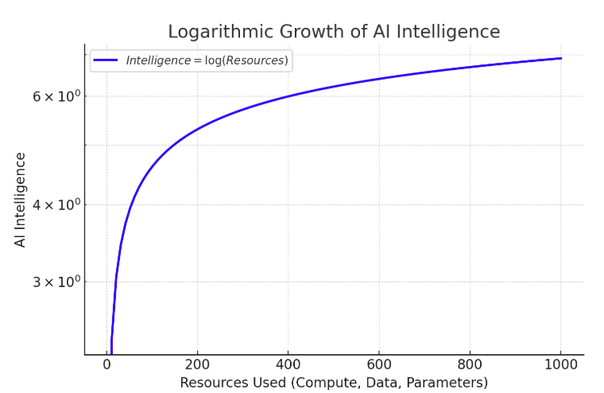
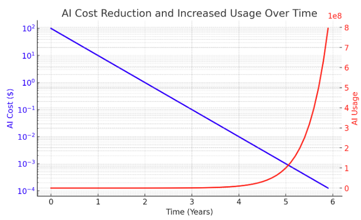
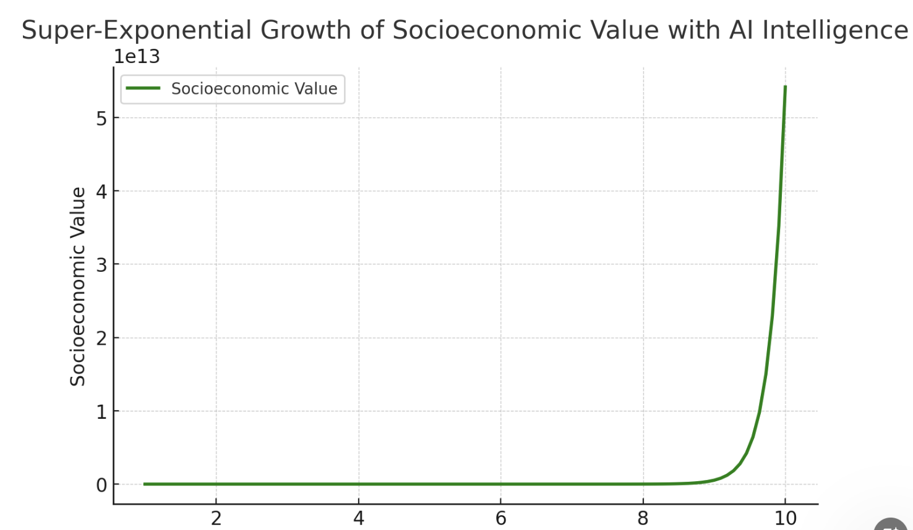

# Three Observations

> **OpenAI 首席执行官 Sam Altman 发表了一篇题为《三大观察》的文章，探讨了人工智能经济学的发展趋势。** 他指出，AI 智能水平与计算资源呈对数关系，AI 成本正以惊人的速度下降，而智能增长将带来超指数级的经济价值。**Altman 预测 AI 代理将成为 "虚拟同事"，深刻改变知识型工作和全球生产力。** 他同时强调，AGI 的影响将是不均衡的，社会如何适应这种转变将是未来最大的挑战。 **文章强调确保AGI的好处得到广泛分配至关重要，并呼吁公众对 AGI 的发展方向有更多的控制权。**

Our mission is to ensure that AGI (Artificial General Intelligence) benefits all of humanity. 

Systems that start to point to AGI* are coming into view, and so we think it’s important to understand the moment we are in. AGI is a weakly defined term, but generally speaking we mean it to be a system that can tackle increasingly complex problems, at human level, in many fields.

People are tool-builders with an inherent drive to understand and create, which leads to the world getting better for all of us. Each new generation builds upon the discoveries of the generations before to create even more capable tools—electricity, the transistor, the computer, the internet, and soon AGI.

Over time, in fits and starts, the steady march of human innovation has brought previously unimaginable levels of prosperity and improvements to almost every aspect of people’s lives.

In some sense, AGI is just another tool in this ever-taller scaffolding of human progress we are building together. In another sense, it is the beginning of something for which it’s hard not to say “this time it’s different”; the economic growth in front of us looks astonishing, and we can now imagine a world where we cure all diseases, have much more time to enjoy with our families, and can fully realize our creative potential.

In a decade, perhaps everyone on earth will be capable of accomplishing more than the most impactful person can today.

We continue to see rapid progress with AI development. Here are three observations about the economics of AI:

* **The intelligence of an AI model roughly equals the log of the resources used to train and run it.** These resources are chiefly training compute, data, and inference compute. It appears that you can spend arbitrary amounts of money and get continuous and predictable gains; the scaling laws that predict this are accurate over many orders of magnitude.

​	

* **The cost to use a given level of AI falls about 10x every 12 months, and lower prices lead to much more use.** You can see this in the token cost from GPT-4 in early 2023 to GPT-4o in mid-2024, where the price per token dropped about 150x in that time period. Moore’s law changed the world at 2x every 18 months; this is unbelievably stronger. 

​	

* **The socioeconomic value of linearly increasing intelligence is super-exponential in nature.** A consequence of this is that we see no reason for exponentially increasing investment to stop in the near future.

If these three observations continue to hold true, the impacts on society will be significant.

We are now starting to roll out AI agents, which will eventually feel like virtual co-workers.

Let’s imagine the case of a software engineering agent, which is an agent that we expect to be particularly important. Imagine that this agent will eventually be capable of doing most things a software engineer at a top company with a few years of experience could do, for tasks up to a couple of days long. It will not have the biggest new ideas, it will require lots of human supervision and direction, and it will be great at some things but surprisingly bad at others.

Still, imagine it as a real-but-relatively-junior virtual coworker. Now imagine 1,000 of them. Or 1 million of them. Now imagine such agents in every field of knowledge work.

**In some ways**, **AI** ==**may turn out**== *like the transistor economically*: *a big scientific discovery that scales well and that seeps into almost every corner of the economy*We don’t think much about transistors, or transistor companies, and the gains are very widely distributed. But we do expect our computers, TVs, cars, toys, and more to perform miracles.

The world will not change all at once; it never does. Life will go on mostly the same in the short run, and people in 2025 will mostly spend their time in the same way they did in 2024. We will still fall in love, create families, get in fights online, hike in nature, etc.

But the future will be coming at us in a way that is impossible to ignore, and the long-term changes to our society and economy will be huge. We will find new things to do, new ways to be useful to each other, and new ways to compete, but they may not look very much like the jobs of today. 

**Agency, willfulness, and determination** ==**will likely be**== *extremely valuable*. Correctly deciding what to do and figuring out how to navigate an ever-changing world will have huge value; resilience and adaptability will be helpful skills to cultivate. AGI will be the biggest lever ever on human willfulness, and enable individual people to have more impact than ever before, not less.

We expect the impact of AGI to be uneven. Although some industries will change very little, scientific progress will likely be much faster than it is today; this impact of AGI may surpass everything else.

The price of many goods will eventually fall dramatically (right now, the cost of intelligence and the cost of energy constrain a lot of things), and the price of luxury goods and a few inherently limited resources like land may rise even more dramatically.

Technically speaking, the road in front of us looks fairly clear. But public policy and collective opinion on how we should integrate AGI into society matter a lot; one of our reasons for launching products early and often is to give society and the technology time to co-evolve.

AI will seep into all areas of the economy and society; we will expect everything to be smart. Many of us expect to need to give people more control over the technology than we have historically, including open-sourcing more, and accept that there is a balance between safety and individual empowerment that will require trade-offs.

While we never want to be reckless and there will likely be some major decisions and limitations related to AGI safety that will be unpopular, directionally, as we get closer to achieving AGI, we believe that trending more towards individual empowerment is important; the other likely path we can see is AI being used by authoritarian governments to control their population through mass surveillance and loss of autonomy.

Ensuring that the benefits of AGI are broadly distributed is critical. **The historical impact of technological progress** ==**suggests**== *that **most of the metrics** **we care about** (health outcomes, economic prosperity, etc.) ==**get better**== **on average and over the long - term***, **but** **increasing equality** ==**does not seem**== *technologically determined* **and** **getting this right** ==**may require**== *new ideas*

In particular, it does seem like the balance of power between capital and labor could easily get messed up, and this may require early intervention. We are open to strange-sounding ideas like giving some “compute budget” to enable everyone on Earth to use a lot of AI, but we can also see a lot of ways where just relentlessly driving the cost of intelligence as low as possible has the desired effect.

Anyone in 2035 should be able to marshall the intellectual capacity equivalent to everyone in 2025; everyone should have access to unlimited genius to direct however they can imagine. There is a great deal of talent right now without the resources to fully express itself, and if we change that, the resulting creative output of the world will lead to tremendous benefits for us all.

Thanks especially to Josh Achiam, Boaz Barak and Aleksander Madry for reviewing drafts of this.

*By using the term AGI here, we aim to communicate clearly, and we do not intend to alter or interpret the definitions and processes that define our relationship with Microsoft. We fully expect to be partnered with Microsoft for the long term. This footnote seems silly, but on the other hand we know some journalists will try to get clicks by writing something silly so here we are pre-empting the silliness…

1. [three-observations][https://blog.samaltman.com/three-observations]

