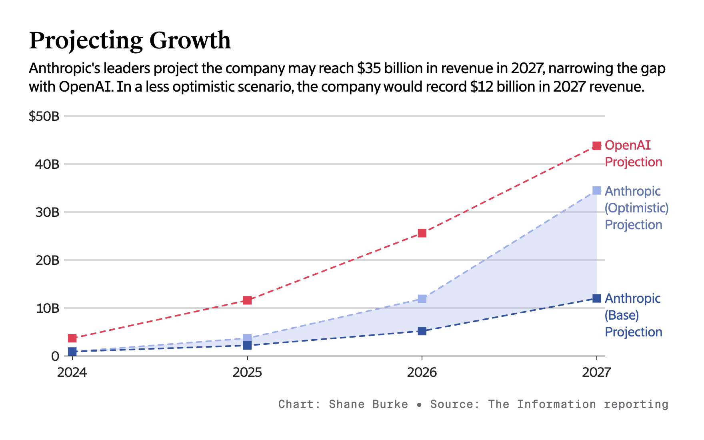

Anthropic 预估公司的收入可能会在 2027 年达到 350 亿美元，进一步缩小与 OpenAI 的差距，其中近三分之二将来自 API 业务，这将是 OpenAI 预测的 2027 年 API 收入的三倍。

### from indigo

> 就像 SemiAnalysis 在最近一篇文章里类比的，大模型很像芯片行业，最先进制成的高端芯片拥有定价权；在AI 发展的前沿，拥有最好推理或编码能力的模型也将继续拥有定价权；但更多"足够好"的可用模型则会陷入价格战。

### new product

> The Information 透露 Anthropic 会在几周内发布他们的新模型，也许是 Claude 4 - 具备推理能力的混合模型。该模型新增了一个滑块选项，使用多少智能来解决问题，就像在开发者环境中设置输出 token 长度那样。当阀值为零时，可以快速处理简单任务，而无需额外的工作，表现得像一个传统的大型语言模型，阀值越高意味着模型将使用更多的计算资源来解决复杂问题。
>
> OpenAI 就计划在新的 GPT-5 中终结掉混乱的模型选择，采用类似的智能使用量选项让用户体验更简单，这次向 Anthropic 学习！
>
> Anthropic 的策略是优先企业市场，通过滑动比例选择智能，让开发人员能够更好地控制成本、速度和定价。报道中说当 Anthropic 的新模型在被允许"思考"最长时间时，它在某些编程基准上的表现超过了 OpenAI 最先进的推理模型（即推理设置为 "高 "的 o3-mini）。新的模型最擅长企业工程师可能会做的编码任务。例如，可以理解由数千个文件组成的复杂代码库，并能在第一时间生成完整的代码。

* [anthropic-growth][https://www.reuters.com/technology/anthropic-projects-soaring-growth-345-billion-2027-revenue-information-reports-2025-02-13/]