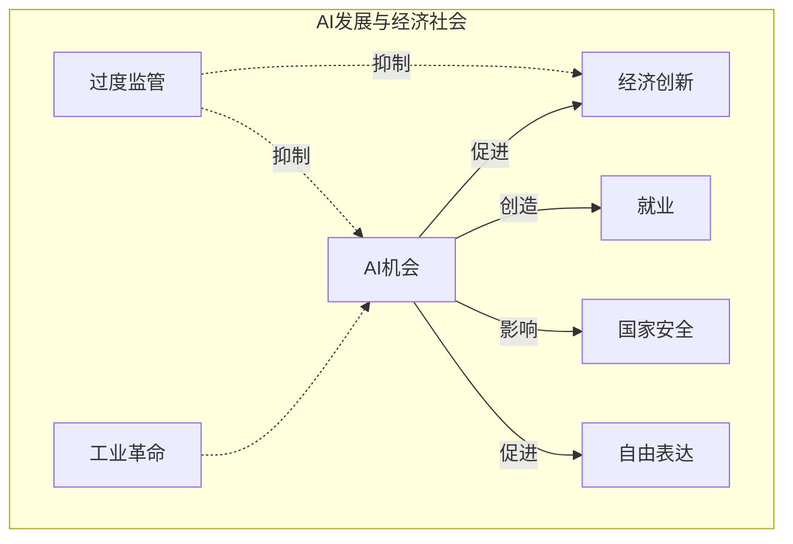
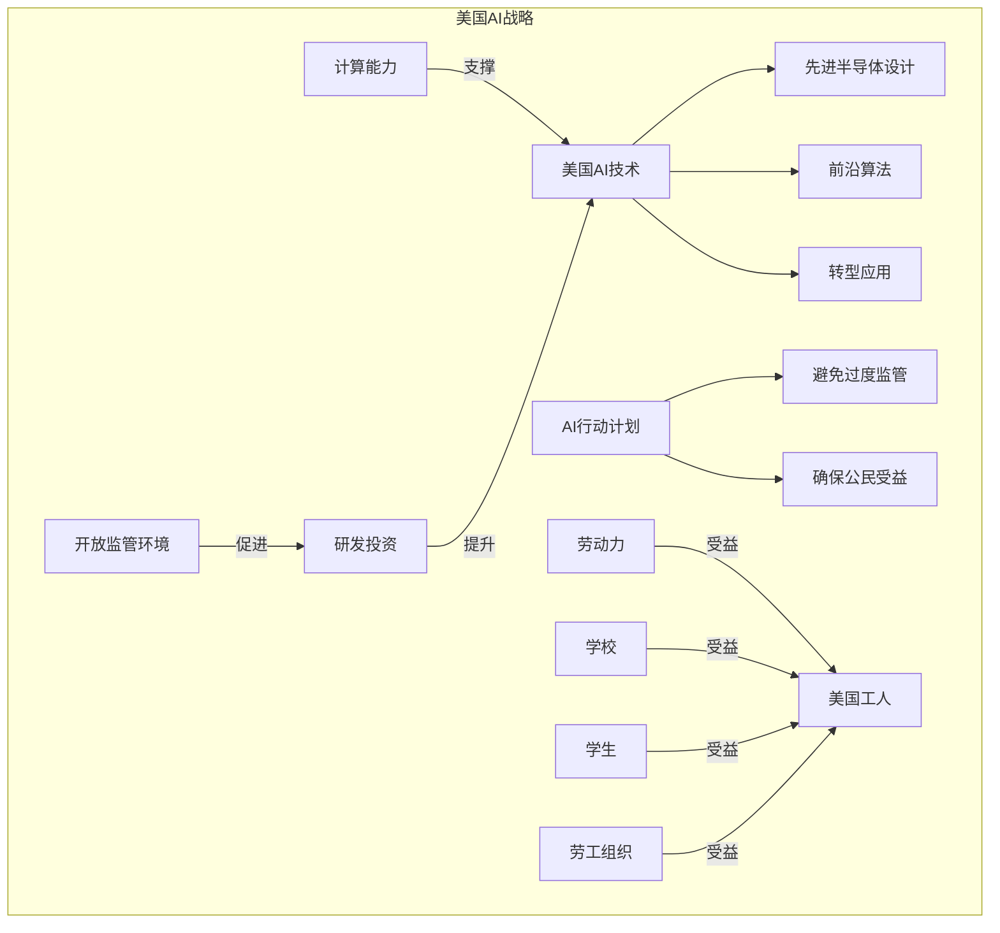
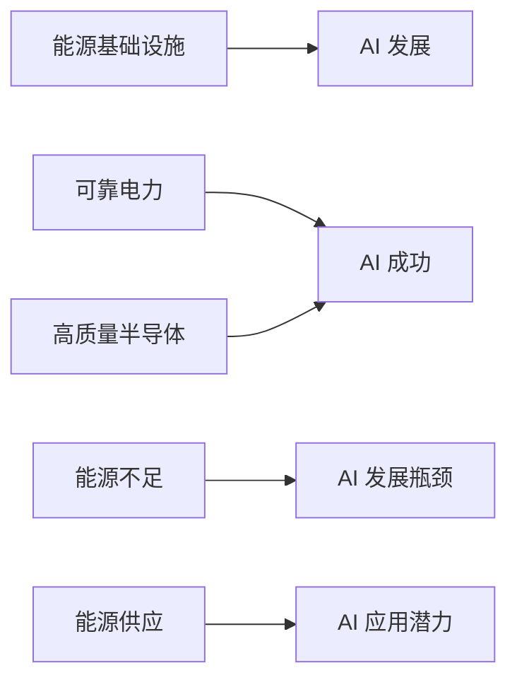
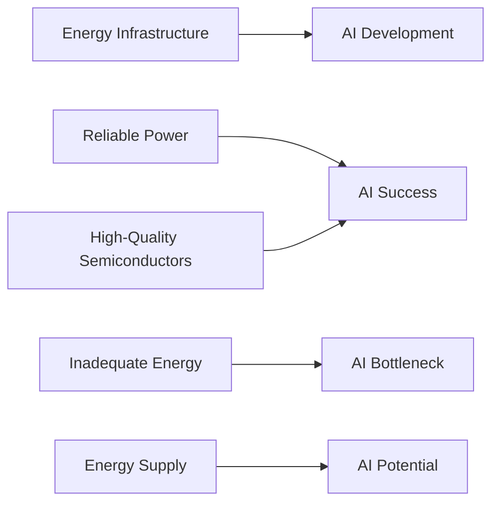
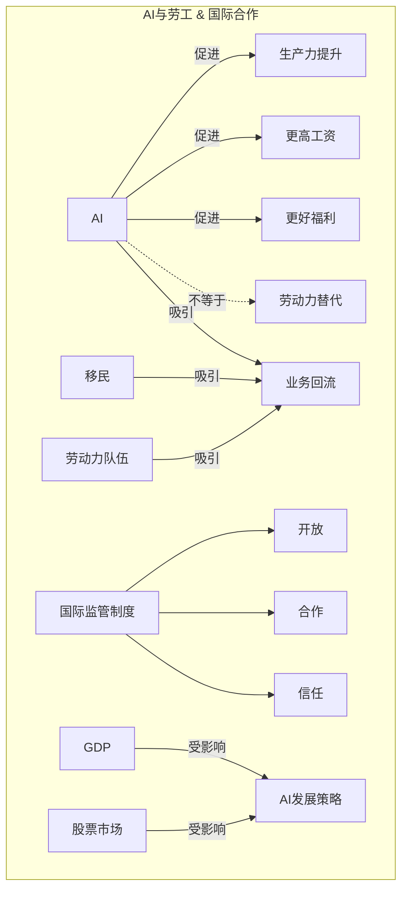
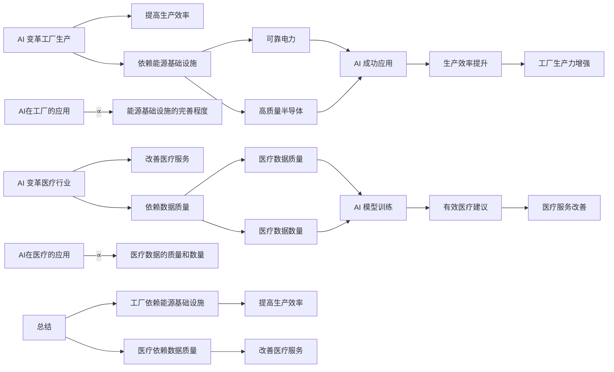
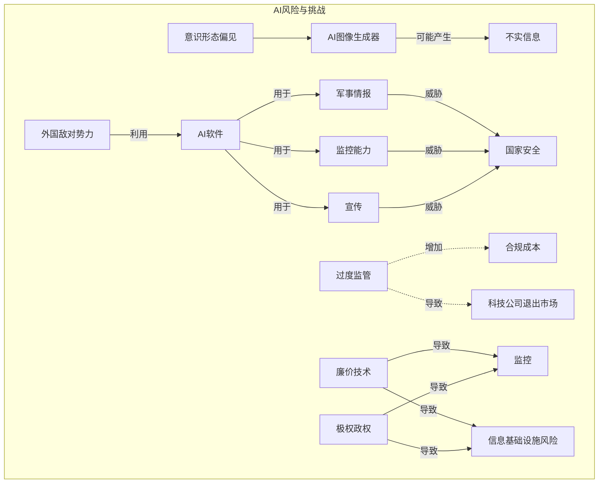
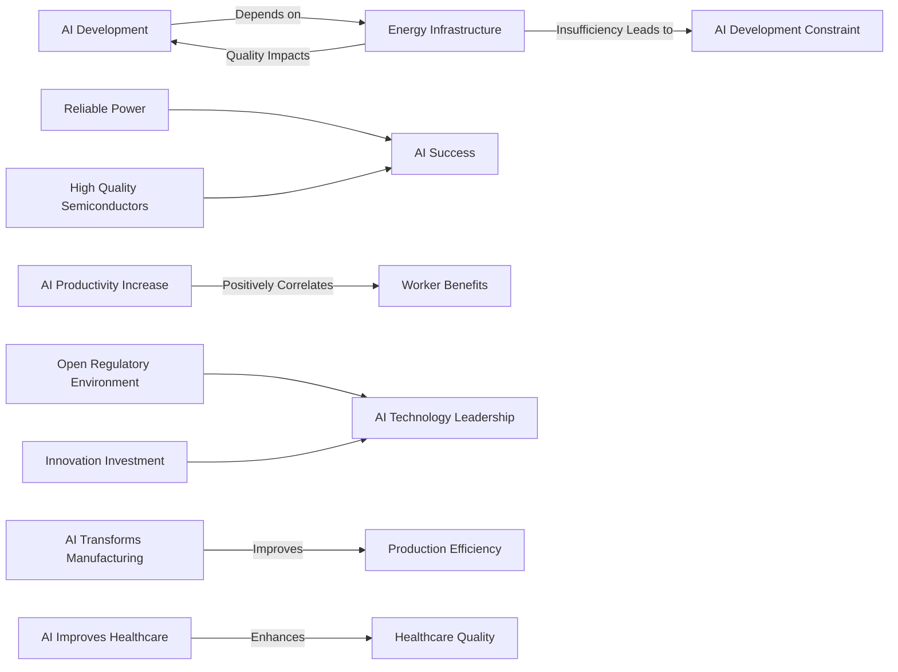
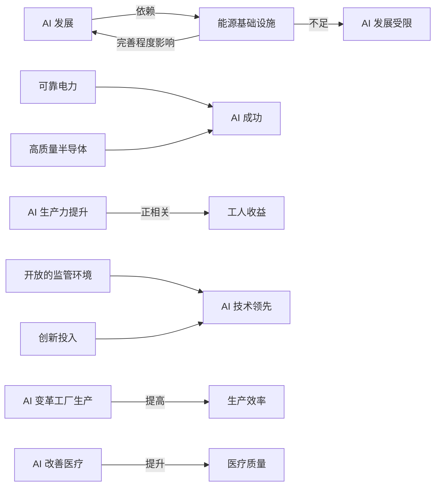

# on the future of artificial intelligence

> from JD Vance

# AI的机会

## 美国的AI战略

## 能源基础设施

## 以工人为核心

## 物理世界的应用

## 变革物理世界

# AI 风险

# 总结

[JD Vance on the future of artificial intelligence][[https://www.youtube.com/watch?v=64E9O1Gv99o]

