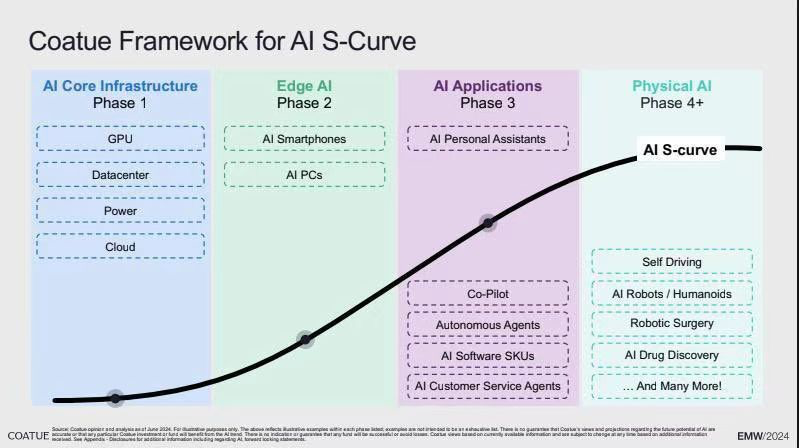

# Coatue Framework for AI S-Cursve

Coatue 是一家总部位于纽约的顶级对冲基金，成立于1999年，以其对科技领域的敏锐洞察和长期投资策略闻名。截至2024年，其管理规模已从最初的1500万美元跃升至486亿美元，投资组合覆盖了SpaceX、DoorDash、Zoom、Databricks等全球科技巨头，并深度参与了中国移动互联网（如腾讯、美团、字节跳动）和Web 3领域（如OpenSea、Niantic）的布局。近年来，Coatue在人工智能（AI）领域的投资尤为活跃，其发布的**AI S-Curve Framework**（AI S曲线框架）成为行业重要参考。

---

### **Coatue Framework for AI S-Curve**
Coatue 的AI S曲线框架基于技术发展的周期性规律，将AI的演进分为多个阶段，强调投资节奏与市场阶段的匹配。以下是其核心观点和框架解析：

#### 1. **AI S曲线的技术演进阶段**
Coatue 认为AI技术发展遵循“基础设施→边缘硬件→应用层→具身智能”的递进路径，每个阶段对应不同的投资机会：  

- **AI基础设施（AI Infra）**：当前市场处于这一阶段的中期，核心是算力、芯片（如英伟达GB200）、数据中心（如微软“星际之门”）和液冷技术。算力成本从2017年的40美元/TFLOP降至2024年的2美元/TFLOP，降幅达95%，推动了AI规模化应用。  
- **边缘AI（Edge AI）**：随着推理任务向终端转移，边缘设备（如手机、PC）将承担90%的实时响应需求。Dell因其在服务器、存储和PC领域的综合布局，被Coatue视为该领域的核心标的。  
- **AI应用层（AI Applications）**：尽管生成式AI（如ChatGPT）已崭露头角，但应用层仍处早期阶段，需依赖私有数据和多模态创新（如音频、视频生成）形成差异化。  
- **具身智能（Embodied AI）**：以通用机器人为代表，需突破数据瓶颈（如仿真训练、视频学习）和成本限制（预计2026-2027年机器人成本将低于人类平均工资）。

#### 2. **市场验证与投资逻辑**
- **算力与能源矛盾**：AI对电力的需求将引发能源短缺，核电（如美国Constellation公司）成为唯一可持续解决方案，预计其业绩年复合增长率达28%。  
- **技术规模化拐点**：Coatue强调“智能即服务”（IQaaS）的商业模式，认为大模型（如GPT-4）的工程化扩展是核心挑战，而开源生态（如Stability AI）将加速技术民主化。  
- **市场泡沫与韧性**：尽管2023年科技股因AI概念暴涨（如英伟达年回报率209%），但Coatue指出市场仍依赖少数巨头（如“七巨头”贡献标普500涨幅的85%），需警惕结构性风险。

#### 3. **未来展望**
Coatue预测，AI将推动新一轮超级周期，类似于PC和移动互联网的变革，并可能催生“硅基生命”的进化。具身智能的普及将分三阶段实现：  
1. **Seeing**（认知阶段）：通过媒介初步了解机器人；  
2. **Experiencing**（服务体验阶段）：B2B2C模式（如咖啡厅机器人）；  
3. **Owning**（个人拥有阶段）：家庭机器人逐步承担复杂任务（如管家、保姆）。

---

### **总结**
Coatue的AI S曲线框架不仅为技术演进提供了结构化视角，还通过投资节奏的精准把控（如优先布局基础设施和边缘硬件）展现了其对市场的前瞻性。其核心逻辑在于：**技术规模化需依赖成本下降、数据积累和能源支撑**，而AI的终极目标是将“智能”无缝嵌入人类生活的每个场景，成为“隐形”的基础设施。

[Coatue][https://www.coatue.com/strategies]