## Deepseek 发展拆分

以下是基于内容将子图拆分为 **不同的**，每个专注于一个独立的主题或逻辑关系。每个都是一个独立的 Mermaid 子图，可以单独使用或组合在一起。

---

### ** 1: DeepSeek R1 的组成**
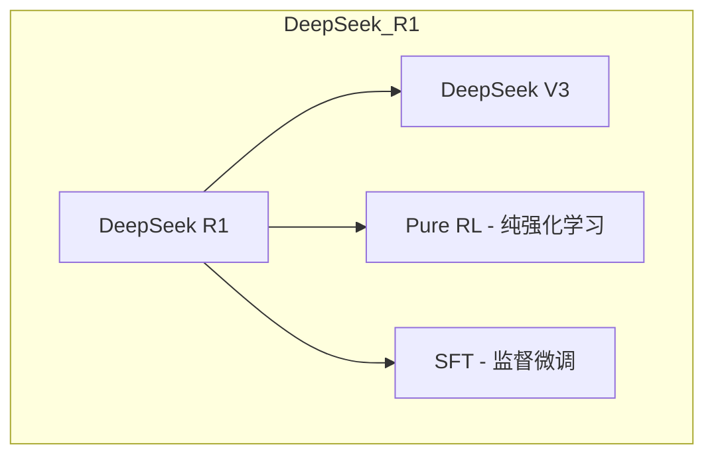

---

### ** 2: 推理模型与 CoT**
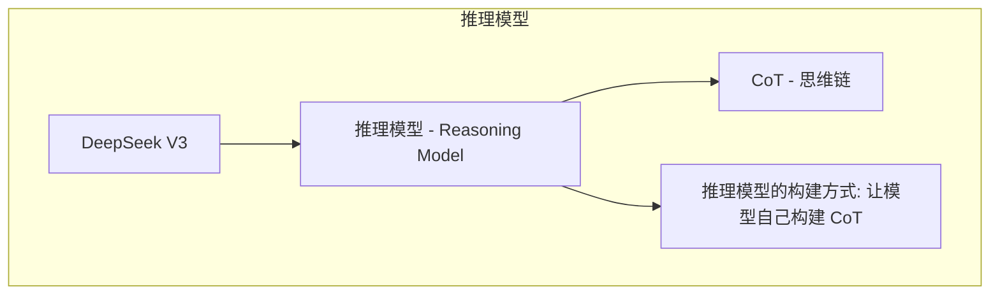

---

### ** 3: DeepSeekMoE 的结构**
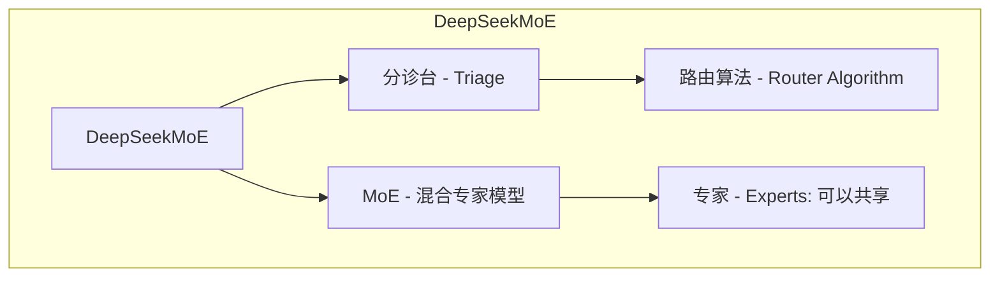

---

### ** 4: AGI 与大语言模型**
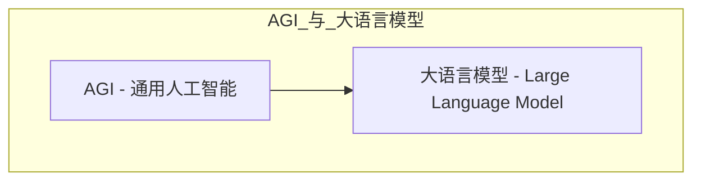

---

### ** 5: Pure RL 与 PRM 的对比**
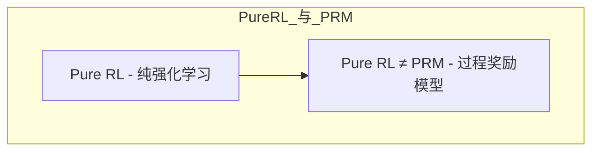

---

### ** 6: MTP 与效率提升**
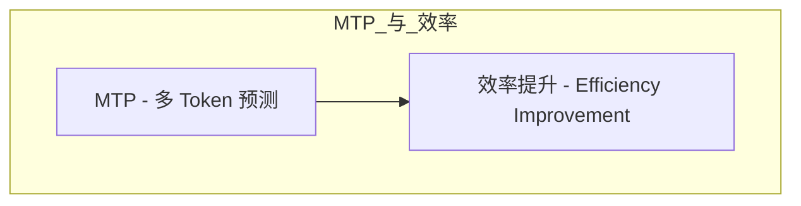

---

### ** 7: 高质量数据与模型提升**
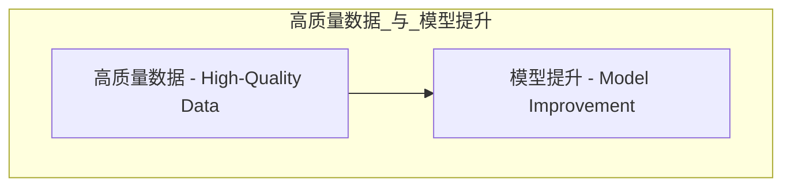

---

### ** 8: 硬件与软件优化**
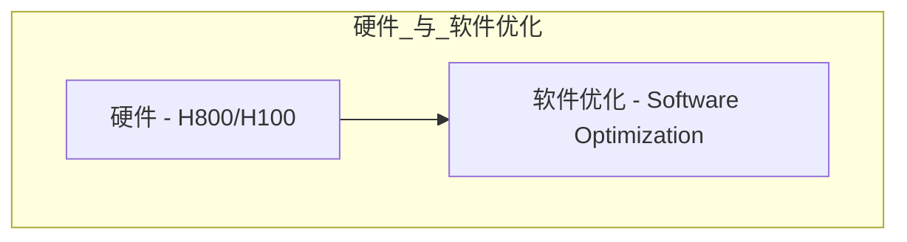

---

### ** 9: Agent Framework**
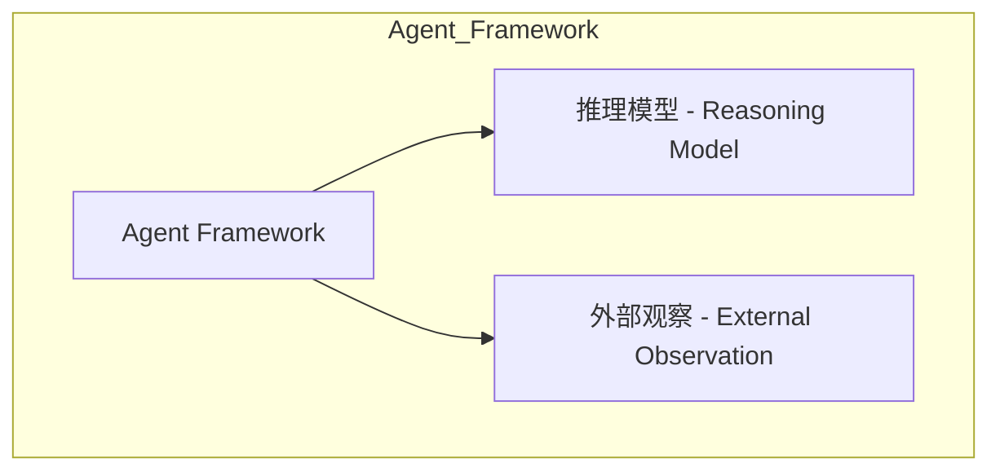

---

### ** 10: R1 的时间差优势**
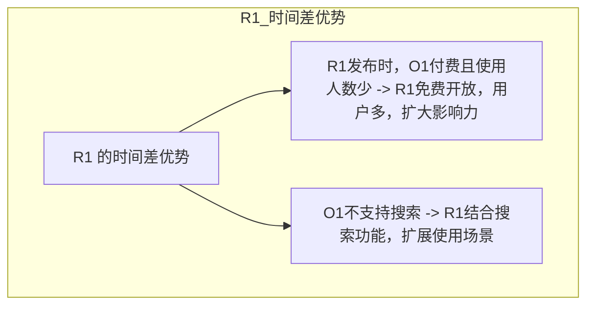

---

### ** 11: 训练成本**
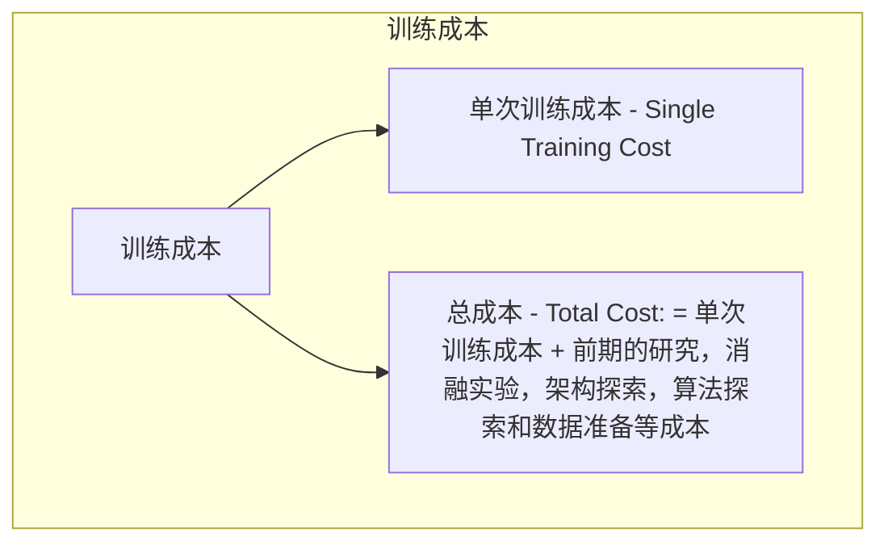

---

