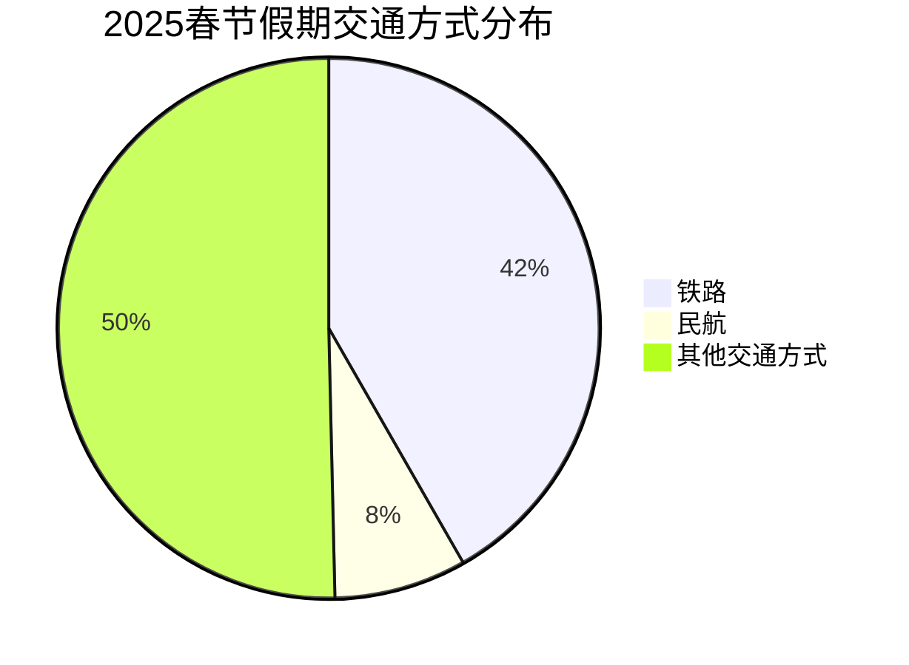
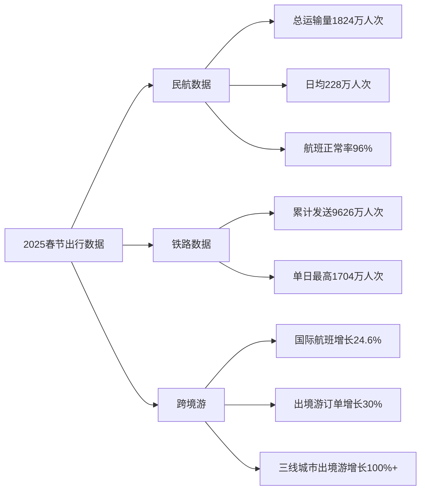
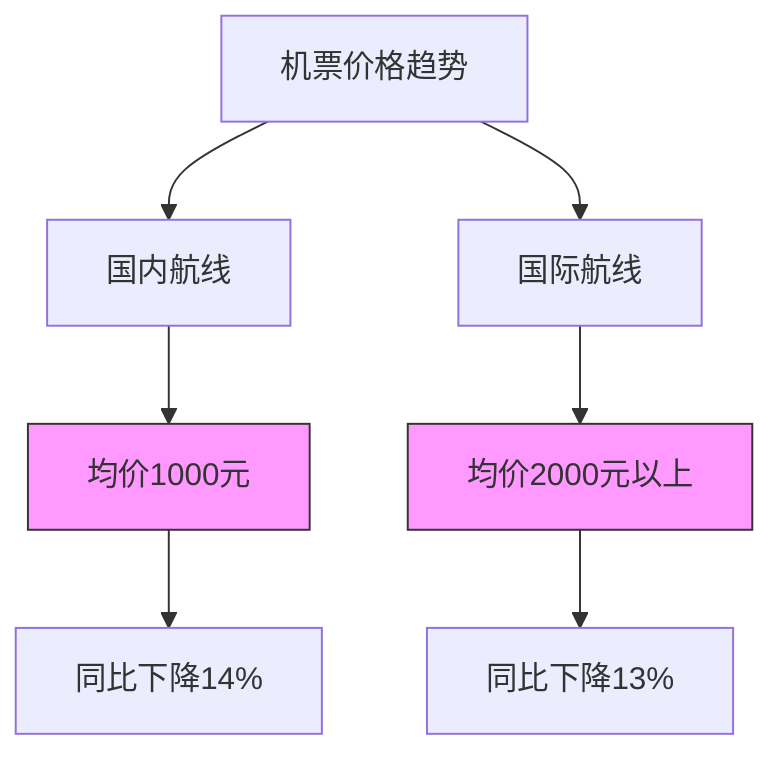

# 春节假期出行火热：铁路民航多项数据创新高，国际航班同比增超24%

> 消费板块开年一回来就跌，白酒板块更是首当其冲，没办法啊，春节出行数据你们看了吗？和24、23年比，继续价跌量升，跑来跑去的人多了，消费力却减弱了，今年春运的机票便宜得吓人！我回成都的商务舱1500， - from  量化分析官

实施8天法定假期后的首个春节，民航、铁路多项出行数据再创新高。

2月5日，据中国民航报从民航局了解到，2025年春节假期（1月28日至2月4日）全国民航运行安全平稳有序，累计运输旅客1824万人次，日均228万人次，比2024年春运同期（2024年2月9日至16日）增长2.9%。其中，2月3日（大年初六）全国民航发送旅客248万人次，创历史新高。春节假期，全国民航累计保障航班14.5万班，日均18083班。航班正常率达96%，比2024年春运同期提高3.4个百分点。

多个第三方出行平台显示，今年春节民航运输旅客量和客运航班总量创历史新高。

全国铁路方面，据国铁集团数据显示，2月4日正月初七，春节假期最后一天，全国铁路发送旅客1704万人次，再次创下春运单日旅客发送量历史新高，春节假期期间全国铁路累计发送旅客9626万人次。

往年春运都会给民航和铁路行业带来明显的客流收益。今年春节假期多个航司机场以及国铁数据创新高，也意味着航司、机场以及铁路部门的盈利能力继续增强。

整体来看，据新华社报道，来自2025年综合运输春运工作专班数据显示，今年春节假期8天全社会跨区域人员流动量超23亿人次，具体为230684.5万人次，全社会跨区域人员流动量持续保持高位运行。经文化和旅游部数据中心测算，春节假期8天，全国国内出游5.01亿人次，同比增长5.9%；国内出游总花费6770.02亿元，同比增长7.0%。

春节机票同比下降超一成

机票价格方面，今年春节未延续去年同期的“量价齐升”，价格呈现同比下滑的趋势。

据第三方出行平台“飞常准”数据显示，2025年春节假期国内机票含税单程均价1000元左右，同比2024年春节下降14%；国际机票含税单程均价2000元以上，同比下降13%。航班管家数据显示，2025年春节期间民航经济舱平均票价达959元，同比2024年春节下滑16.6%，较2019年春节微增2.8%。日趋势上与历年春节保持一致，春节当天票价跌至谷底，随后呈阶梯式增长，初七票价达峰值。

值得注意的是，今年春节前机票价格再现跳水，部分航线跌至百元，临时购票出行成为不少年轻人春节短途游的选择。记者从在线旅游平台“去哪儿”了解到，春节期间选择乘飞机节中出游量同比增一倍，大家出行更分散，也更灵活。七成以上节中出行的机票提前购买周期，缩短至3天内。

随着春节假期的结束，机票价格也呈现下行趋势，节后也将迎来春季错峰出游旺季。第三方旅游平台“携程”数据显示，初五初六返程高峰期机票价格高企，选择错峰返程的游客可在大年初十（2月7日）后购买机票，机票价格预计在此后将回归平常水平。携程数据显示，元宵节后出发，机票、酒店均价相较春节期间有30%至50%回落，适宜错峰出游。从机票价格维度，降幅明显的目的地有重庆、昆明、哈尔滨、三亚、海口，均价下降三、四成。

不过，2月5日零时起，国内航线燃油附加费今年面临首次上调。记者从去哪儿获悉，接到航司消息，调整后，成人旅客国内航线燃油附加费征收标准为800公里及以下航段，每人每航段收取20元；800公里以上航段，每人每航段收取40元。与调整前的标准相比，分别上调了10元和20元。

去年以来，航空客运市场“旺丁不旺财”现象较为突出。1月13日，中国航空运输协会召开2024年第四季度理事单位信息沟通会。通报指出，2024全年完成旅客运输量和货邮运输量均创历史新高，经济舱平均票价同比2023年下降超过10%。行业仍面临不少挑战和压力，其中通报中就提及“八纵八横”高速铁路基本贯通将进一步冲击商务快线等。

国际客运航班同比增超两成

得益于多个跨境游政策利好影响，跨境游成为蛇年春节旅游市场增长引擎。

据民航局数据显示，国际方面，春节假期期间日均保障国际客运航班1888班，比2024年春运同期增长24.6%，恢复至2019年日均水平的86.6%，热门航线集中在与日、韩、东南亚等周边旅游目的地国家间航线上，航班量较大的是与日本、泰国、韩国、马来西亚、新加坡、越南等国家间的航线。

据航旅纵横数据显示，春节假期期间，出入境旅客量比2024年春节同期增长约14%。

航班管家数据显示，2025年春节期间，民航通航国家69个，其中TOP20国家航班量占国际航班总量的92.1%，出港区域主要集中在东亚与东南亚，日本、泰国、韩国位列前三，恢复率上日本已超2019年水平，泰国恢复滞后，仅71.9%，除此之外马来西亚、新加坡、越南、俄罗斯、阿联酋、英国、老挝、意大利、新西兰等国航班恢复率已超100%。

“今年春节期间，跨境游订单同比增长三成。”据携程数据显示，报告显示，短途出境游中，赴日订单同比去年春节增长翻倍。美国、西班牙、意大利、法国等长线游目的地也颇受游客欢迎，分别增长53%、82%、56%、50%。入境游方面，日韩、新马泰等短线入境游订单同比去年春节增长130%，法国、西班牙、意大利、加拿大、澳大利亚等长线入境游订单同比去年增长近120%。

值得一提的是，随着越来越多国家免签，出境游机票价格和酒店价格的降低，以及新开航线越来越多，越来越多的小城居民可以尝试出国过年的滋味。

去哪儿大数据显示，春节三线及以下城市居民购买的出境游机票量已经占总量的三成以上，同比去年春节增长逾一倍。增幅最高的包括，河北张家口、山东滨州、内蒙古鄂尔多斯、广东阳江等，其居民在春节期间预订的出境游机票量同比都增长了2倍以上。

春节8天长假，遇上240小时免签，也有更多外国客人也喜欢来中国。去哪儿数据显示，截至目前，春节期间使用非中国护照预订国内航班的数量同比去年增长七成。其中，排名前五的国家为韩国、美国、澳大利亚、马来西亚和加拿大。在外国人预订前往的中国城市当中，除了北京、成都、上海、广州、西安、杭州等历史文化厚重感强的城市机票预订量较高，越来越多外国人转向二三线城市探索，同比去年新增10个目的地。分别是：包头、大理、南通、台州、伊宁、恩施、义乌、临沂、珠海和北海。

// ... existing code ...

## Visualization

1. [春节假期出行火热：铁路民航多项数据创新高，国际航班同比增超24%][https://www.thepaper.cn/newsDetail_forward_30084440]