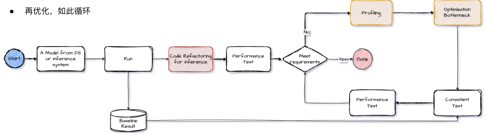

# AI Inference Optimization  With Case Study

> 2024.03.08

**主题：AI推理优化及其案例研究**

**引言**

本简报总结了一份关于AI推理优化的幻灯片演示，主要内容包括基本知识介绍、推理优化流程、案例研究以及优化工具链。演示文稿由 Wenlong Cao（曹文龙）于2024年3月18日发布。核心目标是提升AI推理性能，降低资源消耗，并改善用户体验。

**1. 基本知识介绍**

- **优化目标**（幻灯片 4）
  - **提升系统吞吐**: 单位时间内处理更多样本，减少服务占用计算资源的时长。
  - **减少响应延迟**: 响应时间直接决定客户体验。
  - **提升资源利用率**: CPU/GPU 长期处于空闲状态，不能物尽其用。
- **AI推理相关资源**
  - CPU计算资源/GPU计算资源
  - 网络请求/本地数据读写/设备间数据交换I/O
- **性能调优相关理论**（幻灯片 5）
- **木桶原理**: "一只木桶盛水多少，不取决于最高的那块木板，而是取决于木桶壁上最短的那块。" 强调找出系统中性能瓶颈的重要性。
- **Amdahl 定律**: 定义了串行并行化后加速比的计算公式和理论上限。 加速比定义: Slatency = TW / T(s)W = (1-p)T+pT / (1-p)T+ εpT = 1 / 1-p+εp。 加速比越高，表明优化效果越明显。

**2. 推理优化工作流程**

- **基本工作流**（幻灯片 7）

1. 了解代码，并固化结果
2. 重构代码
3. 通过 profiling 定位系统瓶颈
4. 优化问题
5. 测试，定位下一个优化点
6. 再优化，如此循环

- **代码重构** (幻灯片8) : 示例代码展示了如何加载模型，数据预处理，并执行推理。
- **Profiling** (幻灯片 9-11):
- **Profiling 目标**: 定位系统瓶颈，找到待优化点。
- **Profiling 方法**:
  - 使用 torch.cuda.nvtx 或 nvtx annotation + nvidia system 进行定位。
  - logging 打点，详细而有序。
  - 推荐使用 oneservice 配合使用 aipinfer 中的 logger 进行性能打点。
  - 使用 profile 模块或者火焰图， 参考 [WOMP] VizTracer and VizViewer.
- **NVTX + Nsight Systems 定位示例** 展示了 Nsight Systems 如何定位代码中的性能瓶颈
  - **oneservice 中性的性能定位 log 示例** 展示了 oneservice 记录的详细log信息, 包括时间戳, 进程, 参数等， “详细而有序的log，有助于发现和分析定位问题”。
- **优化方法** (幻灯片 12)
  - **瓶颈类型**:
    -  CPU Compute Bound,
    -  GPU Compute Bound, 
    - I/O Bound.
- **技术点**: 
  - FP32->FP16, High Performance Kernel, TensorCore, 
  - Kernel Fusion, Graph Optimization, Constant Folding, 
  - Multiple Instance,
  -  Multi Stream, MPS等。
- **常用方法**: 
  - 高性能推理框架，
  - 模型转换/图优化，
  - 图像压缩/高速下载。
- **高性能推理框架** (幻灯片13): 
  - 比较了不同框架（PyTorch, TensorRT) 在不同batch size下的推理性能，并说明 “batchsize=1, 吞吐提升至2~4x; batchsize=16, 吞吐提升至2~6x.”。

**3. 推理优化案例研究**

本演示提供了多个优化案例，详细分析了不同类型的性能瓶颈，并提供了相应的解决方案。

- **案例一：CPU Bound** (幻灯片 15-22)
  - **背景**: 商品属性的 tagging 服务中，GPU 利用率非常低（12%左右）。
  - **问题**: CPU 利用率非常高，达到 95% 以上， 初步判断服务存在 CPU 计算瓶颈。 unsupervised_infer 部分时间占整体时间 90% 以上，且 download + detection 约占 20%-300ms, “color 这个CPU聚类模型 占70%+(600-900ms) 的时长，其中 post_process 为总体耗时”。
  - **瓶颈**: CPU 计算瓶颈，阻塞了后续的 supervised 模型 (GPU), 导致系统 GPU 利用率偏低。
  - **优化方案**:
    - **重构代码**: 将无监督模型（KMeans）和深度学习模型（EfficientNet）并行处理，先通过 EfficientNet 对颜色进行预测, 然后将两个模型的结果进行整合.
    - 将 GPU 模型分离出来，业务 pipeline 将不依赖 GPU，纯 CPU 部署即可。GPU 模型与 CPU 模型分离，使得拓展更加灵活。
  - **优化效果**: ID 地区的性能提升 160%，GPU 资源数量由原来的9-16张可减少到3张，CPU 资源由 96～192 核可减少到 64～96 核。 预计GPU 资源可节约 70%，CPU 资源可节约 50%。
- **案例二：GPU Bound + Memory Bound** (幻灯片 23-27)
  - **背景**: 跨语言机器翻译服务，模型基于 OpenNMT 训练后直接部署，推理性能欠佳。
  - **问题**: 模型结构复杂 (Seq2Seq, Transformer), 采用 PyTorch 进行推理, 性能较低，模型转换过程中，应用图优化技术 （包括常量折叠，算子融合等）。
  - **优化**:
    - 针对 GPU Bound 模型, 尝试采用更高效的推理框架 PyTorch -> Onnx -> OnnxRuntime.
    - Kernel 数量减少 20%, 模型性能提升一倍.
    - 将模型分为 3 部分：Decoder 和 Encoder 分别有一个 InferenceSession, 增加 H2D 和 D2H 的开销.
    - 对输入数据/输出结果进行 I/O Binding。 结合 Decoder 模型特点， 裁剪一半的输出，减少 IO 开销。
  - **优化效果**: FasterTransformer 相比 OnnxRuntime 提升明显 (4~5x).
- **案例三：GPU Bound** (幻灯片 28-33)
  - **背景**: 为了提升错误类别的召回率, 使用 T5-Large Transformer 模型，并转化为生成特定 token [X] 的生成任务，在模型部署过程中，使用 huggingface transformers 推理，业务评估性能不满足上线要求。
  - **问题**: 模型是基于 T5 模型进行 finetune 的模型, 模型是 Encoder + Decoder 结构的， GPU 计算瓶颈， generate(GPU) 平均 460 ms， 占总时长的 98%， 预处理(CPU) tokenizer 平均时间 9.3ms，CUDA Kernel 空间闲闭， PyTorch 训练框架中存在的常见问题.
  - **优化方案**:
    - **重构代码**: dataset + dataloader, 参数配置整理, 方便 serving 部署与瓶颈定位。
    - **高性能推理库优化推理性能**: 算子融合，kernel 数量 2356 减少到 1400 个, 减少因 kernel launch 导致的 GPU 空闲。
    - **算子优化**: FasterTransformer (FT) 中除了基本的高性能 kernel 优化外，还实现了 padding 的去除，减少无用的计算，进一步提升 GEMM 的计算效率。
    - **低精度推理**: 采用 FP16 低精度推理，成倍提升 GPU 计算吞吐量。
    - **算子对齐，例如激活函数 Gelu**, **前后处理对齐**。
    - **优化效果**: 模型加载初始化时间大幅减少3x, 模型推理时间延迟加速比3x, 服务基于 Oneservice 部署，相比较 baseline，吞吐提升 4.86 倍，时间延迟减少 50%～80%。
- **案例四：I/O Bound** (幻灯片 34-36)
  - **背景**: 线上服务存在较多的 I/O 操作，比如图片下载和服务间相互调用等。
  - **问题**: 无论Service层面开多少服务进程，无法进一步提升 CPU 利用率。 image data 较大, 网络阻塞服务, CPU 利用率不高.
  - **优化方案**:
    - 网络请求重构为并发方式, 子服务调用也可相同处理.
    - **进一步优化图像下载**: 采用 imencode 进行压缩，大部分使用 JPEG 有损压缩，大小只是原始数据的 10% 左右。 应用更高性能的图片编解码库 （JPEG 用 simplejpeg/PyTurbojpeg，Pillow 9.2.0, OpenCV）
- **案例五：多模态模型系统优化** (幻灯片 37-41)
  - **背景**: 搜索广告依赖商品类别、属性的关键词，商品相关的图像与标题/类别标签等文本数据, 不同地区的语言, 文化差异，解决方法案存在差异.
  - **需求**: 模型为 ALBEF 应用于图文匹配/检索场景, 每个地区对应一个模型用于类别 Correction， 全量业务数据耗时比较长， 希望提升系统吞吐，减少 GPU 资源占用时间.
  - **问题**: 图像数据下载阻塞进程, GPU/CPU 很长时间空闲, 模型初始化时间长，推理过程模型推理中 85% 的耗时为矩阵计算。
  - **优化**:
    - **I/O 瓶颈优化**: 网络请求密集的I/O，平均时间占比高， urls 通过多线程异步加载实现。
    - **模型性能优化**: 低精度推理提升矩阵计算性能, 重构模型子模块的调用关系，减少数据交换开销, 算子融合，常量折叠等手段减少 Kernel 加载开销, 初始化时间 30s+ 降低到 <1s
    - **服务部署**: 模型推理速度提升 75% (4.38x), 单卡服务吞吐达 150 items/s.
  - **多模态其他问题**：不同模态的 encoder 大小/性能差异大, 共享 image/text encoder, 但分类算法不共享, 不同模态对低精度敏感度不一样。
- **案例六：Memory Leak** (幻灯片 42-44)
  - **背景**: 业务已上线服务，出现重启现象，从资源监控中可以看到，Memory Usage 处于涨而不降状态，或者过段时间重启，服务中可能存在内存泄漏。
  - **内存泄漏检测**: 使用 tracemalloc, psutil, memory_profiler 等工具进行分析。 tracemalloc 记录所有内存分配和释放的操作，以及每个对象的大小和位置等信息； memory_profiler 是第三方内存分析工具。

**4. 优化工具链**

- **基本工作流相关工具链**（幻灯片 46）
- **Model Convert**: 模型转换工具，支持多种格式。
- **Oneservice**: 推理服务框架，支持分布式部署。
- **Data Processing Library**: 数据处理库，包括 Wave, MFCC, Normalize, Tokenize, Decode, Resize 等。
- **DataLoader**: 数据加载器，支持多种数据格式和优化。
  - **系统性能评估**: 测试性能和延迟。
  - **模型优化白皮书** （幻灯片 47, 50）
  - **设计目的**: “授人以鱼不如授人以渔”， 旨在帮助大家更好地进行模型优化。
  - **预期收获**: 结合真实业务场景中部署 AI 模型的经验学习优化技能，充分优化服务器资源利用效率，降低AI应用部署成本。
  - **主要内容**: 与模型优化相关的技术原理，如训练，推理优化，性能分析和基准测试等，最佳实践指导和典型业务案例分析。
- **在线文档**: 提供中文版和英文版。

**5. 主要内容总结** （幻灯片 48）

- **2个原理**：木桶原理, Amdahl 原理.
- **1个过程**：模型优化的基本流程.
- **n个工具**: aipinfer.logger，nvtx，监控系统，内存泄漏定位工具。
- **x个案例**: GPU Bound, CPU Bound, I/O Bound, Memory Leak。
- **toolchains + 一本白皮书**.