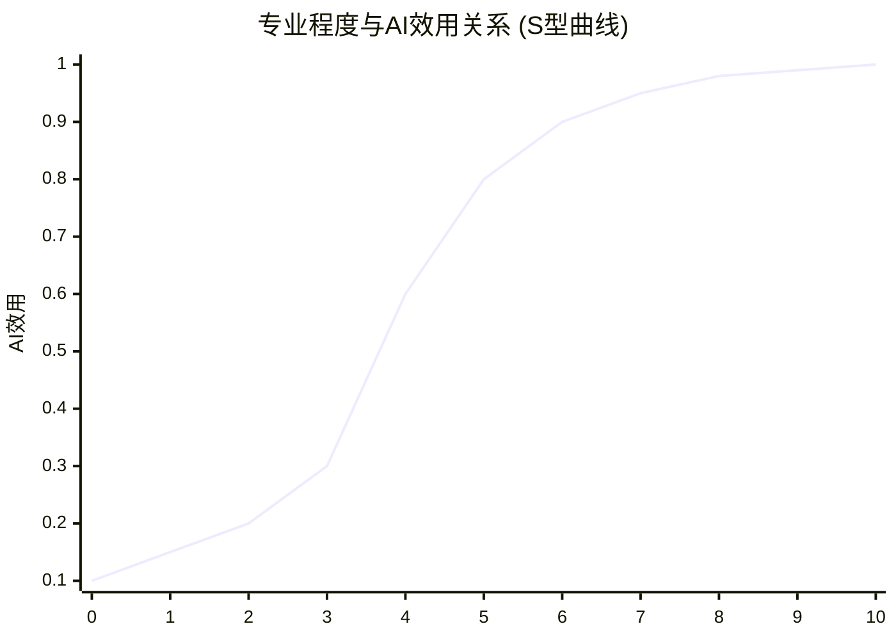
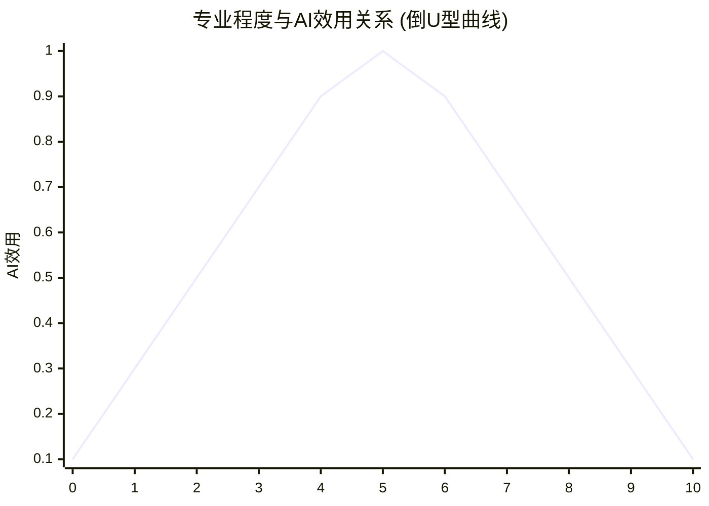

# AI_tools_utility

## 专业程度与AI工具的效用之间的关系

“专业程度”与“AI工具的效用”之间的关系大致可以用一条 **非线性曲线** 来描述，主要包括以下几个阶段：

1. **初学者（Low Expertise, Low AI Utility）**
   - 由于对AI工具不了解，用户无法正确选择或使用AI，导致其效用较低。
   - 可能仅使用AI工具进行简单的辅助（如自动补全、翻译等）。
2. **进阶者（Moderate Expertise, Rising AI Utility）**
   - 逐渐掌握AI工具的使用方法，并结合自身专业知识，提高生产力。
   - AI在数据分析、文案生成、代码补全等方面发挥更大作用。
   - 典型例子：程序员使用Copilot、市场人员使用AI生成营销内容。
3. **专业人士（High Expertise, High AI Utility）**
   - 能够深度理解AI工具的能力和局限，精准地调用其功能，最大化效用。
   - 可能开发、定制AI工具，或用AI提升自身专业工作的效率。
   - 例如：医生利用AI辅助诊断但依然基于专业判断决策。
4. **顶级专家（Very High Expertise, Declining AI Utility）**
   - AI工具的效用可能达到瓶颈，因为顶级专家的洞察力、创造力、战略思维等，AI难以替代。
   - 过度依赖AI可能限制其独特的专业判断或创新能力。
   - 例如：人工智能专家本身就是在开发AI工具，工具对他们的帮助有限。

## AI 工具效用（AI  Tools Utility）

 **专业度 → AI工具效用**：专业度越高，AI工具的效用越大。可以理解为AI工具效用 = k(专业度)，k函数表示AI工具的效用与专业度正相关。具体的关系表现为一下两种类型

### 专业程度与AI效用关系 (S型曲线) Logistic 函数

**S型曲线（Logistic 函数）**：适用于AI效用随专业程度逐渐上升但趋于平稳的情况。
$$
U(x)=L1+e−k(x−x0)U(x) = \frac{L}{1 + e^{-k(x - x_0)}}
$$

- x 表示专业程度（从初学者到专家）
- U(x) 表示 AI 工具的效用
- L 是最大效用
- k 控制曲线陡峭程度
- x0 是效用增长的中点

这个图表展示了：X轴代表专业程度（从0到10） Y轴代表AI效用（从0到1）
曲线特征：

1. 在低专业度时，AI效用增长缓慢
2. 在中等专业度时，AI效用快速增长
3. 在高专业度时，AI效用增长逐渐趋于平缓
这种S型曲线很好地展示了：只有达到一定的专业水平门槛，才能充分发挥AI工具的效用，而当专业度达到很高水平后，AI效用的增长会趋于饱和。

**倒U型曲线（二次函数）**：适用于AI效用在一定专业程度后下降的情况。
$$
U(x)=−a(x−b)2+cU(x) = -a(x - b)^2 + c
$$

- 其中 b代表 AI 效用的峰值位置，c 是最大效用。

这个图表展示了：X轴代表专业程度（从0到10），Y轴代表AI效用（从0到1）
曲线特征：

1. 在低专业度时，AI效用随专业度提升而增加

2. 在中等专业度时（约5分），AI效用达到最大值

3. 在高专业度时，AI效用反而开始下降

  这种倒U型曲线表明：
  存在一个最佳的专业水平点，在这个点上能获得最大的AI工具效用
  过度依赖或过度专业化反而可能降低AI工具的效用
  这种关系暗示了在使用AI工具时需要找到一个平衡点

上图展示了两种可能的数学模型：

1. **S型曲线（蓝色虚线）**：表示 AI 工具的效用随着专业程度的提高逐渐上升，但最终趋于饱和，适用于 AI 主要作为**工具而非决策者**的情况。
2. **倒U型曲线（红色实线）**：表示 AI 效用先上升，在专业程度较高时达到峰值，然后可能因专家的深入理解而减少依赖 AI，适用于 AI 无法完全取代高级专业知识的场景。

实际应用中，不同行业、不同 AI 工具可能呈现不同的趋势。例如：

- 编程助手（如 Copilot）：更符合 S 型曲线，因为即使是顶级程序员，AI 也能持续提高效率。
- 医疗诊断 AI：可能符合倒 U 型曲线，因为 AI 在中等专业程度时帮助最大，但高级医生可能更依赖经验和直觉。

