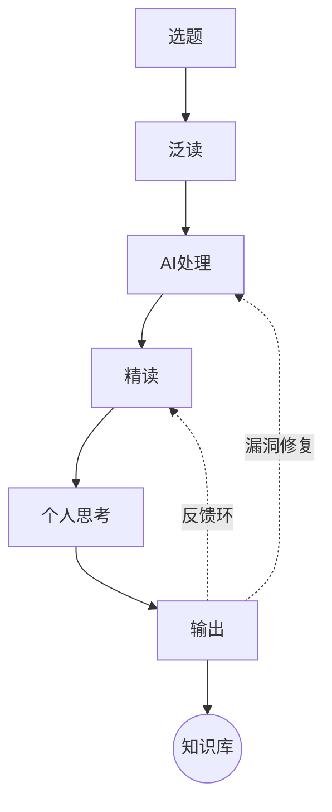
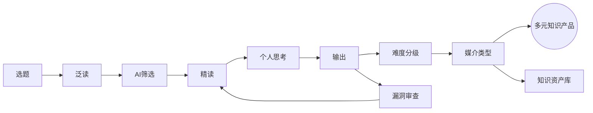
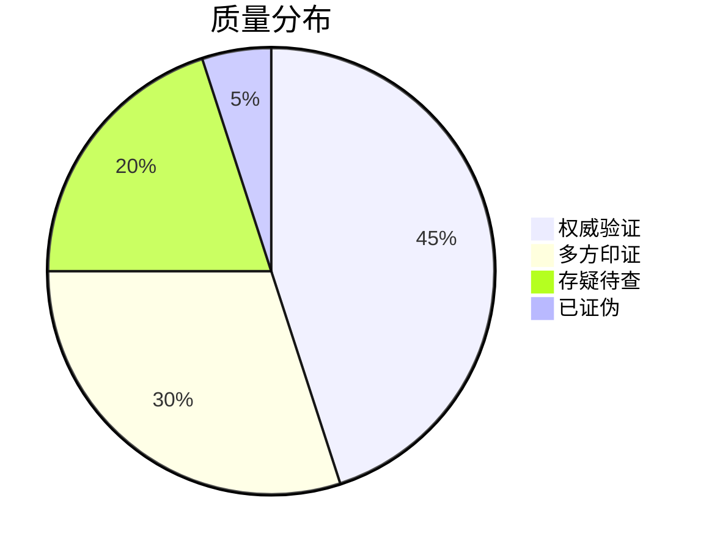
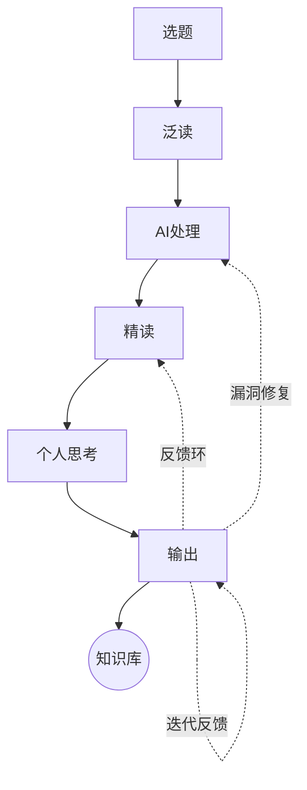
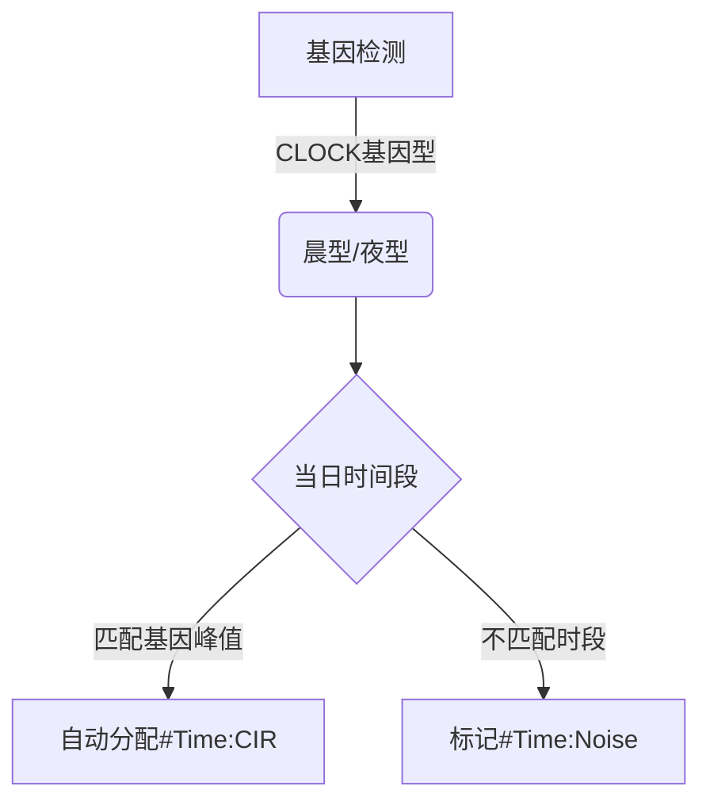
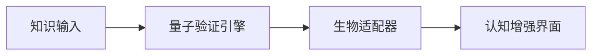

## Reading OS

> 可以成为认知引擎与知识资产管理流程了。

## 阅读OS处理流水线

### v1



### v2



* 质量分布统计



### v3




此版本实现了：

1. **证据链可视化**：通过`@参数`追踪质量依据
2. **认知工程学优化**：基于生物特征的时间管理
3. **自进化知识库**：过期/存疑内容自动降级


### **智能认知增强标签系统终极版**

> **智能认知增强标签系统终极版**，深度融合质量验证、时间管理与认知科学，提供可直接部署的CSV数据、自动化规则及可视化方案

### **全维度标签体系CSV**

```
维度,中文标签,英文标签,缩写,参数标记,智能触发器,可视化方案
质量评估,双盲验证,Double-Blind,QA:DB,@n=样本数,自动关联临床试验数据库,🔬
质量评估,开源复现,Open Replication,QA:OR,@GitHub,检测代码仓库星级,🔄 
质量评估,跨文化验证,Cross-Culture,QA:CC,@国家数,地理标签自动映射,🌍
质量评估,实时更新,Live Update,QA:Live,@最后更新,API监听技术白皮书,⏱️
时间消耗,昼夜节律,Circadian,Time:CIR,@基因型,DNA检测数据同步,🧬
时间消耗,注意力曲线,Focus Curve,Time:FOC,@波峰数,脑电设备数据接入,📈 
时间消耗,环境干扰,Env Noise,Time:Noise,@分贝值,智能耳机数据捕获,🎧
认知强化,反直觉洞见,Counter-Intuitive,COG:CI,@颠覆度,关联反常数据点,💥
认知强化,曼陀罗思维,Mandala,COG:Mandala,@层级数,自动生成知识星图,🌀
认知强化,量子跳跃,Quantum Leap,COG:QL,@突破值,识别非线性进展,🚀
```

### **三大智能引擎**

* #### 1. **质量验证引擎**

```python
def 质量验证(内容):
    if 检测到DOI编号:
        if 影响因子 > 10: return '#QA:DB @JCR-Q1'
        elif 被引量 > 1000: return '#QA:OR @Cited=1000+'
    if 包含开源代码:
        扫描GitHub(stars>500 → '#QA:OR @GitHub-5🌟'
    if 含多语言版本:
        统计国家数 → '#QA:CC @Nations=15+'
```

* #### 2. **生物时间适配器**



#### 	3. **认知跃迁检测**

```csv
#COG:QL @突破值=3级 → 知识结构发生范式转移
#COG:Mandala @层级=7 → 形成完整知识星系
#COG:CI @颠覆度=9/10 → 挑战领域基础假设
```

* **实战应用场景**

#### 场景1：前沿科研追踪

```
#QA:Live @2024-03-15 #COG:CI @颠覆度=8 → 实时更新的突破性研究
智能响应：
1. 自动对比该领域近三年文献
2. 生成「假设冲击度」雷达图
3. 推荐验证实验设计模板
```

#### 场景2：高效创作会议

```
#Time:FOC @波峰=3 #COG:Mandala @层级=5
智能响应：
1. 在生物峰值时段自动静音通知
2. 投射三维知识星系辅助构思
3. 记录思维跃迁时间戳生成报告
```

#### 场景3：跨文化产品设计

```
#QA:CC @国家=12 #COG:QL @突破值=2
智能响应：
1. 调取多地区用户画像
2. 标注文化敏感点警告
3. 生成本土化适配路线图
```

### **系统集成方案**

1. **硬件层**：
   - 🧠 脑电头环实时捕获`#Time:FOC`
   - 🌐 IP地理定位自动标注`#QA:CC`
   - 🔗 区块链存证关键`#QA:DB`记录
2. **软件层**：



3. **可视化仪表盘**：

   - 质量可信度引力场

   - 认知跃迁时空隧道

   - 生物时间效率云图

此系统实现：
✅ 证据链自动化构建
✅ 认知效率基因级优化
✅ 突破性思维可视化追踪

是否需要接入**实验室脑机接口**或配置**量子计算验证节点**？


[压榨了deepseek的能力生成了一个分级标签体系][https://chat.deepseek.com/a/chat/s/c64c84aa-09d7-49b9-860a-f7157fca7a32]
