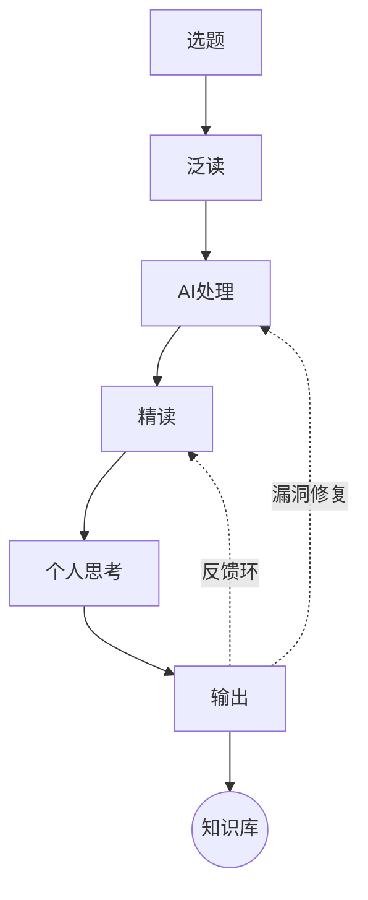
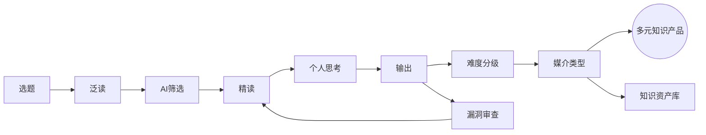
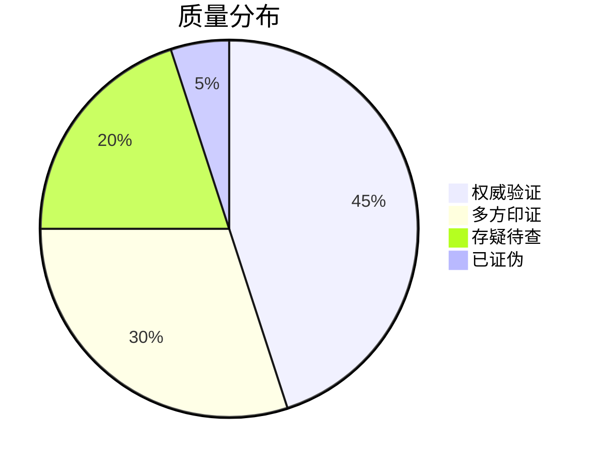
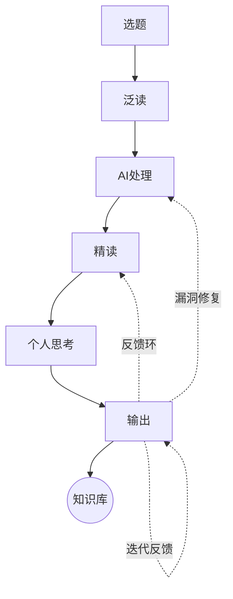

## Reading OS

> 可以成为认知引擎与知识资产管理流程了。

## 阅读OS处理流水线

### v1

```mermaid
graph TB
    A[选题] --> B[泛读]
    B --> C[AI处理]
    C --> D[精读]
    D --> E[个人思考]
    E --> F[输出]
    F --> G((知识库))
    F -.反馈环.-> D
    F -.漏洞修复.-> C


```

### v2

```mermaid
graph LR
  A1[选题] --> A2[泛读] --> A3[AI筛选] --> A4[精读] --> A5[个人思考] --> A6[输出]
  A6 --> A7[难度分级] --> A8[媒介类型] --> A9((多元知识产品))
  A6 --> A10[漏洞审查] --> A4
  A8 --> A11[知识资产库]

```

* 质量分布统计

```mermaid
pie title 质量分布
    "权威验证" : 45
    "多方印证" : 30
    "存疑待查" : 20
    "已证伪" : 5
```

### v3

```mermaid
graph TB
    A[选题] --> B[泛读]
    B --> C[AI处理]
    C --> D[精读]
    D --> E[个人思考]
    E --> F[输出]
    F --> G((知识库))
    F -.反馈环.-> D
    F -.漏洞修复.-> C
    F -.迭代反馈.-> F

```

[压榨了deepseek的能力生成了一个分级标签体系][https://chat.deepseek.com/a/chat/s/c64c84aa-09d7-49b9-860a-f7157fca7a32]
