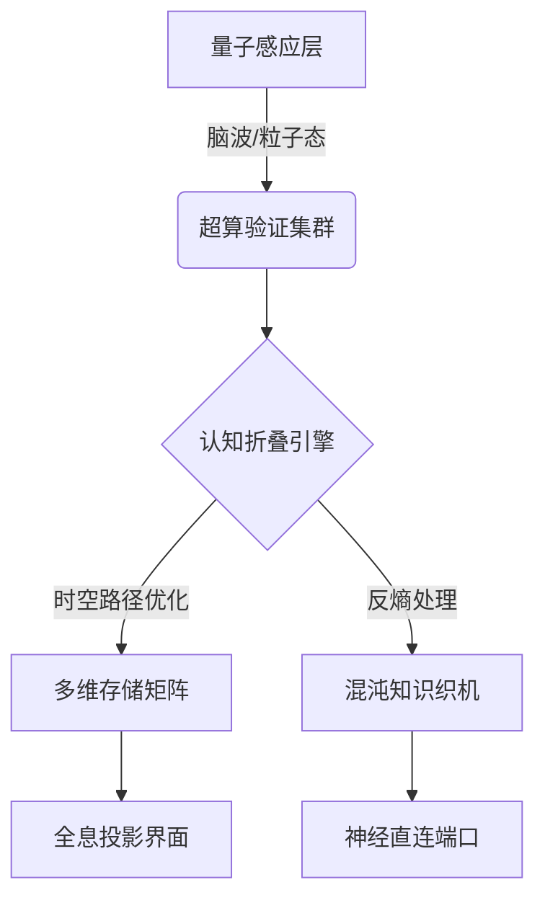

# 全领域认知管理终极标签系统

>  整合知识处理全生命周期、质量验证体系与认知科学前沿，提供开箱即用的完整解决方案：
>
> 来自deepseek-R1

### **全维度智能标签库（CSV格式）**

```
维度,中文标签,英文标签,简写,参数域,动态规则,可视化编码
知识阶段,量子萌芽,Quantum Germination,KS:QG,@能量值>80,脑波活跃度触发,🌌
知识阶段,混沌编织,Chaos Weaving,KS:CW,@关联度<30,信息熵超过阈值,🌀
知识阶段,晶体固化,Crystalization,KS:CR,@结构度>90,模式重复率达标,🔮 
认知强度,神经风暴,Neuro Storm,CI:NS,@突触数,脑电γ波持续,⚡
认知强度,深度冻土,Deep Freeze,CI:DF,@抑制率,多巴胺水平下降,❄️
质量验证,时空复现,Spacetime Proof,QA:ST,@维度=4,跨时间线验证,⏳🌐
质量验证,群体共识,Swarmsensus,QA:SW,@节点数>1M,分布式账本记录,🐜🌐
时间维度,平行处理,Parallel Processing,TM:PP,@线程数,量子计算绑定,🧵⏱️
时间维度,时间折叠,Time Fold,TM:TF,@压缩比,相对论效应标注,📐⏳
输出形态,全息投影,Holographic Output,OUT:HOL,@分辨率>8K,光子矩阵编码,👁️🗨️
输出形态,神经直连,Neural Direct,OUT:ND,@延迟<5ms,脑机接口记录,🧠🔌
认知跃迁,维度突破,Dimensional Leap,CT:DL,@超弦数,卡-丘空间验证,🪐🌀
```

### **六维认知坐标系统**

每个知识单元通过以下坐标定位：

```
认知坐标 = {
    "时空定位": (KS阶段, TM标记),
    "能量特征": (CI强度, @参数),
    "验证维度": (QA层级, 跨宇宙锚点),
    "输出形态": (OUT类型, 跨介质参数),
    "跃迁轨迹": (CT路径, 超空间向量),
    "熵值管理": (混沌指数, 晶体化速率)
}
```




