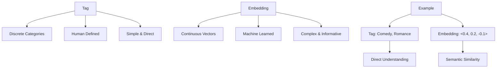

# Embedding

### 第一步：想象两者的样子

- **Tag（标签）**：假设你在超市买东西，每件商品上都有一个贴纸，比如“水果”“零食”“饮料”。这些贴纸是人直接写上去的，非常直白，告诉你这个东西属于哪个类别。它们是离散的、固定的，通常由人手动定义。
- **Embedding标签**：现在想象这些商品没有贴纸，而是每个商品被“浓缩”成一个魔法数字，比如“苹果”是[0.1, 0.5, -0.2]，“薯片”是[0.8, -0.3, 0.1]。这些数字不是人贴上去的，而是机器通过分析数据（比如商品描述、使用场景）自动生成的。它们不是简单的类别，而是连续的、充满信息的“浓缩版身份”。

---

### 第二步：区别在哪里？
1. **谁来定义？**
   - **Tag**：人定义的。比如你说“这篇文章是‘科技’类的”，这就是一个tag，直接由你决定。
   - **Embedding**：机器学出来的。计算机看大量数据（比如文章内容），自己算出一个数字向量，比如[0.3, 0.7, -0.1]，你甚至不一定知道这些数字具体代表啥，但它们抓住了文章的“本质”。

2. **形式是什么？**
   - **Tag**：通常是单词或短语，比如“积极”“消极”“搞笑”。简单明了，但信息量少。
   - **Embedding**：是一串数字（向量），比如[0.2, -0.1, 0.9]。信息量多，能表示复杂的相似性和关系，比如“猫”和“狗”的embedding会比“猫”和“桌子”更接近。

3. **灵活性如何？**
   - **Tag**：很死板。比如一篇文章被打上“科技”tag，你没法知道它跟另一篇“科技”文章有多像，除非再加更多tag。
   - **Embedding**：超级灵活。两个向量的距离可以直接算出来（比如用数学公式），告诉你两篇文章到底有多相似，甚至能发现它们在某些细微方面的联系（比如都提到AI，但语气不同）。

4. **用途上的区别**
   - **Tag**：适合人看和管理。比如你在笔记本上写“重要”“待办”，方便自己快速分类。
   - **Embedding**：是为机器设计的。计算机用它来做高级任务，比如推荐系统（“你喜欢这个，可能会喜欢那个”）或搜索（找到意思相近的内容）。

---

### 第三步：举个生活例子
假设你在给朋友推荐电影：
- 用**tag**：你说“这部电影是‘喜剧’‘爱情’”，朋友一看标签就懂了，但不知道它跟《老友记》有多像。
- 用**embedding**：你不用说具体类别，机器直接给这部电影一个向量[0.4, 0.2, -0.1]，然后发现它跟《老友记》的向量[0.5, 0.1, -0.2]很接近，就推荐给朋友。朋友可能不知道这些数字，但机器知道它们“味道”相似。

---

### 第四步：总结区别
- **Tag**是给人用的简单分类，直白但粗糙，像贴在东西上的便签。
- **Embedding**是给机器用的高级“浓缩信息”，复杂但精确，像一个包含无数细节的数字DNA。

所以，tag是你能一眼看懂的标签，而embedding是机器才能读懂的“隐藏密码”，它能干更多聪明的事。你觉得这个解释清楚吗？想再挖深点吗？

## Visualization

好的！让我用费曼的方法（Feynman Technique）来解释“embedding”（嵌入），这种方法强调用简单、直白的语言把复杂概念讲清楚，仿佛在教给一个完全不懂的人。

### 第一步：什么是embedding？
想象你有一个超级杂乱的房间，里面堆满了各种玩具、书、衣服等等。你想把这些东西整理一下，但不是简单地堆在一起，而是把它们“浓缩”成一个更容易理解的小标签，贴在每个东西上。比如，所有的毛绒玩具贴上“软乎乎”标签，所有的书贴上“知识”标签。这样，你一看标签就大概知道这些东西是什么，而不用每次都翻开看细节。这就是embedding的本质——把复杂的东西（比如词语、图片、甚至整个句子）变成一个简单但有意义的“标签”，方便计算机理解和处理。

在计算机的世界里，这个“标签”其实是一组数字（通常是一个向量），它抓住原始东西的核心特点。比如，单词“猫”可能被嵌入成 [0.2, -0.1, 0.9]，而“狗”可能是 [0.3, -0.2, 0.8]。这些数字不是随便选的，它们是通过大量数据训练出来的，能反映“猫”和“狗”之间的相似性（比如它们都是宠物）。

---

### 第二步：为什么需要embedding？
假设你是一个图书管理员，面对一堆书，想快速知道两本书是不是讲差不多内容的。你不可能把每本书都读一遍，对吧？如果每本书都有一个“标签”（比如一串数字），你只要看这些数字有多接近，就能猜到书的相似度。embedding就是干这个的——它把复杂的东西（文字、图像等）变成数字，让计算机可以快速比较、分类或者找规律。

比如在自然语言处理（NLP）里，计算机不懂“猫”和“狗”是什么意思，但它能通过embedding看到它们的数字很接近，就知道它们可能有关系（比如都是动物）。这比直接处理原始的文字或图片快得多，也更聪明。

---

### 第三步：embedding怎么来的？
想象你在学外语，老师教你“apple”和“pomme”（法语里的苹果）是一个意思。你是怎么记住的呢？可能是通过看句子里的用法，比如“吃一个apple”和“吃一个pomme”，慢慢发现它们总是出现在相似的地方。embedding的训练过程有点像这样：计算机看大量的数据（比如句子），发现哪些词老是出现在一起，哪些词意思相近，然后给它们分配相似的数字“标签”。

具体来说，这种训练通常靠神经网络（比如Word2Vec或BERT）。这些模型会分析海量文本，调整每个词的数字，直到这些数字能很好地反映词之间的关系。比如，“国王”和“女王”的embedding会很接近，但跟“桌子”差得远。

---

### 第四步：用embedding干啥？
回到我们杂乱房间的例子。有了这些小标签，你可以干很多事：把“软乎乎”的东西放一堆，把“知识”的放书架，还能快速找到跟“软乎乎”类似的东西。embedding也一样，它在AI里用途超广：
- **搜索**：你搜“猫”，它能找到“喵星人”之类意思相近的词。
- **推荐**：Netflix看你喜欢“动作片”，就推类似的片子，因为它们的embedding接近。
- **翻译**：把中文的“猫”和英文的“cat”映射到相似的数字，就能翻译了。

---

### 总结
Embedding就像给复杂的东西贴了个“聪明标签”，用一串数字浓缩它的意思。计算机用这个标签来快速理解、比较和处理东西。它的核心是通过数据学习出来的，能抓住事物之间的关系，比如“猫”和“狗”比“猫”和“桌子”更像。简单吧？

