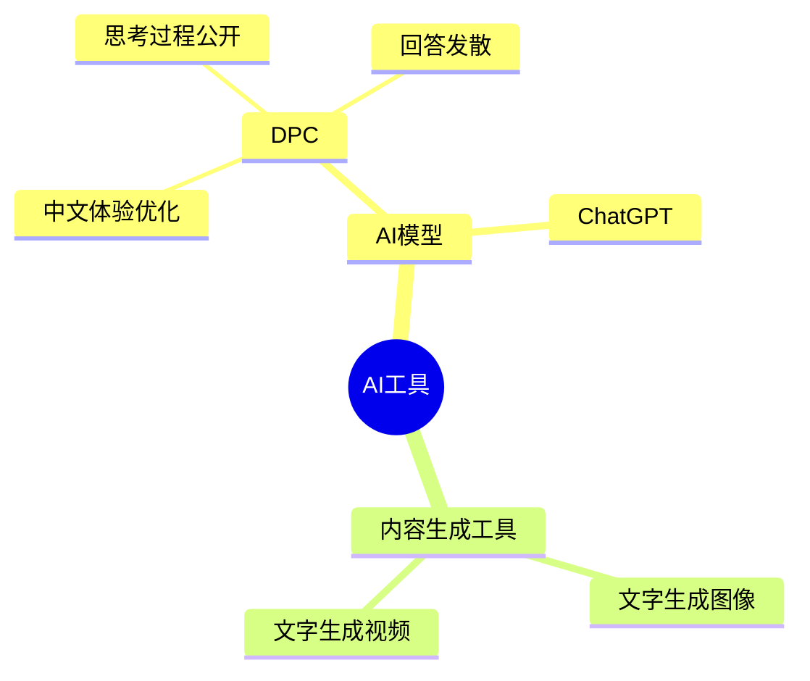
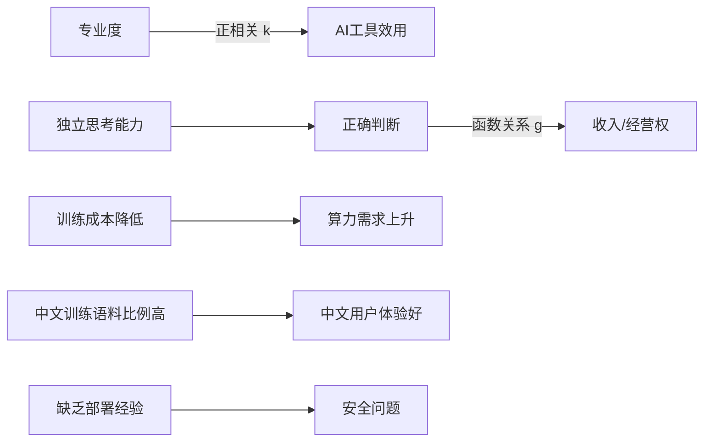
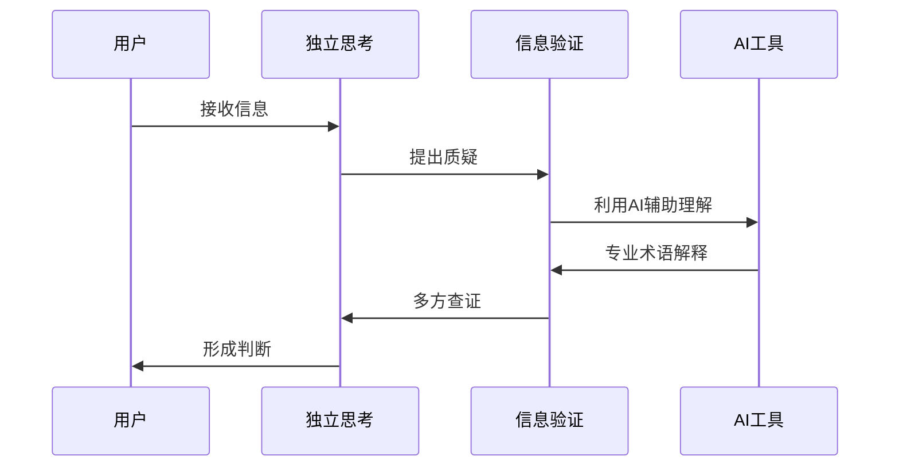

# 老师在2025年2月7日的分享独立思考

围绕**独立思考能力**这一核心概念，阐述了多个AI相关概念及其相互关系。为了更清晰地理解这些关联，可以采用链式思考 (Chain of Thought, COT) 的方式，通过定义、分类、比较、因果和科学方法论等逻辑手段进行梳理：

1.  **定义与分类**：
    *   **AI (人工智能)**：定义为一种工具。根据其功能，AI可以被分类为多种类型，例如：
        *   **AI模型**：如DPC (DeepSeek) 和 ChatGPT。
        *   **内容生成工具**：如文字生成图像工具、文字生成视频工具等。
    *   **独立思考能力**：定义为在信息过载的环境下，进行多角度分析和做出理性判断的能力。
    *   **专业度**：定义为个体在特定领域所掌握的知识和技能水平。
    *   **算力**：定义为计算机处理数据的能力。
    *   **训练语料**： 用于训练AI模型的数据集。

2.  **比较与对比**：
    *   **DPC vs. ChatGPT**：两者均为AI模型。
        *   DPC在中文用户体验上可能更优，因为其训练语料中中文比例较高。
        *   DPC全面公开了思考过程。
        *   DPC的回答更发散，可能表明其并非通过大规模蒸馏ChatGPT获得。
    *   **专业人士 vs. 非专业人士**：
        *   对于专业人士，AI工具能显著提升工作效率和创造力。
        *   对于非专业人士，AI工具的效用有限.
    *   **蒸馏模型 vs. 原始模型**：
        *   蒸馏后的模型答案应该更收敛。

3.  **因果关系**：
    *   **专业度 → AI工具效用**：专业度越高，AI工具的效用越大。可以理解为AI工具效用 = k(专业度)，k函数表示AI工具的效用与专业度正相关。
    *   **独立思考能力 → 正确判断 → 收入/经营权**：独立思考能力是做出正确判断的前提，而正确的判断是获取收入和经营权的关键。 收入/经营权 = g(判断)，其中g表示函数关系，意味着判断越准确，越有可能获得更高的收入和经营权。
    *   **训练成本降低 → 算力需求上升**：训练成本降低会吸引更多参与者，导致算力需求上升。
    *   **缺乏产品部署/服务器安全经验 → 安全问题**：换方（DeepSeek的开发者）在产品部署和服务器安全方面经验欠缺，可能导致安全问题。
    *   **中文训练语料比例高 → 中文用户体验好**：DPC对中文用户更友好，因为其训练语料中中文比例较高。

4.  **科学方法论**：
    *   **假设检验**：发言人通过提问和阅读理解来验证某些说法，例如DeepSeek是否蒸馏了ChatGPT，以及PTX指令集是否绕过了CUDA垄断。
        *   针对"DeepSeek蒸馏了ChatGPT"的假设，通过分析其回答的发散性进行反驳。
        *   针对"PTX指令集绕过了CUDA垄断"的说法，通过提问验证发现PTX就是CUDA指令集，从而否定了该说法。
    *   **信息核实**：发言人强调要独立思考，四处查证，利用AI工具来解决专业术语的理解问题，以此提升阅读理解能力和判断力。

5.  **逻辑串联**：

    *   在这个信息时代，AI作为一种强大的工具，其价值的发挥取决于使用者的专业度。 然而，各种AI工具和信息的涌现也伴随着虚假信息和炒作。 **独立思考能力**是关键，它能够帮助人们**区分真伪，做出正确的判断**。 正确的判断能够帮助人们**更好地利用AI工具**，并在专业领域**取得更大的成就，获得更高的收入和经营权**。 同时，我们也需要关注AI的安全问题，并不断提升自身的专业度，才能在这个快速变化的时代立于不败之地。

通过以上分析，可以看出发言人强调了独立思考能力在AI时代的重要性，以及如何运用科学方法论来验证信息，提升自身能力。发言人同时提醒人们关注AI的安全风险，并不断提升自身的专业度。

## Visualization

### AI分类与关系

### 因果关系图

### 科学方法论流程
