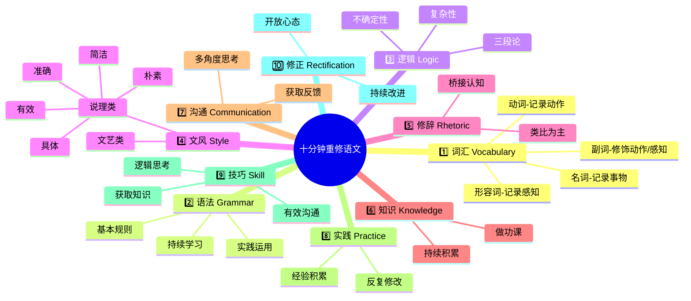
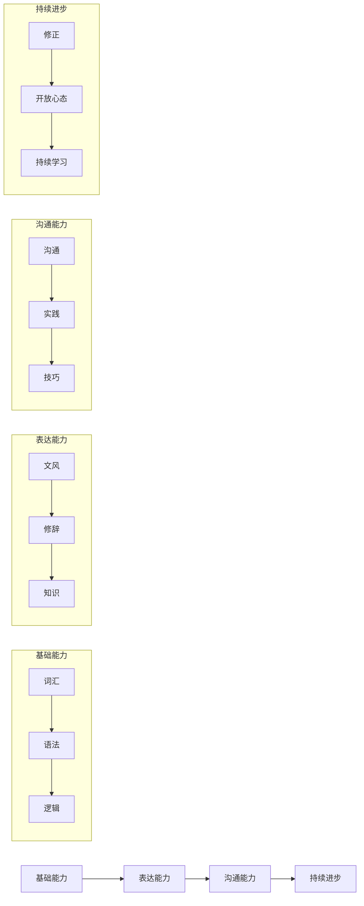

# 重修语文课

十分钟重修语文
这真是异常吊诡的事情：任何一种体制下的教育制度都在 "写作" 方面无能为力 —— 语文教育是如此地苍白无力，乃至于各个国家的教育者都沮丧地发现年轻一代至少有半数在接受所谓的 "高等教育" 之后竟然连基本的 "阅读能力" 都不具备。这是个 "十分钟教程" —— 让我们重修一下语文。人人都会写字，人人都有话可说，人人都应该能够写好文章；在这个文字发表空前容易的年代，文字更有力量。

第一分钟：词汇（Vocabulary）
最好换个角度重新认识词汇。名词是干什么的？名词是用来记录你所能够感知的事物 —— 管它是抽象的还是具体的。形容词是干什么的？你用形容词来记录你对你能够感知的那个事物的感知。动词呢？动词用来记录你能够感知的那个事物所发出的动作。那么最后，副词呢？副词修饰动词的时候，是用来记录你对你能够感知的那个事物所发出之动作的感知；副词用来修饰形容词的时候，是用来记录你对你能够感知的那个事物的感知的感知。（这一分钟的内容看起来比较拗口，只要能做到对这些文字断句准确，理解无误，那么仅在一分钟之后就已经脱胎换骨 —— 你对文字的感知已经大不相同。

第二分钟：语法（Grammar）
你不一定要成为语法学家，但你起码要知道基本规则。这就好像投资股市不一定非要先成为林奇或者巴菲特，享受电影不一定要先成为徐克或者斯皮尔伯格；但起码要学习最基本的游戏规则。中文也好英文也罢，语法书一本就够。了解基本规则之后，就开始动手写字，把语法书当作地图，需要什么就去查什么，查多了就全记住了 —— 就好像一个地方去了好几次之后就再也用不着查地图了一样。千万不要相信那些鬼话，说什么 "不用学语法" —— 人家发疯是人家的事儿，你情愿当傻子相信疯子，那是你的问题。

第三分钟：逻辑（Logic）
逻辑应该是所有生物中人类所特有的得之不易的工具。亚里士多德的三段论是最基础的东西。但是，生活中运用逻辑时所要面对的是 "不确定性"、"复杂性"。必然成立的三段论 —— 比如，大前提：人都要死的；小前提：苏格拉底是人；结论：苏格拉底必然会死的 —— 往往没有什么实际意义。生活中要处理的更可能是这样的情形：大前提：政客通常都不可靠；小前提：奥巴马当然是政客；结论是不确定的、分析是复杂的：奥巴马到底有多可靠？追求逻辑上的准确所有的挑战基本上都来自于一个人是否勇于面对 "不确定性" 与 "复杂性"。

第四分钟：文风（Style）
常见的文章起码可以如此二分：文艺类文章与说理类文章。这两类文章很不相同。基本上，文艺类的文章可能更注重修辞、更考究措辞、更华丽更天马行空。然而，说理类文章的根本目的是为了让人看懂，传递信息，积累知识，交流经验；因此说理类文章的文字最好 "简洁、朴素、有效、准确、具体"。当然，这不是铁律，如果有能力用华丽的文字说清楚道理也不是不行；反过来，用朴素的语言叙述动人的故事也未尝不可。但是所有希望自己的思考结果能够有效表达的人都最好牢记这十个字的标准 —— 仅仅十个字而已，却已经足够。

第五分钟：修辞（Rhetoric）
修辞的力量不言而喻。所有的修辞之中也许只有 "类比" 是不可或缺的。类比的本质是 "为了说清楚大家不熟悉的 X，先去找一个 1) 大家都熟悉的 2) 与 X（至少某一方面）最相似最接近的 A，最终做到 X 对大家来说不言而明"。小学老师说 "地球的构造就跟鸡蛋的构造差不多"；中学老师说 "原子内部的构造与太阳系的构造如出一辙"；对那些拿一两个 "反例" 试图反对某一观点的人我们说 "随便哪一只破烂钟表都能一天对两次呢"…… 这些都是类比，类比的力量就在于此：它是我们作为人类从无知跨越到有知必须的桥梁。其它的修辞手段，有空就学，没空就算 —— 大不了更朴素一点没有什么不好。

第六分钟：知识（Knowledge）
字、词、句、语法、风格、修辞等等，都是表达手段。没有米，无论是谁再巧做不出饭吃。"求知" 这个词的意味实在是太过理想化，还不如用比较朴素的另外一个说法 "做功课"。做好任何事情，都要提前做好功课。写小说也好、写教程也罢，都需要做功课；功课做得多了，知道的就多了，能够用来思考的也多了，这些东西多到一定程度，写出来的东西必然厚重、有质感。肤浅的文字之所以肤浅，一句话：作者没做功课。知识改变命运，只因为一个人获得新的知识之后，他的整个世界都会因此发生变化。相信我，功课无止境。

第七分钟：沟通（Communication）
有效表达只是最基本的层次，有效沟通才是真正的目标。从多个角度出发思考已非易事，从反对自己观点之人的角度出发思考问题难上加难。但如若做不到这一点，就无法做一个好的听众、好的读者。输出取决于输入，是不变的真理；不吃草的话牛是挤不出奶的。沟通不仅仅是为了说服，更多是为了获取反馈。沟通的技巧最重要的只有一个：不要认为自己与自己的观点是一回事儿。做到这点，就很容易看到种种反馈之中的宝贵之处。对做不到这点的人来说，逆耳的不仅仅是忠言，甚至就没有听着顺耳看着顺眼的东西 —— 可怜、可悲。

第八分钟：实践（Practice）
经验需要积累，而积累只能通过实践。所谓 "下笔如有神" 一看就是不会写文章的人才可能相信的痴心妄想。好的文章从来都不是一蹴而就的，好的文章从来都是改出来的。所谓的 "灵感" 也更可能在实践中闪现，而不大可能凭空而出。作者写字就好像司机开车一样。司机要积累到一定的驾驶里程，才可能遇到所有可能遇到的安全问题，于是终究有一天经验足够到有可能回避一切危险。作者也一样，写字多到一定程度才可能知道文字的种种属性 —— 不大可能通过某一本写作教程就理解所有文字的属性。不仅要多写，还要为了写好而做更多的功课，这是良性循环的起点。

第九分钟：技巧（Skill）
技巧这东西要等到明白究竟可以在哪里用得上的时候才容易学会。当前这篇 "十分钟教程" 里所提到的十个方面之中，个个都需要技巧。通过一定的实践，无论是谁也都会自然而然地掌握一些技巧。但有一个方面的技巧是应该最先打磨的 —— 获得知识的技巧：从观察到聆听，从阅读到反刍，从读书到笔记，从使用图书馆到使用搜索引擎，一切获得知识的手段需要技巧，并且还需要不停地打磨这些基本技巧。其次是逻辑思考的技巧，再次之是沟通的技巧。这三项是应该排在其他技巧之前，因为打磨任何一项技巧都需要时间，时间有限的情况下，只能划分轻重而为之。

第十分钟：修正（Rectification）
没有人从一开始就能做到完美。正如一篇好文章是要反复修改才能成为好文章一样，一个作者也要反复修正自己才能成为好作者。几乎一切都需要修正，并且需要反复修正 —— 只要时间允许。前一分钟说每一项技巧都需要打磨，这一分钟要说的是连技巧都要反复修正。甚至，还有些时候要把一切都完全推翻从头再来，这需要的不仅是勇气，还需要耐心与智慧。让自己的心智保持开放，知易行难的原因在于其中蕴含着痛苦 —— 打破牙齿和血吞（曾国藩语）的痛苦。

## Visualization

