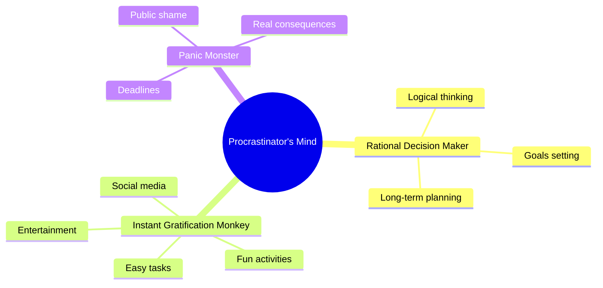
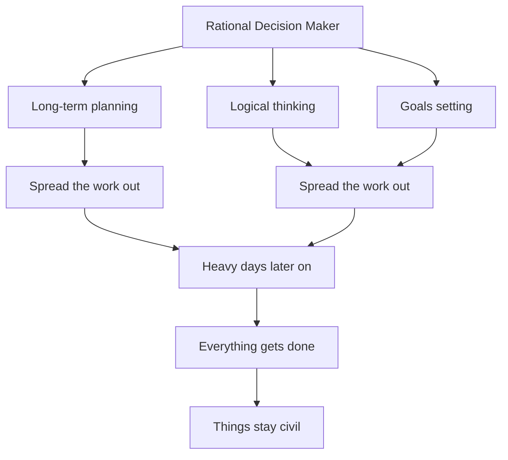
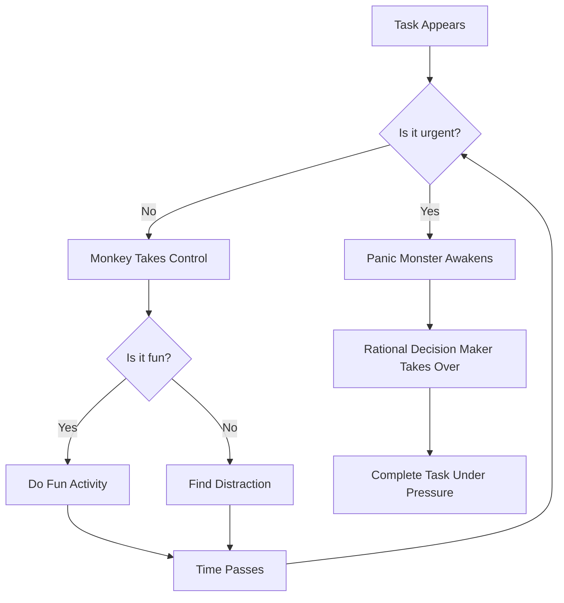

# Inside The Mind of a Master Procrastinator by Tim Urban

## Visualization

### The Procrastinator's Mind

### Procrastination Decision Flow

And I would want to do that like that. That would be the plan. I would have it all ready to go, but then, actually, the paper would come along, and then I would kind of do this. And that would happen every single paper.

But then came my 90-page senior thesis, a paper you're supposed to spend a year on. I knew for a paper like that, my normal work flow was not an option. It was way too big a project. So I planned things out, and I decided I kind of had to go something like this. This is how the year would go. So I'd start off light, and I'd bump it up in the middle months, and then at the end, I would kick it up into high gear just like a little staircase. How hard could it be to walk up the stairs? No big deal, right?

But then, the funniest thing happened. Those first few months? They came and went, and I couldn't quite do stuff. So we had an awesome new revised plan. And then – but then those middle months actually went by, and I didn't really write words, and so we were here. And then two months turned into one month, which turned into two weeks.

And one day I woke up with three days until the deadline, still not having written a word, and so I did the only thing I could: I wrote 90 pages over 72 hours, pulling not one but two all-nighters — humans are not supposed to pull two all-nighters — sprinted across campus, dove in slow motion, and got it in just at the deadline.

I thought that was the end of everything. But a week later I get a call, and it's the school. And they say, *"Is this Tim Urban?"*

And I say, *"Yeah."*

And they say, *"We need to talk about your thesis."*

And I say, *"OK."*

And they say, *"It's the best one we've ever seen."*

That did not happen.

It was a very, very bad thesis. I just wanted to enjoy that one moment when all of you thought, *"This guy is amazing!"* No, no, it was very, very bad.

Anyway, today I'm a writer-blogger guy. I write the blog ***Wait But Why***. And a couple of years ago, I decided to write about procrastination. My behavior has always perplexed the non-procrastinators around me, and I wanted to explain to the non-procrastinators of the world what goes on in the heads of procrastinators, and why we are the way we are.

Now, I had a hypothesis that the brains of procrastinators were actually different than the brains of other people. And to test this, I found an MRI lab that actually let me scan both my brain and the brain of a proven non-procrastinator, so I could compare them. I actually brought them here to show you today. I want you to take a look carefully to see if you can notice a difference. I know that if you're not a trained brain expert, it's not that obvious, but just take a look, OK? So here's the brain of a non-procrastinator.

Now, here's my brain.

There is a difference. Both brains have a rational decision-maker in them, but the procrastinator's brain also has an instant gratification monkey. Now, what does this mean for the procrastinator? Well, it means everything's fine until this happens.

So the rational decision-maker will make the rational decision to do something productive, but the Monkey doesn't like that plan, so he actually takes the wheel, and he says, actually, let's read the entire Wikipedia page of the Nancy Kerrigan/ Tonya Harding scandal, because I just remembered that that happened.

**ALSO READ:** Faith and Doubt: Greg Tonkinson (Full Transcript)

Then we're going to go over to the fridge, to see if there's anything new in there since 10 minutes ago. After that, we're going to go on a YouTube spiral that starts with videos of Richard Feynman talking about magnets and ends much, much later with us watching interviews with Justin Bieber's mom.

*"All of that's going to take a while, so we're not going to really have room on the schedule for any work today. Sorry!"*

Now, what is going on here? **The Instant Gratification Monkey** does not seem like a guy you want behind the wheel. He lives entirely in the present moment. He has no memory of the past, no knowledge of the future, and he only cares about two things: *easy and fun*.

Now, in the animal world, that works fine. If you're a dog and you spend your whole life doing nothing other than easy and fun things, you're a huge success!

And to the Monkey, humans are just another animal species. You have to keep well-slept, well-fed and propagating into the next generation, which in tribal times might have worked OK. But, if you haven't noticed, now we're not in tribal times. We're in an advanced civilization, and the Monkey does not know what that is. Which is why we have another guy in our brain, the Rational Decision-Maker, who gives us the ability to do things no other animal can do. We can visualize the future. We can see the big picture. We can make long-term plans. And he wants to take all of that into account. And he wants to just have us do whatever makes sense to be doing right now.

Now, sometimes it makes sense to be doing things that are easy and fun, like when you're having dinner or going to bed or enjoying well-earned leisure time. That's why there's an overlap. Sometimes they agree. But other times, it makes much more sense to be doing things that are harder and less pleasant, for the sake of the big picture. And that's when we have a conflict. And for the procrastinator, that conflict tends to end a certain way every time, leaving him spending a lot of time in this orange zone, an easy and fun place that's entirely out of the Makes Sense circle. I call it the Dark Playground.

Now, the Dark Playground is a place that all of you procrastinators out there know very well. It's where leisure activities happen at times when leisure activities are not supposed to be happening. The fun you have in the Dark Playground isn't actually fun, because it's completely unearned, and the air is filled with guilt, dread, anxiety, self-hatred — all of those good procrastinator feelings. And the question is, in this situation, with the Monkey behind the wheel, how does the procrastinator ever get himself over here to this blue zone, a less pleasant place, but where really important things happen?

Well, turns out the procrastinator has a guardian angel, someone who's always looking down on him and watching over him in his darkest moments — someone called the **Panic Monster**.

Now, the Panic Monster is dormant most of the time, but he suddenly wakes up anytime a deadline gets too close or there's danger of public embarrassment, a career disaster or some other scary consequence. And importantly, he's the only thing that the Monkey is terrified of. Now, he became very relevant in my life pretty recently, because the people of TED reached out to me about six months ago and invited me to do a TED Talk.

Now, of course, I said yes. It's always been a dream of mine to have done a TED Talk in the past. But in the middle of all this excitement, the Rational Decision-Maker seemed to have something else on his mind. He was saying, *"Are we clear on what we just accepted? Do we get what's going to be now happening one day in the future? We need to sit down and work on this right now."*

And the Monkey said, *"Totally agree, but let's just open Google Earth and zoom in to the bottom of India, like 200 feet above the ground, and we're going to scroll up for two and a half hours till we get to the top of the country, so we can get a better feel for India."* So that's what we did that day.

**ALSO READ:** The Art of Diplomacy: Tayo Rockson (Transcript)

As six months turned into four and then two and then one, the people of TED decided to release the speakers. And I opened up the website, and there was my face staring right back at me. And guess who woke up?

So the Panic Monster starts losing his mind, and a few seconds later, the whole system's in mayhem. And the Monkey — remember, he's terrified of the Panic Monster — boom, he's up the tree! And finally, finally, the Rational Decision-Maker can take the wheel and I can start working on the talk.

Now, the Panic Monster explains all kinds of pretty insane procrastinator behavior, like how someone like me could spend two weeks unable to start the opening sentence of a paper, and then miraculously find the unbelievable work ethic to stay up all night and write eight pages. And this entire situation, with the three characters — this is the procrastinator's system. It's not pretty, but in the end, it works. And this is what I decided to write about on the blog just a couple of years ago.

When I did, I was amazed by the response. Literally thousands of emails came in, from all different kinds of people from all over the world, doing all different kinds of things. These are people who were nurses, bankers, painters, engineers and lots and lots of PhD students.

And they were all writing, saying the same thing: *"I have this problem too."* But what struck me was the contrast between the light tone of the post and the heaviness of these emails. These people were writing with intense frustration about what procrastination had done to their lives, about what this Monkey had done to them. And I thought about this, and I said, well, if the procrastinator's system works, then what's going on? Why are all of these people in such a dark place?

Well, **it turns out that there's two kinds of procrastination**. Everything I've talked about today, the examples I've given, they all have deadlines. And when there's deadlines the effects of procrastination are contained to the short term because the Panic Monster gets involved. But there's a second kind of procrastination that happens in situations when there is no deadline.

So if you wanted a career where you want to be a self-starter — something in the arts, something entrepreneurial — there's no deadlines on those things at first, because nothing's happening at first, not until you've gone out and done the hard work to get momentum, to get things going. There's also all kinds of important things outside of your career that don't involve any deadlines, like seeing your family or exercising and taking care of your health, working on your relationship or getting out of a relationship that isn't working.

Now if the procrastinator's only mechanism of doing these hard things is the Panic Monster, that's a problem, because in all of these non-deadline situations, the Panic Monster doesn't show up. He has nothing to wake up for, so the effects of procrastination, they're not contained; they just extend outward forever.

**And it's this long-term kind of procrastination that's much less visible and much less talked about than the funnier, short-term deadline-based kind**. It's usually suffered quietly and privately. And it can be the source of a huge amount of long-term unhappiness, and regrets. And I thought, that's why these people are emailing, and that's why they're in such a bad place. It's not that they're cramming for some project. It's that long-term procrastination has made them feel like a spectator, at times, in their own lives. The frustration is not that they couldn't achieve their dreams; it's that they weren't even able to start chasing them.

**ALSO READ:** Want to be Happier? Stay in the Moment: Matt Killingsworth (Full Transcript)

So I read these emails and I had a little bit of an epiphany — that I don't think non-procrastinators exist. That's right — I think all of you are procrastinators. Now, you might not all be a mess, like some of us, and some of you may have a healthy relationship with deadlines, but remember: the Monkey's sneakiest trick is when the deadlines aren't there.

Now, I want to show you one last thing. I call this a **Life Calendar**. That's one box for every week of a 90-year life. That's not that many boxes, especially since we've already used a bunch of those. So I think we need to all take a long, hard look at that calendar. We need to think about what we're really procrastinating on, because everyone is procrastinating on something in life. We need to stay aware of the Instant Gratification Monkey. That's a job for all of us. And because there's not that many boxes on there, it's a job that you probably start today.

Well, maybe not today, but … sometime soon.

Thank you.

### **SUMMARY OF THIS TALK:**

Tim Urban's TED Talk, titled **"Inside the Mind of a Master Procrastinator,"** delves into the world of procrastination and the inner workings of a procrastinator's mind. Here are the key points from his talk:

**1. Procrastination is Universal:** Tim shares his personal experiences with procrastination during his college days when he had to write papers. He admits to a common pattern of delaying tasks, even when he had ample time to complete them.

**2. The Procrastinator's Dilemma:** Tim describes his attempt to tackle a 90-page senior thesis and the elaborate plan he devised to complete it gradually over the year. However, he ends up procrastinating until the last moment, writing the entire thesis in a high-stress, sleep-deprived marathon.

**3. The Monkey and the Rational Decision-Maker:** Tim introduces two characters in the procrastinator's brain: **the Rational Decision-Maker**, who plans for the future and makes logical decisions, and the **Instant Gratification Monkey**, who seeks immediate pleasure and resists productive tasks.

**4. The Dark Playground:** The Monkey often takes control, leading the procrastinator into the **"Dark Playground,"** where enjoyable but unproductive activities like binge-watching videos and unnecessary internet surfing dominate. This zone is marked by guilt and anxiety.

**5. The Panic Monster:** The Panic Monster awakens when a deadline approaches or there's a threat of public embarrassment. It forces the Rational Decision-Maker back into control, allowing the procrastinator to complete tasks under pressure.

**6. Two Types of Procrastination:** Tim distinguishes between short-term procrastination, which is deadline-driven and often leads to frenzied productivity, and long-term procrastination, which affects important life goals that lack deadlines and can result in lasting unhappiness and regret.

**7. The Life Calendar:** Tim presents a "Life Calendar" with boxes representing the weeks in a 90-year life. He encourages the audience to contemplate what they are procrastinating on and the limited number of opportunities they have in life. This visual prompts self-reflection and the need to address long-term procrastination.

**8. Procrastination is Universal:** Tim concludes by suggesting that procrastination is a universal struggle, affecting everyone to some degree. He emphasizes the importance of recognizing and managing procrastination, particularly when there are no external deadlines to prompt action.

In his entertaining and relatable talk, Tim Urban uses humor and personal anecdotes to shed light on the common experience of procrastination and the internal battles that procrastinators face. He encourages the audience to confront their own procrastination tendencies and take action to pursue their goals and dreams.

[Inside The Mind of a Master Procrastinator by Tim Urban][https://singjupost.com/inside-the-mind-of-a-master-procrastinator-by-tim-urban-full-transcript/?singlepage=1]