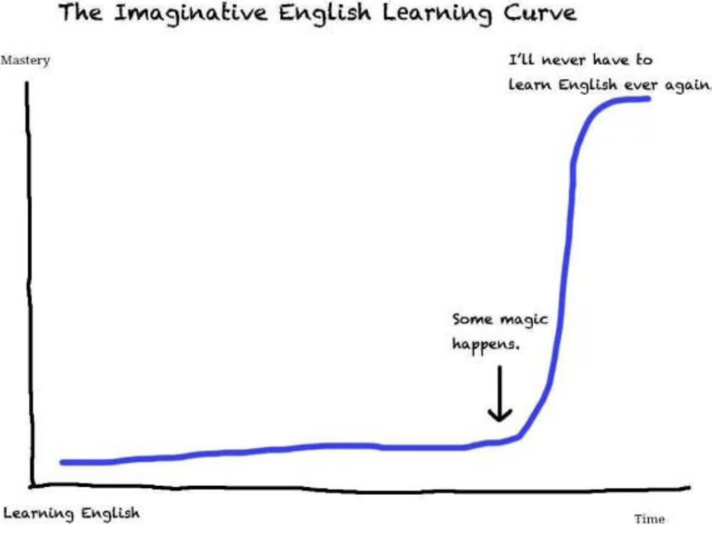
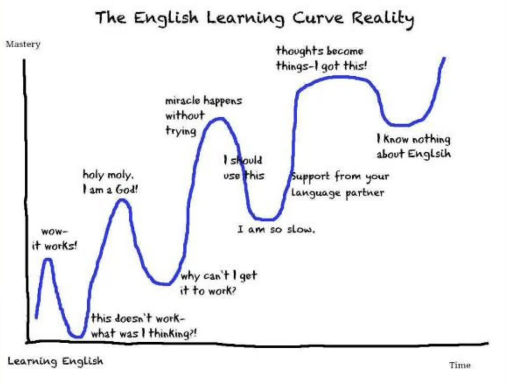

# the English Learning curve

关于英语学习曲线，以下是一些源文件中提到的相关信息：

- **理想的学习曲线**：源文件提到，很多人想象中的英语学习曲线是突然有一天开窍，英语水平直线飞升，达到一个平台期后就再也不用学英语了。但这种理想的学习曲线是不存在的。

- 真实的学习曲线

  

  ：实际的英语学习曲线是迂回曲折上升的。在这个过程中，学习者会遇到各种各样的问题，包括：

  - 开始时会有一个小小的波峰，感觉学习有效。
  - 之后会觉得学习又不管用了，水平下降。
  - 然后又会到一个新的小高峰，感觉自己很厉害。
  - 随后又会陷入“为什么又不管用了”的困惑。
  - 如果放弃，学习就会停止，但如果不放弃，会进入“不经意间发生奇迹”的状态，突然觉得状态很好。
  - 接着又会觉得学不会，觉得自己很蠢。
  - 这时，语伴和老师的支持会帮助你走向新的学习高峰。
  - 最后，你可能会陷入新一轮的纠结，觉得自己什么都不懂。

- 学习曲线的意义

  ：

  - 这个真实的学习曲线是学习任何一门学科的正常过程。
  - 当感觉快要放弃时，可以看看这个图，了解自己所处的阶段。
  - 要利用好语伴之间的纽带，一起学习。

- 其他相关信息

  - 老师在课上播放科恩的歌曲，并提到科恩是浪漫的歌手和诗人，可以课后自己去听。
  - 老师提到同学们交的作业很多都配了乐，包括英文歌和配乐诗朗诵，还有配中国传统乐器的。
  - 老师纠正了gift和given的发音，强调举一反三的重要性。
  - 老师还纠正了appropriate的发音，建议遇到长单词时将其切开。
  - 老师讲解了very well的用法，既可以表示“非常好”，也可以表示反语“真有你的”。
  - 老师提到虚擬語氣在英語中非常重要，並舉例說明。

希望这些信息能帮助你理解英语学习曲线。