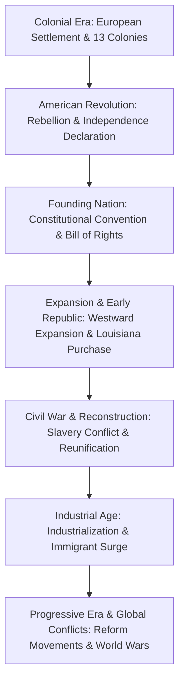
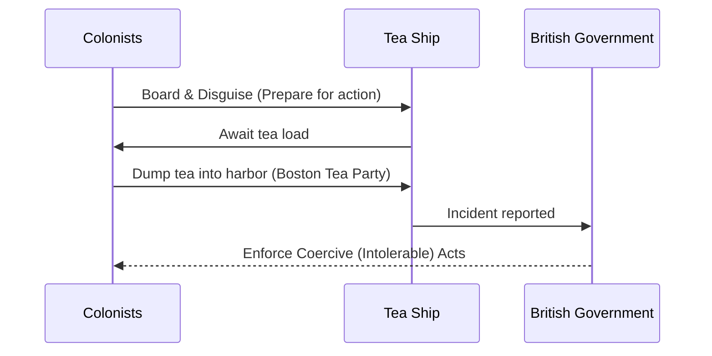

# 《美国小史》（A Little History of the United States)

> prompt: 我最近在读《美国小史》（A Little History of the United States，作者：James Davidson）这本书。请你帮我起早一份对这本书的深度解读报告，帮我快速、全面、深刻的理解这本书中的所有重要观点和细节，请适当举例帮助充分理解观点。 要求：使用英文搜索，只采纳英文资料（因为互联网上英文资料在数量和质量上都是最好的），用中文回答。

好的，我将为你撰写一份全面、深入的解读报告，详细解析《美国小史》的所有重要观点和细节。

报告将涵盖以下内容：

-   书籍的整体框架和核心论点
-   重要的历史事件、社会变革、政治制度、经济发展与文化演变
-   关键细节的深度解读，并结合具体案例分析
-   与其他重要的美国历史书籍（如Howard Zinn的《A People's History of the United States》和Paul Johnson的《A History of the American People》）进行比较，分析不同作者的叙述视角
-   采用表格形式整理关键信息，提高信息传递效果

研究完成后，我会将报告呈现给你。

## 《美国小史》深度解读报告

## 引言与书籍概览

**作者与背景：**《美国小史》（**A Little History of the United States**）是詹姆斯·韦斯特·戴维森（James West Davidson）于2015年出版的一部美国简史，属于耶鲁大学出版社"Little History"系列之一。戴维森是一位资深历史学者，曾参与编写多本广受欢迎的中学历史教材。作为系列的一部分，这本书旨在以简明生动的方式概述美国历史，从"发现"美洲到现代美国的形成，覆盖长达500年的发展历程。全书约40章，每章约7页，总篇幅约300页，用通俗易懂的笔触串联起美国历史的重要事件和人物。

**结构与内容覆盖**：**戴维森从欧洲人到达"新世界"前夕开始，强调美洲原住民早已在这片土地上繁衍生息，因此严格说来，"新世界"只是相对欧洲人而言的新概念。他写道："历史学家长期以来称美洲为'新世界'，相对于欧洲、非洲和亚洲的'旧世界'。我没有使用这些术语，因为美洲对印第安人来说当然不新，他们已经在这里生活了数千年。"但他也指出，哥伦布1492年后，两百年间欧洲人与美洲土著的接触彻底改变了这片大陆，战争征服、天花病毒以及蒲公英和洋葱等外来物种的传播，使得1492年以前的美洲成为了一个截然不同的"新世界"。从这番引言出发，作者按照时间顺序讲述历史：**殖民时代**（涵盖早期探险、殖民地建立、北美十三州的发展）、**独立革命**与建国、**西进扩张**与社会变革、**南北战争**与重建、**工业化**与崛起、**世界大战**与冷战、**民权运动**与当代演进等。全书的编排类似一部浓缩的美国通史，几乎每个美国学生在课堂上听过的重大事件在书中都有涉猎。例如，殖民地时期的普利茅斯和詹姆斯敦、18世纪中的法印战争（法法印第安人战争）、掀起革命的波士顿倾茶事件、南北战争、罗斯福的新政、二战、肯尼迪政府的高光时刻（如古巴导弹危机）等，在书中依次登场。

**写作风格：**戴维森运用了生动的叙事方式，将历史故事娓娓道来。他善于用细节和人物对话增强可读性，在短短几句话中制造出氛围和悬念。例如，他描写1773年波士顿倾茶事件时，不仅交代了殖民者反抗英国茶税的背景，还塑造了塞缪尔·亚当斯（Samuel Adams）在灯火昏暗的教堂里以暗语发动民众的场景，随后"乔装成印第安人"的波士顿群众冲向港口把茶叶倒入冰冷海水。这种手法使得历史事件仿佛发生在读者眼前，充满故事性和节奏感。再如，他在讲述1962年的**古巴导弹危机**时，用寥寥数语概括了13天的惊险对峙："在宏大的历史规模上，这不过是雷达屏幕上小小的一闪。然而我们所知的世界几乎终结。"他引用时任国务卿迪安·腊斯克的话"对手先眨眼了"，又指出事实上**双方**都在核战边缘退让了一步。通过这些简练而具画面感的描述，戴维森在有限篇幅内保持了历史叙事的连贯性和趣味性。

\*\*局限与评价：\*_由于篇幅有限，《美国小史》在深度上有所取舍，更侧重于"大事年表"式的主线故事，而对一些社会文化层面的细节着墨较少。有评论指出，书中对女性和少数族裔历史的涉及相对不足：殖民地时代到建国初期几乎不见女性身影，直到19世纪末20世纪初的妇女参政运动才让女性登场；非裔美国人的历史在南北战争重建结束后到马丁·路德·金出现之间也几乎空白。整体而言，这本书提供的是一幅美国历史的"素描"——内容广泛但简洁，对重要事件都有覆盖，但分析较为简略。正如_《柯克斯评论》\*所言："这是让读者对历史兴奋起来的一次令人钦佩的尝试，但这种走马观花的方式难免流于肤浅"。尽管如此，戴维森流畅生动的文笔备受肯定，适合作为快速了解美国历史的入门读物。在深入分析《美国小史》内容的同时，我们也将其与霍华德·津恩（Howard Zinn）的《美国人民的历史》和保罗·约翰逊（Paul Johnson）的《美国人的历史》等经典美国史著作进行对比，探讨不同史学叙事的视角与历史观差异。

接下来，本报告将分为两大部分：首先**全面解析《美国小史》**的内容要点，按照历史脉络梳理美国的政治制度演变、社会变革、经济发展和文化演进；随后**比较分析戴维森、津恩和约翰逊**三位历史学家作品的叙事侧重和历史观异同，并通过表格整理关键信息，帮助读者快速掌握要点。

## 美国历史发展全景：重要观点与演变脉络

《美国小史》按照时间顺序，带领读者纵览美国数百年的历史演变。在戴维森的叙事中，政治制度的形成与变迁、经济的发展、社会结构的变化以及文化思想的演进交织在一起。以下将按照重要历史阶段，对书中涵盖的关键内容和观点进行梳理，并结合具体案例进行深入解读。

### 一、殖民时代：探索、新世界与十三殖民地的社会形态

**地理大发现与早期殖民：**哥伦布1492年的远航为欧洲人"发现"美洲揭开序幕，这一事件也开启了欧美文明碰撞的新纪元。戴维森在引言中即强调欧洲人的到来对美洲大陆造成的翻天覆地变化，包括战争征服和疾病传播对印第安文明的毁灭性打击。16世纪起，西班牙、英国、法国等相继在北美探险和殖民：西班牙占据佛罗里达和西南地区，法兰西深入今加拿大和路易斯安那河流域，而英国则在北美东海岸建立据点。英国的北美殖民主要以**十三殖民地**的形式展开：从弗吉尼亚的詹姆斯敦（1607年，英国在北美的第一个永久殖民地）到新英格兰地区的普利茅斯殖民地（1620年，清教徒建立），各殖民地逐步发展，为独立建国奠定基础。

**殖民地的人口与经济：**早期北美殖民地人口由多元移民构成，包括英国清教徒、苏格兰-爱尔兰移民、德国人、荷兰人、瑞典人等，以及通过奴隶贸易被强制带来的非洲黑人奴隶。到18世纪中叶，十三殖民地居民已具有显著的多样性，各殖民地在人口构成、经济结构和宗教文化上形成**区域差异**（见下表）。

**殖民地区域差异一览：**

| 区域 | 主要殖民地 | 社会与人口特点 | 经济形态及贸易 | 宗教与文化 |
| ---- | ---------- | -------------- | -------------- | ---------- |
|      |            |                |                |            |

| 新英格兰殖民地 | 马萨诸塞（含普利茅斯）、罗得岛、康涅狄格、新罕布什尔 | 以英格兰清教移民为主，宗族社群紧密；城镇和村庄密集，重视教育，较高识字率（1647年马萨诸塞立法要求城镇办学） | 土地贫瘠，盛行小农自耕和家庭农场，难以大规模种植；依靠渔业、造船、海运贸易和手工业[chnm.gmu.edu](https://chnm.gmu.edu/tah-loudoun/blog/lessons/differences-among-colonial-regions/#:~:text=Another difference is clearly noted,for certain items or skills)。[chnm.gmu.edu](https://chnm.gmu.edu/tah-loudoun/blog/lessons/differences-among-colonial-regions/#:~:text=New England's economy at first,colonies had fertile farmlands which)。 | 清教文化占主导，宗教氛围浓厚；17世纪后期经历宗教热情衰退，18世纪中叶爆发**第一次大觉醒**，掀起新教复兴 |
| -------------- | ---------------------------------------------------- | ------------------------------------------------------------ | ------------------------------------------------------------ | ------------------------------------------------------------ |
|                |                                                      |                                                              |                                                              |                                                              |

| 中部殖民地 | 纽约、宾夕法尼亚、新泽西、特拉华 | 人口来源多元，包含英格兰、荷兰、德国、瑞典等移民，"熔炉"特征明显；存在城市（纽约、费城）也有乡村和农庄，社会结构多样[chnm.gmu.edu](https://chnm.gmu.edu/tah-loudoun/blog/lessons/differences-among-colonial-regions/#:~:text=economic ventures and were seeking,villages%2C cities%2C and small farms)。 | 土地肥沃，被称为"北美粮仓"[khanacademy.org](https://www.khanacademy.org/humanities/us-history/colonial-america/colonial-north-america/a/lesson-summary-new-england-and-middle-colonies#:~:text=Academy www,the colonies%3A The New)。；盛产小麦、玉米等粮食作物并饲养牲畜，同时商贸活跃，港口城市繁荣（纽约、费城成为贸易中心）[chnm.gmu.edu](https://chnm.gmu.edu/tah-loudoun/blog/lessons/differences-among-colonial-regions/#:~:text=New England's economy at first,colonies had fertile farmlands which)。 | 信仰自由度较高，不同教派并存（如宾州贵格会、纽约的多宗派）；文化包容多元，印刷业和出版兴起（本杰明·富兰克林在费城创办《宾州公报》） |
| ---------- | -------------------------------- | ------------------------------------------------------------ | ------------------------------------------------------------ | ------------------------------------------------------------ |
|            |                                  |                                                              |                                                              |                                                              |

| 南部殖民地 | 弗吉尼亚、马里兰、卡罗莱纳（南北）、乔治亚 | 社会阶层分化明显：大庄园奴隶主、小农和大量黑人奴隶；城镇稀少，人口分散在乡村种植园，教育和基础设施不足[chnm.gmu.edu](https://chnm.gmu.edu/tah-loudoun/blog/lessons/differences-among-colonial-regions/#:~:text=Another difference is clearly noted,for certain items or skills)。[chnm.gmu.edu](https://chnm.gmu.edu/tah-loudoun/blog/lessons/differences-among-colonial-regions/#:~:text=colonies were able to provide,of pride or shared experience%2Fidentity)。 | 农业种植园经济，占有广袤肥沃土地，种植烟草、水稻、靛蓝，18世纪末兴起棉花；依赖黑奴劳动，大农场几近自给自足，余产品出口欧洲[chnm.gmu.edu](https://chnm.gmu.edu/tah-loudoun/blog/lessons/differences-among-colonial-regions/#:~:text=colonies were able to provide,of pride or shared experience%2Fidentity)。 | 英国国教（圣公会）为主，但宗教凝聚力弱；社区以庄园为中心而非教会；文化上受英伦上流影响，注重绅士文化和荣誉，但整体文化教育发展滞后 |
| ---------- | ------------------------------------------ | ------------------------------------------------------------ | ------------------------------------------------------------ | ------------------------------------------------------------ |
|            |                                            |                                                              |                                                              |                                                              |

_表：北美十三殖民地区域差异概览_。新英格兰以宗教移民为主，重社区和教育；中部多元开放，农业和商业并重；南部重财富农业和奴隶制，社会分层显著。

从上表可以看出，不同殖民区域的发展路径各异：新英格兰形成了以**宗教公社**和**海洋贸易**为特色的社会；中部殖民地体现出**多元文化**与商农业并举的繁荣；南部则是**种植园奴隶制**主导的经济，并造就了截然不同的社会等级结构。这些区域差异对日后美国的政治走向和社会冲突埋下伏笔——特别是南北之间围绕奴隶制和经济模式的分歧，最终将演变为内战的导火索之一。

**殖民地的政治与自治传统：**虽然十三殖民地名义上受英国统治，但由于地理距离遥远和通讯落后，殖民地逐渐发展出一定程度的自治传统。例如，新英格兰早期实行公社式的市政会议（Town Meeting），弗吉尼亚则成立了**议会式**的弗吉尼亚众议院（1619年），殖民者在地方事务上拥有发言权。18世纪中期，各殖民地都已设立民选立法机构并习惯于自我管理税收、民兵和地方法律。这种自治经验培养了殖民者的政治参与意识和对权利的诉求。此外，殖民地居民共享着**英国法律和政治传统**：使用英语、阅读共同的英国文学、奉行英国普通法，认同公民享有生命、自由、财产等天赋人权（洛克思想）。随着时间推移，殖民地之间的隔阂也在减少——道路开通、邮政系统建立（本杰明·富兰克林曾任北美邮政局长）、殖民地报刊在各地传播，这些都促进了北美殖民地逐渐形成**共同体意识**。1754年，七个殖民地曾在阿尔巴尼代表大会上讨论殖民地联盟方案（富兰克林提出"合则存，分则亡"漫画

），虽未获英政府批准，但表明了北美地方自主的倾向。

**宗教与文化演变：**殖民地时期的文化以欧洲传统为基础，又逐步孕育出美洲特色。17世纪的新英格兰清教伦理塑造了刻苦勤勉、注重教育的文化氛围，被视为"山巅之城"的道德使命感鼓舞着移民社会。然而，到了18世纪前期，宗教热情有所衰退，理性主义的**启蒙思想**传播开来

。对此反弹的是1730-1740年代席卷北美的**第一次大觉醒**（The First Great Awakening）。这一宗教复兴运动由乔纳森·爱德华兹、乔治·怀特菲尔德等新教传道人引领，他们在北美各地巡回布道，呼唤人们皈依和重生，唤起了大众宗教热情。成千上万的殖民地民众集会聆听布道，许多人深受触动而归信。大觉醒的影响深远：一方面，它打破了殖民地中**正统教会**对宗教生活的垄断地位，新教各派如浸信会、循道宗等蓬勃发展，推动了宗教多元和更广泛的宗教参与；另一方面，它强调个人与上帝直接沟通、人人平等地寻求救赎的观念，某种程度上**民主化**了殖民地社会的宗教生活。这种宗教上的个人主义和平等意识，也为后来殖民者质疑世俗权威（包括英国王权）提供了思想土壤。许多历史学家认为，大觉醒在文化上促进了北美殖民地的认同感，为独立革命时期争取政治权利的思潮做了一定铺垫。

总的来说，殖民时代为美国奠定了**多元移民社会**和**地方自治传统**的基础。戴维森在《美国小史》中，通过讲述清教徒登陆、威廉·宾恩创建宾夕法尼亚的故事，以及奴隶贩运和印第安人冲突等案例，让读者了解这段时期社会结构的形成和矛盾的累积。在作者笔下，我们看到一方面北美殖民地在地理上、文化上日益趋同，孕育自由与自治；另一方面，不同人群和区域的差异也在扩大（如奴隶制的南方与自由劳工的北方），暗流涌动。正是在这样的背景下，十三殖民地在18世纪下半叶面对宗主国英国的新政策时，逐渐走向联合抗争。

### 二、独立革命与建国：从殖民反抗到立宪体制的确立

**英殖民统治的危机：**七年战争（北美部分称法印战争，1754-1763年）后，英国为了弥补战争债务并加强对殖民地的掌控，推行了一系列新政策，如《印花税法》（1765年）和《茶税法》（1773年）等，向殖民地直接征税，引发殖民者强烈不满。殖民地认为自身没有议会代表，"无代表不纳税"的口号不胫而走。这场英殖民政府与北美殖民地居民之间的矛盾，逐步演变为抵制与镇压的恶性循环。《美国小史》中生动再现了波士顿民众抗税的故事：1773年，当英国东印度公司的运茶船抵达波士顿港，激进的爱国者组织"自由之子"早已策划行动。塞缪尔·亚当斯在波士顿老南教堂点燃众人情绪，话音刚落，一群波士顿人伪装成莫霍克族印第安人冲向港口，将大批茶叶倾倒海中（即**波士顿倾茶事件**）。戴维森通过这个标志性事件揭示了殖民者反抗的决心，也指出这一事件背后的深层忧虑：殖民者担心一旦接受小小的茶税，日后将无法阻挡英国议会课征更繁重的赋税。波士顿倾茶激怒英国议会，随之而来的**强制法案**（1774年，关闭港口等惩罚措施）进一步加深了对立。

**独立战争与建国：**1775年，列克星敦和康科德的枪声打响北美独立战争的序幕。戴维森概述了大陆军在乔治·华盛顿领导下经历的艰难征程，以及法国援助下约克镇胜利的关键转折。1776年7月4日，《独立宣言》发表，托马斯·杰斐逊起草的这份文献阐明了天赋人权和平等理念，宣布殖民地成为独立的合众国。在描述建国历程时，《美国小史》强调了几项**奠基性的制度与妥协**：

-   **邦联条款和宪法制定：**独立后最初的**《邦联条例》**（Articles of Confederation, 1781年生效）由于中央政府软弱无权，难以应对战争债务、贸易冲突和内部叛乱（如1786年的谢司起义）。因此，各州代表于1787年召开制宪会议，制定了新的**联邦宪法**。戴维森会提到制宪会议上联邦党人与反联邦党人的辩论，以及妥协产物：两院制（参议院各州平等、众议院按人口）、三权分立、联邦与州权力划分等。尤其重要的是，南北就**奴隶人口计入代表名额**达成"三五妥协"（每5名奴隶算作3人用于人口计数）和关于奴隶贸易20年后再议等，这些都为新国家埋下隐患。**1789年宪法**正式生效，华盛顿当选首任总统，新生美国确立了共和立宪体制和代议民主机制。
    
-   **权利法案：**为缓和各方对中央权力的疑虑，宪法于1791年增补**前十条修正案**即《权利法案》，保障言论、宗教、陪审团审判等基本自由权利。这体现了革命理念在法律上的落实，也成为美国政治文化的重要基石。
    

**早期共和国的发展：**戴维森的叙事继续跟踪华盛顿、亚当斯、杰斐逊、麦迪逊等**开国元勋**执政时期的要点。例如：

-   **党派的兴起：**尽管华盛顿告诫要避免党争，但在财政部长亚历山大·汉密尔顿和国务卿托马斯·杰斐逊的政策分歧下，美国很快形成了联邦党（倾向强中央、商业精英利益）和民主共和党（主张分权、农民利益）两大派别。这是美国**两党制**的起源，也反映出不同地区经济基础（商贸新英格兰 vs. 农业南方）导致的政治立场分野。
    
-   **领土扩张与印第安政策：**1803年**路易斯安那购地**将国土扩展至密西西比河以西广阔区域，杰斐逊派遣刘易斯和克拉克远征队考察西北。同时，联邦政府对原住民逐步采取强硬的迁移政策，在19世纪多个条约和战争中迫使印第安部族让出土地。戴维森或许会提到诸如切罗基人的悲惨"血泪之路"（1830年代印第安迁移）等事件，以说明美国扩张伴随着对土著的深重影响。
    
-   \*\*1812年战争：\*\*再次与英国交战虽无明显胜负，却激发了美国民族主义，塑造了如白宫、星条旗、安德鲁·杰克逊将军等民族记忆。战后进入"善感的年代"，党争一时淡化，但很快新的矛盾出现。
    

\*\*社会与思想的变革：\*\*19世纪前半叶，美国社会经历了一系列动态变化，这在《美国小史》中也有所反映：

-   \*\*市场革命：\*\*交通基础设施（运河、公路、铁路）的改善和工业的起步，促成"市场革命"。北方新兴工厂（如纺织业）和商业城市兴起，西部农业加强与市场联结，经济模式正由自给自足转向商品化生产。这预示着美国从独立时的农业共和国向工业化国家迈进。
    
-   \*\*民主化进程：**随着西部平民的政治力量上升，选举权扩大到几乎所有白人男性（财产资格逐渐取消），安德鲁·杰克逊的1828年当选象征着**"平民政治"\*\*时代来临。戴维森可能会讲述杰克逊如何代表拓 frontier 平民利益，与精英对抗（如废除第二银行），开启美国政治中的大众民主浪潮。但也会指出此时民主的局限——女性、非白人仍被排除在参政权之外。
    
-   **改革运动：**19世纪上半叶出现了各种**社会改革**浪潮，如废奴主义（反对奴隶制的运动兴起，1830年代威廉·劳埃德·加里森等出版《解放者》，呼吁立即废奴）、妇女权利（1848年塞尼卡瀑布大会发表《妇女权利宣言》，拉开女性争取平等权利的序幕）、禁酒运动、教育改革（霍勒斯·曼推动普及公立教育）以及第二次大觉醒（1800-1840s新一轮宗教复兴，促进了诸多社会改革观念）。这些运动体现出美国社会内部要求完善民主和道德提升的努力，也与当时的新教复兴和启蒙理想相结合。
    

以上这些都为下一个阶段——北部自由劳工与南部蓄奴种植园之间的**尖锐对立**埋下伏笔。戴维森在讲述独立至内战前的时期（亦称"建国后的**建国时代**"和"**繁荣与危机并存的前南北战争时代**"）时，既描绘了美国在制度和版图上的巨大拓展，也提示读者：宪法所未能最终解决的奴隶制问题，随着领土扩张正变得越来越无法回避。

### 三、内部分歧加剧与南北战争：联邦的断裂与重生

\*\*扩张与奴隶制矛盾：\*\*19世纪中叶，随着美国领土扩展到太平洋沿岸（例如1845年兼并德克萨斯、1848年美墨战争获取西南大片土地、1846年获得俄勒冈），新的州该以自由州还是蓄奴州身份加入联邦，成为举国关注的争议焦点。国会多次试图通过妥协维系北南平衡，如1820年密苏里妥协（确定36°30′以北禁止奴隶制）和1850年妥协（加利福尼亚自由州入联、严格的逃奴法等配套），但收效有限。堪萨斯-内布拉斯加法案（1854年）引入的"居民主权"原则导致流血冲突（"流血的堪萨斯"），最高法院在"斯科特诉桑福德案"（1857年）裁定非裔无公民权并认为国会无权禁奴，更令北方舆论愤慨。**废奴运动**在北方从少数激进派的呼声，逐渐成为道义和政治议题。哈里特·比彻·斯托的小说《汤姆叔叔的小屋》（1852年）影响广泛，让许多北方人第一次直观感受到奴隶制的残酷。

\*\*南北战争的爆发：\*\*最终，1860年林肯当选总统成为导火索。林肯所属的新兴共和党反对奴隶制向西部扩张，这让南部各州感到自身生存方式受威胁——南方领袖认为在联邦政治中已丧失话语权，于是在1860-61年间，11个蓄奴州宣布脱离合众国，成立"美利坚邦联"。1861年4月，南部邦联军队进攻萨姆特堡，南北战争正式打响。在《美国小史》中，戴维森会带领读者走过这场美国史上最血腥的冲突，可能重点提及：

-   \*\*战争概况：\*\*早期南方在军事将领才能和防御战略上占优（如李将军在弗吉尼亚战场的胜利），北方则凭借工业和人口优势渐占上风。转折点包括1863年的葛底斯堡战役（北方取得决定性胜利）和西部的维克斯堡战役（北方控制密西西比河）。1865年4月李将军向格兰特将军投降，战争结束。战火导致逾60万军人丧生，南方经济社会遭受重创。
    
-   **解放黑奴：**战争进程中，林肯于1863年元旦颁布《解放奴隶宣言》，宣布叛乱州的奴隶获得自由。这一举措使战争目标从单纯维护联邦，转变为道义上的反奴斗争，也防止了英国等列强支持南方邦联。1865年通过的**第十三修正案**彻底在法律上废除了美国的奴隶制度。
    
-   **内战的深层原因：**戴维森大概会指出，**奴隶制**问题是南北战争不可回避的核心因素。不仅是道德上的对立，更涉及**经济利益**和**政治权力**的争夺。正如PBS历史节目所总结的："战争的中心问题实际上是奴隶制的经济利益及对这一体系的政治控制"
    
    。南方要求**州权**以维护和扩张奴隶制，北方尤其是共和党坚持联邦原则反对奴隶制进入新领土。林肯的当选表明南方在联邦层面失去影响力，因而选择了分裂。可以说，南北战争是联邦为捍卫自身统一和根本价值（自由平等理念）而经历的一场涅槃，也是工业资本主义北方对农业奴隶制南方的制度性胜利。

**重建时代：**战争结束后，美国迎来了艰难的**重建**（Reconstruction）时期（1865-1877年）。《美国小史》对此阶段的叙述可能较简略，但需要理解其要点：

-   **政治重建：**林肯遇刺后继任的安德鲁·约翰逊总统对南方采取宽松政策，引发共和党激进派不满。国会接管重建，派联邦军队进驻南方，监督解放奴隶的权利保障和南方各州的新政府组建。1865-1870年先后通过**第十三、十四、十五修正案**，从宪法上废奴并赋予非裔公民权和男性选举权。但在实践中，重建也伴随着南方白人的抵制和暴力反弹，如三K党（KKK）的恐怖活动。
    
-   **社会变革：**数百万解放的黑人获得法律自由，但经济上普遍陷入**佃农制**(sharecropping)的桎梏，与过去奴役相去不远。尽管短暂出现了非裔参政（有黑人当选州议员、联邦议员）和公共教育兴起等进步，但南方白人很快通过种种手段（如**黑法典**Black Codes限制黑人权利）来恢复对黑人劳动和人身的控制。
    
-   **重建的终结：**1877年，"**妥协**"导致联邦军撤出南方，重建宣告结束。南方很快进入**"吉姆·克劳"时代**（Jim Crow Era），各州立法实施种族隔离和剥夺黑人选举权。从19世纪末到20世纪中期，南部实行**种族隔离法**，在公共设施、教育、选举等方面对非裔美国人系统性歧视。1896年联邦最高法院在**普莱西诉弗格森案**判决中竟裁定"种族隔离但平等"合法，为种族隔离制度背书。这表明，内战虽废除了奴隶制，但美国要真正实现种族平等，还有漫长斗争在后。
    

戴维森笔下的南北战争与重建，既是对国家统一和民主原则的一次严峻考验，也是社会结构巨变的转折点。战争的胜利使美国保全了联邦，并为工业经济的腾飞扫清道路；但战后重建的半途而废又为种族问题留下深深的伤痕。**林肯**在葛底斯堡演说中曾展望"民有、民治、民享的政府永世长存"，这一理想在此后的美国历程中不断遭遇挑战，并促发新的变革浪潮。

### 四、工业化时代与崛起：经济腾飞、移民潮与社会问题

**工业革命与经济腾飞：**南北战争结束后，美国进入**"镀金时代"**（Gilded Age，大约1870s-1890s）。这一时期，美国从一个农业国迅速转变为世界工业强国。大量技术创新和企业扩张涌现：铁路网横贯大陆（1869年第一条跨洲铁路竣工），钢铁、石油、电力等产业兴起（如卡内基的钢铁帝国、洛克菲勒的标准石油公司）。在1876-1900年间，美国工业产值以惊人速度增长，到19世纪末已超过英国，成为全球领先的工业制造国。**布里塔尼卡百科**指出，美国在19世纪末**钢铁**和**铁制品**的产量已居世界首位，贡献了全球超过四分之一的生铁供给。工业化带来经济繁荣，也造就了一批空前富有的资本家（马克·吐温称之为"镀金时代"的**强盗大亨**，如范德比尔特、摩根等）。

\*\*铁路和西部开发：\*\*政府通过大量赠地补贴铁路建设，铁路成为国家经济动脉，将东部工业城市与西部资源产地连接。西进运动在战后达到高潮，大批定居者迁往西部草原从事农牧业，淘金潮和牛仔文化兴盛，同时美国最终以武力征服了西部最后的印第安部族（如1876年小大角战役、1890年伤膝溪屠杀），在1890年美国人口普查正式宣告"边疆消失"。戴维森可能会提到贯穿19世纪的"**天定命运**"观念——很多美国人相信扩张是上天赋予的使命，这既为领土扩张提供了意识形态正当性，也在史书上留下荣耀与悲剧交织的篇章。

**移民潮与城市化：**工业化需要大量劳动力，19世纪后期迎来了美国历史上的**移民高峰**。来自欧洲南部、东部的新移民（意大利人、犹太人、波兰人等）蜂拥而至，还有不少华人劳工来到西部修筑铁路。1870-1900年间，美国人口从3800万增至7600万，其中很大一部分是新移民。新移民多聚居于城市工业区和居住区，使城市人口剧增。到1900年，芝加哥、纽约等大城市的居民中，近半数为外国出生或子女。城市化也带来**社会问题**：贫民窟、劳资冲突、环境恶化、公共卫生和基础设施压力等。这一时期也滋生了**排外情绪**，如1882年的《排华法案》禁止华工移民，就是种族主义产物。

\*\*劳工运动与社会矛盾：\*\*镀金时代极度的财富不平等和工人困境引发了日益高涨的劳工运动和改革呼声。工厂工人长时间低工资劳动，工作环境危险；童工普遍，工伤事故频发。为改善处境，工人组织了工会，如1869年成立的劳工骑士团、1886年的美国产业工会联合会（AFL）。**罢工运动**此起彼伏：1877年全国铁路大罢工、1886年芝加哥干草市场骚乱、1894年普尔曼罢工等等。这些事件往往遭遇企业主和政府的武力镇压，显示了资本与劳工间尖锐冲突。戴维森的简史可能会简要提及其中具有代表性的事件，以说明工业化不仅带来繁荣，也带来了严重的社会问题亟待解决。

**镀金时代的政治与改革萌芽：**镀金时代的联邦政治一度因腐败和裙带风盛行而声名不佳（如"信用 mobilier"丑闻等）。然而，到了19世纪末，针对大型垄断和不公的**改革思潮**开始出现。1880-90年代，农民为对抗铁路和粮食买办压榨而组织**人民党**（Populist Party），要求银本位和对大企业的管制。联邦政府也开始迈出监管经济的步伐：1887年通过《州际商业法》监管铁路；1890年通过**谢尔曼反托拉斯法**，试图防止垄断。但在19世纪末，这些法律执行力度有限。**进步主义时代**（Progressive Era）在20世纪初到来前，改革的力量已经在积聚。

### 五、进步时代与世界大战：改革、动荡与美国崛起

\*\*进步主义改革：\*\*约1890-1920年被称为"**进步主义时代**"，这一时期社会各界推动多项改革以解决镀金时代遗留的问题。《美国小史》大概会介绍几位进步时代的重要人物和举措：

-   **托拉斯和垄断的遏制：**西奥多·罗斯福（总统1901-1909年）以"托拉斯克星"自居，运用反托拉斯法拆分北方证券铁路托拉斯等大企业，打击垄断以维护竞争。【注：罗斯福政府通过反垄断诉讼拆分了标准石油等。】后来的威廉·塔夫脱和伍德罗·威尔逊政府也延续了这一反托拉斯趋势。1914年又设立**联邦贸易委员会**，加强对不公平商业行为的监管。
    
-   **社会立法：**进步主义者推动**劳工权益**和**社会正义**立法。例如限制童工、强制教育、改善工厂安全（纽约三角工厂大火后促成工厂安全法规）、建立**食品药品监管**（1906年《纯净食品和药物法案》）。同时，城市改革家打击地方政治机器腐败，倡导市政公用事业公有化等。
    
-   \*\*宪法修正：\*\*这一时期通过的几项重要修正案体现改革成果：第16条修正案（1913年，联邦所得税，为社会财政改革铺路）、第17条（1913年，直接选举联邦参议员，加强民主）、第18条（1919年，禁酒令，回应禁酒运动道德诉求）、第19条（1920年，妇女投票权，标志女性参政权的胜利）。戴维森书中可能会特别强调第19条修正案，通过这场长达数十年的妇女参政运动，让美国女性获得了选举权，这是社会平等进程的重要里程碑。
    

**美西战争与国际地位转变：**1898年，美国与西班牙爆发战争，夺取了菲律宾、关岛和波多黎各，并使古巴脱离西班牙控制。这场短暂的**美西战争**标志着美国首次成为海外殖民帝国，也昭示其崛起为世界强国。戴维森或将提及"向外转折"的背景，如弗雷德里克·特纳在1893年宣称美国"边疆的消失"后，需要向海外寻求新的扩张空间，海权论鼓吹美国扩充海军等等。美西战争后的门罗主义扩展（"罗斯福推论"）、在拉美的干预（巴拿马运河的修建、拉美"后院"政策）和在东亚的门户开放政策，都预示着20世纪的美国不再孤立于西半球，而是在全球发挥更积极（有时强硬）的影响。

\*\*第一次世界大战：\*\*1914年爆发的第一次世界大战初期，美国保持中立。到1917年，由于德国无限制潜艇战和齐默曼电报事件等，美国舆论转向参战。当年4月威尔逊总统领导美国投入协约国一方作战。美国远征军在战争后期（1918年）发挥了关键作用，加速同盟国的崩溃。1918年大战结束后，威尔逊在巴黎和会上主张"十四点原则"和建立国际联盟，展现出理想主义的外交观。但美国国会拒绝加入国际联盟，使美国在战后又退回一定程度的孤立状态。**一战对美国的影响**包括：军工生产刺激了经济，奠定了美国金融中心地位（美国从债务国变成债权国），同时战争促进了女性（护士、工厂工人）和非裔（"大迁徙"——南部黑人涌向北方工业城市）的社会地位转变。戴维森可能会提到，虽然美国在凡尔赛和会上未能全盘实现威尔逊的理想，但一战确立了美国在国际体系中的重大地位，成为"世界银行家"和工业强国。

\*\*战间期的繁荣与危机：\*\*1920年代，美国迎来短暂繁荣和社会文化的剧烈变化：

-   **经济繁荣与泡沫：**一战后的共和党执政（哈定、柯立芝）推行亲商业政策，减税降 regulation，鼓励商业扩张。新技术（汽车、广播、家电）的推广和消费信贷的兴起，推动"咆哮的二十年代"经济飞速增长。股票市场更在投机风潮下屡创新高。然而经济结构中隐藏隐患：农业萧条、贫富差距扩大、投机泡沫膨胀。1929年股市崩盘，随之而来的银行倒闭和工业产出急剧下滑，标志着**大萧条**的开始。
    
-   **社会与文化动荡：**"摩登时代"的到来冲击传统价值：城市年轻人享受爵士乐和新兴娱乐，女性"弗拉apper"时尚和独立生活方式崭露头角。纽约的**哈莱姆文艺复兴**见证非裔美国人在文学、音乐（爵士）等领域的创造力迸发，对美国文化产生深远影响。但同时乡村和保守势力对城市世俗化感到不安，表现为1920-1933年的**禁酒令**（试图透过法律强制道德）以及3K党在20年代的复燃（排外和种族主义高涨）。移民法也在1924年收紧（设定配额偏向北欧移民），反映出本土主义抬头。
    

戴维森在这一部分可能通过一些生动故事反映时代特点，例如**查尔斯顿舞和爵士音乐**如何风靡年轻一代、**斯科普斯"猴子审判"**（1925年关于进化论教学的诉讼）折射现代科学与宗教保守的冲突、**萨科与万泽蒂案件**体现移民在红色恐慌中的遭遇等等。这些案例凸显了一个快速变化的美国：技术进步与观念冲撞并存。

**大萧条与新政：**1929年的股灾触发了**世界性经济危机**。到1933年，美国失业率接近25%，银行体系崩溃，大量民众陷入赤贫。面对前所未有的危机，富兰克林·D·罗斯福于1933年就任总统，推出一系列"**新政**"举措：

-   **经济干预和复苏：**罗斯福政府实行凯恩斯式的积极干预经济，如银行假日稳定金融体系、通过《玻璃-斯蒂格尔法》强化银行监管、成立联邦存款保险公司（FDIC）。为救济失业，设立了**就业项目**（如土木工程署CWA、工务局PWA、田纳西河流域管理局TVA），大量基础设施建设既提供了就业也改善了国家资产。农业方面通过农业调节法（AAA）限制产量提高农产品价格。工业方面由全国工业复兴法（NIRA）试图通过行业协作稳定物价和工资。
    
-   **社会保障和劳工权利：**新政第二阶段（"第二次新政"，1935年起）更加注重长期改革。1935年通过**社会保障法**，建立养老金、失业保险等社会安全网，是美国历史上第一次联邦层面社会福利制度。**华格纳法**（1935）确认工人集体谈判权，刺激产业工会运动壮大。可以说，新政初步建立了美国的**福利国家**框架，赋予联邦政府更大责任来保障公民福祉和调节经济。
    

戴维森在书中或许没有篇幅详述每项新政，但会强调罗斯福新政对美国政治经济结构的重大转型：它不仅帮助美国走出大萧条，也**永久改变了政府与市场、政府与公民的关系**，联邦政府职能从"守夜人"扩展到经济和社会领域。这在同时代保守派看来是"社会工程"式的过度干预（如保罗·约翰逊就批评新政为"多管闲事的激进举措"），但在许多历史学家眼中，新政拯救了美国民主资本主义，使国家没有陷入极端主义，是美国制度自我调适的成功范例。

\*\*第二次世界大战：\*\*1939年二战爆发，起初美国仍坚持中立，但在罗斯福领导下给予盟国大量援助（租借法案等）。1941年12月日本偷袭珍珠港，促使美国正式参战，与轴心国展开全球战争。戴维森将带领读者经历几大关键阶段：

-   **战争中的美国社会：**全国总动员使失业一扫而空，工厂开足马力生产军需物资，经济彻底走出萧条。**女性**大批进入工厂（"铆钉工罗茜"成为象征）填补男性空缺；**非裔**通过参加军队和战争工业，地位有所提升，但军中种族隔离仍存，战时也爆发过一些种族骚乱。政府在战时强化对经济的管控（如价格管制、配给制）并进行强有力的宣传鼓动。然而，也发生了比如**日裔美国人集中营**（120,000日裔被强制迁入营地）的悲剧，反映出战争恐慌下公民自由的牺牲。
    
-   \*\*对德对日战场：\*\*欧洲战场上，美军于1944年诺曼底登陆开辟第二战线，1945年推进到德国本土，与苏军一起迫使纳粹投降。太平洋战场，美军经历中途岛等海战扭转劣势，一步步逼近日本本土。1945年8月，美国在广岛长崎投下两枚原子弹，导致日本投降。二战胜利使美国和苏联成为两大超级强国，美国本土未遭战火破坏，经济一枝独秀，掌握核武器，迎来了空前强盛的"**美国世纪**"。
    

戴维森笔下的二战高光时刻可能包括：珍珠港事变激发的爱国热情、盟军在诺曼底浴血奋战的壮阔场景、**曼哈顿计划**研制原子弹的机密故事等。这些事件不仅描述了战争的进程，也塑造了战后世界格局。

### 六、冷战时代：超级大国对峙与社会变革并进

**冷战的开始：**二战结束后，美国与昔日盟友苏联之间由于意识形态和地缘利益冲突而迅速陷入对峙，开启了长达数十年的**冷战**时期。《美国小史》将概括这一宏大背景下美国政治外交和国内社会的演变。

-   **遏制战略与冲突：**杜鲁门总统奉行"遏制"战略，试图阻止共产主义扩张。1947年的杜鲁门主义宣示美国支援"被共产主义武装侵略"国家，标志着干预全球的承诺。随之而来的马歇尔计划帮助欧洲复兴，1949年美国牵头组建北约。同年苏联爆炸原子弹、中国共产党建立政权，使美国感到威胁升级。1950年-1953年的**朝鲜战争**是冷战首次热战冲突，美国领导的联合国军在朝鲜半岛与中朝军队激战，最终恢复停战线，体现遏制政策的代价和决心。冷战期间，美国还卷入了**越南战争**（后文详述），并在全球与苏联进行代理人战争或干预（如拉美、中东的政变与战争）。
    
-   **核武竞赛与外交危机：**冷战有几个高风险时刻，其中**古巴导弹危机**（1962年）是最著名的。戴维森在书中特别生动地描述了这场对峙如何让世界处于核战边缘，并讲述肯尼迪与赫鲁晓夫最终都选择退让一步避免灾难。这种以"互相确保毁灭"为背景的核平衡，主导了50-60年代美苏关系。1970年代尼克松政府则抓住中苏裂痕实行缓和政策，与苏联签署限制核武的协定（SALT I），并访华开启中美关系正常化。
    

**战后经济繁荣与社会变迁：**1950-60年代，美国国内经历了一段**繁荣与变革并存**的时期：

-   **战后繁荣与中产阶级：**二战后美国经济快速增长，出现庞大的中产阶级。老兵回国和家庭重建带来"婴儿潮"，联邦政府政策（如G.I.法案提供退伍军人教育贷款、住房贷款）帮助大量家庭购房、上大学。高速公路系统建设、郊区化扩张，使典型的**郊区中产生活**（郊区住宅、汽车、电视电器环绕的舒适生活）成为50年代美国梦的象征。消费社会形成，电视广告、百货公司蓬勃发展。这个时期美国家庭收入和生活水平大幅提升，被称为"**黄金年代**"。
    
-   **冷战冲击下的政治氛围：**繁荣背后，也有焦虑。冷战对抗催生了**麦卡锡主义**：以反共名义，美国国内爆发对共产主义嫌疑分子的调查和迫害（1947-1954年达到高潮），许多知识分子、演艺界人士受到牵连。戴维森可能提到参议员麦卡锡如何制造"红色恐慌"，以及最终被社会舆论唾弃的故事，以反映民主在恐惧面前受到的挑战和自我纠偏。
    
-   **民权运动崛起：**在南北战争结束一个世纪后，非裔美国人的平等权利斗争终于迎来高潮。从1940年代末开始，二战中服役的黑人和北方支持者对南部种族隔离提出挑战。1954年，最高法院**布朗诉教育委员会案**推翻了"隔离但平等"，裁定公立学校种族隔离违宪。然而南方阻力巨大，1957年小石城事件需要联邦军护送黑人学生入学。转折点在于**非暴力抗议运动**兴起：1955年罗莎·帕克斯在阿拉巴马拒绝让座引发蒙哥马利公交抵制，马丁·路德·金崛起为领袖。接下来，1960年格林斯伯勒午餐柜台静坐、1961年自由乘车运动、1963年华盛顿大游行等，使民权诉求成为全国焦点。
    
-   **立法胜利：**约翰逊总统在肯尼迪遇刺后继任，大力推动民权立法。国会通过了划时代的**《1964年民权法案》**，禁止在公共场所和就业中的种族、宗教、民族歧视；接着通过\*\*《1965年投票权法》**，废除了选民读写测试等阻碍，保障南方黑人投票权**
    
    **。随后1968年又通过《公平住房法》，禁止住房销售和出租中的歧视。这些法律在名义上终结了**吉姆·克劳法\*\*时代，平息了自重建失败以来制度化的种族不平等。
-   **民权运动的高潮与余波：**1965年后，民权运动内部出现新的趋势，一些年轻激进派如"黑豹党"主张更强硬的"黑人权力"（Black Power）。1968年马丁·路德·金遇刺引发全国骚乱，在悲剧中民权时代告一段落。虽然法制上取得重大成果，但事实上非裔在经济社会领域的平等还有很长的路要走。这场运动也启发了**其它群体的权利斗争**：1960-70年代，妇女解放运动、拉美裔权利运动、美洲原住民运动、同性恋权利运动相继兴起，要求公平和尊重。
    

**越南战争与社会动荡：**冷战的另一大考验是**越战**。美国于1964年通过东京湾决议介入南越，与北越和越共作战。战争旷日持久、伤亡惨重且没有胜利希望，国内反战情绪日益高涨。1960年代后期，**反越战运动**成为青年和知识界的主题，大规模示威此起彼伏。嬉皮士为代表的**反文化运动**崛起，提倡和平、爱与反权威，摇滚乐和嬉皮风潮改变了年轻一代的文化面貌。1968年堪称动荡的顶点：春节攻势让越战乐观论破灭、美国社会发生骚乱、民权领袖和总统候选人相继被刺杀，同年尼克松当选总统，承诺"体面结束"越战。1973年美军最终撤出越南，1975年西贡陷落，这场战争以美国的失败告终，对美国人自信心造成重大打击。戴维森的书可能以**一两段**文字概括越战的迷茫和创伤，以及它如何撕裂了美国社会，让60年代的乐观转为70年代的怀疑。

**70年代的危机与调整：**1970年代对美国来说是艰难的转型期。尼克松政府在外交上取得中美和解、从越战抽身等成果，但却因**水门事件**（1972-1974）爆发丑闻，总统被迫辞职，重挫公众对政府的信任。经济上，1973年石油危机导致能源短缺，通货膨胀和经济停滞并存（"滞胀"）打破了二战后繁荣。福特和卡特两任总统任内都面临经济困局和国际信心下降的问题。1979年的伊朗人质危机更凸显美国外交威望受挑战。虽然戴维森在简史中可能不会细致展开这些事件，但应会提到70年代美国的困顿心态，以及社会思潮从激进回摆：保守主义开始聚拢能量（如宗教右派崛起、要求恢复传统价值），为80年代的政治转向做准备。

### 七、当代（1980年代以来）：保守复兴、冷战落幕与多极挑战

\*\*里根时代的保守主义复兴：\*\*1980年，罗纳德·里根以保守主义纲领当选总统，标志美国政治光谱向右转。里根政府（1981-1989）的主要特征包括：

-   **经济政策：**推行"供给侧经济学"，通过**大规模减税**（特别是对富人和企业）和放松监管，期望刺激投资和经济增长。这一策略被称为"里根经济学"或"涓滴经济学"。里根也增加国防开支，大力发展军事，结果联邦财政出现高赤字。经济上，1980年代中期美国通胀得到控制，经济恢复增长，但财富分配两极化加剧，传统制造业工人有的失业（受自动化和对外竞争影响）。
    
-   **冷战终局：**里根最初对苏联采取强硬立场（称之为"邪恶帝国"），推动星球大战计划（导弹防御）。但在戈尔巴乔夫上台后，美苏关系缓和，双方签署中程导弹条约（1987年）。1989-1991年东欧剧变和苏联解体，冷战结束。美国成为唯一超级大国。戴维森会强调**冷战以美国胜利告终**，并可能指出美国长期奉行的遏制政策以及经济实力最终压倒了苏联。
    
-   \*\*社会与文化：\*\*80年代的美国社会在保守浪潮下强调传统家庭价值，抵制吸毒犯罪（"对毒品宣战"）。同时，新技术蓬勃（个人电脑兴起）、大众文化全球传播（好莱坞电影、流行音乐走向世界）。艾滋病危机在80年代爆发，对公共健康和社会观念带来冲击，也引发对同性群体的关注和歧视的讨论。戴维森可能不会详细讲这些，但提及美国在80年代的国内氛围：爱国心回升（1984年奥运会上表现、1986年庆祝自由女神像百年等），以及城市犯罪和贫困问题仍存在。
    

\*\*后冷战时代的机遇与挑战：\*\*冷战结束后，美国在90年代经历了一段相对和平繁荣，但也面临新挑战：

-   \*\*海湾战争与单极时刻：\*\*1990-91年海湾战争，美国领导多国部队击退伊拉克入侵科威特，展现出冷战后美军的主导地位和全球警察角色。这是戴维森可能提到的战例，说明美国已无对手，可以牵头解决国际危机。
    
-   **克林顿年代经济与科技繁荣：**比尔·克林顿总统（1993-2001）执政时期，冷战红利和信息技术革命带动美国经济在90年代长达几年的高增长和低失业。互联网从科研网络变为大众平台，.com浪潮改变商业模式。1990年代末美国甚至出现财政盈余。在国际上，克林顿政府倡导**全球化**（推动自由贸易协议NAFTA、支持中国进入WTO），同时在人权和维和上干预（如科索沃冲突）。然而，国内政治两极化开始显现：克林顿在第二任期遭遇"拉链门"丑闻并被众议院弹劾（虽参院未定罪），共和党与民主党在意识形态和道德议题上的对立加深。
    
-   \*\*社会文化发展：\*\*90年代美国社会多元文化进一步发展，非洲裔、拉美裔在政治经济中的存在感提高（科林·鲍威尔等人在高位任职）。流行文化继续输出全球，科技巨头崛起改变生活。种族关系方面，有1992年洛杉矶骚乱等事件提示仍存问题，但也有包容进步的趋势。
    

\*\*21世纪的新挑战：\*\*戴维森的《美国小史》出版于2015年，应该涵盖了2000年代的重大事件：

-   **9·11袭击与反恐战争：**2001年9月11日，基地组织发动恐怖袭击摧毁世贸中心，震惊世界。小布什总统宣布"反恐战争"，美国于2001年底入侵阿富汗推翻塔利班（其庇护了基地组织头目本·拉登）；2003年又不顾争议入侵伊拉克，推翻萨达姆政权。然而伊拉克战争陷入长期动乱，美国付出巨大代价且国际声望受损。戴维森会提到**奥萨马·本·拉登**的恐怖行径和美国的军事回应，表明21世纪初美国安全政策和外交重点转向打击恐怖主义。反恐也带来国内政策变化，如《爱国者法案》扩大政府监听执法权限，引发对公民自由的担忧。
    
-   \*\*金融危机与经济动荡：\*\*2007-2008年，美国发生次贷金融危机，房市崩盘与金融机构倒闭导致全球经济衰退。联邦政府采取紧急救市措施，但随后陷入长期复苏过程。这场危机对普通美国人的影响深远，许多人失业、房屋被法拍，社会对华尔街贪婪和监管不力非常不满，孕育了占领华尔街等抗议运动。
    
-   **政治与社会新局势：**2008年，美国选出**首位非裔总统**巴拉克·奥巴马
    
    。这一历史性时刻象征美国种族关系的重大进展——从两百多年前黑人被贩为奴隶，到21世纪一位非裔登上总统之位，体现了漫长民权斗争的成果。然而，奥巴马执政期间也面临强烈的政治阻力和社会撕裂。保守派草根"茶党运动"兴起，国会党争激烈。种族问题亦未彻底消解，执法不公引发的骚乱和"黑人的命也是命"运动昭示结构性种族矛盾仍存。在戴维森的书的结尾，他强调历史是不断发展的，呼吁年轻一代去书写未来历史。实际上，美国历史并未终结，新世纪的新问题（如日益悬殊的贫富差距、气候变化挑战、政治极化等）正在展开新的篇章。

**小结：**戴维森通过《美国小史》为读者勾勒了从殖民地到21世纪初的美国历史全貌。在他的叙述中，可以看到美国社会如何从欧洲延伸出的殖民地，逐步走向独立、统一，并在复杂的矛盾中不断调整，最终成长为世界强国的历程。这其中既有政治制度上的创造（联邦宪政的成功实践）、也有社会经济的巨大变迁（农业国到工业国，再到信息时代），还有文化理念的传承与更新（自由民主理念的发展、平等意识的扩展）。戴维森以轻快流畅的笔调串联起重大事件，使读者既能掌握时间线，又能通过一个个故事感受历史的温度。不过，如前所述，由于篇幅所限，《美国小史》对许多问题无法展开深度分析，而是提供了一种**主流叙事**的鸟瞰图。这种简明的主流叙事，与其他一些不同取向的美国史作品相比，有何异同？下面我们将通过比较戴维森的《美国小史》、霍华德·津恩的《美国人民的历史》和保罗·约翰逊的《美国人的历史》，来分析不同历史学家眼中美国历史的多种面貌。

## 不同史观的对比：戴维森、津恩与约翰逊

在历史著作中，作者的**立场视角**和**叙事选择**对内容取舍和诠释有深刻影响。詹姆斯·戴维森的《美国小史》、霍华德·津恩的《美国人民的历史》（A People's History of the United States）和保罗·约翰逊的《美国人的历史》（A History of the American People）堪称三种截然不同的美国史叙事范例。它们分别代表了**主流简史**、**底层视角**和**保守视角**三种取向。通过比较，可以更好地理解《美国小史》的特点和局限。下表概括了三部作品在叙事视角、内容侧重和历史观上的差异：

| 比较维度 | **詹姆斯·戴维森** 《美国小史》 (2015) | **霍华德·津恩** 《美国人民的历史》 (1980) | **保罗·约翰逊** 《美国人的历史》 (1997) |
| -------- | ---------------------------------------- | -------------------------------------------- | ------------------------------------------ |
|          |                                          |                                              |                                            |

| **作者立场/视角** | 中间派历史学者，长期从事教材编写，旨在**概括主流共识**的美国史 | 激进左翼历史学家，采用**"自下而上"**的人民视角，聚焦被压迫群体 | 英国保守主义史家，从**精英和保守**立场审视美国史，崇尚资本主义成就 |
| ----------------- | ------------------------------------------------------------ | ------------------------------------------------------------ | ------------------------------------------------------------ |
|                   |                                                              |                                                              |                                                              |

| **叙事特点** | **简明通俗**：篇幅短小（300页），语言生动，按时间线讲述主要事件人物，以故事吸引读者；风格平实客观，分析浅显，**覆盖面宽**而**细节深度有限** | **批判叙事**：详尽篇幅（中译本约700页），线性叙事但强调**底层群众的抗争史**，大量引用原始资料、亲历者声音，揭露官方史观忽视的黑暗；语调富有道德激情，带有鲜明的**社会正义立场** | **宏大叙事**：篇幅巨著（英文本1100页），以**政治、经济精英活动**为主线，贯穿强烈个人评论；笔法流畅磅礴，叙事涵盖广泛，从殖民时代至20世纪末，强调**美国的独特伟大和成功经验** |
| ------------ | ------------------------------------------------------------ | ------------------------------------------------------------ | ------------------------------------------------------------ |
|              |                                                              |                                                              |                                                              |

| **内容侧重** | **"大事记"视角**：独立战争、宪法、领土扩张、内战、两次大战、冷战等**国家层面大事件**构成框架；涉及总统、战争、法律等传统主题较多。对经济和社会运动亦有提及但简略（如劳工运动、妇女运动以几个例子点到）。少数族裔史和妇女史在主线中占比不高（评论指出其对女性和非裔的涉及有限） | **"人民"视角**：从**印第安人遭遇**哥伦布写起，章节围绕不同群体的斗争，如奴隶反抗、劳动者罢工、农民起义、反战与民权运动等。**精英政治事件让位于底层叙事**——例如独立战争在津恩笔下不仅是华盛顿的故事，更是普通士兵和贫农的处境；工业化时代重点讲述工人罢工、移民困境而非铁路大亨的丰功。书中充满对既有权威的质疑和对平民英雄的讴歌 | **"伟人"视角**：突出**领袖人物**和**精英贡献**。约翰逊称他的著作是对"全体美国人"的礼赞，但实际上更倾向歌颂建国元勋、企业家、思想家等塑造历史的人物[m.douban.com](https://m.douban.com/book/subject/4218900/#:~:text=A History of the American,is a labor of love）)。他高度评价美国的资本主义活力，将19世纪末所谓"强盗大亨"的时代视为"伟大文化开花期"；对如富兰克林·罗斯福、肯尼迪等自由派领导人及其政策多持批评态度 |
| ------------ | ------------------------------------------------------------ | ------------------------------------------------------------ | ------------------------------------------------------------ |
|              |                                                              |                                                              |                                                              |

| **历史观与诠释** | **温和进步观**：整体论调正面，认可美国历史作为一个逐渐完善自由民主的过程（如建国的成就、奴隶制的废除、民权立法等被视为进步里程碑）。对负面事件亦有提及但不极端批判，如谈及欧洲殖民对印第安人的灾难、美国参与战争的争议，但语气克制，避免强烈道德谴责。结尾呼吁年轻一代参与创造未来历史，基调乐观积极 | **批判修正观**：认为传统美国史**掩盖了压迫与斗争**的本质，津恩揭示权力精英为维护自身利益而牺牲大众利益的历程。他描绘美国历史为一系列不公正的延续，强烈批判殖民侵略、资本主义剥削和对外战争（如称墨西哥战争是掠夺土地的侵略，越战是帝国主义战争）。历史被视为人民不断抗争、统治者不断让步的过程，每一寸进步（如八小时工作制、民权）都是底层奋斗所获。津恩的历史观饱含道德判断，带有左翼理想主义色彩，鼓励读者站在被剥夺者一边思考。 | **保守英雄观**：约翰逊从保守主义理念出发诠释历史，把美国成功归功于自由企业、个人主义和清教伦理等价值。他对**大政府干预**持怀疑甚至否定态度，例如尖锐地抨击罗斯福新政和约翰逊的"伟大社会"政策为"多余的社会工程"。相反，他赞扬自由市场带来的繁荣，认为美国历史上的缺陷（如镀金时代常被批评的贫富不均、垄断）在他眼中也是活力的象征。他的历史观充满美国例外论的自豪，肯定美国使命和领导世界的正当性，同时对主流自由派历史叙事和激进批评（如对津恩的观点）持强烈反对意见。 |
| ---------------- | ------------------------------------------------------------ | ------------------------------------------------------------ | ------------------------------------------------------------ |
|                  |                                                              |                                                              |                                                              |

| **代表性案例解读** | *（以哥伦布"发现"美洲为例）* 戴维森既承认1492年后美洲原住民的灾难，也认为欧洲人到来使美洲变成了全新世界，强调历史由此进入新阶段。他的文字中平衡了印第安人的视角和"新大陆"概念，没有用过激词汇，但点出殖民带来的巨变 | *（哥伦布抵达美洲）* 津恩开篇直陈哥伦布对印第安人的屠杀与奴役，将其作为侵略和种族灭绝的开端，批判传统史书歌颂航海大发现却掩盖了原住民苦难。他引用拉斯卡萨斯记载的残暴行为，让读者从受害者角度看待"发现"[marxists.org](https://www.marxists.org/chinese/reference-books/howard-zinn/index.htm#:~:text=第一章哥伦布、印第安人和人类的进步 · 第二章划清肤色界限 · 第三章低贱的人，恶劣的生存条件,第四章暴政就是暴政 · 第五章一种革命 · 第六章性别压迫)。（通过章节标题如"哥伦布、印第安人和人类的进步"反讽所谓"进步"） | *（哥伦布抵达美洲）* 约翰逊承认欧洲殖民带来的冲突，但总体上将其置于文明扩张的叙事中，可能强调哥伦布航行的勇气和全球联系的开启，而不会详述印第安人惨状。作为英国人写美国史，他或更多着墨于英国清教徒殖民的积极意义，淡化西班牙殖民的暴行，以突出"清教徒立国"的正面形象 |
| ------------------ | ------------------------------------------------------------ | ------------------------------------------------------------ | ------------------------------------------------------------ |
|                    |                                                              |                                                              |                                                              |

| **学术反响与评价** | 《美国小史》因其简洁流畅适合作为入门读物，广受一般读者欢迎。评论称赞作者写作技巧，使繁杂历史变得引人入胜。但在专业上，它仅是对既有史实的总结，缺乏新颖见解。对于已经熟悉美国史的人来说，可能觉得内容浅尝辄止。不过作为快速复习或教育读物价值较高，被评价为"轻松一读，内容平衡"（例如Open Letters书评认为其比系列其他"小史"更出色）。 | 《美国人民的历史》自1980年问世即引发巨大反响，成为美国最畅销的历史著作之一。支持者称其"令人震撼地展示了被主流历史遗漏的人民斗争"；很多教师以其作为替代教材。然而主流历史学者对津恩褒贬不一。有人赞誉它提供了必要的纠偏视角，也有人批评津恩选择性地罗列负面史实、忽视美国进步，带有强烈偏见。保守派更斥之为"反美宣传""严重失实"。尽管如此，该书在大众中影响深远，被认为"改变了美国人看待自己历史的方式"，其"自下而上"的范式已融入许多新历史作品。 | 约翰逊的《美国人的历史》以非美国人的视角书写美国，被视为对自由派历史的一种挑战。它学识渊博、文笔出色，受到一些读者欢迎（豆瓣评分8.9，说明中文读者对其评价颇高[m.douban.com](https://m.douban.com/book/subject/4218900/#:~:text=豆瓣评分)。）。但学术界批评其带有浓厚的政治倾向，选择性论证明显。有史评人指出约翰逊对某些时期（如坚称19世纪末并非"强盗大亨"横行而是文化繁荣）缺乏客观平衡；他对罗斯福、肯尼迪等的贬低和对里根、尼克松的美化也引争议。总体来说，该书代表了一种保守的新右史观，有助于了解保守派如何讲述美国历史，但需与其他史料对照阅读。 |
| ------------------ | ------------------------------------------------------------ | ------------------------------------------------------------ | ------------------------------------------------------------ |
|                    |                                                              |                                                              |                                                              |

_表：戴维森、津恩、约翰逊三部美国史著作的比较。三者分别从主流-综合、底层-批判、精英-保守的角度切入，对同一历史事实有不同诠释。_

**综合来看：**戴维森的《美国小史》以**时间线为骨架**，提供了内容广博但相对中性的美国历史概览，适合打基础。然而，它对于社会底层视角和批判性分析相对薄弱。这正是霍华德·津恩著作所补充的：津恩颠覆传统叙事，把焦点放在原住民、黑人、劳工、女性等"无声的大多数"身上。这种视角揭示了许多被忽略的史实和观点，例如殖民扩张的暴力、劳工运动的艰辛、政府决策背后的利益动机等，让读者看到美国历史的另一面。不过，津恩过度强调阶级和权力压迫，有时对美国民主制度的改良能力评价过低，被批评为**过度偏颇**。与此相对，保罗·约翰逊代表了另一种偏颇，即**过度歌颂**美国传统精英和保守价值，淡化黑暗面。他的书阅读起来信息量大且观点鲜明，但必须注意其中意识形态倾向。例如，他将新政视为失败且有害的干预，与多数主流历史学家认为新政在大萧条中发挥重要作用的看法大相径庭。

对于学习美国历史的人来说，将这三种不同角度结合起来，有助于形成**全面而辩证**的认识。《美国小史》给出基本脉络和事实框架；《美国人民的历史》提醒我们倾听被压迫者的声音，理解进步是如何通过斗争得来；《美国人的历史》则提供了对美国优势和价值的热情辩护，即使不完全同意，也能加深对美国政治文化的理解。历史本身丰富复杂，需要多元视角互相印证、平衡。正如戴维森在书末所言："过去之所以提出更多问题，是因为未来值得我们付出更多。历史现在是属于你的，由你来书写和生活。"——这一开放性的结语提醒我们，研读历史不仅是接受前人结论，更是在不断提问和比较中汲取养分。

## 结论

詹姆斯·戴维森的《美国小史》以生动简洁的笔触，带领读者走过美国数百年风云变幻，串联起从殖民时期到21世纪的历史脉络。通过本报告的深入解读，我们全面梳理了书中涵盖的**政治制度演进**（如从殖民自治到联邦立宪、内战后的宪法修正、20世纪的立法变革）、**社会变革**（移民潮、城市化、民权运动、女性解放等）、**经济发展**（殖民地经济、工业化崛起、科技革命）和**文化演变**（宗教复兴、思想启蒙、大众文化）的关键脉络。这部书的价值在于提供了一个**清晰的美国历史概要**，兼顾了重要事件和基本趋势，对于入门者把握整体图景非常有用。同时，我们也看到其局限——在有限篇幅内，许多复杂议题无法展开深入分析，一些非主流的视角未获充分体现。

通过与霍华德·津恩、保罗·约翰逊等作者的比较，我们认识到**历史叙事的多样性**：同样的美国历史，可以有完全不同的讲述方式和价值判断。戴维森选择了相对平衡中正的立场，以传统"大事件"为经纬；津恩则站在底层人民立场审视权力结构，充满批判精神；约翰逊从保守视角赞美美国的成就与资本主义动力，对自由主义改革持怀疑态度。这种对比提醒我们，阅读任何历史作品时都要意识到作者的**倾向**，鼓励我们参考多种资料以求接近历史真相。

对于读者和研究者而言，本报告希望不仅提供对《美国小史》的内容消化，还成为一个拓展思考的起点。快速理解这本书，可以借助文中整理的表格和要点回顾美国历史发展的**主线**；而深入研究美国历史，则需要进一步阅读不同立场的著作，考察具体事件的原始资料和学术研究。在学习历史时，既要掌握**清晰的知识框架**，也要保持**批判的思维**，在多元观点中形成自己的见解。

总之，《美国小史》为我们勾勒出美国从殖民地蜕变为现代国家的恢弘画卷。在这个过程中，有自由与民主的光辉，也有冲突与矛盾的阴影。理解这段历史，有助于我们看清今日美国社会的成因和走向。正如书名所示，它是"一部小史"，篇幅有限但内容丰富；而美国历史本身仍在书写之中，值得我们持续关注和探索。

1. [deepsearch-for-A Little History of the United States][https://chatgpt.com/share/67a6a51e-b85c-8007-b194-107847660a7b]
1. [美国小史][[https://views-repeat-sng.craft.me/WAkvABsKi3geZB]

