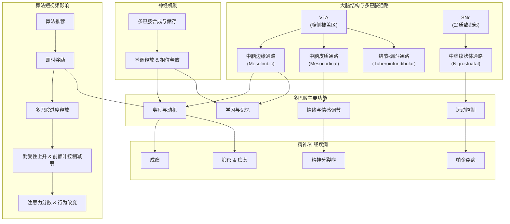

# 多巴胺回路功能

好的，我将研究大脑中的多巴胺回路，包括其解剖结构、神经机制、主要功能，以及它们与精神和神经疾病的关系。

特别关注"算法短视频导致青少年上瘾"这一社会现象，探讨其背后的多巴胺机制。从生物学的角度，分析短视频如何利用多巴胺回路引发并强化成瘾行为，从而帮助人们更深入地理解算法短视频对人类，尤其是青少年的潜在危害。

我会尽快整理相关研究和科学解释，并与你分享我的发现。

## 大脑中的多巴胺回路

## 大脑结构：多巴胺通路的解剖结构

多巴胺能神经元主要集中在中脑的黑质致密部（Substantia Nigra pars compacta）和腹侧被盖区（Ventral Tegmental Area, VTA），并从这些区域向全脑投射，形成多条重要的多巴胺通路

。\*\*中脑边缘通路（Mesolimbic pathway）\*\*起源于腹侧被盖区，投射至边缘系统的伏隔核（属于腹侧纹状体）和嗅结节等区域。这一通路被认为是大脑奖励系统的核心部分。**中脑皮质通路（Mesocortical pathway）**同样起源于腹侧被盖区，但投射至前额叶皮质等大脑皮层区域。这两条通路合称为**中脑-皮质-边缘系统（mesocorticolimbic system）**，在奖赏、情绪和认知功能中发挥关键作用。**中脑纹状体通路（黑质-纹状体通路，Nigrostriatal pathway）**则由中脑的黑质致密部投射至背侧纹状体（包括尾状核和壳核）。该通路主要参与运动控制，也与习惯学习和一定的奖励相关认知过程有关。另外还有**结节-漏斗通路（Tuberoinfundibular pathway）**，由下丘脑投射至垂体漏斗部，主要调节内分泌，例如抑制垂体泌乳激素的分泌。综上，大脑多巴胺回路解剖上包括中脑-边缘、中脑-皮质和中脑-纹状体等通路，它们连接中脑与纹状体、边缘系统、皮质等区域，构成分布广泛的多巴胺能神经网络。

## 神经机制：多巴胺信号的传递方式

多巴胺能神经元在其胞体内合成多巴胺，并将其储存在轴突末梢的囊泡中。神经冲动（动作电位）到达末梢时会引发多巴胺释放，释放的多巴胺通过突触作用于下游神经元的多巴胺受体

。多巴胺受体分为D1样受体（D1、D5）和D2样受体（D2、D3、D4）两大类，其作用机制不同：例如，在纹状体的中型棘状神经元上，多巴胺激活D1受体会促进直接通路的活动，从而促进运动或奖励相关行为，而作用于D2受体则抑制间接通路，减少运动。因此，多巴胺对下游神经元的调节是**调制性**的，而非简单的兴奋或抑制——它可以根据受体类型和所在回路，引起不同的功能效应。多巴胺信号在时间上也有**基调释放（tonic release）**和**相位释放（phasic burst）**之分：基调释放提供背景水平的调节，而相位性骤发的多巴胺释放常被认为是一种奖励信号。当意外获得奖励时，中脑多巴胺神经元会出现短暂的高频放电，释放多巴胺，这被视为**"奖励预测误差"**信号，用于告诉大脑实际得到的奖励超出了预期。这种误差信号会驱动可塑性改变——例如加强纹状体和皮质的突触连接，从而强化先前导致奖励的行为。总的来说，在多巴胺回路中，多巴胺作为神经递质，通过作用于特定通路和受体，调控着**行为、情绪和认知**的神经活动模式：它既能在瞬时上赋予奖励价值信号，指导学习，又能在较长期尺度上调节神经环路的兴奋性和可塑性。

## 多巴胺回路的主要功能

**1\. 奖励机制与动机控制**：多巴胺最著名的功能是在大脑奖励系统中起核心作用。中脑边缘通路（VTA→伏隔核）被称为大脑的"奖励回路"，处理奖励刺激的愉悦感和诱因价值

。当我们遇到令人愉快的事物（如美食、社交肯定等），伏隔核中的多巴胺水平会上升，产生愉悦"喜欢"的感觉和驱动"想要"的动机。多巴胺不仅赋予奖励刺激愉悦感（"开心"/喜欢），还赋予它们**激励显著性**，使个体产生趋近动机去追求这些刺激。例如，动物实验显示，如果阻断多巴胺信号，动物即使"喜欢"某种食物的味道，也会失去动力去努力获得它。这表明多巴胺对"**想要**（wanting）"奖励的驱动作用尤为重要。此外，多巴胺介导**正强化**作用：当某行为带来多巴胺释放，大脑会将该行为与奖励关联，从而增加未来重复该行为的概率。通过这一机制，多巴胺回路在驱动学习有益行为、形成习惯以及激励我们接近奖励目标方面发挥关键作用。

**2\. 情绪和情感调节**：多巴胺也参与调控情绪状态，尤其与积极情绪和愉悦体验相关。正常情况下，适当的多巴胺活动带来愉快、兴奋和积极的情绪；反之，若多巴胺通路功能不足，可能导致**快感缺失（Anhedonia）**等症状****

****。抑郁症患者常表现为对原本有乐趣的活动失去兴趣和快感，其背后的神经机制之一就是奖赏回路功能低下——研究表明，抑郁症患者在获得奖励时伏隔核等区域的激活明显降低，提示**中脑-边缘多巴胺回路**活性不足。因此，多巴胺的降低被认为与抑郁情绪和快感缺失密切相关。另一方面，多巴胺回路也与应激和焦虑等负性情绪有关：例如，中脑边缘通路除了介导奖励外，也参与厌恶/惩罚相关的学习，使个体避开带来不良后果的情景。多巴胺在杏仁核等情绪中心的信号调节可能影响焦虑水平——尽管焦虑的生物学机制复杂且涉及5-HT等多种系统，但有研究证据表明多巴胺在不同脑区对焦虑行为有调节作用。总的来说，多巴胺通过影响奖赏和惩罚体验，在**情绪调节**中扮演双重角色：既能促进积极情感和兴趣，也参与调节对负性刺激的反应。

**3\. 学习和记忆**：多巴胺对于强化学习（reinforcement learning）和习得性记忆形成至关重要。正如前文提到的"奖励预测误差"机制，中脑多巴胺神经元会将实际奖励与预期的差异编码成多巴胺信号

。当实际奖励高于预期时，多巴胺骤增（正误差）强化了先前的行为记忆；当奖励低于预期时，多巴胺活性降低（负误差）促使我们改变策略。通过这样的反馈，多巴胺驱动**行为学习**：它在纹状体和皮层诱导突触可塑性，使与奖励关联的记忆痕迹加强。例如，实验发现如果用光遗传学抑制动物中脑多巴胺神经元的误差信号，动物就难以学习新的奖励线索关系，说明多巴胺误差信号对学习是必要的。除了奖励学习，多巴胺也影响其他形式的记忆和认知过程。前额叶皮质中的多巴胺对**工作记忆**和**执行功能**起重要作用。适当水平的D1受体刺激可增强前额叶神经元对任务相关信息的维持，但过高或过低的多巴胺都会损害工作记忆（所谓"倒U型"效应）。总之，多巴胺通过调节神经可塑性和神经元活动模式，在**学习新行为、巩固记忆痕迹，以及执行复杂认知任务**中发挥不可或缺的作用。

**4\. 运动控制**：虽然题目关注的是行为和心理功能，但需要指出**中脑纹状体通路**的多巴胺对运动控制也至关重要。黑质-纹状体通路中的多巴胺调节基底节电路，两条运动通路（直接通路和间接通路）的平衡取决于多巴胺对D1和D2受体的不同作用

。正常情况下，这种调节确保运动的顺畅启动和停止。当黑质多巴胺神经元丢失时（例如帕金森病中），纹状体内D1和D2通路失衡，导致运动启动困难、动作迟缓等症状。这体现了多巴胺在运动功能上的重要性。此外，基底节回路也参与习惯形成和某些类型的学习，因此运动和认知功能在多巴胺作用下并非截然分离，而是有所重叠。

## 多巴胺与精神/神经疾病的关系

### 成瘾（Addiction）

**成瘾**被认为是多巴胺奖励机制的"劫持"。无论是物质成瘾（如药物滥用）还是行为成瘾（如赌博），它们共同的生物学特征是反复的刺激导致大脑奖励回路中过量的多巴胺释放

。例如，**所有成瘾行为都会引起伏隔核多巴胺水平的升高**。这种异常强烈的多巴胺信号使大脑将成瘾对象（毒品或行为）与极高的奖励价值联系起来，形成强化的记忆和偏好。随着反复刺激，大脑可能产生**耐受性**：多巴胺受体下调或敏感性降低，导致需要更强的刺激才能获得同等的快感。这就是为什么成瘾者往往会升级剂量或增加行为频率。另一方面，长期成瘾还会削弱其它天然奖赏的吸引力，因为大脑"习惯"了异常高的多巴胺水平，普通的日常乐趣（食物、人际互动等）显得索然无味。成瘾还伴随大脑前额叶等控制回路的功能受损，使得**抑制冲动**的能力下降，这进一步加剧了强迫性寻求刺激的循环。神经影像研究表明，成瘾者的大脑奖励回路和前额控制区发生了可塑性改变，与正常人相比对成瘾相关线索反应过度，而对抑制控制信号反应不足。总之，成瘾过程体现了多巴胺回路可塑性的负面一面：**过度的多巴胺刺激强化了有害行为模式**，并削弱了大脑自然的奖赏平衡机制和自我控制能力。

### 抑郁症和焦虑症

**抑郁症**（重性抑郁障碍）与多巴胺功能低下密切相关。抑郁症的核心症状之一是快感缺失，即对快乐事物不再感到愉悦，这被认为直接涉及**奖赏回路的功能障碍**

。研究指出，抑郁患者在奖赏任务中**伏隔核和前扣带回等奖励相关脑区的激活减少**，提示中脑-边缘多巴胺通路活性降低。这意味着，本该释放多巴胺让人感到开心的刺激，在抑郁患者脑中无法产生正常反应。多巴胺系统的失调可能导致患者缺乏动力、对曾经喜欢的活动失去兴趣，并伴随情绪低落和迟滞感。许多抗抑郁治疗也暗示了多巴胺的作用：例如，一些抗抑郁药（如安非他酮）通过增加多巴胺和去甲肾上腺素来改善患者的愉悦感和动力。这都支持**多巴胺缺乏在抑郁症快感缺失和动力降低中的作用**。

**焦虑症**的发生机制复杂，主要涉及5-羟色胺、去甲肾上腺素等神经递质，但**多巴胺同样参与了焦虑状态的调节**

。影像学和药理学研究发现，一些焦虑障碍患者的大脑多巴胺D₂受体或多巴胺转运体功能有异常改变，提示奖赏-动机通路可能与焦虑症状相关。举例来说，社交焦虑可能涉及对社交奖励的低敏感（可能与伏隔核多巴胺反应减弱有关），而广泛性焦虑则可能涉及多巴胺在边缘系统（如杏仁核）的过度反应，使个体对潜在威胁过度警觉。然而，需要强调的是，不同类型的焦虑症中多巴胺的作用并不相同且尚未完全明确。一些证据来自于帕金森病患者：约有将近一半的帕金森患者（多巴胺缺乏）同时患有严重焦虑症，这提示**多巴胺水平改变与焦虑情绪之间存在关联**。总体而言，虽然焦虑主要被视为5-HT等系统的问题，但多巴胺系统的紊乱（无论是功能降低还是异常敏感）**可能影响大脑对奖励和惩罚的评估，从而在焦虑症状的产生中扮演一定角色**。

### 精神分裂症

**精神分裂症**的多巴胺假说是精神病学中一个经典理论。简而言之，该假说认为：精神分裂症患者中脑多巴胺通路功能失调，导致**边缘系统多巴胺活动过强**以及**皮质多巴胺活动不足**的并存

。过强的多巴胺信号（尤其在中脑边缘通路）被认为与妄想、幻觉等**阳性症状**有关：多巴胺过度使得患者对无关刺激赋予过高的意义和显著性，从而产生异常的信念和感知。相反地，前额叶皮质多巴胺功能偏低则可能导致**阴性症状**和认知障碍，例如情感平淡、社交退缩和思维执行功能受损。抗精神病药物大多是多巴胺D2受体拮抗剂，它们通过阻断多巴胺受体来缓解精神病性症状，这进一步支持多巴胺在精神分裂症中的关键作用。需要注意，精神分裂症的病因还涉及谷氨酸、GABA等系统，但**修正的多巴胺假说仍强调本病在中脑-边缘和中脑-皮质多巴胺通路上存在异常**。这意味着精神分裂症可以被视作大脑奖励/动机回路与认知控制回路的多巴胺失衡所致的一系列症状群。

### 帕金森病

**帕金森病**是多巴胺系统功能障碍最明确的实例之一。该病的主要病理是中脑黑质致密部的多巴胺能神经元进行性退化，导致**黑质-纹状体通路**多巴胺严重缺乏。结果是基底节运动电路失去平衡：由于缺乏多巴胺对直接/间接通路的正常调节，病人的运动输出受到抑制

。帕金森患者表现出静止性震颤、肌肉强直、运动迟缓（运动启动困难）等症状，就是因为纹状体内D1通路得不到足够激活而D2通路相对过度抑制，整体**运动激活信号不足**。除了运动症状外，帕金森病人常出现抑郁、焦虑、嗅觉减退、睡眠障碍等非运动症状，这其中部分也与多巴胺在中脑边缘通路的缺失有关。例如，正如前述，黑质多巴胺减少可导致奖赏回路功能下降，从而出现抑郁倾向。同样，因为多巴胺对认知功能有调节作用，一些帕金森患者在病程后期出现认知迟缓和执行功能障碍。帕金森病的标准疗法是补充多巴胺功能（如左旋多巴药物），这在一定程度上恢复了纹状体多巴胺水平，缓解运动症状。这进一步证明了**多巴胺在运动控制及相关行为中的核心作用**：当多巴胺神经元损毁时，相应功能会明显受损，而恢复多巴胺信号可以部分挽救这些功能。

## 算法短视频导致青少年上瘾现象的多巴胺机制

近年来崛起的**算法推荐短视频**（如TikTok抖音等）利用了大脑多巴胺回路的奖励机制，使青少年深陷于反复刷视频的行为中。这类短视频通常时长仅数秒到几分钟，内容高度浓缩有趣，并通过智能算法个性化地持续推送用户感兴趣的片段

。从神经科学角度看，短视频应用巧妙地**操纵了即时奖励和多巴胺释放**：当用户刷到一个有趣的视频时，大脑腹侧被盖区（VTA）被激活，向伏隔核等奖励中枢释放多巴胺，引发愉悦和满足感。由于短视频往往设计得丰富新奇且"上头"，这个愉悦反馈几乎是**即时的**——用户只需几秒钟注意力就能获得一次"小奖励"。同时，短视频流提供了**源源不断的内容和不确定的惊喜**，类似赌场的老虎机机制：用户可能需要刷过几个平淡视频，突然就会遇到一个非常有趣的，这种**不可预测的奖励模式**更容易强化行为。每当用户找到有趣的视频，多巴胺就会"突发"，强化大脑对刷视频行为的正向反馈。正如有研究比喻的："这些短视频就像老虎机，用户不断上下滚动，就期待下一下刷出令人大脑释放多巴胺的视频"。

**即时满足与成瘾机制**：短视频的即时奖励特性使大脑逐渐**习惯于高频率的小多巴胺刺激**。随着时间推移，大脑的奖励系统可能出现**耐受**：需要更多的新奇刺激或更长时间刷屏，才能获得起初同等强度的满足感

。研究指出，当大脑频繁接受短视频带来的多巴胺冲击后，会**提高对多巴胺的阈值**，以至于**现实生活中的刺激由于节奏较慢、强度较低，而难以引发同样程度的愉悦**。换言之，经常刷短视频的人可能觉得日常活动变得"无聊"，因为真实世界无法每几秒就给一次快感。这正是短视频让青少年"对现实世界兴趣下降"的生物学原因：他们的大脑已经被训练得**追逐即时快感**，难以忍受延迟满足。同时，多巴胺的不断驱动会削弱前额叶皮质对冲动的控制能力。短视频应用个性化推荐的精准和无尽滚动的模式，使人很难主动停下来，这其实利用了大脑决策系统的弱点。在**自控力尚未成熟的青少年**中，这种效应更为明显：研究发现，自制力较差的年轻人更容易沉迷短视频，当他们观看算法精准推荐的个性化视频时，大脑的奖赏回路和与成瘾相关的脑区（如背侧后扣带回、内侧前额叶）激活更强。有fMRI实验比较了观看个性化推荐视频与观看一般视频的脑活动，结果发现前者激活了更多默认模式网络和VTA等区域，而且**问题性使用程度越高（上瘾程度越高），其自我控制能力越低**。一项针对TikTok用户的研究指出，大约有\*\*5.9%\*\*的年轻用户出现了类似成瘾的有害使用行为。这些发现说明，**短视频通过即时奖励和多巴胺强化形成了高度上瘾的体验**，并且对自控力尚在发育的青少年影响尤甚。

**对注意力和耐心的影响**：短视频成瘾的另一个显著后果是**注意力涣散**和**耐心下降**。因为大脑被训练去追求不断变化的快速刺激，长时间刷短视频会降低大脑对**长时程、低刺激任务**的耐受性

。有调查比较了电子设备使用者的专注时长，发现2000年代初人们在一次任务上的平均注意力可持续约2分半，而到2010年代初已降至仅约75秒。虽然导致注意力跨度缩短的因素很多，但**社交媒体和短视频的兴起被认为是重要原因之一**。短视频常伴随快速剪辑、多窗口画面（例如分屏同时播放多个内容）等，为了抓取眼球而极度强化感官刺激。大脑在这种**信息过载和高强度刺激**下，会不断地将注意力从一个刺激跳到下一个，以追求每时每刻的新鲜感。久而久之，用户在现实中执行需要专注的任务时就更容易分心、烦躁，因为他们的大脑习惯了短视频那种即时满足的模式，不再"愿意"等待缓慢的回报。简而言之，**短视频让大脑进入了一个寻求即时满足的学习状态**：只专注于能带来快速反馈的事物，忽略需要耐心投入的目标。这直接导致了青少年注意力难以集中、阅读长篇内容或完成长期目标的能力下降，以及遇到需要延迟满足的情境时易产生挫败感。

**对青少年大脑可塑性的长期影响**：青少年时期大脑正处于高度可塑的发展阶段，奖励系统和自我控制系统都在发育和重塑中

。在这一关键期，过度沉迷短视频等强奖励行为，可能对大脑发育产生**长期的影响**。研究表明，青春期个体的**奖励敏感性**本来就比成人高，而**抑制性控制**能力相对不足，这使他们对新奇刺激有更强的趋动力，同时更易冲动。如果在此期间反复给予高度强化的多巴胺刺激（例如天天沉浸在短视频的快感中），会**改变大脑奖励回路的发展轨迹**。具体而言，大脑可能适应这种过度的刺激水平，导致将来对正常奖励反应减弱、基线多巴胺水平失衡，类似于"提线过度松弛"的情况；同时，由于总是缺少对冲动的锻炼和延迟满足的练习，前额叶皮质等控制区域的功能可能发育得相对较弱。这些改变可能不会立刻表现为解剖结构上的巨大差异，但在功能上，可能体现在成年后较高的冲动性、注意缺陷，以及对自然奖励系统的兴趣低下等。换句话说，**青春期大脑在过度短视频刺激下的可塑性改变，可能增加未来行为成瘾和注意力问题的风险**。这与我们在成瘾研究中看到的规律一致：在大脑尚未成熟时受到的不良刺激，会使其对奖励与控制的神经通路产生长久的适应性改变。当然，并非所有沉迷短视频的青少年都会出现永久问题，但从群体角度看，这种行为模式对大脑发育的潜在危害值得高度警惕。

**可能的干预和解决方案**：针对"算法短视频上瘾"对青少年的影响，干预需要从个人、家庭、技术和社会多方面入手。首先，**个人层面**可以采取行为策略来重新训练大脑的奖赏机制。例如，刻意设定每日的短视频使用时限，强制自己在达到时间后停止，并**对自己的使用时长保持觉察**

。使用一些辅助工具（比如应用的防沉迷模式、计时器）来限制刷视频的时间，被证明是减少过度使用的有效手段。将刷短视频作为一种"奖励"安排在完成学习或工作任务之后，而非不加节制地随时浏览，也有助于恢复**延迟满足**的习惯。睡前尤其应该避免无休止地刷视频，因为这既扰乱睡眠，又强化了睡前多巴胺刺激的依赖，**定时规划**在某些时段不使用手机有助于打破这种循环。其次，**家庭和教育层面**需要加强数字素养教育，让青少年了解短视频令人上瘾的原理——明白这些应用"令人欲罢不能"并非意志薄弱，而是大脑被算法利用的正常反应。这种认识有助于减少盲目沉迷和内疚感，增强主动管理使用的意愿。同时，家长和学校可以鼓励并创造条件让青少年多参与线下活动，如体育运动、艺术创作、面对面社交等。这些活动提供了更**多样且健康的奖赏**（例如运动后的内啡肽快感、社交互动的情感满足），可以在一定程度上**重塑大脑对奖励的反应模式**，平衡对短视频的依赖。此外，**技术和政策层面**也开始有所行动。一些短视频平台推出了青少年模式，限制使用时长和夜间使用；有的国家监管机构针对未成年人使用此类应用制定了严格的时间限制和内容过滤。这些措施旨在从源头上减少短视频对发育中大脑的过度刺激。最后，对于已经表现出严重成瘾症状的青少年，**心理干预**可能是必要的，例如咨询师指导下的认知行为疗法，帮助他们建立更健康的生活习惯和应对策略。

**总结**：多巴胺回路贯穿于大脑的奖励、动机、情绪和认知功能。当这一回路被"算法短视频"反复激活时，青少年的大脑在享受即时快感的同时也付出了代价——注意力被碎片化，耐心和现实兴趣降低，甚至可能对大脑发育产生深远影响。通过对多巴胺机制的深入了解，我们既能解释短视频成瘾现象的成因，也能据此制定相应的干预措施，帮助青少年重新**掌控注意力与生活乐趣**，避免成为多巴胺循环的被动参与者。正如一句话所说："产品设计在利用你的本能，大脑中了圈套并非你的错。但走出这个圈套，需要对自己的大脑负责。" 通过个人努力和社会支持相结合，我们有望减轻短视频算法成瘾对下一代的负面影响，促使他们的大脑健康发育并学会与科技健康相处。

* [大脑中的多巴胺回路][https://chatgpt.com/share/67a0ac86-8f90-8007-b240-b438c50ff992]