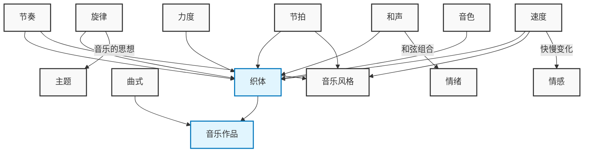

# element of music

音乐的元素相互关联，共同构建了音乐的整体体验。以下是一些概念之间的关系，以等式或逻辑关系串联的形式呈现：

- **旋律 (Melody)** 是音乐的"思想"。它是通过将一系列音符连接起来表达一个想法的，在古典音乐中，有组织的旋律被称为主题。
- **和声 (Harmony)** 是当两个或多个音符同时演奏时产生的。和声可以通过和弦来体现，和弦可以有大调、小调甚至不和谐的声音，从而设定歌曲的情绪。
- **节奏 (Rhythm)** 是音乐中时间的组织方式，是通过不同的节拍来创造的。节奏使人们想要跟随音乐的节拍。
- **节拍 (Meter)** 指的是在一个小节中有多少个节拍，如四分之三拍（每小节三个节拍，常用于华尔兹）和四四拍（每小节四个节拍，常用于进行曲）。
- **速度 (Tempo)** 决定了歌曲的快慢。速度可以用意大利语词汇来描述，例如largo表示慢速，presto表示快速。速度会影响音乐的情感，例如慢速的音乐可能让人感到困倦或悲伤，而快速的音乐可能让人感到快乐。
- **节奏 + 节拍 + 速度 = 音乐风格**。这些元素的组合可以创造出无限的音乐风格。
- **力度 (Dynamics)** 指的是音乐演奏的音量大小。力度也用意大利语词汇来描述，例如pianissimo表示非常轻柔，mezzo forte表示中等响亮。渐强符号（crescendo）表示音量逐渐增大。
- **音色 (Timbre)** 是区分不同乐器声音的特征。例如，长笛的声音与钢琴的声音不同。
- **织体 (Texture)** 是旋律、和声、节奏和音色的组合，它创造了一个作品的整体声音。
- **曲式 (Form)** 是音乐的"路线图"。一种常见的曲式是ABA形式。

因此，我们可以将这些元素之间的关系总结如下：

**旋律 + 和声 + 节奏 + 节拍 + 速度 + 力度 + 音色 = 织体**

**织体 + 曲式 = 音乐作品**

这些元素并非孤立存在，它们相互作用，共同创造出音乐的丰富性和多样性。理解这些元素之间的关系有助于更好地欣赏和分析音乐。

## Visualization

