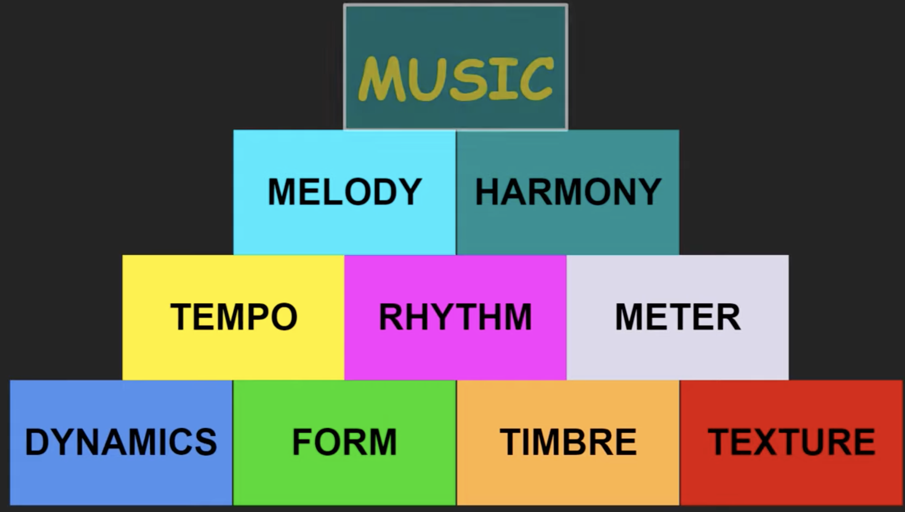
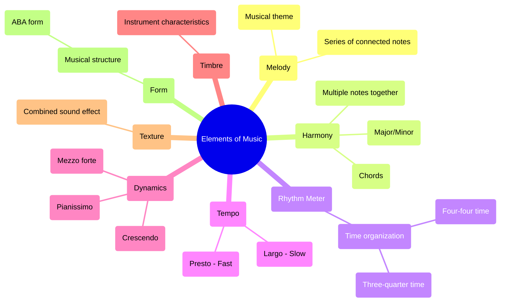
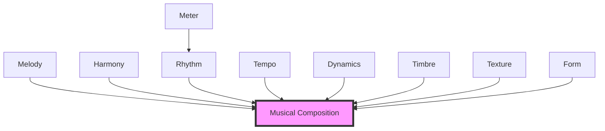

# element of music 

**简报文档：音乐元素**

**概述:**

这份简报总结了Mrs. Morris关于音乐元素的课程内容。课程涵盖了构成音乐的各种基本要素，并解释了它们如何共同创造出丰富多样的音乐体验。Mrs. Morris 使用浅显易懂的语言，结合实际例子，帮助听众理解这些抽象概念。

**主要主题及要点:**

1. **旋律 (Melody):**

- 定义：一系列相互连接的音符，表达一个完整的音乐想法。
- 经典音乐中的旋律被称为主题 (theme)。
- 成功作曲的标准之一是听众在歌曲结束后仍然记得旋律。
- 引用： “melody is a series of notes connected together to express one idea…a composer is considered successful when the listener continues to remember the melody even when the song is over”

1. **和声 (Harmony):**

- 定义：两个或多个音符同时演奏。
- 在乐谱中以垂直堆叠的方式呈现，构成和弦 (chords)。
- 和弦可以有大调、小调甚至不和谐的声音，从而设定歌曲的情绪（快乐、悲伤、梦幻）。
- 引用： “harmony is when two or more notes are played together…chords can have a major minor or even dissonant sounds that can set the mood of a song making it's unhappy sad or even dreamy”

1. **节奏 (Rhythm):**

- 定义：音乐组织时间的方式，通过多种节拍的组合形成。
- 节奏会让人情不自禁地跺脚、拍手或跳舞。
- 引用： “rhythm is music's way of telling time…rhythm makes people want to tap their feet clap their hands or just get up and dance”

1. **节拍 (Meter):**

- 定义：每小节的节拍数。
- 例子：
- 三拍子 (three-quarter time)：每小节三个节拍，如华尔兹舞曲 (waltz)。
- 四拍子 (four four time) 或常用拍 (common time)：每小节四个节拍，常见于进行曲 (marching band) 中。
- 引用： “meter tells us how many beats there are in a measure such as three-quarter time…four four time or common time is most often used in music”

1. **速度 (Tempo):**

- 定义：歌曲的快慢速度。
- 使用意大利语术语：
- Largo：慢速
- Presto：快速
- 其他速度标记介于两者之间。
- 音乐速度会影响情绪表达（慢速音乐可能令人感到困倦或悲伤，快速音乐则可能使人感到快乐）。
- 引用： “tempo determines how fast or slow a song will go…largo means slow and presto means fast…the temple of music will help to determine the emotion of the music”

1. **力度 (Dynamics):**

- 定义：音乐的响度或柔度。
- 使用意大利语术语：
- Pianissimo：非常柔弱
- Mezzo forte：中等响度
- Crescendo：渐强
- 引用："dynamics tell us how loud or soft to play music…a word like pianissimo tells us that we should play the music very soft and the word like mezzo forte means to play the music medium loud"

1. **音色 (Timbre):**

- 定义：区分不同乐器声音的特征。
- 例如：长笛的声音。
- 引用： “timbre is the characteristic sound that distinguishes one instrument from another instrument"

1. **织体 (Texture):**

- 定义：旋律、和声、节奏和音色结合起来形成的整体音响效果。
- 引用："texture combines melody harmonies rhythms and tavres to create an overall sound of a piece of music"

1. **曲式 (Form):**

- 定义：音乐的结构或路线图。
- 常见曲式：ABA曲式 (ABA form)，常见于爵士乐、古典乐甚至流行音乐。
- 引用："form is the road map of music…one of the most common forms is aba form"

**总结:**

Mrs. Morris 的课程以清晰的方式介绍了音乐的各个要素，强调了它们如何相互作用，从而创造出各种各样的音乐体验。她使用具体的例子和意大利语术语，使得抽象概念更容易被理解和记忆。这节课为初学者了解和欣赏音乐提供了一个扎实的基础。

**附加说明：**

- 课程以唱歌和音乐实践结尾，强调了音乐的乐趣。
- 课程鼓励进一步学习和探索。
- 使用Solfege (唱名法) 来进行声乐练习
- 此课程为入门级音乐教学，为后续更深入的学习提供了铺垫。

## Visualization

### Musical Elements Overview

### Musical Elements Interaction

