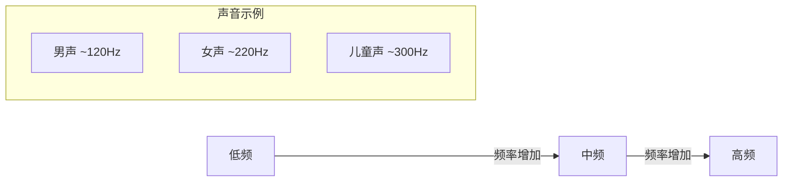
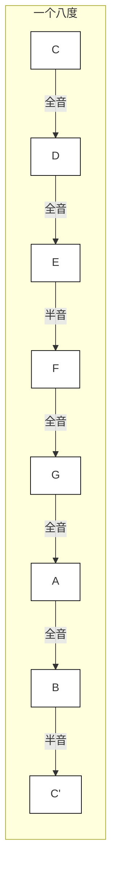
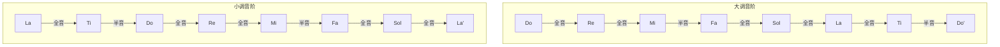

# Pitch & Scale

好的！让我们用**费曼学习法**的四个步骤（**Concept→Teach→Review→Simplify**）来彻底理解「音高与音阶」，全程用**生活化类比+互动实验**，保证小白也能秒懂。

---

### **第一步：Concept（概念）→ 用生活常识理解核心**
#### **1. 音高（Pitch）→ 声音的"楼层"**
- **本质**：声音振动的频率（Hz），频率越高音越高，反之越低  
- **类比**：  
  - 女生说话像"高楼层"（高频），男生像"低楼层"（低频）  
  - 钢琴从左（低音）到右（高音）像爬楼梯，每高一个八度=爬高一层楼  

#### **2. 音阶（Scale）→ 音乐的"楼梯设计图"**
- **定义**：按特定规则排列的一组音高，像楼梯的台阶  
- **关键**：台阶间距决定音阶性格（全音=跨两个键，半音=相邻键）  
  *试想：楼梯台阶均匀（大调） vs 高低不平（蓝调）带来不同行走体验*

---

### **第二步：Teach（教授）→ 拆解给"小学生"听**
#### **实验1：用杯子装水模拟音高**
- **工具**：5个玻璃杯 + 水 + 筷子  
- **步骤**：  
  1. 杯中水量由多到少排列（多=低音，少=高音）  
  2. 敲击杯子，听音高变化，标记为Do(水最多)、Re、Mi、Fa、Sol  
  3. **发现规律**：水量差决定音高差，类似钢琴键的间距  

#### **实验2：楼梯上的音阶探险**
- **动作**：站在楼梯前，想象每级台阶代表一个音  
  - **大调音阶**（C大调）：  
    第1级(C)→跨两级到第3级(D)→再跨两级到第5级(E)→**半级**到第6级(F)→继续跨两级到G→A→B→**半级**到C  
    *口诀：全全半，全全全半（像跳舞的节奏）*  
  - **小调音阶**（A小调）：  
    台阶间距变为：全半全全半全全（像一瘸一拐的步态）  

---

### **第三步：Review（反思）→ 揪出理解漏洞**
#### **常见困惑Q&A**
- **Q：为什么钢琴有黑键？**  
  → 黑键是"半层楼"（半音），白键黑键交替组成完整的12级台阶（十二平均律）  
  *动手数：C到C'共12个半音（7白键+5黑键）*  

- **Q：音阶为什么重要？**  
  → 它是音乐的"语法规则"，像写作文的词汇库。流行歌用大调（开心），悲伤歌用小调（难过）。  
  *对比试听：*  
  - 大调示例：《Happy Birthday》（明亮的Do-Mi-Sol）  
  - 小调示例：《Suzanne》（低沉的La-Do-Mi）  

- **Q：音高是绝对的吗？**  
  → 标准音A4=440Hz是国际约定，但不同文化/乐器可能有微调，就像不同国家电压不同。  

---

### **第四步：Simplify（简化）→ 终极口诀+实战应用**
#### **音阶速记口诀**
- **大调音阶**："全全半，全全全半" → 想象走路时**跨大步-跨大步-小碎步**  
- **自然小调音阶**："全半全全半全全" → 像**崴脚后的不规则步伐**  

#### **实战三步法**
1. **找键盘规律**：  
   - 白键序列CDEFGAB=全全半全全全半（C大调）  
   - 黑键填补半音空缺（如C→C#，E→F无黑键因为是半音）  

2. **唱音阶练耳**：  
   - 用"Do-Re-Mi-Fa-Sol-La-Ti-Do"唱C大调，手机开钢琴App校对音准  

3. **即兴创作**：  
   - 规则：只用C大调音阶（白键）弹旋律，感受"安全区" vs 加入黑键的"冒险感"  

---

### **小白友好工具包**
- **App推荐**：  
  - *Perfect Piano*：可视化键盘，实时显示音名与唱名  
  - *Functional Ear Trainer*：游戏化听音高练习  
- **实物玩具**：  
  儿童音乐积木（标有音高的积木块可拼出音阶）  

---

### **费曼检验法：你能教会"你奶奶"吗？**
- **测试题**：  
  1. 用楼梯比喻解释为什么C大调音阶的E到F是半音  
  → 答：因为这段楼梯只有半级台阶（钢琴上E到F无黑键）  
  2. 为什么《两只老虎》用大调，《Suzanne》用小调？  
  → 答：前者需要欢快，后者营造忧郁氛围  

---

音高与音阶不是抽象理论，而是**藏在生活中的声音密码**。下次听到电梯"叮咚"声时，可以想想它是Do还是Mi——音乐的世界会变得触手可及。

---

## Visualization

### 音高与频率关系

### 钢琴键盘结构

### 大调与小调音阶对比
