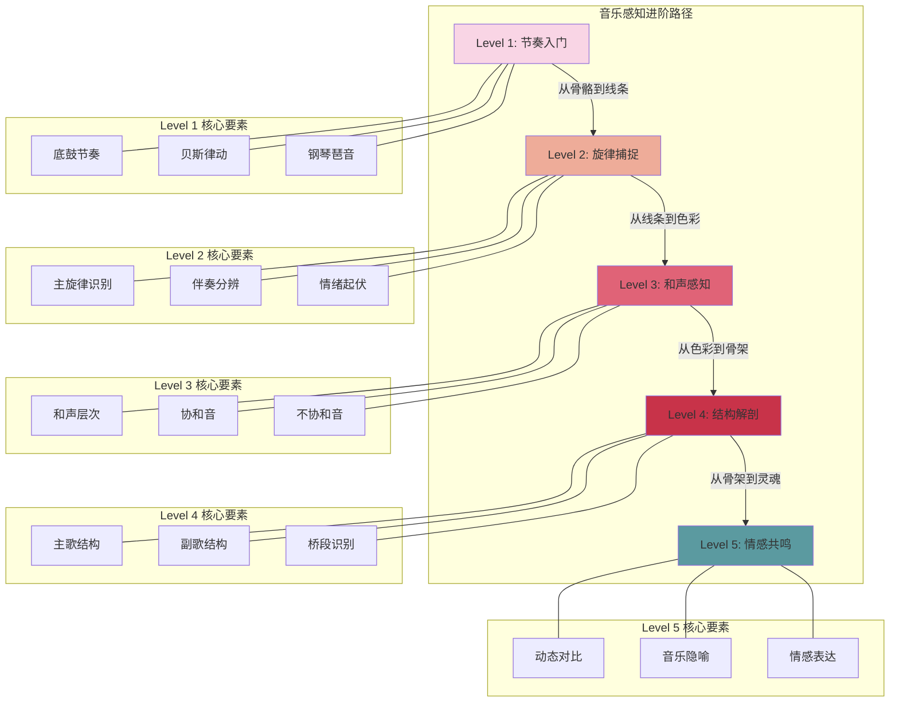
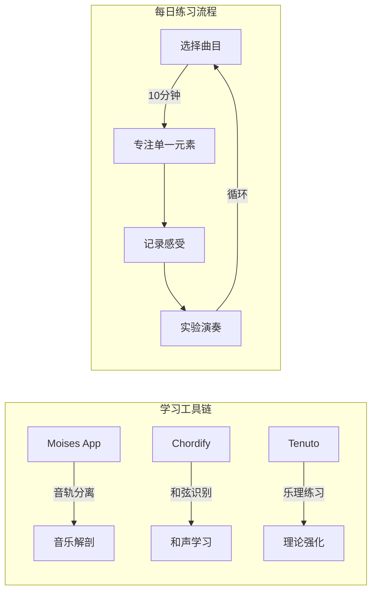

- 音乐感知

  - 从音乐感知能力进阶的思路，推荐不同阶段的曲目清单，从「节奏→旋律→和声→结构→情感表达」层层深入，附带学习重点和实用小技巧。准备好开启你的音乐升级之旅吧！

    ​	  

    ------

  - Level 1：节奏入门 → 感受「骨骼」

    ​	  **目标**：建立基础节奏感，分辨不同乐器的节奏型
    ​	  **推荐曲目**：
  
    - **Queen - \*We Will Rock You***
  
    - **学习点**：跺脚（底鼓） + 拍手（军鼓）的极简节奏

    - **挑战**：用身体模仿"砰-啪-砰-啪"的律动  

      - **The White Stripes - \*Seven Nation Army***

    - **学习点**：贝斯riff（重复低音旋律）如何驱动整首歌

    - **技巧**：用手机节拍器App跟弹贝斯线（注意每小节重音位置）  

      - **Coldplay - \*Clocks***

    - **学习点**：钢琴琶音构成的循环节奏，像齿轮转动

    - 互动

      ：在桌上用指尖模拟钢琴的左右手交替弹奏  

      ​		  

      ------

  - Level 2：旋律捕捉 → 听见「线条」

    ​	  **目标**：分辨主旋律与伴奏，感受旋律的情绪起伏
    ​	  **推荐曲目**：
  
    - **Ed Sheeran - \*Perfect***
  
    - **学习点**：吉他分解和弦与主旋律的对话（注意副歌旋律音域升高）

    - **练习**：用"啦"字哼唱主旋律，再尝试哼吉他伴奏音  

      - **久石让 - \*天空之城***

    - **学习点**：钢琴旋律如何用少量音符营造空灵感

    - **技巧**：闭眼想象旋律线条是风筝的飞行轨迹（升→降→盘旋）  

      - **The Beatles - \*Yesterday***

    - **学习点**：弦乐四重奏如何烘托人声旋律

    - 对比

      ：听原版和纯器乐版，区分人声与弦乐的旋律重叠  

      ​		  

      ------

  - Level 3：和声感知 → 理解「色彩」

    ​	  **目标**：听辨和声层次，感受协和与不协和音的情绪差异
    ​	  **推荐曲目**：
  
    - **Simon & Garfunkel - \*The Sound of Silence***
  
    - **学习点**：双人声和声的平行三度（如"Hello darkness, my old friend"）

    - **互动**：用两个杯子装不同水位，敲击模拟高低声部  

      - **Adele - \*Someone Like You***

    - **学习点**：左手钢琴低音和弦 vs 右手高音旋律的对比

    - **工具**：用「Chordana」App弹奏歌曲和弦，观察和弦色彩变化  

      - **Radiohead - \*Creep***

    - **学习点**：不协和和弦（如G→B）制造的撕裂感

    - 实验

      ：在副歌部分捂住耳朵再松开，感受和声张力的释放  

      ​		  

      ------

  - Level 4：结构解剖 → 拆解「骨架」

    ​	  **目标**：分辨主歌/副歌/桥段，理解歌曲叙事逻辑
    ​	  **推荐曲目**：
  
    - **Taylor Swift - \*Love Story***
  
    - **学习点**：经典流行结构（前奏→主歌→预副歌→副歌→桥段）

    - **游戏**：用色块标记不同段落（如粉色=主歌，黄色=副歌）  

      - **Pink Floyd - \*Wish You Were Here***

    - **学习点**：前奏吉他泛音如何暗示全曲氛围

    - **分析**：对比前奏与结尾的吉他动机，感受"循环叙事"  

      - **Miles Davis - \*So What***

    - **学习点**：爵士乐的AABA结构（32小节公式）

    - 挑战

      ：数拍子辨认萨克斯即兴进入的时机  

      ​		  

      ------

  - Level 5：情感共鸣 → 触摸「灵魂」

    ​	  **目标**：理解编曲如何服务情感，捕捉音乐中的隐喻
    ​	  **推荐曲目**：
  
    - **Jeff Buckley - \*Hallelujah***
  
    - **学习点**：动态对比（从耳语到嘶吼）如何表现挣扎与救赎

    - **任务**：在副歌高潮处写下你联想到的画面关键词  

      - **Hans Zimmer - \*Time\* (《盗梦空间》配乐)**

    - **学习点**：弦乐渐强与管风琴低频制造的"时间膨胀感"

    - **实验**：边听边画曲线图，记录情绪起伏  

      - **Billie Eilish - \*Ocean Eyes***

    - **学习点**：电子音效（水滴声、呼吸声）如何强化孤独感

    - 创作

      ：用手机录一段环境声，尝试叠加到歌曲中  

      ​		  

      ------

  - **Bonus：综合训练曲目**

  - **初级**：*Hotel California* ( Eagles ) → 听辨吉他solo与和声互动

  - **中级**：*Bohemian Rhapsody* ( Queen ) → 分析歌剧式结构拼接

  - 高级

    ：

    Rhapsody in Blue

     ( Gershwin ) → 感受古典与爵士的融合基因  

    ​	  

    ------

  - **工具包：小白友好型学习神器**  

    - **Moises App**：分离歌曲的人声、鼓、贝斯等音轨，像X光片一样解剖音乐

    - **Chordify**：自动识别歌曲和弦，吉他/钢琴小白也能跟弹

    - **Tenuto**：互动式乐理练习，用游戏化方式学音程与和弦

      ------

  - **行动指南**

  - **每日10分钟**：选一首歌，专注听一个元素（如周一专注贝斯线，周二听和声层）

  - **建立音乐日记**：记录每首歌让你"起鸡皮疙瘩"的瞬间，分析原因

  - 翻唱/翻奏实验

    ：即使用口哨或敲杯子，也能体验编曲的乐趣  

    	  音乐就像一门语言，这些曲目是你的单词书，而反复聆听就是最好的语法课。从今天起，每次听歌都是一次探险——祝你早日解锁属于你的"音乐超能力"！

## Visualization

