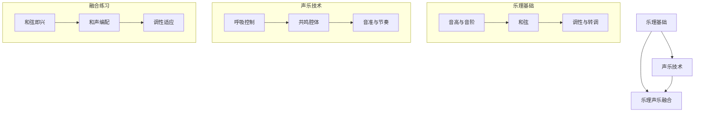
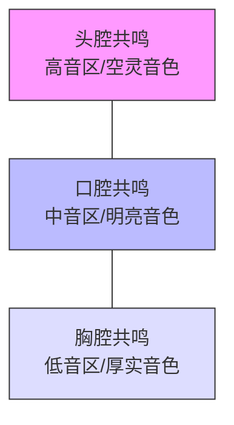
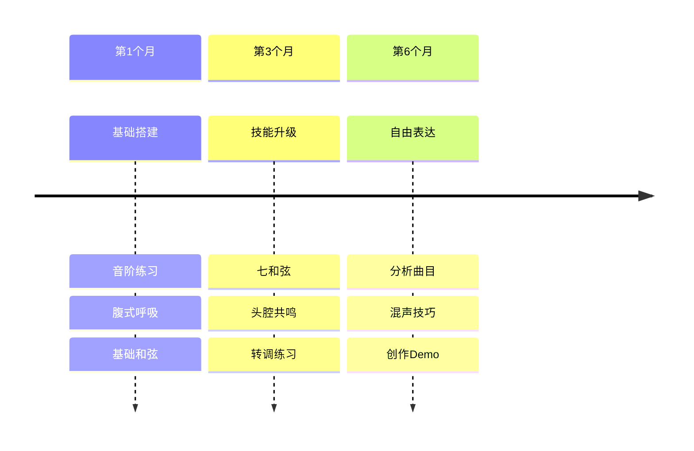
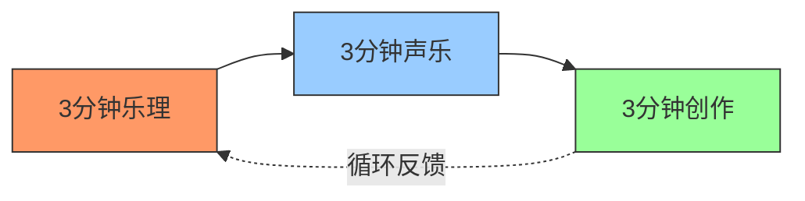

理解乐理与声乐的关系，就像掌握「地图」与「徒步技能」——乐理帮你看清音乐的结构规律，声乐则是用身体实践这些规律的旅程。以下是专为音乐小白设计的**乐理+声乐融合学习路径**，从底层原理到实用技巧层层拆解：

---

### **一、乐理基础：搭建音乐的"语法框架"**
#### **1. 音高与音阶：音乐的字母表**
- **核心概念**：  
  - **十二平均律**：钢琴上7个白键（CDEFGAB）+5个黑键（升/降音）组成12个半音  
  - **大调音阶**：全全半全全全半（如C大调：C-D-E-F-G-A-B-C）→ 明亮快乐  
  - **小调音阶**：全半全全半全全（如A小调：A-B-C-D-E-F-G-A）→ 忧郁深沉  
- **小白训练法**：  
  - 用钢琴App（如**Perfect Piano**）弹C大调音阶，唱出"Do-Re-Mi-Fa-Sol-La-Ti-Do"  
  - 对比《欢乐颂》（大调）和《Suzanne》（小调）的情绪差异  

#### **2. 和弦：情绪的"调色盘"**
- **三和弦构成**：  
  - **大三和弦**：根音+大三度+小三度（如C= C+E+G）→ 阳光  
  - **小三和弦**：根音+小三度+大三度（如Am= A+C+E）→ 阴郁  
- **实战应用**：  
  - 在《Let It Be》中听辨C-G-Am-F和弦进行（左手钢琴低音弹根音辅助记忆）  
  - 用**Ukulele**弹C-Am-F-G7，感受和弦色彩变化  

#### **3. 调性与转调：音乐的时空隧道**
- **关系大小调**：共享相同音阶的不同调性（如C大调↔A小调）  
- **转调技巧**：  
  - 直接转调（如《Hey Jude》结尾升高半音制造升华感）  
  - 通过共同和弦平滑过渡（如C→G时先用Em和弦搭桥）  
- **听力训练**：  
  听《Bohemian Rhapsody》中从B♭大调到E大调的突兀转调，体会戏剧性  

---

### **二、声乐技术：把身体变成乐器**
#### **1. 呼吸控制：声音的"发动机"**
- **腹式呼吸法**：  
  - 吸气时腹部膨胀如气球，呼气时缓慢收缩（手放腹部感受起伏）  
  - 练习：平躺吸气3秒→憋气2秒→发"嘶"声呼气10秒  
- **歌曲应用**：  
  用《Hallelujah》长乐句练习呼吸分配（如"It's a cold and it's a broken Hallelujah"一口气唱完）  

#### **2. 共鸣腔体：声音的"扩音器"**
- **三大共鸣区**：  
  | **区域** | **音色特点**                | **练习曲目**           |
  | -------- | --------------------------- | ---------------------- |
  | 胸腔     | 低沉厚实（如Leonard Cohen） | 《Suzanne》低音段落    |
  | 口腔     | 清晰明亮（如Taylor Swift）  | 《Love Story》叙事部分 |
  | 头腔     | 空灵穿透（如王菲）          | 《天空之城》吟唱段     |
- **共鸣切换练习**：  
  用"Nu~"音从低到高滑动，感受震动从胸腔→口腔→头腔的迁移  

#### **3. 音准与节奏：声乐的"GPS"**
- **音准矫正**：  
  - 用**Vocal Pitch Monitor**App跟弹钢琴单音，匹配音高  
  - 练习《Yesterday》旋律，注意半音（如"Yes-ter-day"中的E→E♭）  
- **节奏感强化**：  
  - 边踏步边唱《We Will Rock You》，让身体律动带动节奏稳定性  

---

### **三、乐理与声乐的融合练习**
#### **1. 用和弦走向即兴哼唱**
- **万能进行**：C-G-Am-F（流行音乐常见）  
  - 步骤：  
    ① 用Ukulele循环弹奏这四个和弦  
    ② 即兴哼唱旋律，注意主音（C）与和弦根音的呼应  
  - 参考曲目：《Let It Be》《Someone Like You》  

#### **2. 和声编配实战**
- **二声部训练**：  
  - 主旋律：C大调《小星星》（C-C-G-G-A-A-G…）  
  - 和声层：平行三度（E-E-B-B-C-C-B…）  
  - 工具：用**GarageBand**录制双轨人声，体验和声叠加效果  

#### **3. 调性适应力培养**
- **移调挑战**：  
  - 将《Happy Birthday》用C大调唱→再用F大调唱  
  - 注意：音高整体上移，但音程关系（全音/半音）保持不变  

---

### **四、分阶段训练计划**
#### **第1个月：基础搭建**
- **乐理**：掌握C大调/A小调音阶，C/Am/F/G和弦  
- **声乐**：腹式呼吸+胸腔共鸣练习，音准误差控制在±20音分内  
- **每日任务**：  
  - 5分钟音阶爬梯（Do-Re-Mi…）  
  - 跟唱《Perfect》主歌部分并录音复盘  

#### **第3个月：技能升级**
- **乐理**：理解七和弦（如G7），学习II-V-I爵士进行  
- **声乐**：头腔共鸣开发，尝试《Skyfall》副歌爆发力  
- **挑战**：用《Fly Me to the Moon》练习转调即兴  

#### **第6个月：自由表达**
- **乐理**：分析《Rhapsody in Blue》调性变化逻辑  
- **声乐**：掌握气声/混声技巧，翻唱《Creep》情绪层次  
- **终极目标**：自弹自唱原创段落并录制Demo  

---

### **五、避坑指南：小白的常见误区**
1. **盲目飙高音**→ 先练好中低声区共鸣，再拓展音域  
2. **死记硬背乐理**→ 每学一个概念立刻用乐器/人声验证  
3. **忽略听力训练**→ 每天用**SoundGym**做10分钟听辨游戏  
4. **过度依赖修音**→ 录音时保留原始人声，直面问题才能进步  

---

### **工具包：声乐+乐理学习神器**
- **音准训练**：Vanido（声乐游戏化练习）  
- **和弦识别**：Chord AI（实时显示歌曲和弦）  
- **节奏强化**：Drumgenius（跟鼓机练习节奏感）  
- **乐理学习**：Hooktheory（可视化分析和弦进行）  

---

音乐是理论+感性的双翼飞行，从今天起，每天用15分钟做「3+3练习」：  
1. **3分钟乐理**：学一个和弦/音阶并弹奏  
2. **3分钟声乐**：练一条音阶+一句歌曲  
3. **3分钟创作**：用刚学的和弦即兴哼旋律  

当你把乐理内化为肌肉记忆，声乐就成了最自然的表达方式——就像呼吸一样。

---

### **六、Visualization**

#### **1. 学习路径图**

#### **2. 声乐共鸣区域**

#### **3. 训练计划时间线**

#### **4. 每日练习流程**

这些可视化图表帮助读者更直观地理解：
1. 整体学习路径和各模块关系
2. 声乐共鸣位置的层次关系
3. 训练计划的时间进程
4. 每日练习的循环模式

