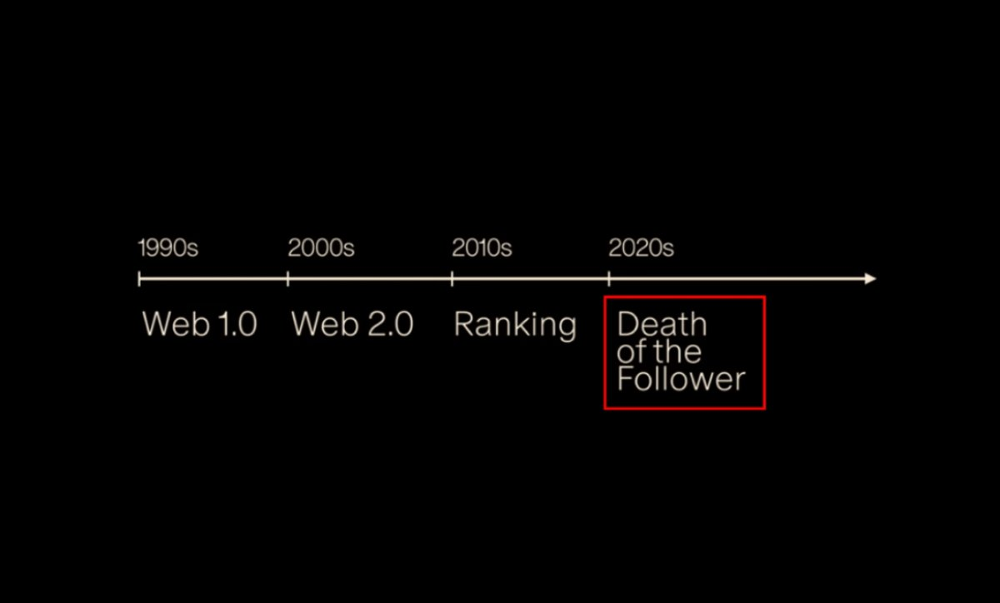
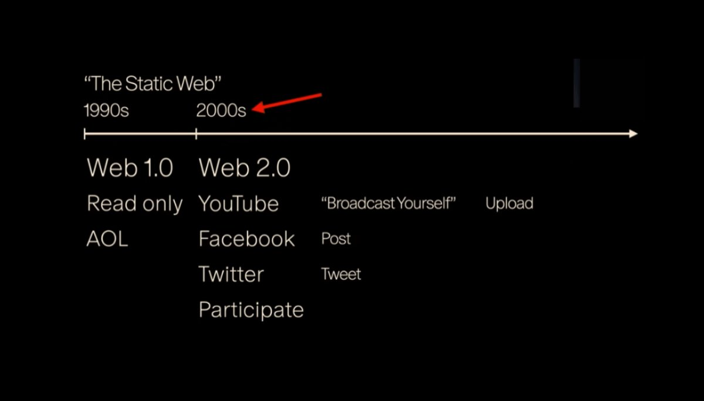
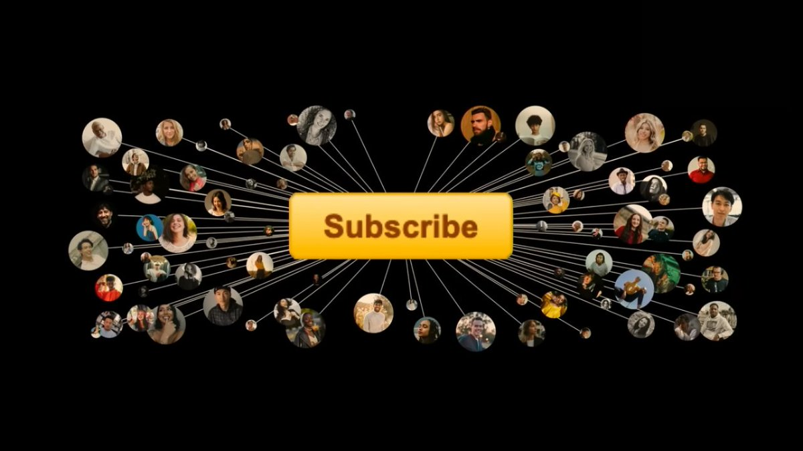
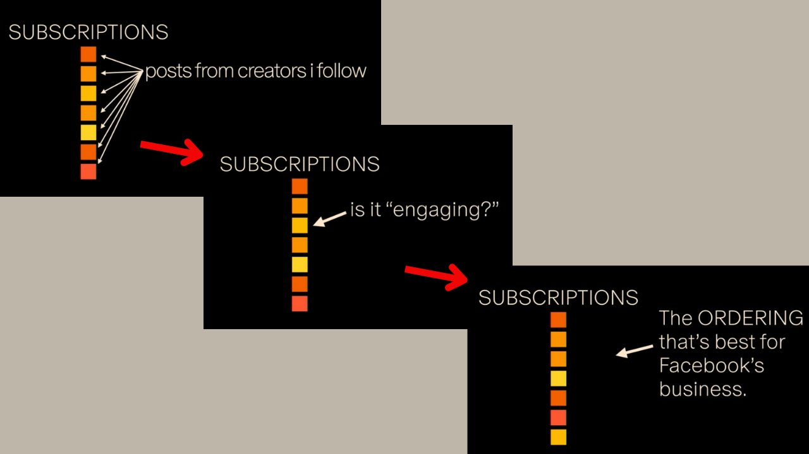
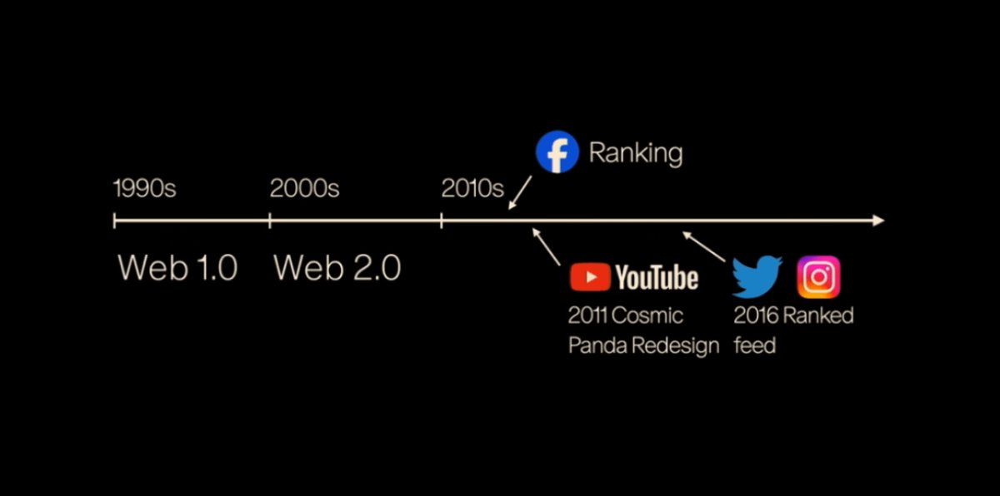
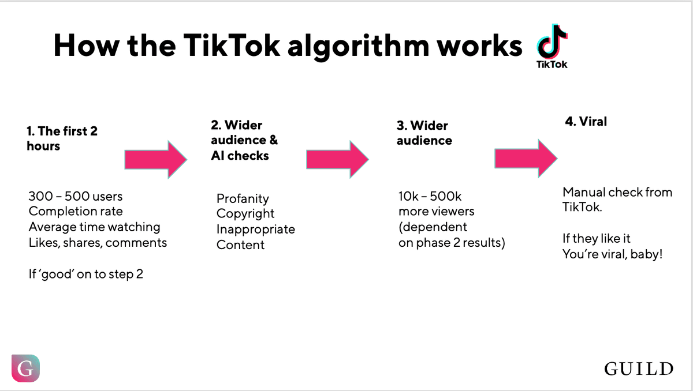
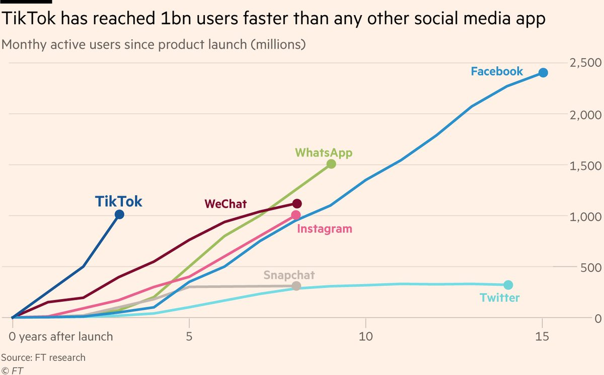
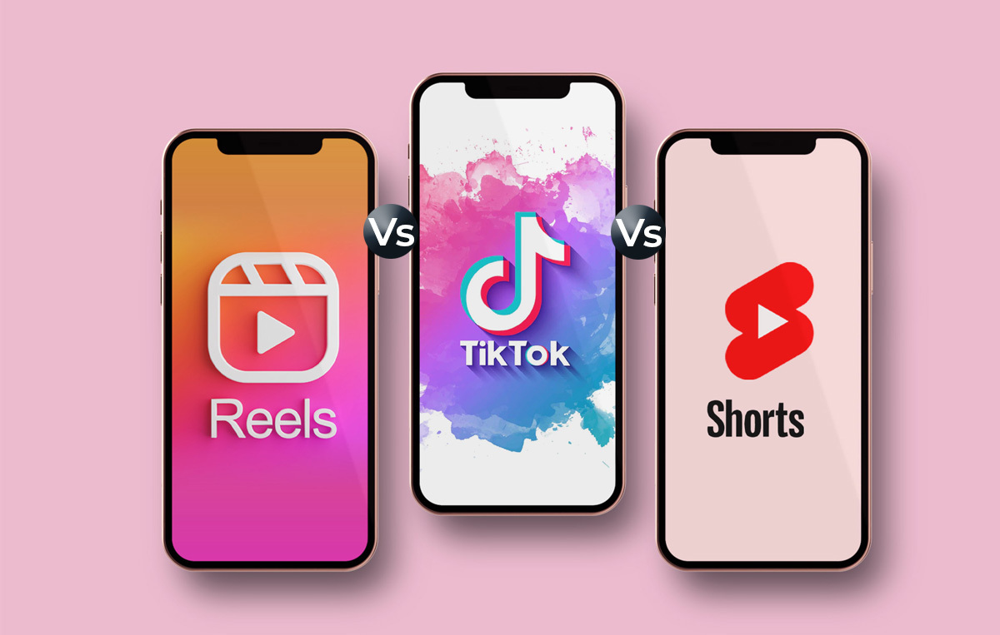
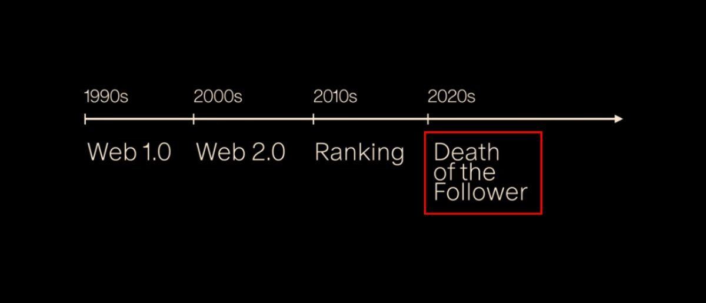

## Followers on social media is a dead concept in 2024

> source by https://x.com/shawnchauhan1/status/1864317012211847479

The internet is at an inflection point, and creators must adapt to survive.

### The early 2000s

YouTube, Facebook, and Twitter emerged.
Their motto was to Express Yourself - by broadcasting, tweeting, Sharing etc.
For the first, you could easily participate on the internet rather instead of just being a passenger.

These sites had a "Subscribe/Follow" button that gave creators a direct line to their audience.This unlocked a massive distribution channel for Artists and Creators to build a following.
So web 2.0 represented the birth of the follower.

Followers meant a community of fans who want to see someone's future work And for a while, having a large following was gold.
YouTube's subscribe button and Facebook's follow feature built careers and communities.

[watch the video](https://x.com/i/status/1864317060358262959)

### The 2010s

But then in the 2010s Facebook started experimenting with a new thing called "ranking".
It took your feed and analysed each post for how engaging it was.
If it wasn't engaging enough, Facebook would then take that post and
push it down in the feed.

Facebook started ranking or ordering posts according to what was best for them - maximizing retention and watch time.

Also, for the first time since Web 2.0, your followers might not necessarily see your posts.
This idea of a subscription started to break down.
But Facebook was thriving -people started spending even more time on their platform.
Other platforms followed its footsteps:
- YouTube launched the Cosmic Panda redesign, centering the entire company around watch time.
- Twitter and Instagram followed with rank feeds in 2016.

Ranking algorithms took over in the 2010s.
Social media sites started ranking posts by engagement, not by the follow button.
Your content was now competing in an algorithmic lottery.
This greatly limited the creative freedom of creators👇

### The 2017s

But it didn't stop there, around the turn of the decade TikTok came onto the scene.
TikTok perfected the algorithmic ranking concept that Facebook started in the early 2010s
Forget about followers or subscribers, TikTok's mission was to make the most engaging feed possible.

Posts on someone's feed were chosen by TikTok and not by the user.
This completely abandoned the concept of "follow" but it worked - TikTok hit a billion users by 2021.
Traffic started flowing away from the legacy social companies toward TikTok.

To compete:
- YouTube launched Shorts
- Instagram launched reels
- Twitter launch for you feed
The goal for these companies became to maximize attention and watch time.

And with this, the 2020s watch time marked the death of the followers.
This trend has changed the economics of creator businesses.
Engagement, not followers, is the real currency now.

Now, nothing is owed to you if you have an audience.
Even with a million followers, your post might only reach 1%.
You have to consistently produce highly engaging pieces of work to get views or engagement.

Your success as a creator is a direct function of how attention grabbing content you can create.
In my opinion, to thrive on social media in the long term, you need to build deep connections with authentic content.
Resist the temptation to create solely for the algorithm.

