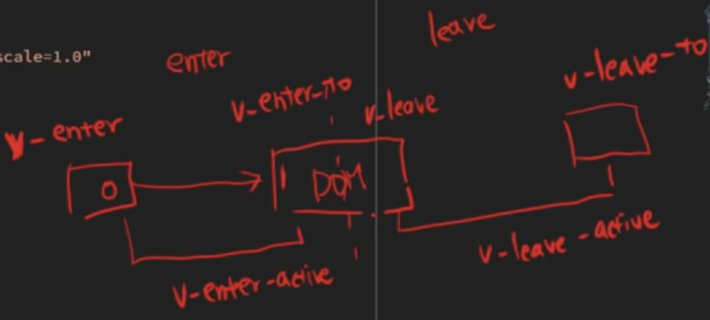
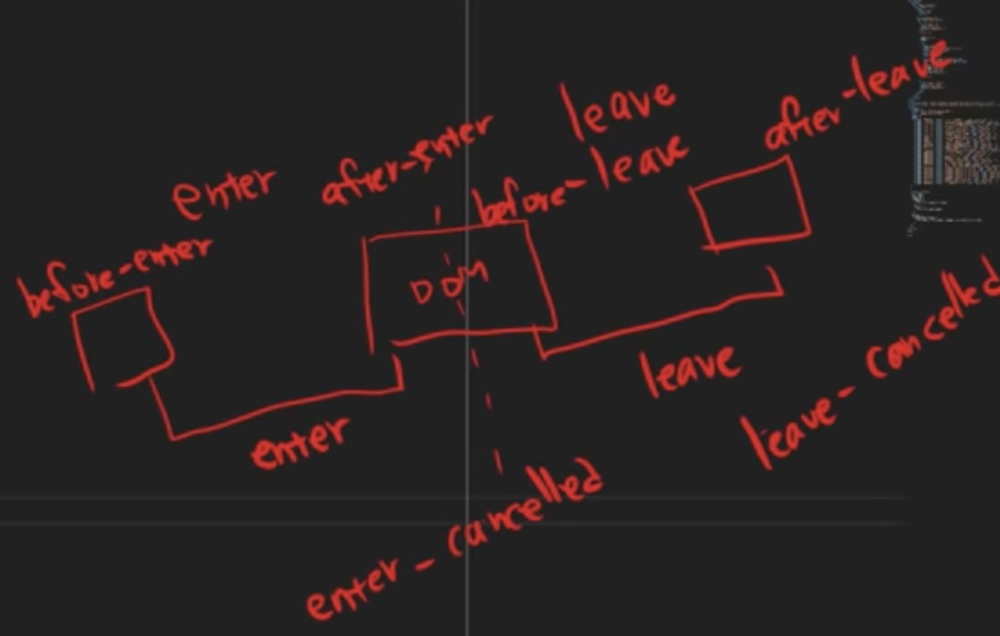

# vue3 从入门到精通

## 提效工具

1. Vue.js devtools

### 1. Vue 与 JQuery 的不同

前端编程从 2.0 时代到 3.0 时代的发展

- 从页面为中心到开始注重数据， 简单来说就是从面向页面到面向数据
- 从单向数据设定，到双向数据绑定， 本示例看到的是数据与属性的绑定
- 从基于 dom 的编程，过度到基于 data 编程， 在 dom 编程时代，编程的范式是确定元素在 dom 中的位置，然后修改或者绑定事件，只需要数据驱动了
- 由于前端框架的技术的发展，导致整个前端的开发范式产生了进化

#### 抛一些小问题

- HTML 模板引擎与字符串模板引擎的区别是什么？
- Vue 这种模板框架与 SpringBoot 中的模板引擎，比如（Thymeleaf）的区别又是什么？他们各自的优势和缺点是什么？
- 究竟是什么特性使得 Vue 成为了前端框架？
- 为什么前端现在是现代编程的引领者？

### 1. 属性绑定

1. 使用 vue3 做数据绑定

```html
<!DOCTYPE html>
<html lang="en">
  <head>
    <meta charset="UTF-8" />
    <meta name="viewport" content="width=device-width, initial-scale=1.0" />
    <link rel="stylesheet" href="css/style.css" />
    <title>Document</title>
  </head>
  <body>
    <div id="app">
      <section>
        <div class="container">
          <div class="title">
            
            <h1>{{data.title}}</h1>
          </div>
        </div>
      </section>
    </div>
    <script src="https://unpkg.com/vue@3/dist/vue.global.js"></script>
    <script>
      const { createApp, ref } = Vue
      createApp({
        setup() {
          const data = { src: './images/vue.png', title: 'Vue.js 手牵手' }
          return {
            data,
          }
        },
      }).mount('#app')
    </script>
  </body>
</html>
```

2. 使用 jquery 做数据绑定

```html
<!DOCTYPE html>
<html lang="en">
  <head>
    <meta charset="UTF-8" />
    <meta name="viewport" content="width=device-width, initial-scale=1.0" />
    <link rel="stylesheet" href="css/style.css" />
    <title>Document</title>
  </head>
  <body>
    <div id="app">
      <section>
        <div class="container">
          <div class="title">
            
            <h1></h1>
          </div>
        </div>
      </section>
    </div>
    <script
      src="https://cdnjs.cloudflare.com/ajax/libs/jquery/3.7.1/jquery.js"
      integrity="sha512-+k1pnlgt4F1H8L7t3z95o3/KO+o78INEcXTbnoJQ/F2VqDVhWoaiVml/OEHv9HsVgxUaVW+IbiZPUJQfF/YxZw=="
      crossorigin="anonymous"
    ></script>
    <script>
      let data = {
        src: './images/vue.png',
        title: 'Vue.js 手牵手',
      }

      $('.title > h1').text(data.title)
      $('.title > img').attr('src', data.src)
    </script>
  </body>
</html>
```

### 2. 事件绑定

- 增加了事件绑定
- 增加了程序逻辑，if /else
- 增加了数据预处理中心，可以对数据进行预处理和缓存

-这里是使用了 vue2 的部分代码

```html
<script>
  let vm = new Vue({
         el: '#app',
         data: data,
         // 資料處理中心
         computed: {
           current() {
             return this.menu[this.index]
           },
           total() {
             return this.menu.length
           },
         },
         methods: {
           changeIndex(change) {
             this.index = (this.index + change + this.total) % this.total

             /*
           this.index += change
           if (this.index < 0) this.index = 0
           else if (this.index > this.menu.length - 1) this.index = this.menu.length - 1
           */
           },
         },
</script>
```

### 3. 表单操作与双向绑定

- v-model： 双向绑定

1. 将属性绑定、和事件绑定合二为一，省去大量冗余代码；
2. 将 input 的 value 属性绑定到 model 的 modelValue 的 prop
3. 将 input 的事件触发时，触发一个携带新值的 update：modelValue 的自定义事件

```html
<input v-model="searchText" />
// 等价于
<input :value="searchText" @input="searchText = $event.target.value" />
// 展开的结果
<CustomInput
  :modelValue="searchText"
  @update:modelValue="newValue => searchText = newValue"
/>
```

### 4. 列表操作与事件绑定

### 5. 动画实现，BOM 操作

- 动画的切换本质是 dom 的切换
- 需要画出 dom
- dom 切换的 6 个状态
  
  <!-- - <transition> 实现动画的组件 -->

-JQuery 做法

<!--  -->

### 5. 数据变更之后的事件绑定

### 6. Lifecycle Hooks Vue 的生命周期

### 7. 网络请求 axios

### 8. 组件管理

### 9. 路由管理

- 路由管理
  [router-vue](https://router.vuejs.org/zh/guide/)
- 嵌套路由
- 动态路

### 10. 状态管理

- MVVM 架构

  1. 目标： 软件开发已经从单体架构走向了微服务架构，在从微服务架构走向了云原生的架构，现代软件工程的一个目标就是解耦，让不同的人，模块、组件专注于自己擅长的事情，如此这要才有可能让整个生态繁荣。
  2. 在页面开发中：重要的是页面，数据、逻辑的解耦，也就是 MVVM 架构；
  3. 在 Model 部分：数据层，因为他仅仅关注与数据本省，不关心行为，是一个保存状态和业务逻辑的实体，就是这个 State；
  4. 在 View 页面端可以使用 vue 这种页面组件来拼接形成比较规范的组件，他的核心通过使用模板语法来声明式的将数据渲染进 DOM，当 Model 数据更新的时候会被 ViewModel 渲染到 View。
  5. 在 ViewModel：类似于 MVC 中的 Controller，核心之一就是这个数据/事件绑定；

- state 是什么

  1. 有了以上的背景知识后，我们可以定义 state 就是 model 层，保存状态和业务逻辑的实体。
  2. 他类似于 SpringBoot 的 bean factory
  3. 他承载着全局状态，有一点像一个永远存在的组件，每个组件都可以读取和写入它。
  4. 他的三个核心概念是 state、getter、action 对应于组件中的 data、computed、methods。

- 集中式状态管理
- 手动的状态管理
- 基于[pinia]的状态管理(https://pinia.vuejs.org/zh/)
  1. pinia 的西班牙语种是菠萝的意思。菠萝花实际上是各自独立的花朵，他们结合在一起构成了一个多重的水果。
  2. Store 类似，每一个都是独立诞生的，但最终他们都是互相联系在一起的
  3. 他（菠萝） 也是一种原产于南美洲的热带水果
  4. 他是 MMVC 中的 viewModel 的基础，有点类似于 JavaEE 中的 JavaBean；
     watch

### 11. 什么是渐进式框架


### 12. 服务端渲染 SSR

- Nuxt
- Next.js

### 13. 静态网站

### 14. 插件

### 15. 其他资源推荐

1. [vue-awesome](https://github.com/vuejs/awesome-vue)
2. [nuxt-awesome](https://github.com/nuxt/awesome)

## 参考文件

1. [springboot-template-engines](https://www.baeldung.com/spring-template-engines)
