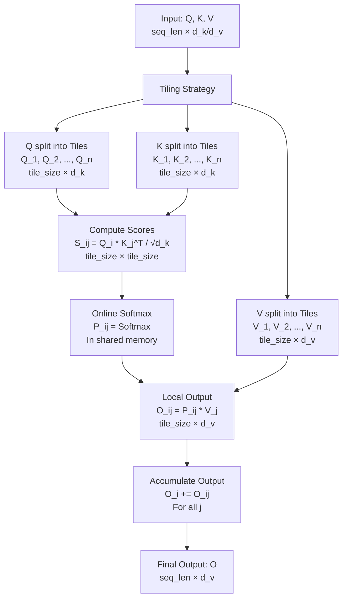
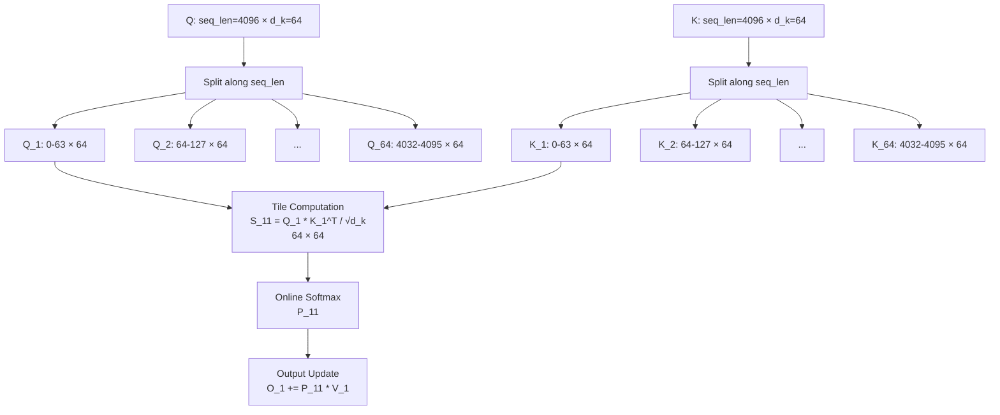

# tiling strategies

在 **Flash Attention** 算法中，**Tiling Strategies（瓦片策略）** 是一种关键优化技术，旨在解决传统注意力机制在 GPU 上计算时的内存瓶颈问题，特别是避免显式地存储和操作大规模的中间矩阵（如注意力权重矩阵）。通过将计算分解为小块（Tiles），Flash Attention 能够在 GPU 的快速内存（如共享内存和寄存器）中逐步完成计算，从而提高效率和降低内存需求。下面我会详细解释 Tiling Strategies 在 Flash Attention 中的作用和实现方式，并用 Mermaid 图表辅助说明。

---

### Flash Attention 的背景
- **传统注意力机制**：
  - 计算注意力权重：`P = Softmax(Q * K^T / √d_k)`，其中 `P` 是 `(seq_len, seq_len)` 的矩阵。
  - 输出：`Output = P * V`。
  - 问题：`P` 是一个很大的中间矩阵（例如 `seq_len = 4096` 时，`P` 大小为 16M 个元素），需要存储到全局内存（DRAM），导致高内存带宽需求和低计算效率。
- **Flash Attention 目标**：
  - 避免显式存储完整的 `P`，通过在线计算和融合操作（Kernel Fusion）直接生成输出。
  - 利用 GPU 的快速内存层次（如共享内存和寄存器）。

---

### 什么是 Tiling Strategies？
- **Tiling（瓦片化）**：
  - 将大矩阵（例如 `Q * K^T` 或 `P * V`）的计算分解为多个小块（Tiles），每个 Tile 是一个子矩阵。
  - 这些小块被设计为适合 GPU 的快速内存（Shared Memory 或 Registers），避免频繁访问慢速的全局内存（DRAM）。
- **核心思想**：
  - 分块计算：一次只计算一个 Tile 的注意力权重和输出。
  - 在线更新：逐步累积输出，而不是一次性生成完整的 `P`。

#### Flash Attention 中的 Tiling
- **输入矩阵**：
  - **Q**：`(seq_len, d_k)`（查询）。
  - **K**：`(seq_len, d_k)`（键）。
  - **V**：`(seq_len, d_v)`（值）。
- **瓦片分解**：
  - 将 `Q` 和 `K` 的序列维度（`seq_len`）分成多个小块，例如每块大小为 `tile_size`。
  - 对应的 `Q * K^T` 被分解为多个子矩阵块，逐步计算。

---

### Tiling Strategies 的实现步骤
1. **分块 Q 和 K**：
   - 将 `Q` 分成 `Q_1, Q_2, ..., Q_n`，每个 `Q_i` 是 `(tile_size, d_k)`。
   - 将 `K` 分成 `K_1, K_2, ..., K_n`，每个 `K_i` 是 `(tile_size, d_k)`。
   - 假设 `seq_len = 4096`，`tile_size = 64`，则有 `4096 / 64 = 64` 个 Tiles。

2. **计算子矩阵得分**：
   - 对于每一对 `(Q_i, K_j)`，计算 `S_ij = Q_i * K_j^T / √d_k`，结果是 `(tile_size, tile_size)` 的小矩阵。
   - 这个小矩阵可以放入共享内存（例如 64×64 = 4096 个元素，远小于完整的 4096×4096）。

3. **在线 Softmax**：
   - 对 `S_ij` 应用 Softmax，生成局部注意力权重 `P_ij`。
   - 使用在线算法（Online Softmax）逐步更新全局统计量（最大值和归一化因子），避免存储完整的 `P`。
   - 计算公式：
     ```
     P_ij = Softmax(S_ij)
     ```

4. **分块累积输出**：
   - 将 `P_ij` 与对应的 `V_j`（`(tile_size, d_v)`）相乘，得到局部输出 `O_ij = P_ij * V_j`。
   - 逐步累积到输出矩阵 `O` 中：
     ```
     O_i += P_ij * V_j  （对于所有 j）
     ```

5. **内存优化**：
   - 每个 Tile 的计算都在共享内存或寄存器中完成，减少对 DRAM 的访问。
   - `P_ij` 不需要存储到全局内存，计算后立即用于更新输出。

---

### Tiling 的优势
1. **内存效率**：
   - 传统方法需要存储完整的 `P`（例如 4096×4096×4字节 ≈ 64MB），而 Tiling 只处理小块（例如 64×64×4字节 ≈ 16KB），适合共享内存（通常几十 KB）。
2. **计算效率**：
   - 分块计算可以并行执行，充分利用 GPU 的线程块（Blocks）和流处理器。
3. **数值稳定性**：
   - 在线 Softmax 通过逐步更新最大值和归一化因子，避免了大矩阵的数值溢出问题。
4. **GPU 适配**：
   - Tile 大小（例如 64 或 128）可以根据 GPU 的共享内存容量和线程块大小调整。

---

### Mermaid 图表示 Tiling Strategies
以下图表展示 Flash Attention 中 Tiling 的工作流程：



---

### 举例说明
- **输入**：`seq_len = 4096`, `d_k = 64`, `d_v = 64`, `tile_size = 64`。
- **Tiling**：
  - `Q` 分成 64 个 Tiles，每个 `Q_i` 是 `(64, 64)`。
  - `K` 分成 64 个 Tiles，每个 `K_i` 是 `(64, 64)`。
- **计算**：
  - 对于 `Q_1` 和 `K_1`，计算 `S_11 = Q_1 * K_1^T / √64`，形状 `(64, 64)`。
  - Softmax 得到 `P_11`，与 `V_1` 相乘，更新 `O_1`。
  - 对所有 `K_j`（j = 1 到 64）重复，累积 `O_1`。
- **结果**：`O` 是 `(4096, 64)`，无需存储 4096×4096 的 `P`。

---

### 与 GPU 的结合
- **线程块（Blocks）**：一个线程块处理一个 Tile 的计算（例如 `S_ij`）。
- **共享内存**：存储 `Q_i`、`K_j` 和 `P_ij`，大小受限于 GPU 共享内存（例如 48KB 或 96KB）。
- **寄存器**：存储在线 Softmax 的统计量（如最大值和归一化因子）。

---

### 总结
- **Tiling Strategies** 在 Flash Attention 中通过将大矩阵分解为小块，逐步计算注意力权重和输出，避免了存储完整的中间矩阵。
- **作用**：提高内存效率、计算效率和数值稳定性，同时适配 GPU 的并行架构。
- **实现**：分块计算得分、在线 Softmax 和累积输出，依赖共享内存和寄存器。

如果需要更具体的代码示例或数学推导（例如在线 Softmax 的公式），请告诉我，我可以进一步扩展！


你提出的问题是完全合理的，让我澄清一下关于“将 `Q` 和 `K` 的序列维度（`seq_len`）分成多个小块”中的术语和概念。确实，**序列维度（Sequence Dimension）**通常就是指**序列长度（Sequence Length）**，也就是 `seq_len`，我之前的表述可能不够清晰，导致了混淆。我会详细解释这个过程，并说明在 Flash Attention 中如何沿着序列维度（也就是 `seq_len`）进行分块（Tiling），以及为什么这么做。

---

### 澄清术语
- **序列维度（Sequence Dimension）**：
  - 在注意力机制中，`Q`（查询）、`K`（键）和 `V`（值）的矩阵形状通常是 `(seq_len, d)`，其中：
    - `seq_len` 是序列长度，表示输入序列中的 token 数量（例如一个句子的单词数）。
    - `d` 是每个 token 的特征维度（例如 `d_k` 或 `d_v`）。
  - “序列维度”就是指矩阵的第一个维度，也就是 `seq_len`。
- **我的表述**：
  - 当我说“将 `Q` 和 `K` 的序列维度（`seq_len`）分成多个小块”时，意思是沿着 `seq_len` 这个维度将矩阵分割为多个子矩阵（Tiles），而不是在特征维度（`d_k`）上分割。
  - 换句话说，`seq_len` 确实是序列长度，我指的是将这个长度分成若干小段。

#### 为什么会有疑问？
- 你可能觉得“序列维度”和“序列长度”是同一个东西，我的表述“分成多个小块”显得多余或不必要。确实如此，“序列维度”就是 `seq_len`，我只是想强调分块操作的目标维度。以下我会更精确地解释这个过程。

---

### 在 Flash Attention 中分块的过程
Flash Attention 通过 **Tiling（瓦片化）** 沿着 `seq_len` 维度分割 `Q` 和 `K`，以减少内存使用并提高计算效率。让我逐步说明：

#### 1. 输入矩阵
- **Q**：`(seq_len, d_k)`，表示 `seq_len` 个查询向量，每个向量维度为 `d_k`。
- **K**：`(seq_len, d_k)`，表示 `seq_len` 个键向量，每个向量维度为 `d_k`。
- **V**：`(seq_len, d_v)`，表示 `seq_len` 个值向量，每个向量维度为 `d_v`。
- 例如：`seq_len = 4096`, `d_k = 64`, `d_v = 64`。

#### 2. 为什么要分块？
- 在传统注意力中，计算 `Q * K^T` 生成一个 `(seq_len, seq_len)` 的得分矩阵（例如 4096×4096），需要大量内存（约 64MB）。
- Flash Attention 的目标是避免存储这个完整的矩阵，而是分块计算。

#### 3. 沿着 `seq_len` 分块
- **分块（Tiling）**：
  - 将 `Q` 的 `seq_len` 行分成多个小块，每个小块包含 `tile_size` 行。
  - 将 `K` 的 `seq_len` 行分成多个小块，每个小块也包含 `tile_size` 行。
  - 例如：
    - `seq_len = 4096`, `tile_size = 64`。
    - `Q` 分成 `4096 / 64 = 64` 个 Tiles，每个 Tile 是 `(64, d_k)`。
    - `K` 分成 64 个 Tiles，每个 Tile 是 `(64, d_k)`。
- **结果**：
  - `Q_1 = Q[0:64, :]`, `Q_2 = Q[64:128, :]`, ..., `Q_64 = Q[4032:4096, :]`。
  - `K_1 = K[0:64, :]`, `K_2 = K[64:128, :]`, ..., `K_64 = K[4032:4096, :]`。

#### 4. 分块后的计算
- 对于每一对 `(Q_i, K_j)`，计算一个小的得分矩阵：
  ```
  S_ij = Q_i * K_j^T / √d_k
  ```
  - `Q_i` 是 `(tile_size, d_k)`，`K_j^T` 是 `(d_k, tile_size)`，结果 `S_ij` 是 `(tile_size, tile_size)`（例如 64×64）。
- 对 `S_ij` 进行 Online Softmax，得到局部注意力权重 `P_ij`，然后与 `V_j` 相乘，逐步更新输出。

#### 5. 为什么要沿着 `seq_len` 分块？
- **内存限制**：完整的 `Q * K^T`（4096×4096）太大，无法放入 GPU 的共享内存（通常几十 KB）。分块后，每个 `S_ij`（64×64）只需约 16KB，可以放入共享内存。
- **逐步计算**：沿着 `seq_len` 分块允许逐块处理注意力计算，避免一次性生成整个矩阵。

---

### 直观理解
- **类比**：
  - 想象 `Q` 是一个长条形的表格，有 4096 行（每个 token 一行），每行有 64 列（特征）。
  - 分块就是把这个长表格剪成 64 个小表格，每个小表格有 64 行。
  - `K` 也是类似处理。
  - 然后，计算每个小表格 (`Q_i`) 和另一个小表格 (`K_j`) 的点积，得到一个小的得分矩阵。
- **序列维度的意义**：
  - `seq_len` 表示序列中的 token 数量，分块就是把这些 token 分组处理，而不是一次性处理所有 token。

---

### Mermaid 图表示分块过程
以下是一个图表，展示沿着 `seq_len` 分割 `Q` 和 `K` 的过程：



---

### 举例说明
- **输入**：`seq_len = 4096`, `d_k = 64`, `tile_size = 64`。
- **分块**：
  - `Q_1 = Q[0:64, :]`（第 0 到 63 行的查询）。
  - `K_1 = K[0:64, :]`（第 0 到 63 行的键）。
- **计算**：
  - `S_11 = Q_1 * K_1^T / √64`，形状 `(64, 64)`。
  - 对 `S_11` 做 Softmax，得到 `P_11`，与 `V_1` 相乘，更新输出。
- **重复**：对所有 `K_j`（j = 1 到 64）计算，累积 `O_1`。

---

### 回答你的疑问
- **“序列维度不是序列长度吗？”**：
  - 是的，序列维度就是 `seq_len`，也就是序列长度。我说“将 `Q` 和 `K` 的序列维度（`seq_len`）分成多个小块”，意思是沿着 `seq_len` 这个维度（矩阵的行数）进行分割，而不是特征维度（`d_k`，矩阵的列数）。
  - 分块的目标是把长的序列分成多个短的子序列，以便分块计算。

---

### 总结
- **序列维度（`seq_len`）** 是矩阵的行数，表示序列长度。
- **分块** 是沿着 `seq_len` 将 `Q` 和 `K` 分成多个小矩阵（Tiles），每个 Tile 是 `(tile_size, d_k)`。
- **目的**：减少内存需求，适配 GPU 快速内存，逐步计算注意力。

如果还有疑问或需要更具体示例（例如代码或矩阵可视化），请告诉我，我会进一步澄清！