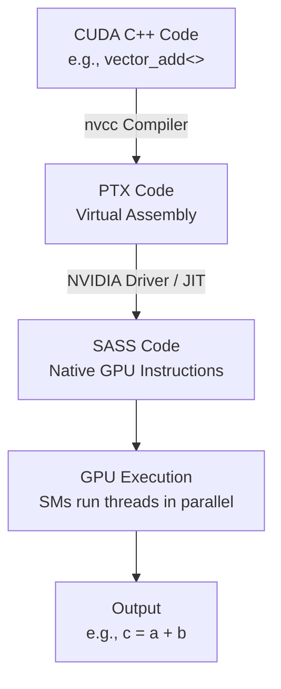

**Parallel Thread Execution (PTX)** 是 NVIDIA GPU 的一种低级虚拟汇编语言，旨在为 CUDA 和其他 GPU 计算框架提供一个中间表示（Intermediate Representation, IR）。它由 NVIDIA 开发，作为 GPU 编程模型的一部分，允许程序员或编译器以接近硬件的方式描述并行计算任务。PTX 并不是直接在 GPU 硬件上执行的机器代码，而是被进一步编译为目标 GPU 架构的原生指令集（例如 SASS，Specific Assembly）。以下我会详细介绍 PTX 的概念、特点、作用，以及它在 NVIDIA GPU 计算中的地位，并用 Mermaid 图表辅助说明。

---

### 什么是 PTX？

#### 定义
- **PTX（Parallel Thread Execution）**：
  - 一种低级虚拟汇编语言，设计用于描述 GPU 上的并行线程执行。
  - 类似于 CPU 的汇编语言，但针对 GPU 的 SIMT（Single Instruction, Multiple Threads）架构。
- **虚拟性**：
  - PTX 不是特定 GPU 硬件的汇编语言，而是一个通用的中间表示。
  - 在运行时或编译时，由 NVIDIA 驱动程序或编译器（例如 `nvcc`）将其转换为目标 GPU 的机器代码（SASS）。

#### 历史
- PTX 首次随 CUDA 平台引入，目前已发展到多个版本（例如 PTX 8.0，截至 2023 年），支持 NVIDIA 的各种 GPU 架构（如 Kepler, Maxwell, Volta, Ampere, Hopper）。

---

### PTX 的核心特点

1. **SIMT 模型**：
   - PTX 基于 SIMT 架构，同一个指令由多个线程并行执行，每个线程处理不同的数据。
   - 例如，一个 PTX 指令（如 `add.f32`）可以同时在 32 个线程（一个 Warp）上执行。

2. **寄存器操作**：
   - PTX 使用虚拟寄存器（数量理论上无限），编译器再将其映射到物理寄存器。
   - 例如：`reg0`, `reg1` 等。

3. **指令集**：
   - 包括算术运算（如 `add`, `mul`）、逻辑运算（如 `and`, `or`）、内存操作（如 `ld`, `st`）、控制流（如 `bra` 分支）等。
   - 支持多种数据类型（如 `f32` 单精度浮点, `s32` 整数）。

4. **并行性支持**：
   - PTX 提供线程标识符（如 `%tid.x`, `%ntid.x`）和块标识符（如 `%ctaid.x`），用于区分线程和线程块。
   - 支持同步指令（如 `bar.sync`）协调线程。

5. **内存层次**：
   - 定义多种内存空间：
     - **寄存器**（`reg`）：线程私有。
     - **共享内存**（`shared`）：线程块共享。
     - **全局内存**（`global`）：所有线程可访问。
     - **常量内存**（`const`）、**纹理内存**（`tex`）等。

---

### PTX 的作用

1. **中间表示**：
   - 在 CUDA 编程中，高级语言（如 C++）通过 `nvcc` 编译为 PTX。
   - PTX 提供了一个与硬件无关的层，方便适配不同 GPU 架构。

2. **优化控制**：
   - 程序员可以手动编写 PTX 代码，精确控制低级操作（如寄存器分配、内存访问）。
   - 例如，在 Flash Attention 中，手动优化 PTX 可能用于分块计算和在线 Softmax。

3. **调试与分析**：
   - PTX 代码可用于性能分析工具（如 NVIDIA Nsight），帮助理解编译器优化和硬件执行。

4. **跨架构兼容性**：
   - PTX 作为虚拟层，确保代码在不同代 GPU 上运行，具体硬件细节由驱动程序处理。

---

### PTX 示例
以下是一个简单的 PTX 代码片段，计算两个数组的元素和：

```ptx
// PTX 代码：数组加法
.visible .entry vector_add(
    .param .u64 param_a,   // 输入数组 a
    .param .u64 param_b,   // 输入数组 b
    .param .u64 param_c,   // 输出数组 c
    .param .u32 param_n    // 数组长度
)
{
    .reg .u32 %tid;        // 线程 ID
    .reg .u32 %n;          // 数组长度
    .reg .u64 %ptr_a, %ptr_b, %ptr_c;  // 指针寄存器
    .reg .f32 %va, %vb, %vc;           // 值寄存器

    // 获取线程 ID 和数组长度
    mov.u32 %tid, %tid.x;              // 当前线程 ID
    ld.param.u32 %n, [param_n];        // 加载数组长度

    // 计算当前线程的索引
    ld.param.u64 %ptr_a, [param_a];    // 加载 a 的指针
    ld.param.u64 %ptr_b, [param_b];    // 加载 b 的指针
    ld.param.u64 %ptr_c, [param_c];    // 加载 c 的指针

    // 检查线程是否在范围内
    setp.ge.u32 %p1, %tid, %n;         // 如果 tid >= n，跳过
    @%p1 bra $L_end;

    // 加载数据，计算，加到 c
    ld.global.f32 %va, [%ptr_a + %tid*4];  // 从全局内存加载 a[tid]
    ld.global.f32 %vb, [%ptr_b + %tid*4];  // 从全局内存加载 b[tid]
    add.f32 %vc, %va, %vb;                 // 计算 c[tid] = a[tid] + b[tid]
    st.global.f32 [%ptr_c + %tid*4], %vc;  // 存储到全局内存

$L_end:
    ret;                                   // 返回
}
```

#### 解释
- **线程 ID**：`%tid.x` 获取当前线程索引。
- **内存操作**：`ld.global` 从全局内存加载，`st.global` 存储结果。
- **算术**：`add.f32` 执行单精度加法。
- **控制流**：`setp` 和 `bra` 实现条件跳转。

---

### PTX 在 NVIDIA GPU 中的执行流程
1. **CUDA C++ 代码**：
   - 程序员编写高级代码。
2. **编译为 PTX**：
   - `nvcc` 将代码编译为 PTX。
3. **转换为 SASS**：
   - NVIDIA 驱动程序或 JIT（Just-In-Time）编译器将 PTX 转换为目标 GPU 的原生指令（SASS）。
4. **执行**：
   - GPU 的 Streaming Multiprocessors (SM) 并行执行 SASS 指令。

---

### PTX 与 Flash Attention 的关系
- **优化潜力**：
  - Flash Attention 的核心（如 Tiling、Online Softmax）可以通过 PTX 实现精细控制，例如：
    - 手动分配寄存器存储 `m_i` 和 `l_i`。
    - 优化共享内存加载和计算。
- **性能分析**：
  - 检查 PTX 代码可以揭示编译器如何处理分块计算，帮助调整 Tile 大小或线程分配。

---

### Mermaid 图表示 PTX 的编译与执行
以下图表展示 PTX 在 GPU 计算中的角色：



---

### PTX 的优势与局限

#### 优势
1. **灵活性**：提供低级控制，适合高性能优化。
2. **可移植性**：跨不同 GPU 架构兼容。
3. **并行性**：天然支持 SIMT 模型。

#### 局限
1. **复杂性**：手动编写 PTX 难度高，通常由编译器生成。
2. **抽象层**：不是最终机器码，性能依赖 SASS 转换效率。
3. **调试困难**：需要专业工具（如 Nsight）分析。

---

### 总结
- **PTX（Parallel Thread Execution）** 是 NVIDIA GPU 的低级虚拟汇编语言，用于描述并行线程计算。
- **作用**：作为 CUDA 的中间表示，提供优化控制和跨架构兼容性。
- **特点**：支持 SIMT、寄存器操作、多层次内存访问。
- **与 Flash Attention**：可用于精细优化分块计算和内存管理。

