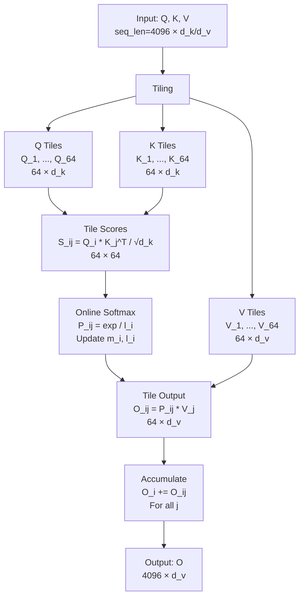
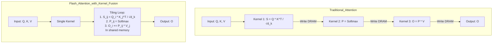
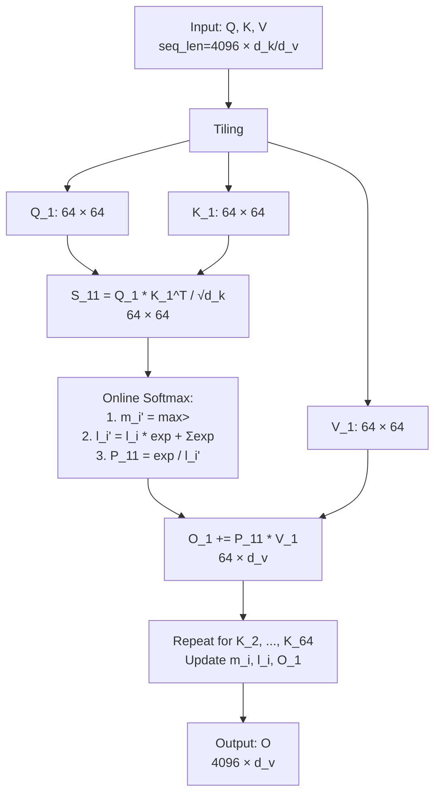
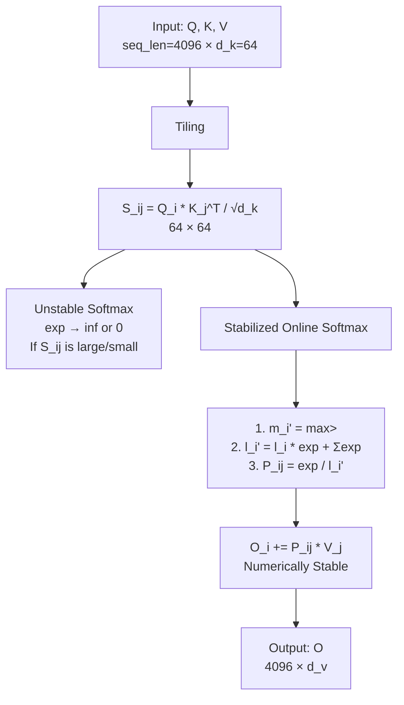
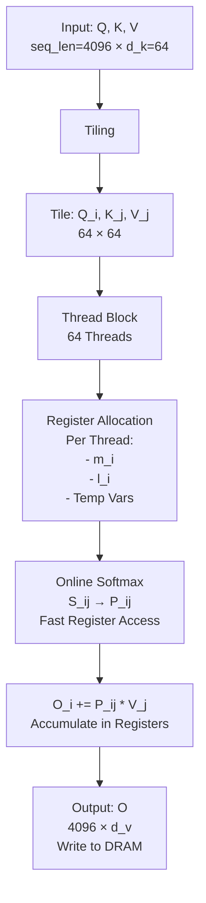

# flash attention

**Flash Attention** 是一种高效的注意力机制优化算法，旨在解决传统 Transformer 注意力机制在处理长序列时的内存和计算瓶颈问题。它由 Tri Dao 等人在 2022 年提出，通过结合 **Tiling（瓦片化）**、**在线计算（Online Computation）** 和 **GPU 内存层次优化**，显著减少内存使用并提升计算速度，同时保持数学上的等价性。以下我会详细解释 Flash Attention 的原理、动机、实现方式及其优势，并用 Mermaid 图表辅助说明。

---

### 传统注意力的瓶颈
传统注意力机制（如 Transformer 中的 Scaled Dot-Product Attention）计算过程如下：
1. **输入**：
   - **Q**（查询）：`(seq_len, d_k)`。
   - **K**（键）：`(seq_len, d_k)`。
   - **V**（值）：`(seq_len, d_v)`。
   - `seq_len` 是序列长度，`d_k` 和 `d_v` 是特征维度。
2. **计算步骤**：
   - 计算得分：`S = Q * K^T / √d_k`，形状 `(seq_len, seq_len)`。
   - Softmax 归一化：`P = Softmax(S)`，形状 `(seq_len, seq_len)`。
   - 输出：`O = P * V`，形状 `(seq_len, d_v)`。

#### 问题
- **内存需求**：`S` 和 `P` 是 `(seq_len, seq_len)` 的矩阵，对于长序列（例如 `seq_len = 4096`），需要存储 16M 个元素（约 64MB），占用大量全局内存（DRAM）。
- **带宽瓶颈**：在 GPU 上，频繁读写这些大矩阵会导致高内存带宽需求，限制计算速度。
- **计算效率**：Softmax 和矩阵乘法被分成独立步骤，无法充分利用 GPU 的并行性。

---

### Flash Attention 的核心思想
Flash Attention 的目标是：
- **避免存储完整的中间矩阵**（`S` 和 `P`）。
- **分块计算**：将序列分成小块（Tiles），在 GPU 的快速内存（如共享内存和寄存器）中逐步完成计算。
- **内核融合（Kernel Fusion）**：将得分计算、Softmax 和输出计算融合到一个 CUDA 内核中，减少内存访问。

#### 关键技术
1. **Tiling（瓦片化）**：
   - 将 `Q`、`K` 和 `V` 沿着序列维度（`seq_len`）分成小块（Tiles），每个 Tile 大小（例如 64 或 128）适合共享内存。
2. **在线 Softmax（Online Softmax）**：
   - 逐步计算 Softmax，避免存储完整的 `P`，通过维护统计量（最大值和归一化因子）在线更新输出。
3. **GPU 内存优化**：
   - 使用共享内存存储 Tile 数据，寄存器存储中间统计量，减少 DRAM 访问。

---

### Flash Attention 的实现步骤
假设 `seq_len = 4096`，`tile_size = 64`，`d_k = d_v = 64`：

1. **分块输入**：
   - `Q` 分成 64 个 Tiles：`Q_1, Q_2, ..., Q_64`，每个 `Q_i` 是 `(64, 64)`。
   - `K` 分成 64 个 Tiles：`K_1, K_2, ..., K_64`，每个 `K_i` 是 `(64, 64)`。
   - `V` 分成 64 个 Tiles：`V_1, V_2, ..., V_64`，每个 `V_i` 是 `(64, 64)`。

2. **分块计算得分**：
   - 对于每一对 `(Q_i, K_j)`，计算：
     ```
     S_ij = Q_i * K_j^T / √d_k
     ```
     - `S_ij` 是 `(64, 64)` 的小矩阵，可放入共享内存。

3. **在线 Softmax**：
   - 对每一行逐步计算 Softmax，避免存储完整的 `P`：
     - 维护每个查询的统计量：
       - `m_i`：当前最大值。
       - `l_i`：归一化因子（指数和）。
     - 对于每个 `S_ij`：
       ```
       P_ij = exp(S_ij - m_i) / l_i
       ```
     - 更新 `m_i` 和 `l_i`，确保数值稳定性。

4. **分块输出**：
   - 计算局部输出：
     ```
     O_ij = P_ij * V_j
     ```
     - `O_ij` 是 `(64, 64)`。
   - 累积到输出：
     ```
     O_i += O_ij  （对于所有 j）
     ```

5. **内存管理**：
   - `Q_i`、`K_j`、`V_j` 和 `S_ij` 存储在共享内存。
   - `m_i` 和 `l_i` 存储在寄存器。
   - 最终输出 `O` 写入 DRAM。

---

### Flash Attention 的数学等价性
- Flash Attention 通过在线 Softmax 保证与传统注意力计算结果相同：
  - 传统 Softmax：`P = exp(S) / Σexp(S)`。
  - 在线 Softmax：通过分块更新 `m_i` 和 `l_i`，逐步计算等价的 `P * V`。

#### 在线 Softmax 公式
对于每一行：
- 初始化：`m_i = -∞`, `l_i = 0`。
- 对于每个 Tile `S_ij`：
  - 更新最大值：`m_i' = max(m_i, max(S_ij))`。
  - 更新归一化因子：`l_i' = l_i * exp(m_i - m_i') + Σexp(S_ij - m_i')`。
  - 更新输出：`O_i = O_i * exp(m_i - m_i') + P_ij * V_j`。

---

### Flash Attention 的优势
1. **内存效率**：
   - 传统：`O(seq_len^2)` 内存（存储 `P`）。
   - Flash：`O(seq_len)` 内存（只需存储输入和输出）。
2. **计算速度**：
   - 通过内核融合和分块计算，减少内存访问，速度提升 2-4 倍（取决于 `seq_len`）。
3. **长序列支持**：
   - 传统方法受限于 DRAM 容量，Flash Attention 可以处理超长序列（例如 `seq_len = 64K`）。
4. **GPU 优化**：
   - 充分利用共享内存（几十 KB）和寄存器，减少带宽瓶颈。

---

### Mermaid 图表示 Flash Attention
以下图表展示 Flash Attention 的工作流程：



---

### 举例说明
- **输入**：`seq_len = 4096`, `d_k = 64`, `tile_size = 64`。
- **分块**：
  - `Q_1 = Q[0:64, :]`，`K_1 = K[0:64, :]`。
  - `S_11 = Q_1 * K_1^T / √64`（64×64）。
- **计算**：
  - 在线 Softmax 生成 `P_11`，与 `V_1` 相乘，更新 `O_1`。
  - 对 `K_2, ..., K_64` 重复，累积 `O_1`。
- **结果**：`O` 是 `(4096, 64)`，内存占用大幅减少。

---

### 总结
- **Flash Attention** 是一种高效注意力算法，通过 Tiling 和在线 Softmax，避免存储大中间矩阵。
- **原理**：分块计算得分、逐步更新输出，利用 GPU 快速内存。
- **优势**：内存效率高、速度快、支持长序列。

如果需要更深入的数学推导（例如在线 Softmax 的证明）或代码实现，请告诉我，我可以进一步扩展！


## Kernel Fusion

**Kernel Fusion（内核融合）** 是一种优化技术，特别是在 GPU 计算（如 CUDA 编程）中，通过将多个独立的计算操作合并到一个单一的内核（Kernel）中执行，减少中间结果的存储和内存访问，从而提升性能。在 Flash Attention 等算法中，Kernel Fusion 是一个关键组成部分。下面我会详细解释 Kernel Fusion 的概念及其在 Flash Attention 中的好处（Kernel Fusion Benefits），并用 Mermaid 图表辅助说明。

---

### 什么是 Kernel Fusion？

#### 定义
- 在 GPU 编程中，一个 **Kernel** 是运行在 GPU 上的一个函数，由多个线程并行执行，通常对应一个计算任务（如矩阵乘法）。
- **Kernel Fusion** 是将多个独立的计算步骤（原本需要多个 Kernel 分别执行）组合到一个 Kernel 中，使得这些步骤在单次调用中完成。

#### 传统方式（无融合）
- 假设有三个操作：
  1. 计算 `A = Q * K^T`（矩阵乘法）。
  2. 计算 `B = Softmax(A)`（归一化）。
  3. 计算 `C = B * V`（输出）。
- 传统方法：
  - 每个操作一个 Kernel：
    - Kernel 1：计算 `A`，写入 DRAM。
    - Kernel 2：读取 `A`，计算 `B`，写入 DRAM。
    - Kernel 3：读取 `B`，计算 `C`，写入 DRAM。
  - 问题：
    - 多次 DRAM 读写（高带宽开销）。
    - 中间结果（如 `A` 和 `B`）需要存储。

#### Kernel Fusion 方式
- 将三个操作融合到一个 Kernel：
  - 输入：`Q`、`K`、`V`。
  - 内部：
    - 计算 `A = Q * K^T`。
    - 立即对 `A` 计算 `B = Softmax(A)`。
    - 立即用 `B` 计算 `C = B * V`。
  - 输出：直接生成 `C`，无需存储 `A` 或 `B`。
- 好处：
  - 中间结果留在快速内存（如共享内存或寄存器）。
  - 减少 DRAM 访问。

---

### Kernel Fusion 在 Flash Attention 中的应用
Flash Attention 使用 Kernel Fusion 将传统注意力机制的多个步骤合并为一个高效的计算过程：
- **传统注意力**：
  - 分步执行：`S = Q * K^T / √d_k` → `P = Softmax(S)` → `O = P * V`。
  - 每个步骤需要独立的 Kernel，中间结果 `S` 和 `P` 存储到 DRAM。
- **Flash Attention**：
  - 融合步骤：
    1. 计算小块得分 `S_ij = Q_i * K_j^T / √d_k`。
    2. 在线计算 `P_ij = Softmax(S_ij)`。
    3. 立即计算 `O_ij = P_ij * V_j` 并累积到 `O_i`。
  - 所有操作在一个 Kernel 中完成，`S_ij` 和 `P_ij` 不写入 DRAM。

---

### Kernel Fusion Benefits（内核融合的好处）

1. **减少内存访问（Reduced Memory Traffic）**：
   - 传统方法需要在 DRAM 中存储和读取中间结果（如 `S` 和 `P`），每次读写消耗大量带宽。
   - 融合后，中间结果留在共享内存或寄存器中，只需最终输出写入 DRAM。
   - **示例**：对于 `seq_len = 4096`，传统方法需要 64MB 的 `P`，而 Flash Attention 只需存储输入和输出（几 MB）。

2. **降低内存需求（Lower Memory Footprint）**：
   - 无需分配空间给大中间矩阵（如 `(seq_len, seq_len)` 的 `P`）。
   - 在 Flash Attention 中，内存复杂度从 `O(seq_len^2)` 降到 `O(seq_len)`。

3. **提升计算效率（Improved Computational Efficiency）**：
   - 融合操作减少了 Kernel 启动开销（每次 Kernel 调用都有固定延迟）。
   - 计算和数据访问紧密结合，充分利用 GPU 的并行性和缓存。

4. **带宽优化（Bandwidth Optimization）**：
   - GPU 的 DRAM 带宽有限（例如 1 TB/s），而共享内存带宽极高（例如 10 TB/s）。
   - Kernel Fusion 最大化快速内存使用，减少对慢速 DRAM 的依赖。

5. **数值稳定性（Numerical Stability）**：
   - 在线 Softmax 与融合结合，通过逐步更新统计量（最大值和归一化因子），避免大矩阵的溢出问题。

---

### Flash Attention 中的 Kernel Fusion 示例
- **输入**：`Q`, `K`, `V`（各 `(seq_len, d_k/d_v)`）。
- **传统方式**：
  - Kernel 1：`S = Q * K^T / √d_k` → 写入 DRAM。
  - Kernel 2：`P = Softmax(S)` → 写入 DRAM。
  - Kernel 3：`O = P * V` → 写入 DRAM。
  - 内存访问：多次读写 `(seq_len, seq_len)` 矩阵。
- **Flash Attention（融合）**：
  - 一个 Kernel：
    - 循环分块：
      - `S_ij = Q_i * K_j^T / √d_k`（共享内存）。
      - `P_ij = Softmax(S_ij)`（在线计算）。
      - `O_i += P_ij * V_j`（累积输出）。
    - 仅最终 `O` 写入 DRAM。
  - 内存访问：仅读输入、写输出。

---

### Mermaid 图表示 Kernel Fusion
以下图表对比传统方式和 Kernel Fusion 的流程：



---

### 举例说明
- **输入**：`seq_len = 4096`, `d_k = 64`, `tile_size = 64`。
- **传统**：
  - `S`（4096×4096）需要 64MB，三次 DRAM 访问。
  - 计算时间受限于带宽。
- **Flash Attention（融合）**：
  - 一个 Kernel 处理 64×64 的 Tile（16KB），共享内存操作。
  - 仅读 4096×64 的 `Q`、`K`、`V`，写 4096×64 的 `O`，内存访问减少 10 倍。

---

### Kernel Fusion Benefits 总结
1. **内存访问减少**：从多次 DRAM 读写变为单次。
2. **内存需求降低**：无需存储中间矩阵。
3. **计算效率提升**：融合操作减少开销。
4. **带宽优化**：利用共享内存高带宽。
5. **数值稳定性**：在线计算更稳健。

#### 在 Flash Attention 中的体现
- 传统注意力：内存和速度随 `seq_len^2` 增长。
- Flash Attention：内存和速度随 `seq_len` 线性增长，性能提升 2-4 倍。

---

### 结论
- **Kernel Fusion** 是将多个计算步骤合并到一个 GPU 内核的技术。
- **好处** 在 Flash Attention 中尤为显著：减少内存使用、提升速度、优化 GPU 性能，使其能高效处理长序列。

## Online Computation

**Online Computation（在线计算）** 是一种计算范式，指在处理数据时不依赖于一次性获取所有数据，而是随着数据的逐步到来（或分块处理）实时计算结果。在机器学习、信号处理和优化算法中，Online Computation 常用于处理大数据流或内存受限的场景。在 **Flash Attention** 中，Online Computation 是实现高效注意力计算的关键技术之一，尤其是通过 **Online Softmax** 来避免存储完整的注意力权重矩阵。以下我将详细介绍 Online Computation 的概念、原理及其在 Flash Attention 中的应用，并用 Mermaid 图表辅助说明。

---

### 什么是 Online Computation？

#### 定义
- **在线计算**：在数据到达时逐步更新计算结果，而不是等待所有数据都可用后再一次性处理。
- **对比离线计算（Offline Computation）**：
  - 离线计算：需要所有数据提前准备好，例如传统 Softmax 需要整个得分矩阵 `S`。
  - 在线计算：数据分块或流式到达，逐步计算，例如处理视频流或长序列。

#### 核心特点
1. **增量更新**：每次处理一部分数据，更新中间结果。
2. **内存效率**：无需存储所有数据或中间结果。
3. **实时性**：适用于动态数据或实时应用。

---

### Online Computation 在 Flash Attention 中的应用
在 Flash Attention 中，Online Computation 主要体现在 **Online Softmax** 上，用于分块计算注意力机制，避免存储 `(seq_len, seq_len)` 的完整注意力权重矩阵 `P`。

#### 传统 Softmax（离线计算）
- 输入：得分矩阵 `S = Q * K^T / √d_k`，形状 `(seq_len, seq_len)`。
- 计算：
  ```
  P_ij = exp(S_ij) / Σ_j exp(S_ij)
  ```
- 问题：
  - 需要存储完整的 `S`（例如 `seq_len = 4096`，64MB）。
  - 对每行计算 Softmax，需要访问所有列的数据。

#### Online Softmax（在线计算）
- **目标**：在分块（Tiling）计算时，逐步更新 Softmax 结果，避免存储 `P`。
- **方法**：
  - 将 `S` 分成多个小块（Tiles），每次处理一个 Tile。
  - 使用统计量（最大值和归一化因子）在线更新 Softmax 计算。

---

### Online Softmax 的实现步骤
假设 `seq_len = 4096`，`tile_size = 64`，得分矩阵 `S` 被分成 64×64 个 Tiles：

1. **初始化统计量**：
   - 对于每一行 `i`（对应查询 `Q_i`）：
     - `m_i`：当前最大值，初始化为 `-∞`。
     - `l_i`：归一化因子（指数和），初始化为 `0`。
     - `O_i`：输出向量，初始化为 `0`。

2. **分块处理**：
   - 对于每个 Tile `S_ij`（形状 `(tile_size, tile_size)`，例如 `S[0:64, 0:64]`）：
     - 计算得分：`S_ij = Q_i * K_j^T / √d_k`。
     - 更新统计量：
       - 新最大值：`m_i' = max(m_i, max(S_ij))`。
       - 调整旧结果：`O_i = O_i * exp(m_i - m_i')`（缩放之前的累积输出）。
       - 更新归一化因子：`l_i' = l_i * exp(m_i - m_i') + Σ_j exp(S_ij - m_i')`。
       - 计算局部权重：`P_ij = exp(S_ij - m_i') / l_i'`。
       - 更新输出：`O_i += P_ij * V_j`。
     - 更新：`m_i = m_i'`, `l_i = l_i'`。

3. **完成所有 Tiles**：
   - 对每一行 `i`，重复处理所有列的 Tiles（例如 `j = 1 到 64`），直到累积完整的 `O_i`。

#### 数学等价性
- Online Softmax 保证结果与传统 Softmax 相同：
  - 传统：`O_i = Σ_j (exp(S_ij) / Σ_k exp(S_ik)) * V_j`。
  - 在线：通过逐步更新 `m_i` 和 `l_i`，分块计算等价的加权和。

---

### Online Computation 的优势
1. **内存效率**：
   - 无需存储 `(seq_len, seq_len)` 的 `S` 或 `P`，只需存储每个 Tile（例如 64×64，16KB）和统计量（`m_i`, `l_i`）。
2. **计算效率**：
   - 与 Kernel Fusion 结合，减少中间结果的读写。
3. **数值稳定性**：
   - 通过跟踪最大值 `m_i`，避免指数运算中的溢出（例如 `exp(1000)`）。
4. **长序列支持**：
   - 内存需求与 `seq_len` 线性相关，而非平方相关，适合超长序列。

---

### Flash Attention 中的 Online Computation 示例
- **输入**：`Q`, `K`, `V`，各 `(4096, 64)`。
- **传统**：
  - 计算 `S`（4096×4096），存储到 DRAM。
  - 对每行 Softmax，生成 `P`。
  - 计算 `O = P * V`。
- **Flash Attention（在线）**：
  - 分块：`Q_1 = Q[0:64, :]`, `K_1 = K[0:64, :]`。
  - 计算 `S_11 = Q_1 * K_1^T / √64`。
  - 在线 Softmax 更新 `O_1`，无需存储 `P_11`。
  - 对 `K_2, ..., K_64` 重复，最终得到 `O`。

---

### Mermaid 图表示 Online Computation
以下图表展示 Flash Attention 中 Online Softmax 的在线计算过程：



---

### 举例说明
- **输入**：`seq_len = 4096`, `tile_size = 64`, `d_k = 64`。
- **Tile 1**：
  - `S_11 = Q[0:64, :] * K[0:64, :]^T / √64`。
  - 初始化 `m_i = max(S_11)`, `l_i = Σexp(S_11 - m_i)`。
  - `O_1 = P_11 * V_1`。
- **Tile 2**：
  - `S_12 = Q[0:64, :] * K[64:128, :]^T / √64`。
  - 更新 `m_i`, `l_i`，调整 `O_1`，累加新贡献。
- **结果**：`O` 是 `(4096, 64)`，无需存储 4096×4096 的 `P`。

---

### 总结
- **Online Computation** 是逐步处理数据的计算方式，通过增量更新减少内存和计算开销。
- **在 Flash Attention 中**：Online Softmax 分块计算注意力，避免存储大矩阵，与 Tiling 和 Kernel Fusion 结合实现高效性。
- **优势**：内存效率高、数值稳定、支持长序列。

如果需要更详细的数学推导（例如 Online Softmax 的证明）或代码示例，请告诉我，我可以进一步扩展！

## 数值稳定性

**Numerical Stability（数值稳定性）** 是计算机科学和数值计算中的一个重要概念，指的是算法在面对有限精度运算（如浮点运算）时，能够避免或减少由于误差放大导致的结果不准确或不可靠的问题。在机器学习、深度学习以及 Flash Attention 等高效算法中，数值稳定性尤为重要，因为不稳定的计算可能导致溢出（Overflow）、下溢（Underflow）或结果失真。以下我会详细解释 Numerical Stability 的意义，尤其是在 Flash Attention 的上下文中，并用 Mermaid 图表辅助说明。

---

### 为什么 Numerical Stability 重要？

#### 浮点运算的局限性
- 计算机使用有限精度（如 32 位浮点数，IEEE 754 标准）表示实数：
  - 范围：约 ±3.4 × 10³⁸。
  - 精度：约 7 位十进制。
- **问题**：
  - **溢出**：数值过大（如 `exp(1000)`），超出表示范围，变成 `inf`。
  - **下溢**：数值过小（如 `exp(-1000)`），趋近于 0，导致信息丢失。
  - **误差放大**：在多步计算中，小误差可能累积导致结果完全错误。

#### 在注意力机制中的体现
- 注意力机制的关键步骤是 **Softmax**：
  ```
  P_ij = exp(S_ij) / Σ_j exp(S_ij)
  ```
  - `S_ij` 是得分（`Q * K^T / √d_k` 的元素），可能很大或很小。
  - 如果 `S_ij` 的值范围过大（例如 1000 或 -1000），`exp(S_ij)` 会溢出或下溢，导致 `P_ij` 变成 `inf` 或 `0`，破坏计算。

---

### Numerical Stability 在 Flash Attention 中的关注点
Flash Attention 通过分块计算（Tiling）和在线 Softmax（Online Softmax）优化注意力机制，但这些技术引入了新的数值稳定性挑战。

#### 1. 大得分值的问题
- 在传统注意力中，`S = Q * K^T / √d_k` 可能生成很大的值：
  - 例如，若 `d_k = 64`，`Q` 和 `K` 的元素范围是 [-1, 1]，则 `S_ij` 可能达到 ±几十或更大。
  - 高维向量点积会放大这种效应。

#### 2. 在线 Softmax 的挑战
- Flash Attention 使用 Online Softmax 分块计算：
  - 逐步更新最大值 `m_i` 和归一化因子 `l_i`。
  - 如果不处理数值范围，`exp(S_ij)` 可能导致溢出。

#### 3. 累积误差
- 分块计算中，多次更新 `O_i`（输出向量）可能会累积舍入误差，尤其是在低精度浮点（如 FP16）下。

---

### 如何确保 Numerical Stability？
以下是 Flash Attention 中解决数值稳定性的方法：

#### 1. Softmax 稳定化（Stabilized Softmax）
- **技巧**：将指数项减去最大值。
- **原理**：
  - Softmax 是平移不变的：
    ```
    P_ij = exp(S_ij - m) / Σ_j exp(S_ij - m)
    ```
    - `m = max_j(S_ij)` 是当前行的最大值。
  - 减去 `m` 后，`S_ij - m ≤ 0`，`exp(S_ij - m) ≤ 1`，避免溢出。
- **在线实现**：
  - 对每个 Tile `S_ij`：
    - 更新 `m_i' = max(m_i, max(S_ij))`。
    - 计算 `exp(S_ij - m_i')`，保证指数项在合理范围。

#### 2. 在线更新统计量
- Flash Attention 维护每个查询的统计量：
  - `m_i`：最大值。
  - `l_i`：归一化因子（指数和）。
- 更新公式：
  ```
  m_i' = max(m_i, max(S_ij))
  l_i' = l_i * exp(m_i - m_i') + Σ_j exp(S_ij - m_i')
  ```
- 这样避免直接计算大指数，保持数值稳定。

#### 3. 适当的缩放因子
- `S = Q * K^T / √d_k` 中的 `√d_k` 是缩放因子，防止点积值过大。
- 例如，`d_k = 64`，`√d_k ≈ 8`，将 `S_ij` 的范围缩小到可控范围。

#### 4. 高精度中间计算
- 在某些实现中，Flash Attention 使用 FP32 进行中间计算（如 Softmax），即使输入是 FP16，以减少舍入误差。

---

### Numerical Stability Matters 的意义
1. **结果准确性**：
   - 不稳定的计算可能导致输出变成 `inf` 或 `NaN`，破坏模型训练。
2. **长序列支持**：
   - 对于大 `seq_len`（如 64K），数值问题更严重，稳定化是必需的。
3. **性能与正确性平衡**：
   - Flash Attention 追求速度，但不能牺牲结果的正确性，数值稳定性是关键约束。
4. **低精度兼容性**：
   - 在 FP16 或 BF16 训练中，数值稳定性更重要，因为表示范围更小。

---

### Flash Attention 中的示例
- **输入**：`seq_len = 4096`, `d_k = 64`。
- **不稳定情况**：
  - `S_ij = 1000`，`exp(1000) = inf`，Softmax 失败。
- **稳定化**：
  - `m_i = 1000`，`S_ij - m_i = 0`，`exp(0) = 1`。
  - `l_i = Σexp(S_ij - m_i)`，计算正常。

---

### Mermaid 图表示 Numerical Stability 在 Flash Attention 中
以下图表展示在线 Softmax 如何通过稳定化处理数值问题：



---

### 举例说明
- **Tile**：`S_ij = [1000, 999, 998]`。
- **不稳定**：
  - `exp(1000) = inf`, `exp(999) = inf`, `exp(998) = inf`。
  - `P_ij = inf / inf = NaN`。
- **稳定**：
  - `m_i = 1000`。
  - `S_ij - m_i = [0, -1, -2]`。
  - `exp(0) = 1`, `exp(-1) ≈ 0.367`, `exp(-2) ≈ 0.135`。
  - `l_i = 1 + 0.367 + 0.135 ≈ 1.502`。
  - `P_ij = [1/1.502, 0.367/1.502, 0.135/1.502] ≈ [0.665, 0.244, 0.09]`。
  - 结果正确且稳定。

---

### 总结
- **Numerical Stability Matters** 因为它确保计算结果在有限精度下的正确性和可靠性。
- **在 Flash Attention 中**：
  - 通过稳定化的 Online Softmax（减去最大值、逐步更新统计量）解决溢出和下溢问题。
  - 保证高效性（分块计算）和正确性的平衡。
- **意义**：支持长序列、低精度计算和模型训练的稳定性。


## Register Allocation

**Register Allocation（寄存器分配）** 是计算机体系结构和编译器设计中的一个关键概念，指在程序执行期间将变量或中间结果分配到 CPU 或 GPU 的寄存器（Registers）中，以优化性能。在 GPU 计算（如 CUDA 编程）和 Flash Attention 等高性能算法中，合理的寄存器分配尤为重要，因为寄存器是速度最快但容量最小的内存资源。以下我会详细介绍 Register Allocation 的原理、作用，以及它在 Flash Attention 中的应用，并用 Mermaid 图表辅助说明。

---

### 什么是 Register Allocation？

#### 定义
- **寄存器**：CPU 或 GPU 中的高速存储单元，直接嵌入在处理器内部，访问延迟极低（通常 1 个周期），但数量有限。
  - 例如：NVIDIA GPU 的每个 Streaming Multiprocessor (SM) 通常有 64K 或 128K 个 32 位寄存器（即 256KB 或 512KB）。
- **Register Allocation**：在编译或运行时决定哪些变量或中间值存储在寄存器中，以减少对慢速内存（如 DRAM 或共享内存）的访问。

#### 与其他内存层次的对比
- **寄存器**：最快，容量小（每个线程几十到几百字节）。
- **共享内存（Shared Memory）**：次快，容量中等（每个 SM 几十 KB）。
- **全局内存（DRAM）**：最慢，容量大（GB 级别）。

#### 目标
- 最大化寄存器使用，减少内存访问延迟。
- 优化程序性能，同时避免寄存器溢出（Register Spilling）。

---

### Register Allocation 的原理

#### 1. 分配策略
- **编译器分配**：
  - 在编译时分析程序的变量生命周期（Live Range），将活跃变量分配到寄存器。
  - 使用图着色算法（Graph Coloring）解决寄存器竞争。
- **手动优化**：
  - 在高性能计算（如 CUDA）中，程序员通过代码设计控制寄存器使用，例如避免动态索引数组。

#### 2. 寄存器溢出（Spilling）
- 当变量数量超过可用寄存器时，多余变量被“溢出”到慢速内存（如共享内存或 DRAM）。
- 溢出会导致性能下降，因为访问慢速内存的延迟远高于寄存器。

#### 3. GPU 中的线程分配
- 在 GPU 中，寄存器是按线程（Thread）分配的：
  - 每个线程有独立寄存器。
  - 一个 SM 的寄存器总数（如 64K）被所有活跃线程共享。
  - 例如，若每个线程用 32 个寄存器，64K 寄存器支持 2048 个线程。

---

### Register Allocation 在 Flash Attention 中的作用
Flash Attention 使用分块计算（Tiling）和在线 Softmax 来优化注意力机制，而 Register Allocation 是确保计算高效和数值稳定的关键。

#### 1. Flash Attention 中的需求
- **中间结果**：
  - 在线 Softmax 需要维护统计量（如每行的最大值 `m_i` 和归一化因子 `l_i`）。
  - 这些值频繁访问，必须快速获取。
- **分块计算**：
  - 每个 Tile（例如 `S_ij = Q_i * K_j^T`）的计算需要临时变量。
- **输出更新**：
  - 累积输出 `O_i` 需要快速读写。

#### 2. 寄存器分配的应用
- **存储统计量**：
  - `m_i`（最大值）和 `l_i`（归一化因子）分配到寄存器，因为它们在每个 Tile 计算中频繁更新。
  - 例如，对于 `seq_len = 4096`, `tile_size = 64`，有 64 个 `Q_i`，每个 `Q_i` 的 `m_i` 和 `l_i` 需快速访问。
- **临时变量**：
  - 计算 `S_ij` 和 `P_ij * V_j` 的中间值存储在寄存器，避免写入共享内存。
- **减少共享内存压力**：
  - 共享内存（几十 KB）存储 Tile 数据（如 `Q_i`, `K_j`），而寄存器处理小规模计算单元。

#### 3. 避免溢出
- Flash Attention 设计时控制每个线程的寄存器使用量：
  - 每个线程处理一个或几个输出元素。
  - 限制局部变量数量，确保寄存器够用。
- 如果溢出到共享内存或 DRAM，会增加延迟，降低性能。

---

### Register Allocation 的优势
1. **速度提升**：
   - 寄存器访问延迟为 1 周期，远低于共享内存（几周期）或 DRAM（几百周期）。
2. **减少内存带宽压力**：
   - 频繁访问的数据留在寄存器，避免额外的内存读写。
3. **支持并行性**：
   - GPU 的线程数量（Occupancy）与寄存器使用反比，合理分配寄存器可增加活跃线程数。
4. **数值计算优化**：
   - 在线 Softmax 的统计量快速更新，确保数值稳定性。

---

### Register Allocation 的挑战
1. **寄存器数量有限**：
   - 例如，一个 SM 有 64K 寄存器，若每个线程用 64 个寄存器，仅支持 1024 个线程。
2. **溢出风险**：
   - 变量过多时，溢出到共享内存，性能下降。
3. **线程平衡**：
   - 寄存器分配需与线程块（Block）大小和 Tile 大小协调。

---

### Flash Attention 中的 Register Allocation 示例
- **输入**：`seq_len = 4096`, `d_k = 64`, `tile_size = 64`。
- **线程分配**：
  - 一个线程块处理一个 Tile（64×64）。
  - 每个线程计算一行输出（64 个元素）。
- **寄存器使用**：
  - `m_i`（1 个寄存器）。
  - `l_i`（1 个寄存器）。
  - 临时变量（如 `S_ij` 的元素，几个寄存器）。
  - 总计：每个线程约 10-20 个寄存器。
- **结果**：
  - 64 个线程用 1280 个寄存器，远低于 SM 的 64K 容量，支持高并行性。

---

### Mermaid 图表示 Register Allocation 在 Flash Attention 中
以下图表展示 Register Allocation 如何融入 Flash Attention：



---

### 举例说明
- **Tile 计算**：
  - `S_ij = Q_i * K_j^T / √64`。
  - 线程 0 计算第 0 行：
    - 寄存器存储 `m_0`, `l_0`, 和当前 `S_ij` 值。
    - 更新 `O_0`。
- **性能**：
  - 寄存器访问：1 周期。
  - 若溢出到共享内存：约 5-10 周期。
  - 寄存器分配减少约 5 倍延迟。

---

### 总结
- **Register Allocation** 是将变量分配到寄存器的优化技术，提升访问速度和性能。
- **在 Flash Attention 中**：
  - 用于存储频繁访问的统计量（`m_i`, `l_i`）和临时变量。
  - 减少共享内存和 DRAM 访问，支持高效分块计算。
- **意义**：加速计算、优化内存层次、支持高并行性。

如果需要更详细的 CUDA 代码示例或寄存器分配的数学分析，请告诉我，我可以进一步扩展！