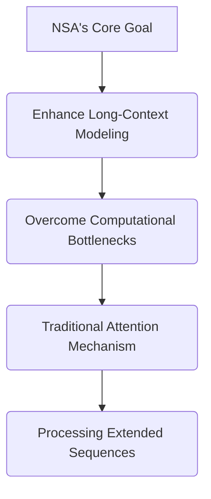
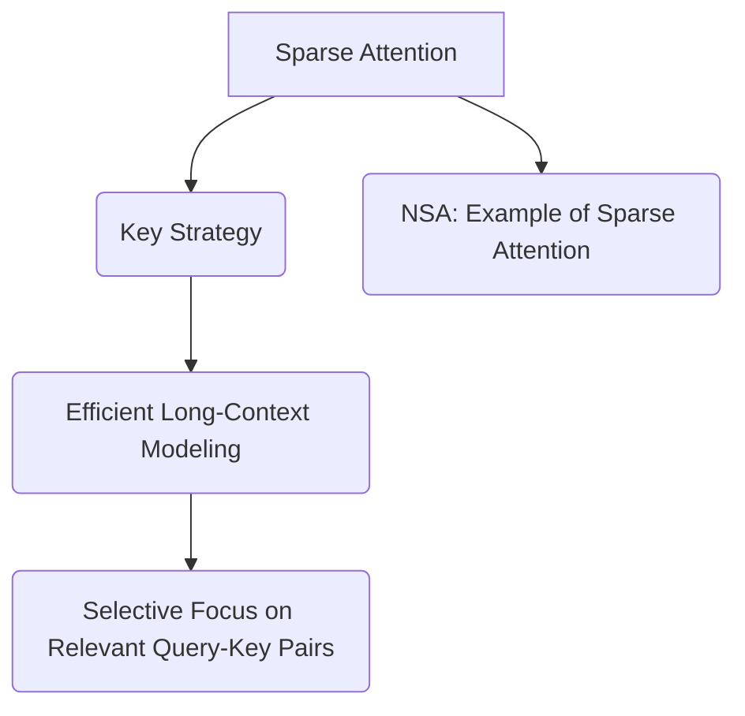
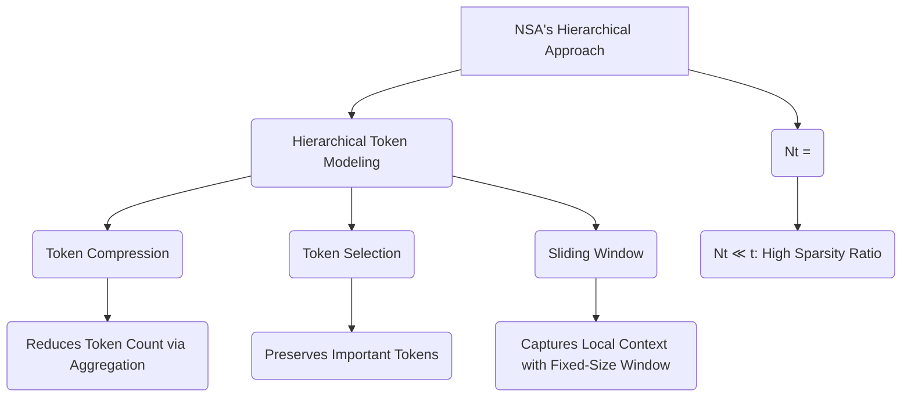
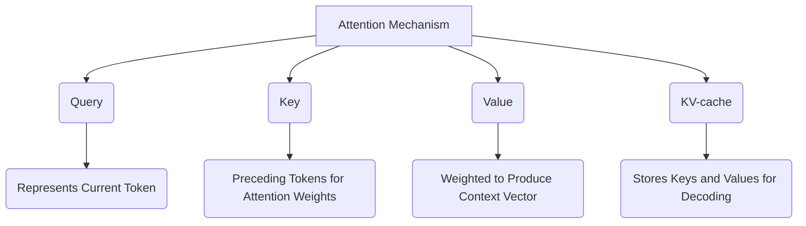
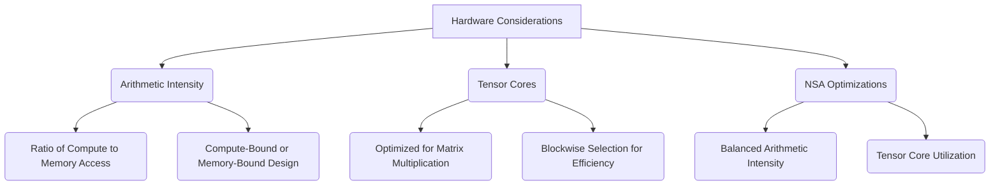
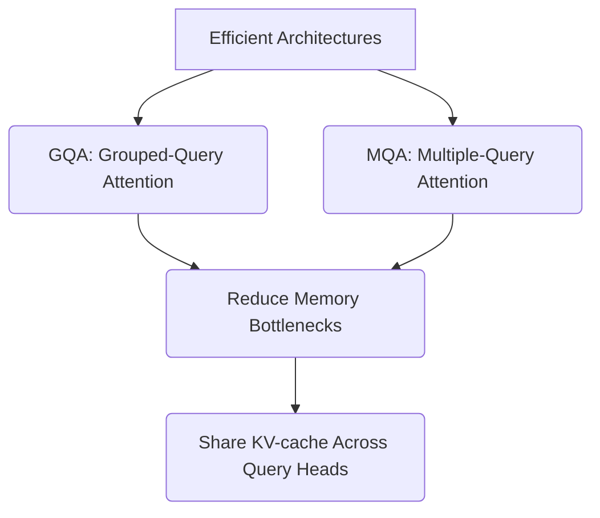
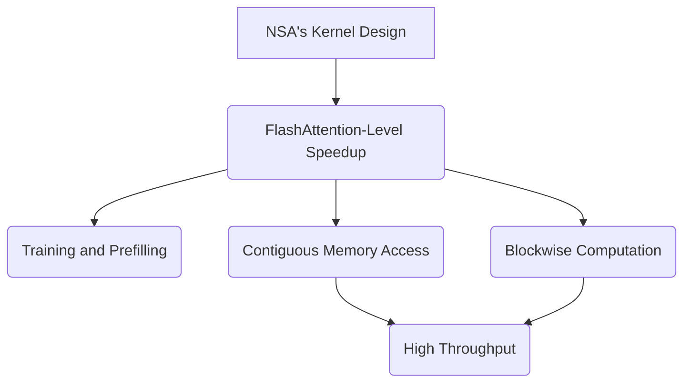
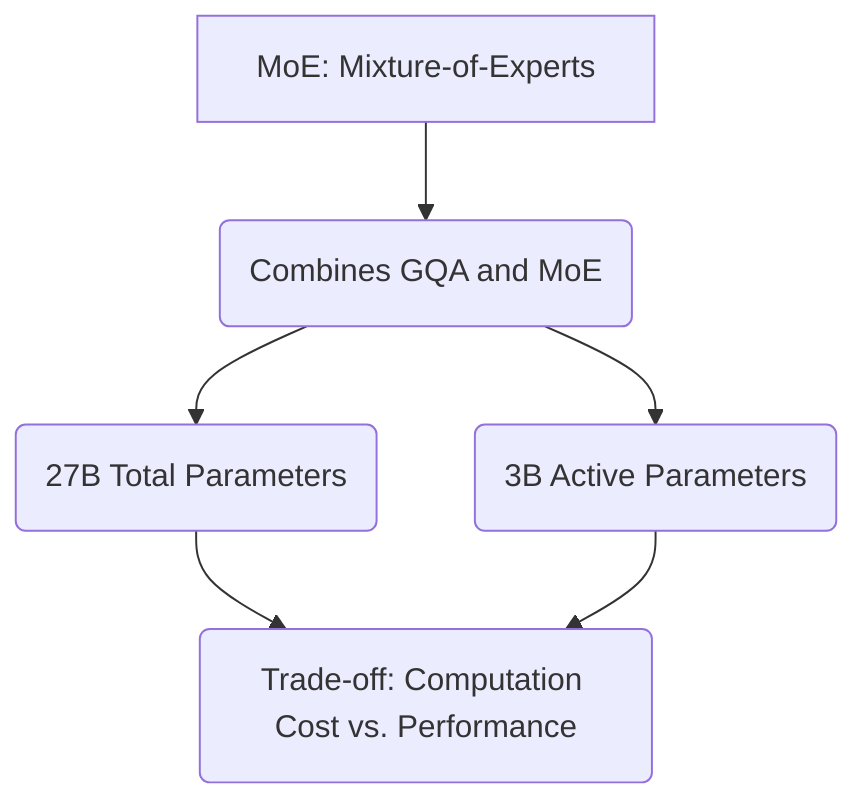
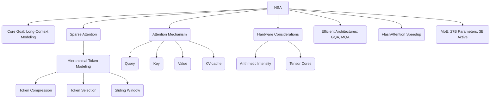

Below is the content translated into **Mermaid** format, with each section represented as a separate Mermaid module (graph). I’ll use a combination of flowcharts (`graph TD`) to represent relationships and hierarchies clearly.

---

### 1. NSA's Core Goal

---

### 2. Sparse Attention as a Solution

---

### 3. NSA's Hierarchical Approach

---

### 4. Attention Mechanism Components

---

### 5. Hardware Considerations

---

### 6. Efficient Architectures

---

### 7. Relationship to FlashAttention

---

### 8. MoE (Mixture-of-Experts)

---

### Combined Overview (Optional)
If you'd like a single diagram combining all sections, here’s a simplified version:

Let me know if you want adjustments or further refinements! Each module is self-contained as requested, and I’ve kept the structure logical and hierarchical using Mermaid syntax.