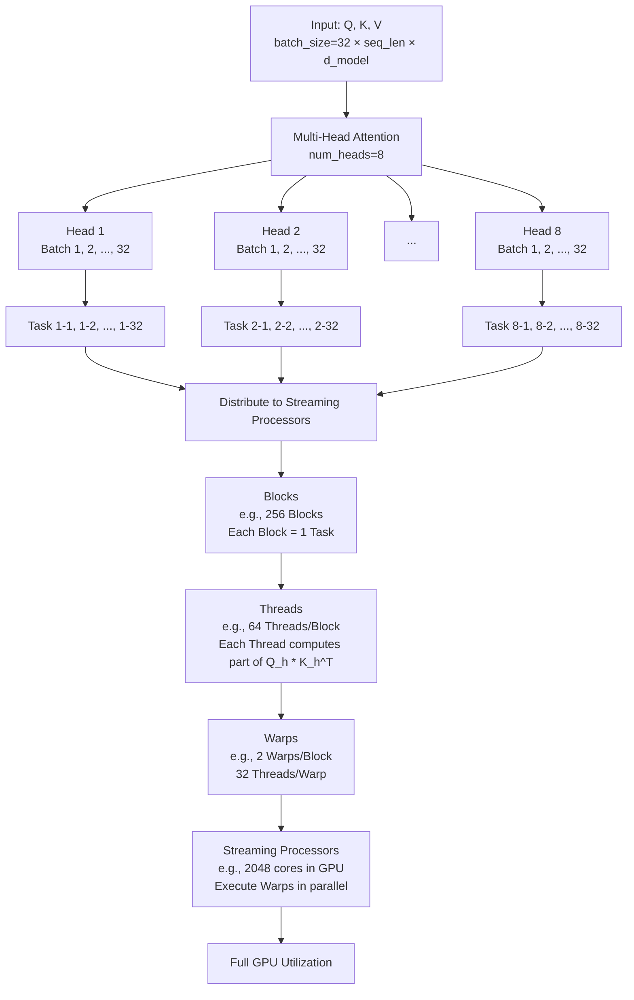

## CUDA 线程层次结构

在 GPU 计算中，“Distribution across streaming processors” 指的是将任务分配到 GPU 的流处理器（Streaming Processors）上，而这种分配具体是通过 CUDA 的线程层次结构实现的，包括 **Blocks（线程块）**、**Threads（线程）** 和 **Warps（线程束）**。我将详细解释这些概念，并基于上一个问题中的 Mermaid 图表展开“Distribution across streaming processors”这一部分，展示多头注意力任务如何映射到这些层次。

---

### CUDA 线程层次结构

1. **Blocks（线程块）**：
   - 线程块是 GPU 上的一组线程，通常包含 32 到 1024 个线程（具体数量可配置）。
   - 每个线程块被调度到一个 **Streaming Multiprocessor (SM)** 上，SM 包含多个流处理器。
   - 线程块内的线程可以共享 **Shared Memory** 并同步执行。

2. **Threads（线程）**：
   - 线程是线程块中的最小执行单元，每个线程运行相同的代码（内核函数），但处理不同的数据（SIMT 架构：Single Instruction, Multiple Threads）。
   - 线程数量由程序员定义，通常与任务的并行粒度相关。

3. **Warps（线程束）**：
   - Warp 是 GPU 执行的基本单位，通常包含 32 个线程（NVIDIA GPU 的固定大小）。
   - 一个线程块被分成多个 Warps，Warps 在流处理器上并行执行。
   - 所有线程在一个 Warp 中同步执行相同的指令，若发生分支（例如 if-else），可能导致性能下降（Warp Divergence）。

4. **Streaming Processors（流处理器）**：
   - 流处理器是 SM 内的核心计算单元，负责执行线程的数学运算（如加法、乘法）。
   - 一个 SM 包含多个流处理器（数量因 GPU 架构而异，例如 NVIDIA A100 的 SM 有 64 个 FP32 流处理器）。

---

### 多头注意力中的任务分配
在多头注意力中，任务（例如每个头的注意力计算或批次中的样本计算）需要分布到流处理器上。以下是如何将 **Sufficient attention heads + large enough batch size** 的任务映射到 Blocks、Threads 和 Warps：

1. **任务分解**：
   - 假设 `num_heads = 8`，`batch_size = 32`，总共有 `8 * 32 = 256` 个独立任务（每个头处理一个批次样本）。
   - 每个任务包括计算 `Q_h * K_h^T`、缩放、Softmax 和 `V_h` 相乘。

2. **分配到 Blocks**：
   - 每个线程块可以负责一个头的计算，或者一个批次样本的计算。
   - 例如：
     - 分配方式 1：一个线程块处理一个头的所有批次样本（8 个 Blocks，每个 Block 处理 32 个样本）。
     - 分配方式 2：一个线程块处理一个批次样本的一个头（256 个 Blocks，每个 Block 处理一个任务）。
   - Blocks 被调度到多个 SM 上并行执行。

3. **分配到 Threads**：
   - 线程块内的线程进一步分解任务。例如，若一个线程块处理 `Q_h * K_h^T`（矩阵乘法），每个线程可以计算矩阵的一个元素。
   - 假设 `seq_len = 64`，得分矩阵形状为 `(64, 64)`，一个线程块可能有 64 个线程，每个线程计算一行的一部分。

4. **组织成 Warps**：
   - 一个线程块（如 64 个线程）被分成 2 个 Warps（每个 Warp 32 个线程）。
   - Warps 在流处理器上并行执行，例如 Warp 1 计算得分矩阵的前 32 个元素，Warp 2 计算后 32 个元素。

5. **流处理器执行**：
   - 每个 SM 的流处理器执行 Warps 中的指令。例如，若 SM 有 64 个流处理器，一个 Warp 的 32 个线程可以同时运行，多个 Warps 交替执行。

---

### 展开后的详细解释
- **Blocks**：将 256 个任务分成多个线程块（例如 8 个 Blocks，每个 Block 负责一个头的 32 个样本）。每个 Block 被分配到一个 SM。
- **Threads**：每个 Block 内的线程处理具体的计算。例如，计算 `Q_h * K_h^T` 时，64 个线程并行计算 64 行的得分。
- **Warps**：线程被分组为 32 个一组的 Warps。例如，一个 64 线程的 Block 有 2 个 Warps，流处理器以 Warp 为单位执行。

#### GPU 利用率
- 若 GPU 有 16 个 SM，每个 SM 处理 1 个 Block，则 8 个 Blocks 只能占用一半 SM。
- 若分成 256 个 Blocks，每个 Block 处理一个任务，则可以更均匀地分布到所有 SM 和流处理器，实现更高的占用率。

---

### Mermaid 图表展开
以下是基于上一个图表展开“Distribution across streaming processors”的详细版本：

---

### 举例说明
- **配置**：`num_heads = 8`, `batch_size = 32`, `seq_len = 64`, GPU 有 2048 个流处理器。
- **任务**：256 个任务（8 头 × 32 批次）。
- **Blocks**：256 个线程块，每个 Block 处理一个任务。
- **Threads**：每个 Block 有 64 个线程，计算 `(64, 64)` 的得分矩阵。
- **Warps**：64 个线程分成 2 个 Warps，每个 Warp 32 个线程。
- **流处理器**：256 个 Blocks × 2 Warps = 512 个 Warps，流处理器并行执行这些 Warps。

---

### 总结
- **Blocks**：将任务分组，分配到 SM。
- **Threads**：块内的线程处理具体计算。
- **Warps**：线程束是流处理器的执行单位。
- 足够的头数和批次大小生成大量任务，通过 Blocks、Threads 和 Warps 分布到流处理器，最终实现 GPU 的充分利用。

如果需要更具体的 CUDA 实现细节或优化建议，请告诉我，我可以进一步扩展！