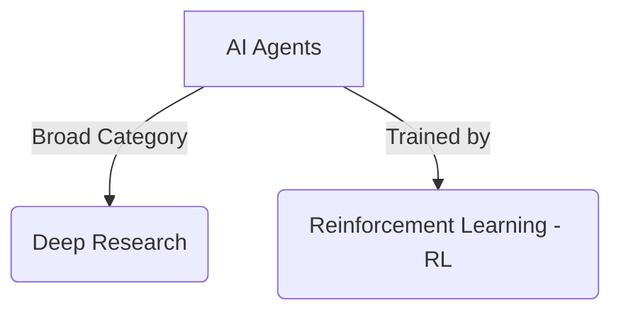
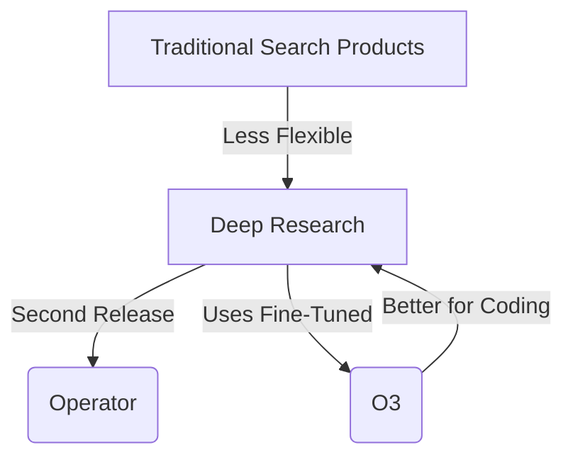
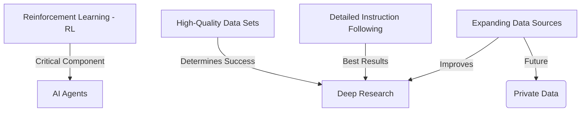
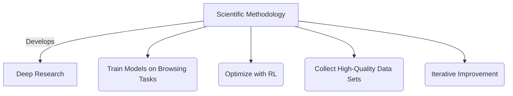
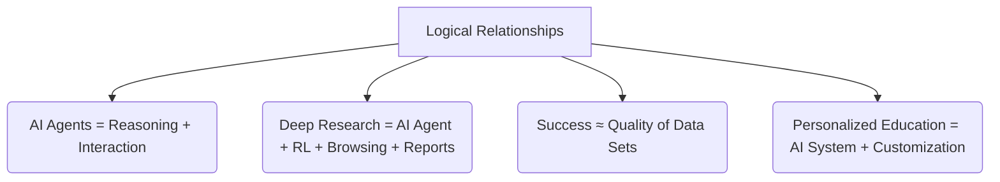
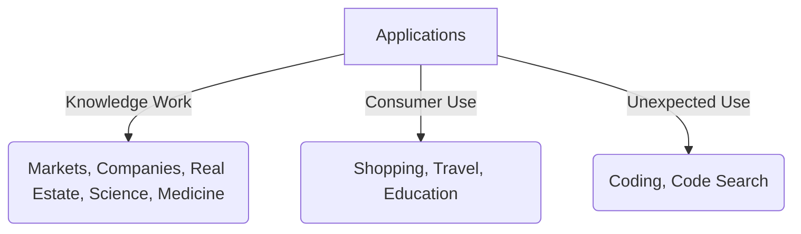
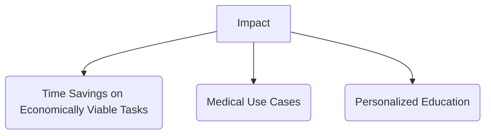

# OpenAI’s Deep Research Team on Why Reinforcement Learning is the Future for AI Agents

### 1. Definitions and Classifications

---

### 2. Comparisons

---

### 3. Causality

---

### 4. Scientific Methodology

---

### 5. Logical Relationships

---

### 6. Applications and Use Cases

---

### 7. Impact and Implications

