# OpenAI’s Deep Research Team on Why Reinforcement Learning is the Future for AI Agents

---

### 1. AI Agents and Reinforcement Learning
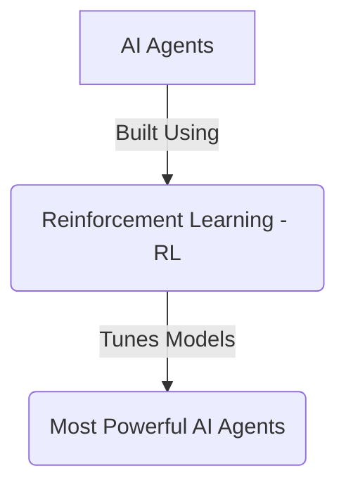

---

### 2. Deep Research as an AI Agent
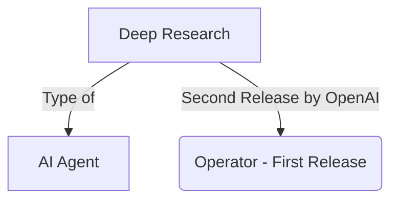

---

### 3. Training of Deep Research
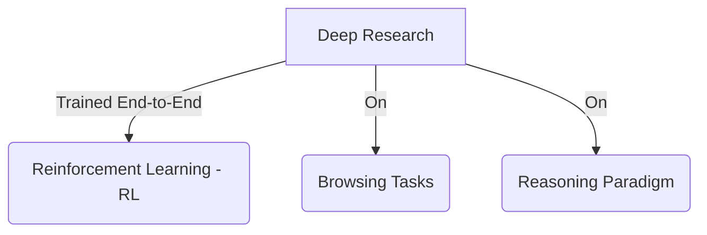

---

### 4. Models Powering Deep Research
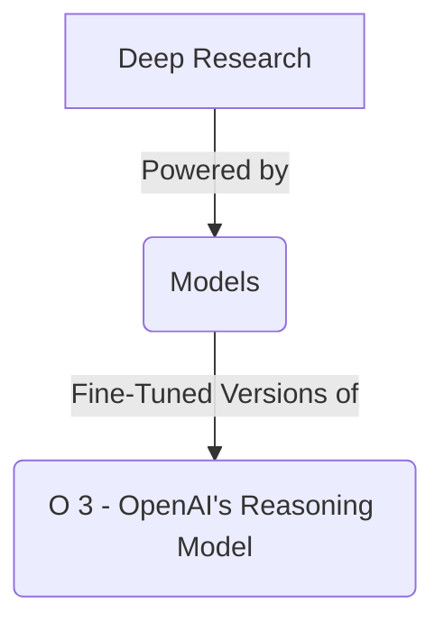

---

### 5. Knowledge Work Applications
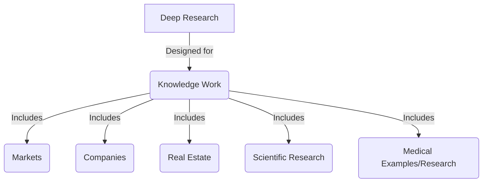

---

### 6. Consumer Use Cases
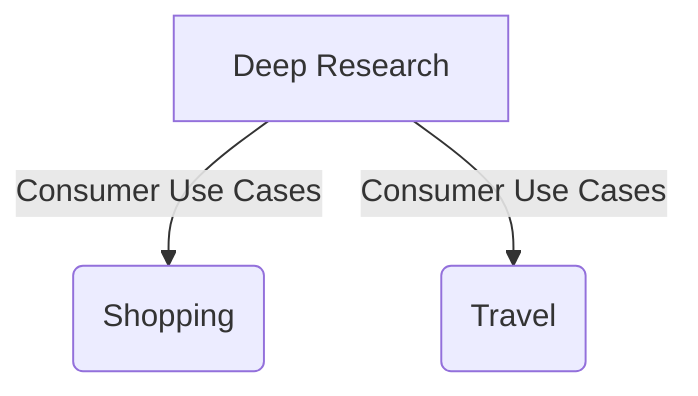

---

### 7. Coding Use Cases
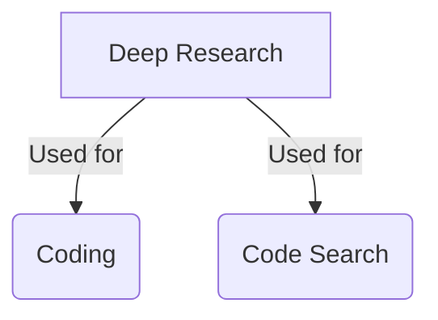

---

### 8. Instruction Following and Citations
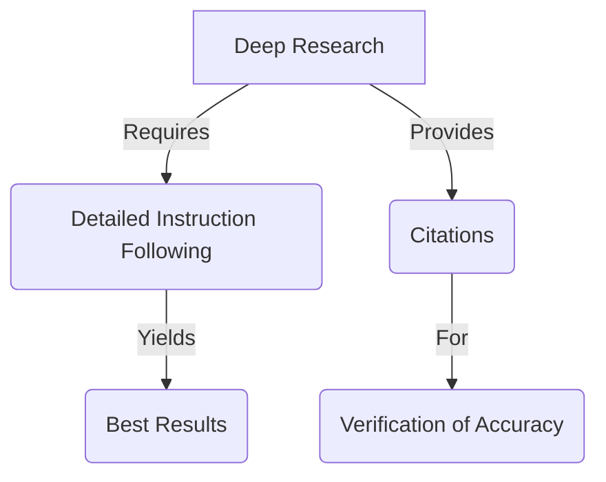

---

### 9. Personalized Education
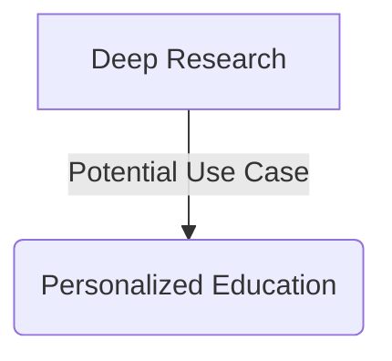

---

### 10. Data Sets and Clarification Flow
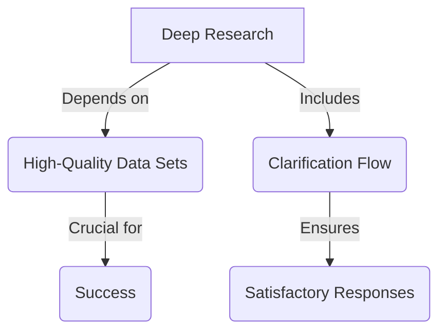

---

### 11. Future Development
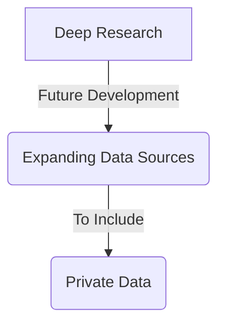

---

### 12. Economic Impact and Medical Assistance
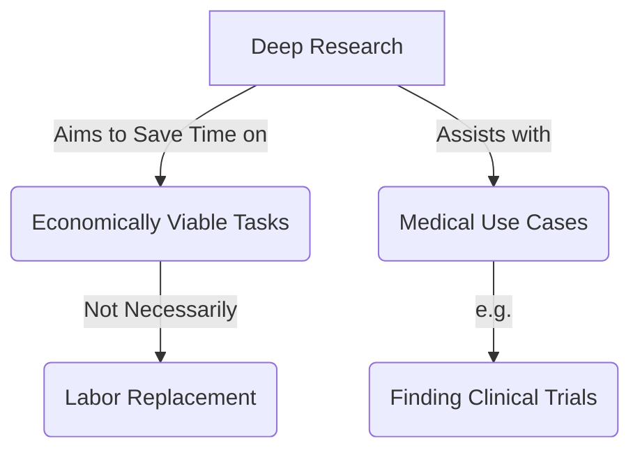

---

### 13. Model Tuning with RL
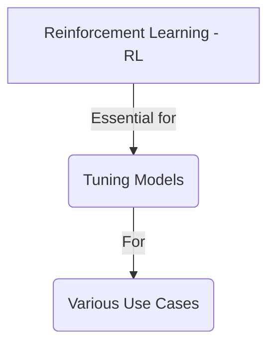

---

### 14. Detailed Descriptions and Internet Reading
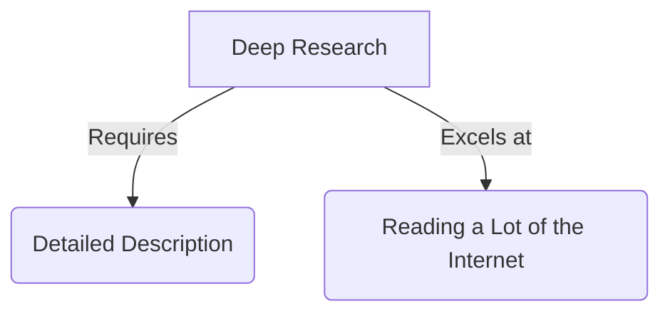

---

### 15. Model Capabilities
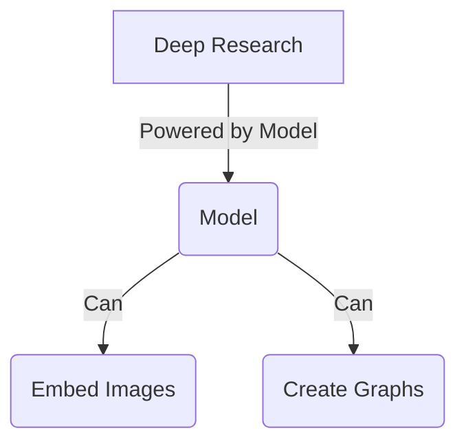

---

### 16. Real-Time Access and Chain of Thought
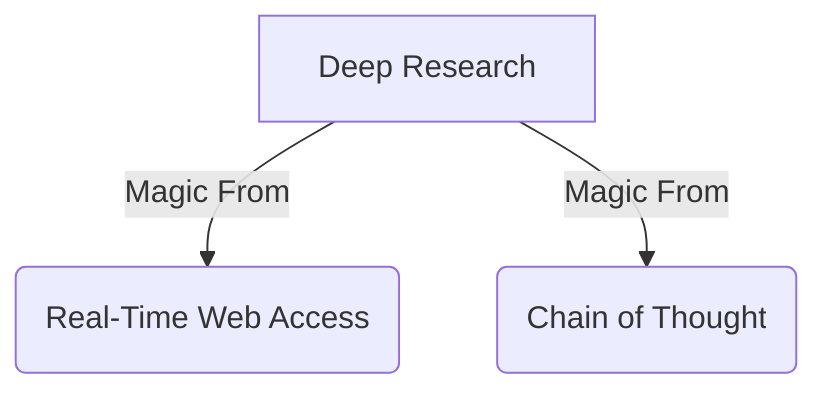

---

### Instructions:
- **Rendering**: Copy each code block into a Mermaid-compatible tool (e.g., `mermaid.live`) to generate a separate image for each subgraph.
- **Node Labels**: I’ve kept node labels consistent where applicable (e.g., "D" for "Deep Research"), as each block is independent and won’t conflict when rendered separately.
- **Purpose**: Each subgraph focuses on a specific aspect of Deep Research, making it easy to visualize individual components of the system.

Let me know if you’d like any subgraphs combined, expanded, or modified further!