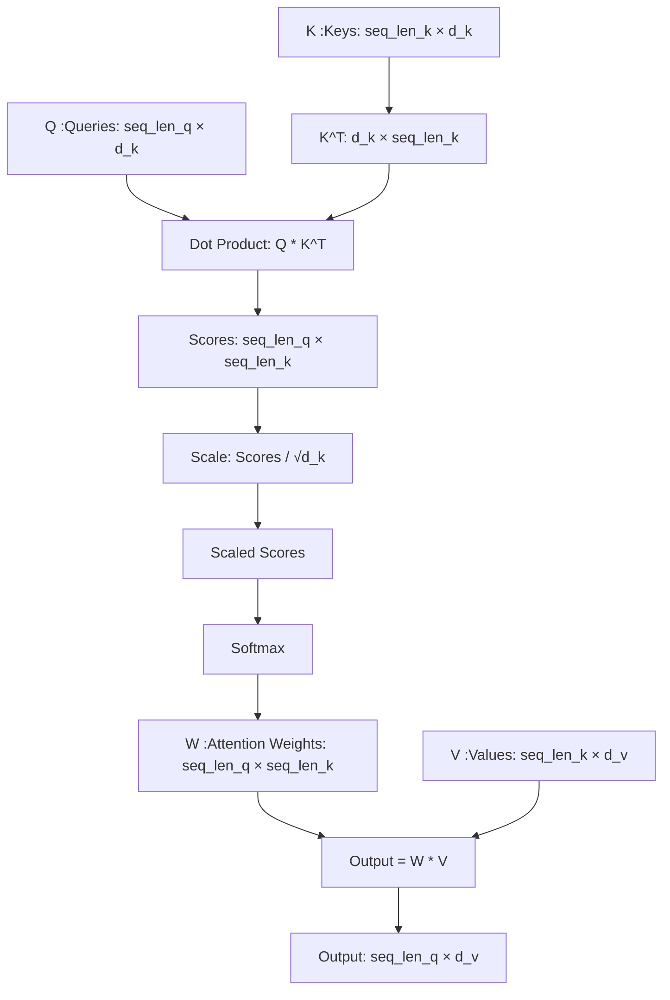
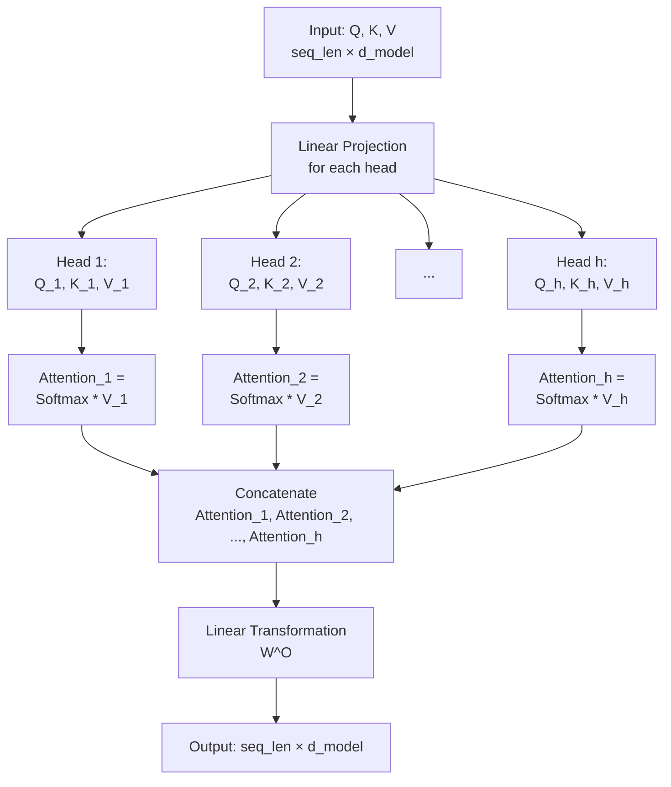
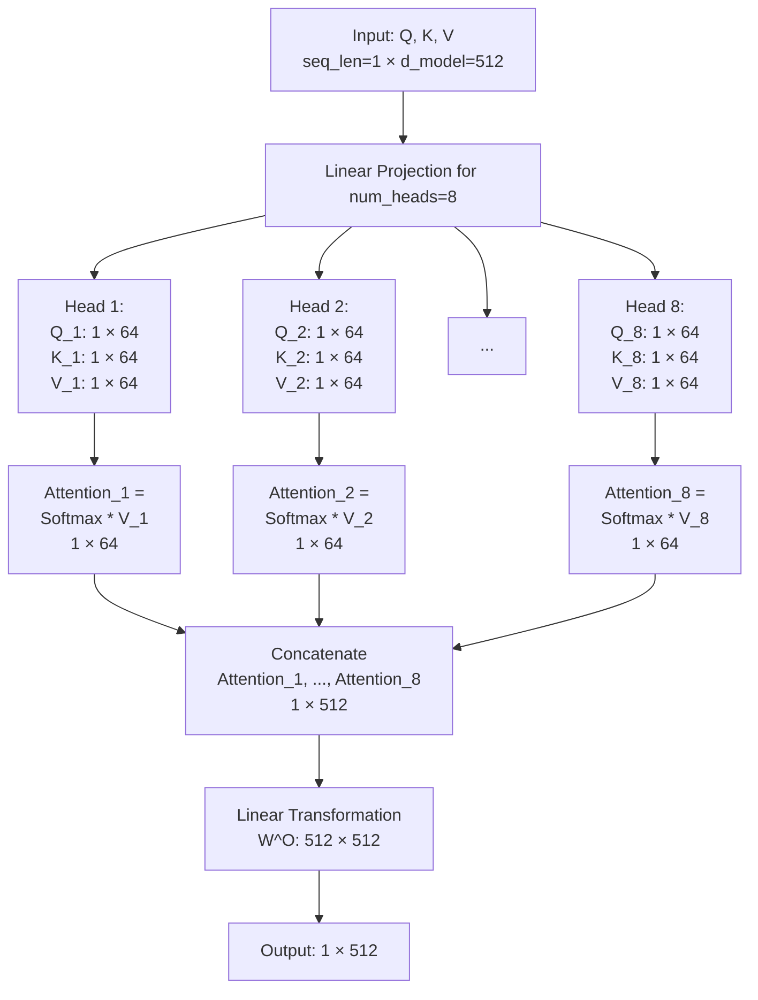
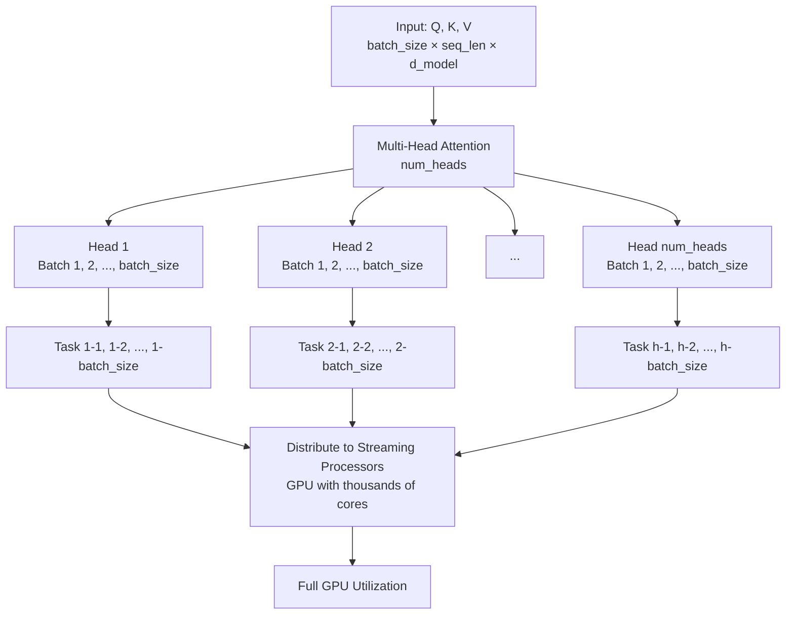

## Attention Mechanism

在注意力机制（Attention Mechanism）中，**Q**（查询，Queries）、**K**（键，Keys）和**V**（值，Values）是核心组件，而注意力权重（Attention Weights，通常记为 **W** 或在公式中隐含表示为概率分布 **P**）是通过 **Q** 和 **K** 的计算得出的。下面我将详细解释如何从 **Q** 和 **K** 计算出注意力权重，并用 Mermaid 图表辅助说明。

---

### 计算过程

1. **输入表示**：
   - **Q** 是查询矩阵，形状为 `(seq_len_q, d_k)`，其中 `seq_len_q` 是查询序列长度，`d_k` 是每个查询向量的维度。
   - **K** 是键矩阵，形状为 `(seq_len_k, d_k)`，其中 `seq_len_k` 是键序列长度，通常与值的序列长度相同。
   - **V** 是值矩阵，形状为 `(seq_len_k, d_v)`，`d_v` 是值向量的维度。

2. **计算相似度（得分）**：
   - 注意力机制通过计算 **Q** 和 **K** 之间的相似度来决定每个查询对每个键的关注程度。
   - 通常使用**点积（Dot Product）**：
     ```
     Scores = Q * K^T
     ```
     - 这里，`K^T` 是 **K** 的转置，形状为 `(d_k, seq_len_k)`。
     - 结果 **Scores** 是一个形状为 `(seq_len_q, seq_len_k)` 的矩阵，表示每个查询与每个键之间的原始相似度得分。

3. **缩放（Scaling）**：
   - 为了防止点积结果过大（尤其在高维情况下会导致数值不稳定），对得分进行缩放：
     ```
     Scaled Scores = Scores / √d_k
     ```
     - `√d_k` 是键向量维度的平方根，作为缩放因子（Scaling Factor），这是 Transformer 模型中常用的技巧。

4. **Softmax 归一化**：
   - 将缩放后的得分通过 **Softmax** 函数转换为概率分布，即注意力权重 **W**：
     ```
     W = Softmax(Scaled Scores)
     ```
     - Softmax 沿着每一行（对应每个查询）操作，确保每行的权重和为 1。
     - **W** 的形状仍是 `(seq_len_q, seq_len_k)`，表示每个查询对所有键的关注分布。

5. **输出计算**：
   - 注意力权重 **W** 再与 **V** 相乘，得到最终的注意力输出：
     ```
     Output = W * V
     ```
     - 输出形状为 `(seq_len_q, d_v)`，表示每个查询对应的加权值。

---

### Mermaid 图表表示
以下是一个 Mermaid 图表，清晰展示从 **Q** 和 **K** 计算注意力权重 **W** 的过程：



---

### 解释
- **Q * K^T**：计算查询和键之间的相似度，生成原始得分矩阵。
- **缩放**：通过除以 `√d_k`，防止得分过大，提升数值稳定性。
- **Softmax**：将得分转换为概率分布，形成注意力权重 **W**。
- **作用**：**W** 表示每个查询对键的关注程度，用于加权求和 **V**。

---

### 数学公式总结
注意力权重的计算可以总结为：
```
W = Softmax((Q * K^T) / √d_k)
```
其中：
- `Q * K^T` 是点积操作。
- `/ √d_k` 是缩放。
- `Softmax` 是归一化。


## Multi-Head Attention, MHA

在注意力机制中，**多头注意力（Multi-Head Attention, MHA）**是 Transformer 模型中的一个关键创新，它通过并行执行多个注意力“头”（Heads）来增强模型的表达能力和计算效率。我将详细解释“多头”的概念及其意义，并用 Mermaid 图表辅助说明。

---

### 什么是“多头”？
- **单头注意力**：标准的注意力机制（如前述的 Q、K、V 计算）只执行一次注意力计算，生成一个注意力输出。这种方式关注的是输入的单一表示。
- **多头注意力**：将单头注意力扩展为多个并行的“头”，每个头独立执行注意力计算。每个头关注输入的不同子空间（Subspace），最后将所有头的输出拼接或组合起来。
  - 具体来说，输入的 **Q**、**K**、**V** 矩阵会被分成多个较小的子矩阵，每个子矩阵对应一个头。
  - 每个头有自己的线性变换参数（W^Q、W^K、W^V），因此关注不同的特征。

#### 计算过程
1. **线性投影**：
   - 输入的 **Q**、**K**、**V**（假设维度为 `seq_len × d_model`）通过线性层投影到多个头的子空间：
     ```
     Q_h = Q * W^Q_h, K_h = K * W^K_h, V_h = V * W^V_h
     ```
     - 每个头的投影矩阵 `W^Q_h`、`W^K_h`、`W^V_h` 形状为 `(d_model, d_k)`，`d_k = d_model / num_heads`。
     - `num_heads` 是头的数量，例如 8 或 16。

2. **并行注意力**：
   - 对每个头独立计算注意力：
     ```
     Attention_h = Softmax((Q_h * K_h^T) / √d_k) * V_h
     ```
     - 每个头的输出形状为 `(seq_len, d_v)`，`d_v` 通常等于 `d_k`。

3. **拼接与线性变换**：
   - 将所有头的输出拼接起来：
     ```
     MultiHeadOutput = Concat(Attention_1, Attention_2, ..., Attention_h)
     ```
     - 拼接后的形状为 `(seq_len, d_model)`。
   - 再通过一个线性层 `W^O`（形状 `(d_model, d_model)`）投影：
     ```
     Output = MultiHeadOutput * W^O
     ```

---

### 多头的意义
多头注意力的设计有以下重要意义：

1. **捕获多样化的表示（Representational Diversity）**：
   - 每个头可以关注输入的不同方面（例如句法、语义、上下文关系等），从而捕获更丰富的特征。
   - 例如，在自然语言处理中，一个头可能关注主语-谓语关系，另一个头关注修饰词。

2. **增强模型容量**：
   - 通过多个头并行计算，模型能够学习更复杂的模式，而不仅仅依赖单一的注意力分布。

3. **提升鲁棒性**：
   - 多头机制降低了模型对单一注意力分布的依赖，即使某些头表现不佳，其他头仍能提供有用的信息。

4. **计算效率与并行化**：
   - 每个头的维度 `d_k` 比原始 `d_model` 小（`d_k = d_model / num_heads`），计算量被分散到多个小规模运算中。
   - 在 GPU 上，这些头的计算可以完全并行，充分利用硬件资源。

5. **类比二维卷积**：
   - 多头注意力类似于卷积神经网络中的多通道卷积，每个头相当于一个独立的“通道”，从不同角度提取特征。

---

### Mermaid 图表表示
以下是一个 Mermaid 图表，展示多头注意力的结构和工作流程：



---

### 举例说明
假设输入维度 `d_model = 512`，头的数量 `num_heads = 8`：
- 每个头的维度 `d_k = d_v = 512 / 8 = 64`。
- 每个头独立计算一个 64 维的注意力输出。
- 最后拼接成 512 维向量，经过线性变换生成最终输出。

#### 意义示例
在一句话“我喜欢跑步”中：
- 头 1 可能关注“喜欢”和“跑步”的关系。
- 头 2 可能关注“我”和“喜欢”的主语-动词关系。
- 多头结合后，模型能更全面地理解句子。

---

### 总结
- **多头**指的是将注意力机制分成多个并行的小型注意力计算单元（头），每个头处理输入的不同子空间。
- **意义**在于提升表示多样性、模型容量、鲁棒性和计算效率，使注意力机制更强大、更灵活。

如果需要更深入的数学推导或代码实现，请告诉我，我可以进一步扩展！

## 切分的基本原理

在多头注意力（Multi-Head Attention, MHA）中，输入的 **Q**（查询）、**K**（键）和 **V**（值）矩阵的分割与序列长度（`seq_len`）无关，而是基于模型的嵌入维度（`d_model`）进行的。即使输入的序列长度很短（例如 `seq_len = 1`），分割依然可以正常进行，因为分割发生在特征维度（`d_model`）上，而不是序列维度（`seq_len`）上。以下我将详细解释如何处理短序列长度的情况，以及如何切分 **Q**、**K**、**V** 为多头，并用 Mermaid 图表说明。

---

### 切分的基本原理
- **输入矩阵**：
  - **Q**：`(seq_len_q, d_model)`
  - **K**：`(seq_len_k, d_model)`
  - **V**：`(seq_len_k, d_model)`
  - `seq_len_q` 和 `seq_len_k` 是序列长度，可能很短（例如 1 或 2）；`d_model` 是固定的嵌入维度（例如 512）。
- **多头切分**：
  - 将 `d_model` 维度分割为 `num_heads` 个子空间，每个头的维度为 `d_k = d_model / num_heads`。
  - 切分是通过线性投影实现的，而不是直接对矩阵按行或列切块。
- **关键点**：
  - 序列长度（`seq_len`）不影响切分，只要 `d_model` 足够大且能被 `num_heads` 整除，切分就可行。

#### 短序列的情况
- 如果 `seq_len_q` 或 `seq_len_k` 很小（例如 1），矩阵的形状仍然是 `(1, d_model)`，切分仍然基于 `d_model` 维度。
- 分割后，每个头的子矩阵形状变为 `(seq_len_q, d_k)`，只是序列维度变小，计算逻辑不变。

---

### 切分过程

1. **线性投影**：
   - 输入矩阵通过线性变换投影到每个头的子空间：
     ```
     Q_h = Q * W^Q_h, K_h = K * W^K_h, V_h = V * W^V_h
     ```
     - `W^Q_h`、`W^K_h`、`W^V_h` 是每个头的投影矩阵，形状为 `(d_model, d_k)`。
     - 例如，若 `d_model = 512`，`num_heads = 8`，则 `d_k = 64`，每个投影矩阵将 `d_model` 降维到 `d_k`。
   - 输出：
     - `Q_h`：`(seq_len_q, d_k)`
     - `K_h`：`(seq_len_k, d_k)`
     - `V_h`：`(seq_len_k, d_v)`（通常 `d_v = d_k`）。

2. **短序列示例**：
   - 假设 `seq_len_q = 1`, `seq_len_k = 1`, `d_model = 512`, `num_heads = 8`：
     - 输入 **Q**：`(1, 512)`。
     - 投影到 Head 1：`Q_1 = Q * W^Q_1`，`W^Q_1` 是 `(512, 64)`，结果 `Q_1` 是 `(1, 64)`。
     - 同理，`K_1` 是 `(1, 64)`，`V_1` 是 `(1, 64)`。
     - 每个头得到一个短序列的子矩阵。

3. **注意力计算**：
   - 对于每个头，计算注意力：
     ```
     Attention_h = Softmax((Q_h * K_h^T) / √d_k) * V_h
     ```
     - 即使 `seq_len = 1`，`Q_h * K_h^T` 仍是 `(1, 1)` 的标量，经过 Softmax 后权重为 1，输出仍是 `(1, d_k)`。
   - 所有头的输出拼接后，经过线性变换恢复到 `(seq_len_q, d_model)`。

---

### 如果序列长度不够长会怎样？
- **不影响切分**：切分依赖 `d_model`，与 `seq_len` 无关。只要 `d_model` 是 `num_heads` 的整数倍，切分总是可行的。
- **计算仍然有效**：
  - 短序列只会导致注意力权重矩阵（`Q_h * K_h^T`）的规模变小（例如 `(1, 1)` 或 `(2, 2)`），但计算逻辑不变。
  - 输出维度保持一致：每个头的输出是 `(seq_len_q, d_k)`，拼接后是 `(seq_len_q, d_model)`。
- **潜在问题**：
  - 如果 `seq_len` 太短，模型可能无法捕捉足够的上下文信息，但这是模型设计的问题，而非切分的问题。

#### 极端情况
- 若 `seq_len_q = 1`, `seq_len_k = 1`：
  - 每个头的注意力计算退化为一个标量加权，但多头仍然提供不同子空间的表示，最终拼接后仍能输出完整的 `(1, d_model)`。

---

### Mermaid 图表示短序列切分
以下是一个图表，展示短序列（如 `seq_len = 1`）下 **Q**、**K**、**V** 的切分和计算：



---

### 总结
- **如何切分**：通过线性投影将 `d_model` 维度分割为 `num_heads` 个子空间，每个头的子矩阵形状为 `(seq_len, d_k)`。
- **短序列影响**：序列长度短不会影响切分，只是减少了注意力计算的规模（例如得分矩阵变小），但多头机制依然有效。
- **解决方法**：无需额外调整切分方式，标准多头注意力设计天然适应任意 `seq_len`。

如果需要代码示例或更详细的数学推导（例如矩阵形状变化），请告诉我，我可以进一步扩展！




