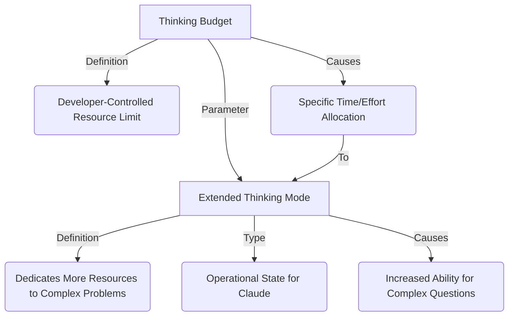
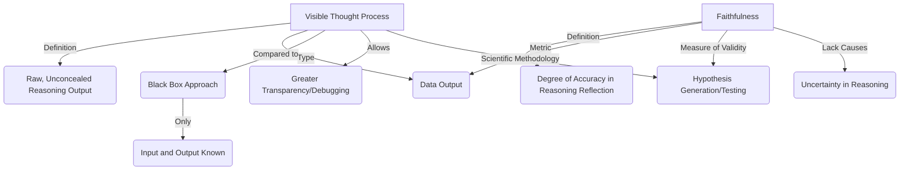
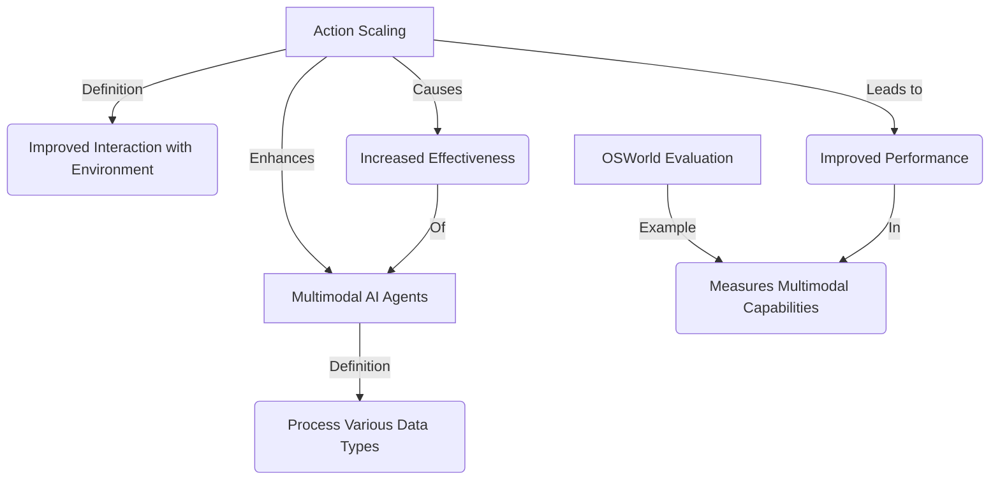
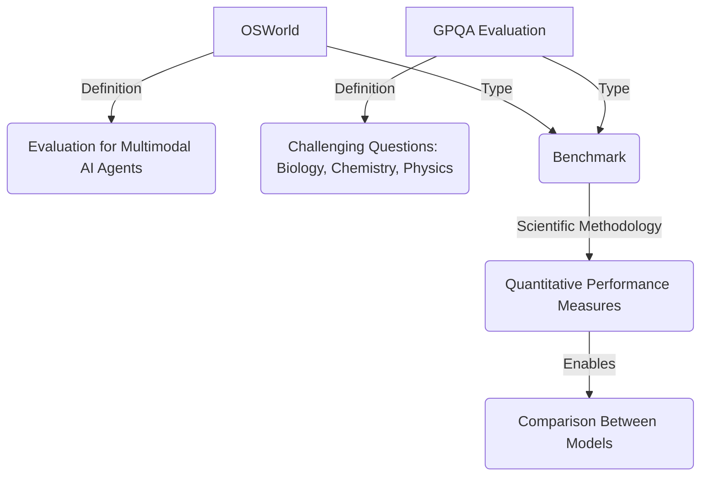
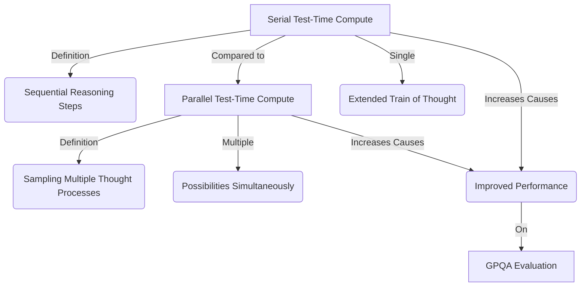
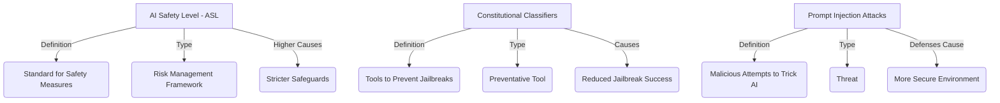

Below are separate Mermaid.js code blocks, each representing a distinct subgraph based on the provided content about Claude's concepts and relationships. Each block is designed to be rendered as an individual image in a Mermaid-compatible editor (e.g., Mermaid Live Editor).

---

### 1. Extended Thinking & Resource Allocation

---

### 2. Introspection & Validation

---

### 3. Agency & Embodiment

---

### 4. Evaluation & Benchmarking

---

### 5. Compute Scaling & Performance

---

### 6. Safety & Security

---

### Instructions:
- **Rendering**: Copy each code block into a Mermaid-compatible tool (e.g., `mermaid.live`) to generate a separate image for each subgraph.
- **Node Labels**: I’ve used unique labels for clarity within each subgraph, with some reused where contextually appropriate (e.g., "A" for "Extended Thinking Mode" in Subgraph 1). Since each block is independent, there’s no conflict when rendered separately.
- **Purpose**: Each subgraph isolates a specific section (Extended Thinking, Introspection, etc.) of the content, providing a clear visual representation of the relationships.

Let me know if you’d like any subgraphs refined, combined, or expanded further!