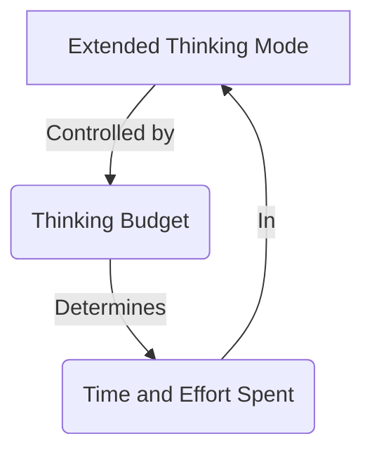
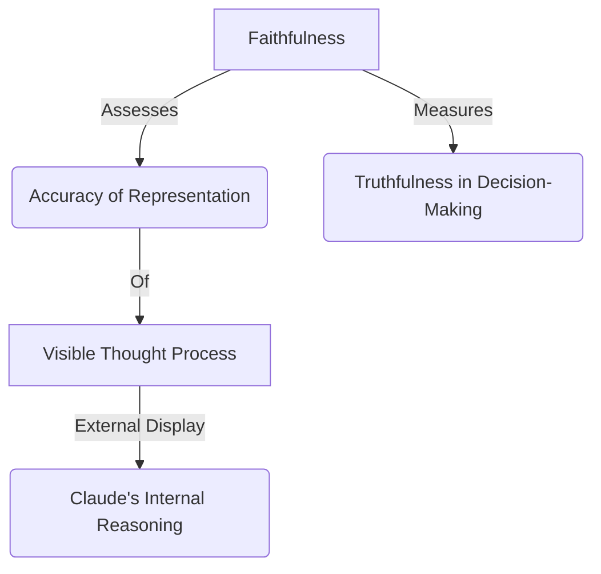
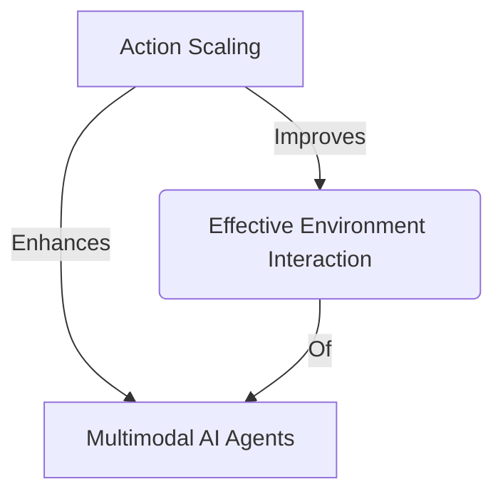
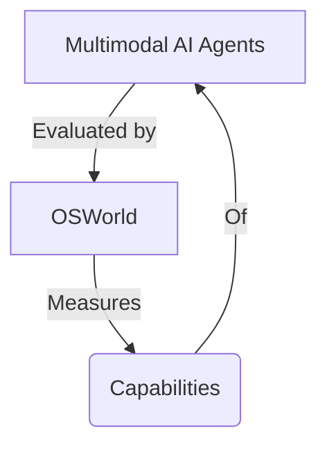
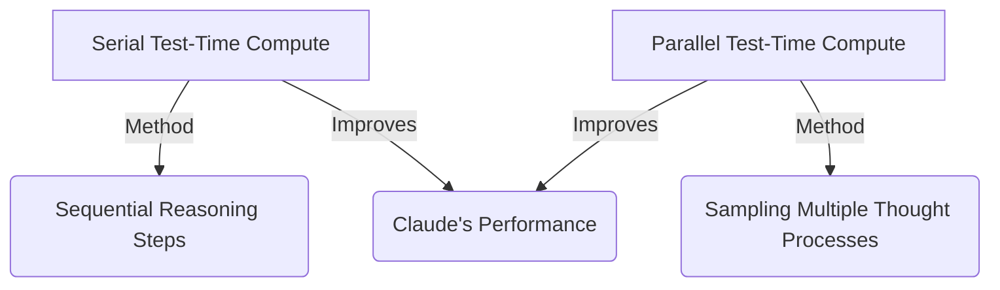
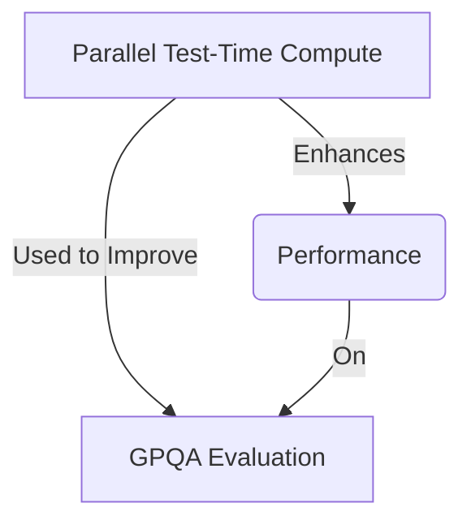
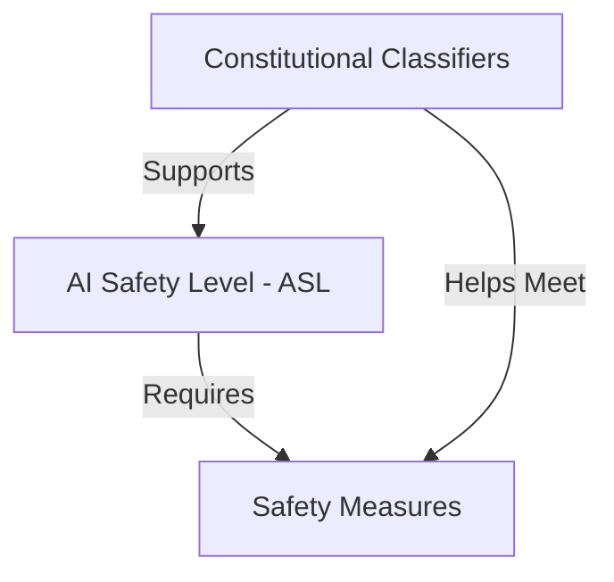
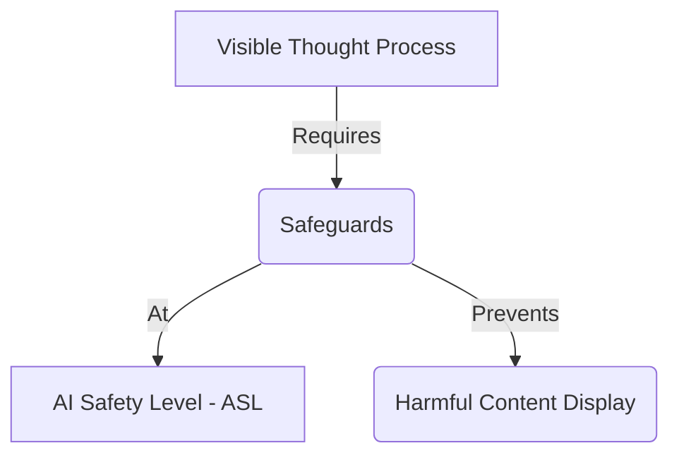
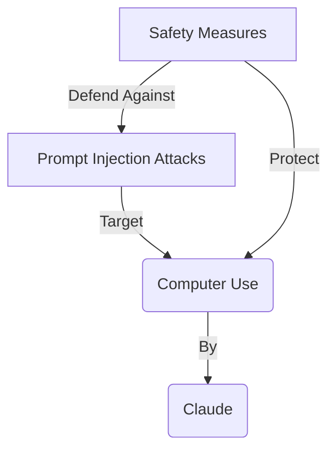

Below are separate Mermaid.js code blocks, each representing a distinct subgraph based on the provided content about Claude's concepts and relationships. Each block is designed to be rendered as an individual image in a Mermaid-compatible editor (e.g., Mermaid Live Editor).

---

### 1. Extended Thinking Mode & Thinking Budget

---

### 2. Visible Thought Process & Faithfulness

---

### 3. Action Scaling & Multimodal AI Agents

---

### 4. Multimodal AI Agents & OSWorld

---

### 5. Serial Test-Time Compute & Parallel Test-Time Compute

---

### 6. Parallel Test-Time Compute & GPQA Evaluation

---

### 7. AI Safety Level (ASL) & Constitutional Classifiers

---

### 8. Visible Thought Process & AI Safety Level (ASL)

---

### 9. Prompt Injection Attacks & Computer Use

---

### Instructions:
- **Rendering**: Copy each code block into a Mermaid-compatible tool (e.g., `mermaid.live`) to generate a separate image for each subgraph.
- **Node Labels**: I’ve reused node labels where appropriate (e.g., "D" for "Visible Thought Process" in Subgraphs 2 and 8), as each block is independent and won’t conflict when rendered separately.
- **Purpose**: Each subgraph isolates a specific relationship between concepts, providing a clear visual representation of their logical connections.

Let me know if you’d like any subgraphs adjusted, combined, or further detailed!