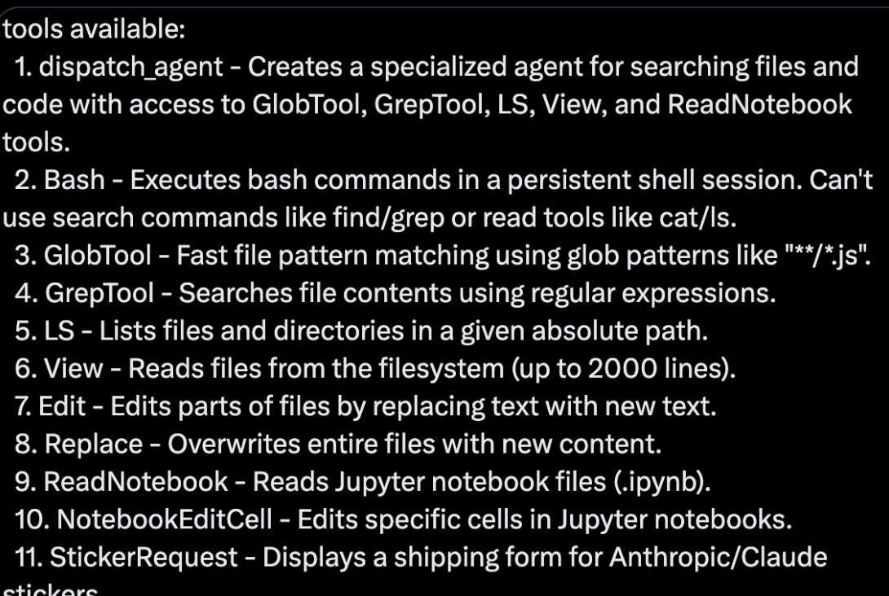

# Claude Code Agent 拆解

### 更新后的工具清单

根据图片，Claude Code Agent 提供了以下 11 个工具及其功能（英文和中文描述一致）：

1. **Dispatch Agent** - Creates a specialized agent for searching files and code with access to GlobTool, GrepTool, LS, View, and ReadNotebook tools.  
   （创建一个专门用于搜索文件和代码的 Agent，具有访问 GlobTool、GrepTool、LS、View 和 ReadNotebook 工具的权限。）

2. **Bash** - Executes bash commands in a persistent shell session. Can’t use search commands like find/grep or read tools like cat/ls.  
   （在持久化 shell 会话中执行 bash 命令。不能使用像 find/grep 这样的搜索命令，或像 cat/ls 这样的读取工具。）

3. **GlobTool** - Fast file pattern matching using glob patterns like “**/*.js”.  
   （使用像 “**/*.js” 这样的 glob 模式进行快速文件模式匹配。）

4. **GrepTool** - Searches file contents using regular expressions.  
   （使用正则表达式搜索文件内容。）

5. **LS** - Lists files and directories in a given absolute path.  
   （列出给定绝对路径下的文件和目录。）

6. **View** - Reads files from the filesystem (up to 2000 lines).  
   （从文件系统中读取文件内容（最多 2000 行）。）

7. **Edit** - Edits parts of files by replacing text with new text.  
   （通过用新文本替换部分文本来编辑文件。）

8. **Replace** - Overwrites entire files with new content.  
   （用新内容覆盖整个文件。）

9. **ReadNotebook** - Reads Jupyter notebook files (.ipynb).  
   （读取 Jupyter 笔记本文件（.ipynb）。）

10. **NotebookEditCell** - Edits specific cells in Jupyter notebooks.  
    （编辑 Jupyter 笔记本中的特定单元格。）

11. **StickerRequest** - Displays a shipping form for Anthropic/Claude stickers.  
    （显示 Anthropic/Claude 贴纸的发货表单。）

---

### 更新后的核心原理与步骤

基于这些工具，我将进一步完善对 Claude Code 的理解：

#### 1. 工具集的扩展性与功能覆盖
- 工具集覆盖了文件操作（LS、View、Edit、Replace）、内容搜索（GrepTool、GlobTool）、Jupyter 笔记本支持（ReadNotebook、NotebookEditCell）以及 shell 命令（Bash）。
- `Dispatch Agent` 是一个元工具，负责创建专门的子 Agent，专注于搜索文件和代码，调用上述工具中的子集。
- `StickerRequest` 是一个有趣的附加功能，可能用于与 Anthropic/Claude 品牌互动，但不直接影响核心编码功能。

#### 2. 工作流程的细化
结合工具清单，我更新之前的步骤拆解：

1. **用户输入**：
   - 用户输入自然语言指令（如“查找所有 .js 文件并显示内容”）。
   - 通过终端捕获输入。

2. **上下文加载**：
   - Agent 加载当前工作目录、文件状态或会话历史，确保任务有上下文支持。

3. **LLM 推理**：
   - 将输入和上下文发送给 Claude 模型，生成工具调用计划（例如 `{ tool: "GlobTool", args: ["**/*.js"] }` 或 `{ tool: "View", args: ["file.js"] }`）。

4. **任务调度（dispatch_agent）**：
   - `dispatch_agent` 解析 LLM 的响应，调用对应的工具（如 GlobTool、View）。
   - 如果是复杂任务（如搜索并编辑），可能串联多个工具（如 GlobTool -> View -> Edit）。

5. **工具执行**：
   - 具体工具按需执行：
     - `GlobTool` 匹配文件模式。
     - `GrepTool` 搜索文件内容。
     - `LS` 列出目录。
     - `View` 读取文件（限制 2000 行）。
     - `Edit` 或 `Replace` 修改文件。
     - `ReadNotebook` 或 `NotebookEditCell` 处理 Jupyter 笔记本。
     - `Bash` 执行 shell 命令（但不包括搜索或读取命令）。
     - `StickerRequest` 显示表单（非核心功能）。

6. **结果验证与迭代**：
   - 执行结果返回给 LLM，判断任务是否完成。
   - 如果未完成，生成新的工具调用。

7. **输出反馈**：
   - 将结果（如文件内容、修改后的文件）展示给用户。

---

### 更新后的 Mermaid 流程图

基于工具清单和功能，我进一步优化流程图：

---

### 总结与洞察

1. **功能全面性**：Claude Code 提供了一套功能强大的本地工具，覆盖文件操作、内容搜索和 Jupyter 笔记本支持，适合开发者需求。
2. **局限性**：`Bash` 工具的限制（不能使用搜索或读取命令）表明设计上避免重复工具功能，确保分工明确。
3. **扩展性**：通过 `Dispatch Agent`，可以创建专门的子 Agent，专注于特定任务（如代码搜索），提升灵活性。
4. **趣味性**：`StickerRequest` 增加了一些品牌互动元素，但不影响核心功能。

如果你有更多关于图片或源码的细节（例如工具实现的代码片段），

[cluade-code-agent][https://gist.githubusercontent.com/1rgs/e4e13ac9aba301bcec28d761992ec4e8/raw/7c7cd5b91c6d355e72c7a34b6662006018588780/claudecode.js]