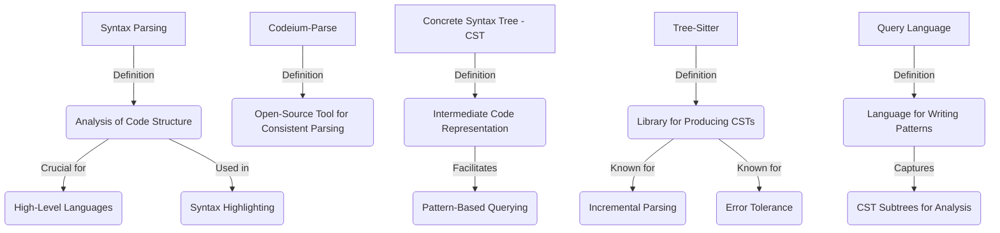
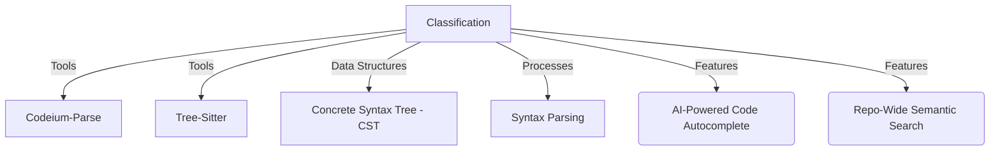
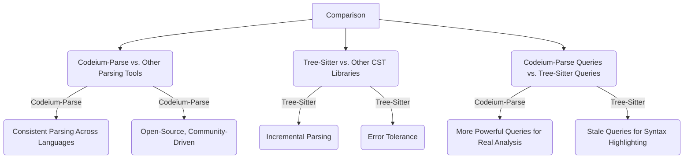
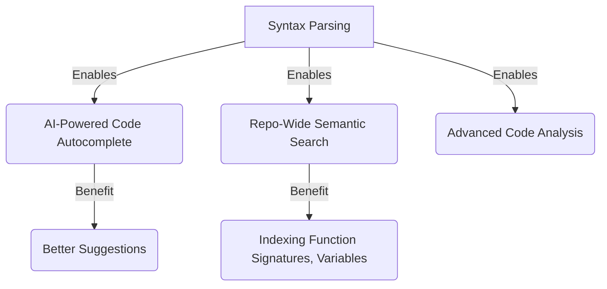
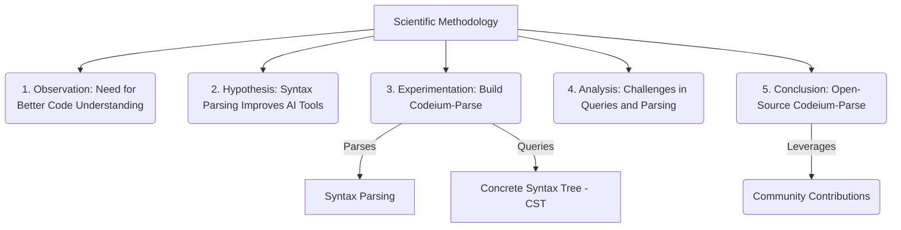
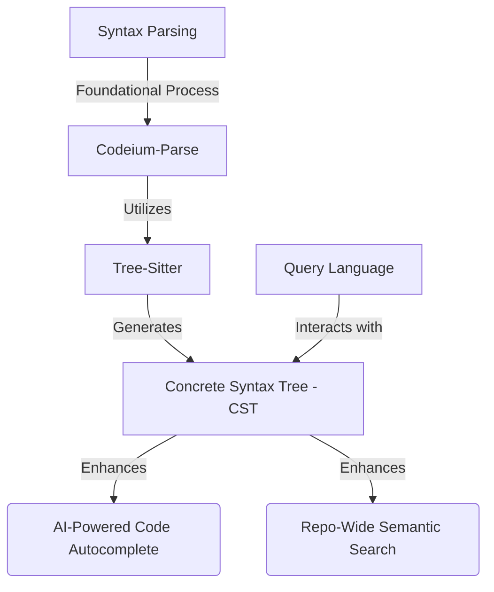

# code assistant

Below are separate Mermaid.js code blocks, each representing a distinct subgraph based on the provided breakdown of concepts related to **Syntax Parsing**, **Codeium-Parse**, and associated tools/processes. Each block is designed to be rendered as an individual image in a Mermaid-compatible editor (e.g., Mermaid Live Editor).

---

### 1. Definitions

---

### 2. Classification

---

### 3. Comparison

---

### 4. Causation (Why Syntax Parsing is Needed)

---

### 5. Scientific Methodology

---

### 6. Overall Process

---

### Instructions:
- **Rendering**: Copy each code block into a Mermaid-compatible tool (e.g., `mermaid.live`) to generate a separate image for each subgraph.
- **Node Labels**: I’ve reused node labels (e.g., "A" for "Syntax Parsing") where appropriate, as each block is independent and won’t conflict when rendered separately.
- **Purpose**: Each subgraph isolates a specific aspect (Definitions, Classification, etc.) of the breakdown, making it easy to visualize individual components.

Let me know if you’d like adjustments, such as combining subgraphs or refining specific relationships!