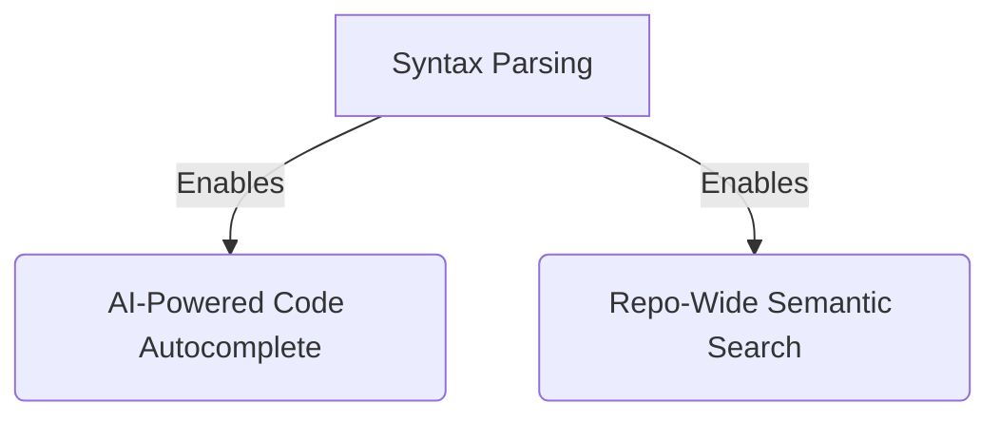
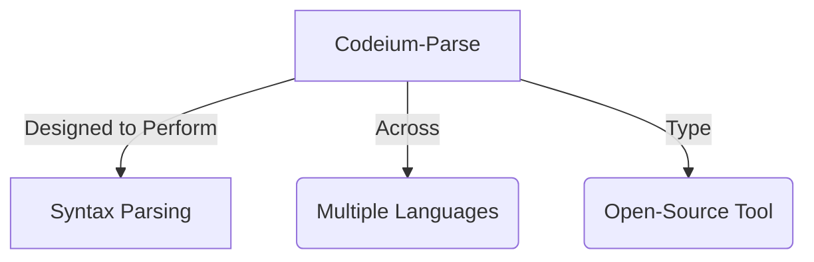
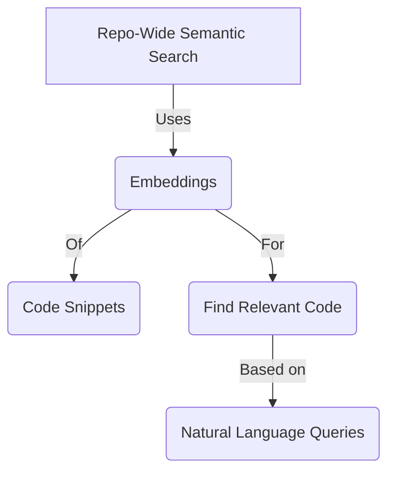
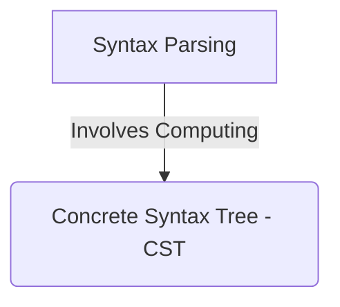
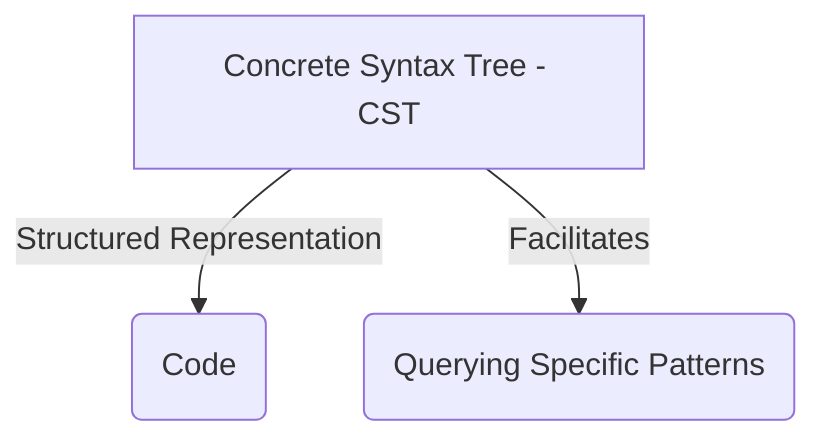
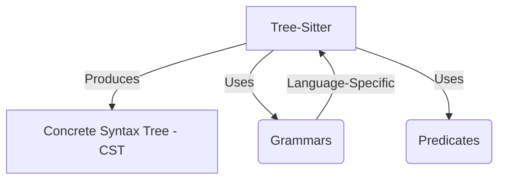
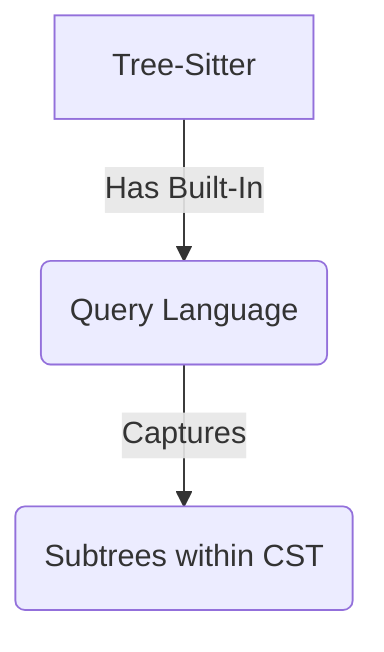
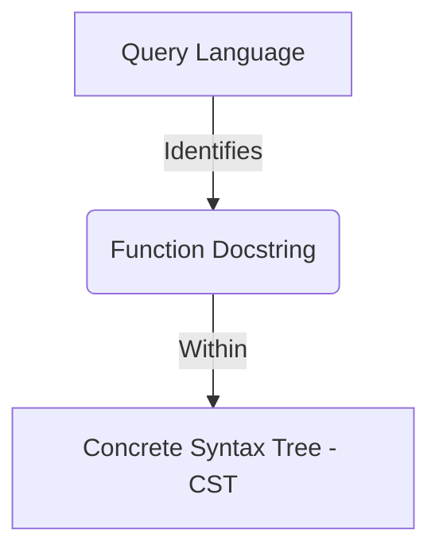
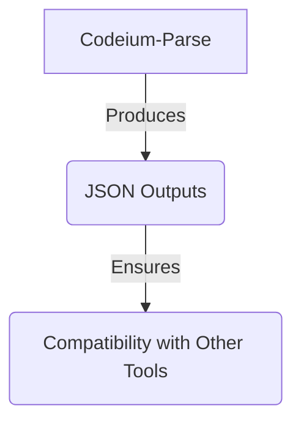
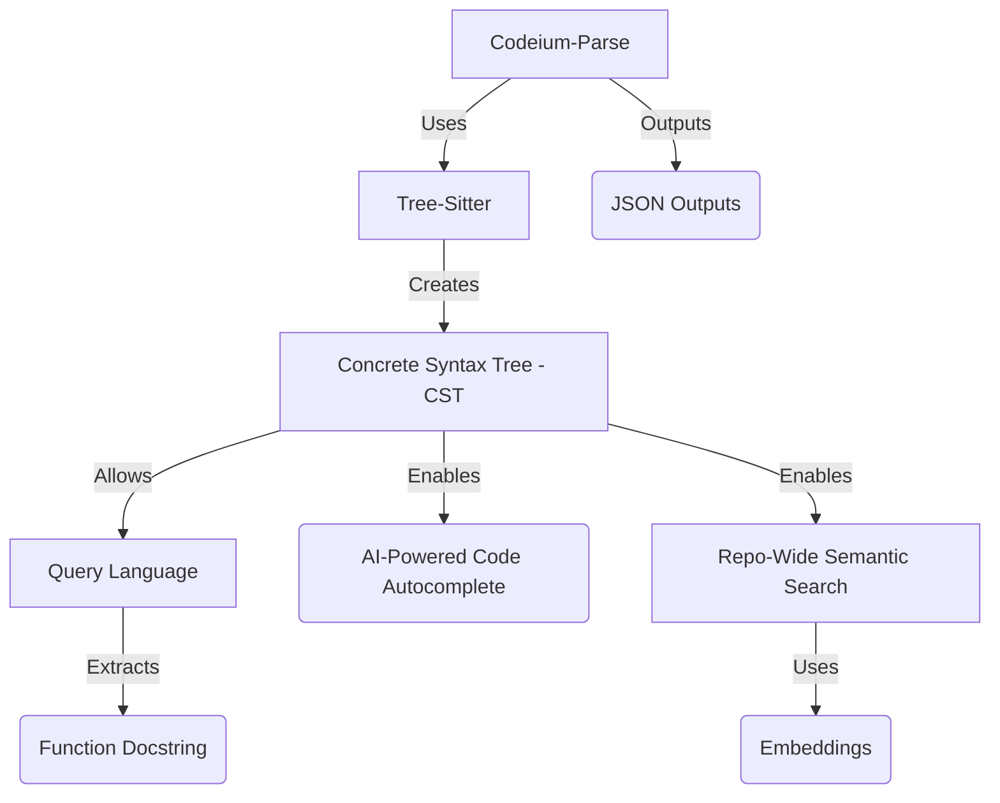

Below are separate Mermaid.js code blocks, each representing a distinct subgraph based on the provided content about **Syntax Parsing**, **Codeium-Parse**, and related concepts. Each block is designed to be rendered as an individual image in a Mermaid-compatible editor (e.g., Mermaid Live Editor).

---

### 1. Syntax Parsing Enables Features

---

### 2. Codeium-Parse as a Tool

---

### 3. Repo-Wide Semantic Search and Embeddings

---

### 4. Syntax Parsing and CST

---

### 5. Concrete Syntax Tree (CST) Purpose

---

### 6. Tree-Sitter and CST Production

---

### 7. Tree-Sitter Query Language

---

### 8. Query Language Application

---

### 9. Codeium-Parse Outputs

---

### 10. Overall Process

---

### Instructions:
- **Rendering**: Copy each code block into a Mermaid-compatible tool (e.g., `mermaid.live`) to generate a separate image for each subgraph.
- **Node Labels**: I’ve reused node labels (e.g., "A" for "Syntax Parsing") where appropriate, as each block is independent and won’t conflict when rendered separately.
- **Purpose**: Each subgraph isolates a specific logical connection or concept, with the final one summarizing the overall process.

Let me know if you’d like any subgraphs adjusted, combined, or further detailed!