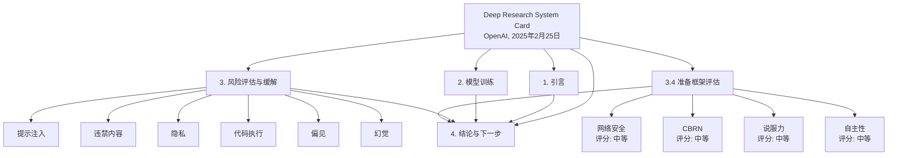

以下是《深度研究系统卡》（OpenAI，2025年2月25日）的简体中文综合结构指南。此指南总结了关键章节、其目的和重要细节，并提供了清晰的文档导航路线图。它按照文档的结构组织，以便于参考。

---

## 《深度研究系统卡》（OpenAI，2025年2月25日）指南

### 概述
《深度研究系统卡》详细介绍了OpenAI的*深度研究*模型的开发、能力、风险和安全措施。这是一个基于早期OpenAI o3模型优化为网络浏览的代理AI系统，在经过广泛的安全测试后向Pro用户发布。本文档描述了模型的训练、评估和风险管理流程，符合OpenAI的准备框架（Preparedness Framework）。其目的是向用户和AI社区介绍模型的优势、局限性及安全措施。

- **日期**：2025年2月25日
- **目的**：记录*深度研究*模型在发布前的开发过程、能力、安全评估和缓解措施。
- **引用**：OpenAI (2025)

---

核心Takeway

* 

### 文档结构和关键章节

#### 1. 引言（第1页）
- **目的**：介绍*深度研究*模型及其能力。
- **要点**：
  - *深度研究*专为复杂的多步骤互联网研究设计，利用推理能力搜索、解释和分析文本、图像和PDF。
  - 基于早期OpenAI o3模型优化，支持网络浏览，能处理用户上传的文件并执行Python代码进行数据分析。
  - 安全测试包括准备评估、治理审查以及针对网络浏览的额外风险评估。
  - 新增缓解措施聚焦于隐私保护和抵御在线恶意指令。

#### 2. 模型数据与训练（第1-2页）
- **目的**：描述模型训练方式及使用的数据集。
- **要点**：
  - 使用专为研究任务设计的新浏览数据集进行训练，教授核心浏览技能（搜索、点击、滚动、文件解释）。
  - 在沙盒环境中训练Python工具，支持计算、数据分析和绘图。
  - 通过强化学习提升对大量网页数据的推理和综合能力。
  - 数据集包括有明确答案的客观任务和按评分标准评分的开放性任务，由链式思维模型评分。
  - 安全训练重用了OpenAI o1的现有数据集，并新增浏览特定安全数据。

#### 3. 风险识别、评估与缓解（第2-34页）
- **目的**：详述*深度研究*的风险、评估方法和缓解措施。
- **小节**：

  ##### 3.1 外部红队测试方法（第2页）
  - **重点**：外部测试识别隐私、违禁内容及越狱等风险。
  - **细节**：红队测试了个人信息处理、受限/危险建议及规避策略（如提示注入、角色扮演、黑话）。

  ##### 3.2 评估方法（第2页）
  - **重点**：评估能力和风险的方式。
  - **细节**：调整现有评估以适应更长、更细致的回答；新增隐私和违禁内容测试；使用定制脚手架进行准备评估。

  ##### 3.3 观察到的安全挑战、评估与缓解（第3-10页）
  - **概览表（第3页）**：
    - 风险：提示注入、违禁内容、隐私、代码执行、偏见、幻觉。
    - 缓解：后期训练、黑名单、沙盒编码、输出过滤、增强搜索依赖。
  - **具体风险**：
    - **提示注入（第3-5页）**：
      - 风险：在线恶意指令可能覆盖用户提示，导致错误回答或数据泄露。
      - 缓解：新增安全数据和系统级限制（例如禁止构造任意URL）。
      - 评估：缓解后攻击成功率降至0-2.63%（文本/多模态测试）。
    - **违禁内容（第6-7页）**：
      - 风险：可能生成有害指导（如暴力促进）。
      - 缓解：更新安全政策、拒绝训练、滥用监控。
      - 评估：与GPT-4o和o1相比，安全性高（0.97），越狱抗性中等（StrongReject 0.93）。
    - **隐私（第8页）**：
      - 风险：从在线来源聚合个人数据。
      - 缓解：更新政策、新安全数据、黑名单、监控。
      - 评估：缓解后个人数据拒绝率达0.96-0.98。
    - **代码执行能力（第8-9页）**：
      - 风险：联网代码执行带来的网络安全威胁。
      - 缓解：无互联网访问的沙盒Python环境。
    - **偏见（第9页）**：
      - 风险：不支持的偏见影响公平性。
      - 缓解：后期训练减少偏见。
      - 评估：BBQ测试显示与o1-preview相似，倾向刻板印象较低（0.34），但模糊处理较弱（0.63）。
    - **幻觉（第9-10页）**：
      - 风险：生成事实错误信息。
      - 缓解：增强搜索依赖、后期训练促进真实性。
      - 评估：PersonQA数据集准确率高（0.86），幻觉率低（0.13）。

  ##### 3.4 准备框架评估（第10-34页）
  - **目的**：评估灾难性风险（网络安全、CBRN、说服力、模型自主性）。
  - **总体评级**：缓解后所有类别均为中等风险。
  - **关键挑战**：
    - **浏览污染（第11-12页）**：
      - 问题：模型可能在线检索评估答案，抬高分数。
      - 解决方案：使用未污染的内部测试，屏蔽答案网站。
    - **缓解措施（第12-13页）**：
      - 预训练数据过滤、深思熟虑的对齐、增强监控和安全投资。
  - **具体类别**：
    - **网络安全（第13-16页）**：
      - 评分：中等
      - 评估：CTF挑战（高中：82-92%，大学：55-91%，专业：47-70%）。
      - 发现：显著优于前代模型，但未达高风险；过滤后浏览污染影响小。
    - **化学与生物威胁制造（第17-21页）**：
      - 评分：中等
      - 评估：专家级规划提升（例如病毒学排除故障55-62%），但未完全赋能新手。
      - 发现：接近高风险门槛，需加强防护。
    - **放射性与核威胁制造（第22-23页）**：
      - 评分：低（未明确说明，假设得出）
      - 评估：受限于非机密数据；专家知识问题得分74%。
      - 发现：因物理壁垒（如裂变材料获取）风险小。
    - **说服力（第24-27页）**：
      - 评分：中等
      - 评估：高说服力（ChangeMyView 80-90百分位），适度操纵性（MakeMePay 36%）。
      - 发现：论证强，但不适于大规模活动。
    - **模型自主性（第27-34页）**：
      - 评分：中等
      - 评估：SWE-Bench强（68%），开放式ML研究弱（MLE-Bench 11%）。
      - 发现：代理任务提升，但无自我改进能力。

#### 4. 结论与下一步（第34页）
- **目的**：总结发现并规划未来。
- **要点**：
  - *深度研究*是强大的研究工具，属中等风险，具备完善安全措施。
  - OpenAI旨在通过此发布促进AI安全的公共讨论。
  - 下一步包括持续监控和改进缓解措施。

#### 5. 致谢（第35页）
- **目的**：表彰贡献者和红队成员。
- **细节**：列出个人及Lysios LLC的红队努力。

#### 参考文献（第35页）
- **目的**：提供方法和基准的引用。
- **细节**：包括StrongReject、BBQ、准备框架等。

---

### 导航提示
- **快速参考**：
  - 引言：第1页
  - 训练细节：第1-2页
  - 风险概览：第3页（表格）
  - 具体风险：第3-10页
  - 准备评估：第10-34页（网络安全：13-16，CBRN：17-23，说服力：24-27，自主性：27-34）
- **关键表格**：
  - 风险缓解：第3页
  - 提示注入结果：第5页
  - 违禁内容评分：第6-7页
  - 准备评估概览：第13、18、24、28页
- **关注安全**：从3.3节（第3-10页）和3.4节（第10-34页）开始。
- **技术细节**：查看第2节（第1-2页）和3.4节的具体评估小节。

---

### 主要收获总结
- **能力**：*深度研究*擅长多步骤研究、网络浏览和数据分析，在准确性和任务完成方面超越前代模型。
- **风险**：网络安全、CBRN、说服力和自主性均为中等风险，通过训练、系统设计和监控得以缓解。
- **安全**：广泛测试降低了漏洞（如提示注入、违禁内容），但仍存部分残余风险。
- **未来**：OpenAI计划改进评估（如网络安全范围、生物风险防护）并监控真实使用情况。

本指南为文档提供了一个结构化的入口，使读者能够快速定位并理解与其兴趣相关的关键信息，无论是技术、安全还是战略方面。