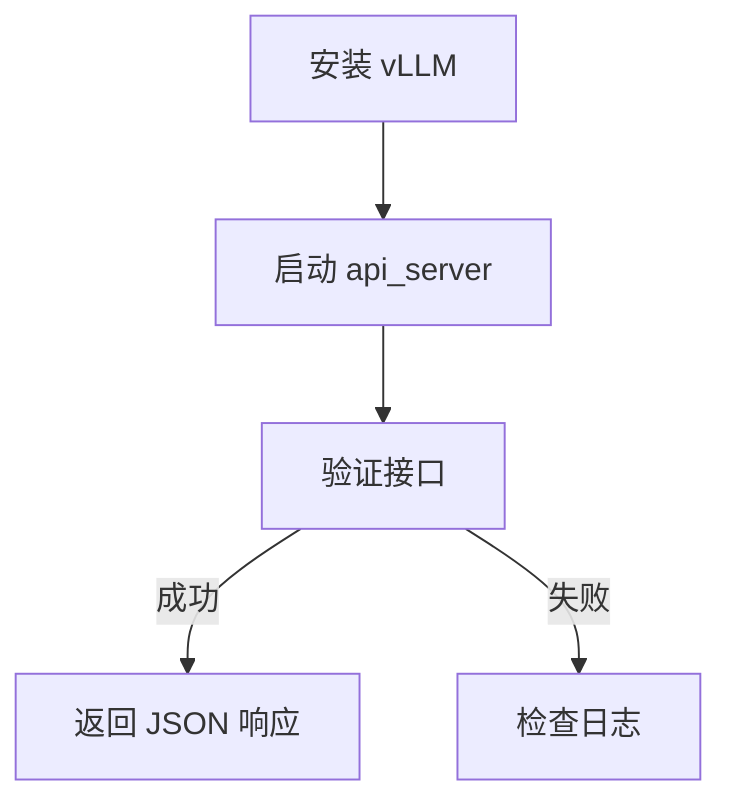
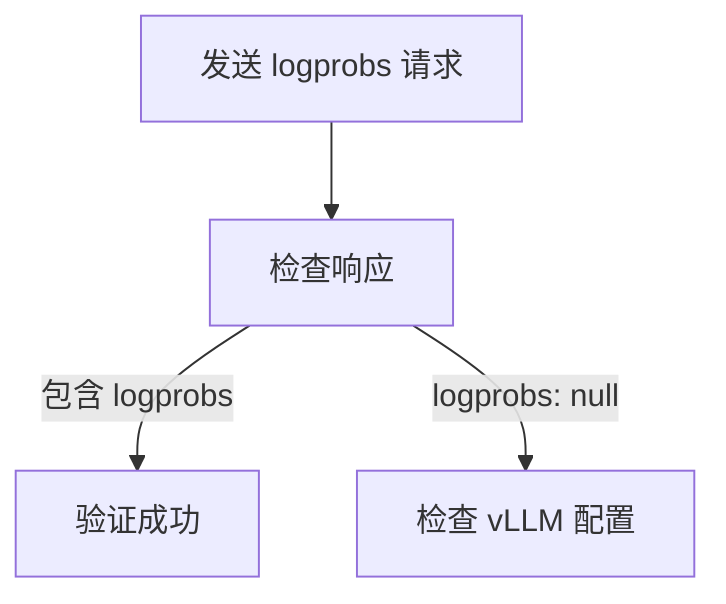
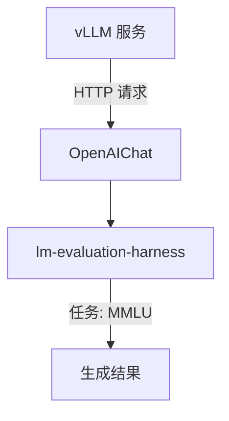
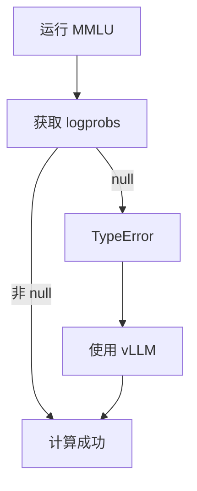

文档聚焦于 vLLM 的部署和 `logprobs` 支持，同时简化了 LMDeploy 的部分，突出 vLLM 在解决 MMLU 任务中的优势。

---

# 使用 vLLM 部署 OpenAI 兼容接口并与 lm-evaluation-harness 集成

**版本**: 2.0  
**日期**: 2025 年 2 月 27 日  
**作者**: xAI 技术团队  
**状态**: 最终版

---

## 目录
1. [概述](#概述)
2. [部署 vLLM 的 OpenAI 兼容接口](#部署-vllm-的-openai-兼容接口)
3. [验证 logprobs 支持](#验证-logprobs-支持)
4. [与 lm-evaluation-harness 集成](#与-lm-evaluation-harness-集成)
5. [解决 MMLU 任务中的 logprobs 错误](#解决-mmlu-任务中的-logprobs-错误)
6. [推荐方案与结论](#推荐方案与结论)
7. [附录](#附录)

---

## 概述

本技术文档旨在指导用户使用 vLLM 部署一个与 OpenAI 兼容的 RESTful 接口服务，作为主力评测框架，并将其与 `lm-evaluation-harness` 集成，用于评估语言模型（如 `internlm/internlm2_5-7b-chat`）的性能。文档特别关注 vLLM 对 `logprobs` 的支持，解决在 MMLU 任务中出现的 `TypeError: 'NoneType' object is not subscriptable` 错误。

### 目标
- 部署 vLLM 提供的 OpenAI ChatCompletions 接口。
- 确保返回真实的 `logprobs` 值。
- 使用 vLLM 集成 `lm-evaluation-harness` 运行 MMLU 任务。

---

## 部署 vLLM 的 OpenAI 兼容接口

vLLM 是一个高效的语言模型推理框架，支持 OpenAI 兼容的 API，并原生提供 `logprobs` 支持，是评测的理想选择。

### 部署步骤

1. **安装 vLLM**  
   ```bash
   pip install vllm
   ```

2. **启动服务**  
   部署模型并监听端口：
   ```bash
   python -m vllm.entrypoints.openai.api_server \
     --model internlm/internlm2_5-7b-chat \
     --port 23333
   ```

3. **验证接口**  
   测试 ChatCompletions 接口：
   ```bash
   curl -X POST http://localhost:23333/v1/chat/completions \
     -H "Content-Type: application/json" \
     -d '{
         "model": "internlm/internlm2_5-7b-chat",
         "messages": [{"role": "user", "content": "你好"}],
         "max_tokens": 50
     }'
   ```

**流程图**：



---

## 验证 logprobs 支持

vLLM 原生支持 `logprobs`，无需额外配置即可返回真实值。

### 测试 logprobs

1. **发送请求**  
   ```bash
   curl -X POST http://localhost:23333/v1/chat/completions \
     -H "Content-Type: application/json" \
     -d '{
         "model": "internlm/internlm2_5-7b-chat",
         "messages": [{"role": "user", "content": "你好"}],
         "max_tokens": 50,
         "logprobs": true,
         "top_logprobs": 5
     }'
   ```

2. **预期响应**  
   ```json
   {
     "choices": [
       {
         "index": 0,
         "message": {"role": "assistant", "content": "你好！"},
         "logprobs": {
           "tokens": ["你", "好", "！"],
           "token_logprobs": [-0.05, -0.10, -0.02],
           "top_logprobs": [
             {"你": -0.05, "我": -1.2, "他": -2.3, "这": -3.0, "是": -3.5},
             {"好": -0.10, "很": -1.5, "不": -2.0, "是": -2.5, "呀": -3.0},
             {"！": -0.02, "。": -1.0, "，": -2.0, "？": -2.5, "…": -3.0}
           ]
         },
         "finish_reason": "stop"
       }
     ]
   }
   ```

**验证流程**：



---

## 与 lm-evaluation-harness 集成

`lm-evaluation-harness` 是一个强大的评估框架，vLLM 的接口可无缝集成。

### 配置与运行

1. **安装 lm-evaluation-harness**  
   ```bash
   git clone https://github.com/EleutherAI/lm-evaluation-harness.git
   cd lm-evaluation-harness
   pip install -e .
   ```

2. **评估脚本**  
   ```python
   from lm_eval import evaluator
   from lm_eval.models.openai import OpenAIChat
   
   model = OpenAIChat(
       model="internlm/internlm2_5-7b-chat",
       base_url="http://localhost:23333/v1",
       api_key="dummy"
   )
   results = evaluator.simple_evaluate(model=model, tasks=["mmlu"], limit=10)
   print(results["results"])
   ```

**架构图**：



---

## 解决 MMLU 任务中的 logprobs 错误

在运行 MMLU 任务时，若使用不支持 `logprobs` 的服务（如 LMDeploy），可能会遇到：
```
logprobs = sum(choice["logprobs"]["token_logprobs"][ctxlen:-1])
TypeError: 'NoneType' object is not subscriptable
```

### 错误原因
- 服务返回 `"logprobs": null`，而 `lm-evaluation-harness` 未处理此情况。

### 使用 vLLM 解决问题
vLLM 返回真实的 `logprobs`，可直接避免错误：
1. **部署 vLLM**  
   如上所述启动服务。
2. **运行评估**  
   使用上述脚本，无需修改代码。

### 替代方案（若不使用 vLLM）
- **修改 lm-evaluation-harness**  
  - 文件：`lm_eval/models/openai.py`
  - 修改：
    ```python
    logprobs = 0
    if choice.get("logprobs") and "token_logprobs" in choice["logprobs"]:
        logprobs = sum(choice["logprobs"]["token_logprobs"][ctxlen:-1])
    ```

**错误处理流程**：



---

## 推荐方案与结论

### 推荐方案
- **主力框架**：vLLM，提供稳定的 OpenAI 兼容接口和 `logprobs` 支持。
- **部署命令**：
  ```bash
  python -m vllm.entrypoints.openai.api_server \
    --model internlm/internlm2_5-7b-chat \
    --port 23333
  ```
- **评估**：直接运行 `lm-evaluation-harness` 的 MMLU 任务。

### 结论
vLLM 作为主力评测框架，解决了 LMDeploy 的 `logprobs` 限制问题，确保与 `lm-evaluation-harness` 的无缝集成。用户无需修改代码即可完成 MMLU 等任务的评估。

---

## 附录

### LMDeploy 的备用方案
若需继续使用 LMDeploy，可尝试修改源码：
```python
import torch
from transformers import AutoModelForCausalLM, AutoTokenizer

async def chat_completions(request):
    model = AutoModelForCausalLM.from_pretrained("internlm/internlm2_5-7b-chat")
    tokenizer = AutoTokenizer.from_pretrained("internlm/internlm2_5-7b-chat")
    prompt = tokenizer.apply_chat_template(request["messages"], tokenize=False)
    inputs = tokenizer(prompt, return_tensors="pt")
    
    outputs = model.generate(
        **inputs,
        max_length=request["max_tokens"],
        return_dict_in_generate=True,
        output_scores=True
    )
    
    scores = torch.stack(outputs.scores, dim=1)
    logprobs = torch.log_softmax(scores, dim=-1)
    generated_ids = outputs.sequences[:, inputs["input_ids"].shape[1]:]
    token_logprobs = torch.gather(logprobs, 2, generated_ids.unsqueeze(-1)).squeeze(-1)[0].tolist()
    tokens = tokenizer.convert_ids_to_tokens(generated_ids[0])
    
    content = tokenizer.decode(generated_ids[0], skip_special_tokens=True)
    return {
        "choices": [
            {
                "index": 0,
                "message": {"role": "assistant", "content": content},
                "logprobs": {"tokens": tokens, "token_logprobs": token_logprobs},
                "finish_reason": "stop"
            }
        ]
    }
```

### 参考资料
- [vLLM GitHub](https://github.com/vllm-project/vllm)
- [lm-evaluation-harness API Guide](https://github.com/EleutherAI/lm-evaluation-harness/blob/main/docs/API_guide.md)
- [LMDeploy 文档](https://lmdeploy.readthedocs.io/)

---

**版权所有 © 2025 xAI**  
本文档受版权保护，未经许可不得转载或分发。